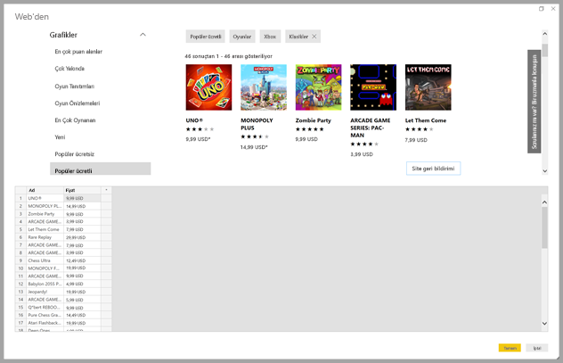
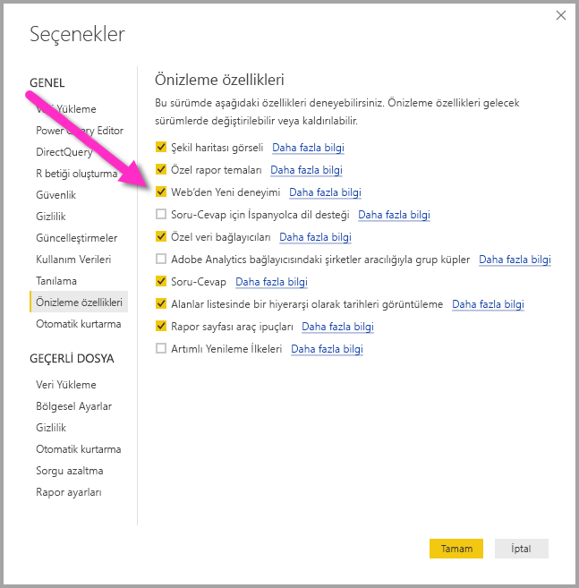
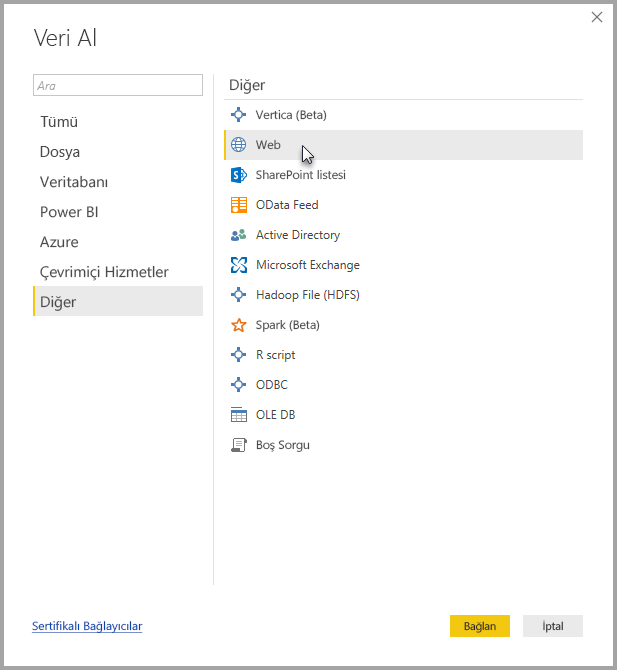
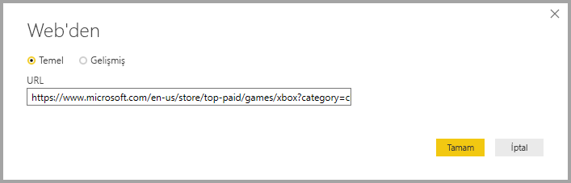
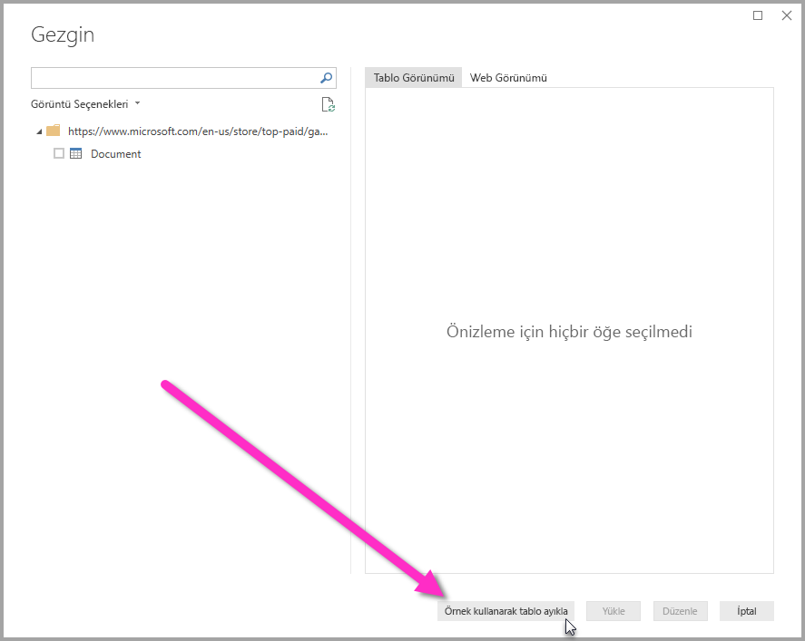
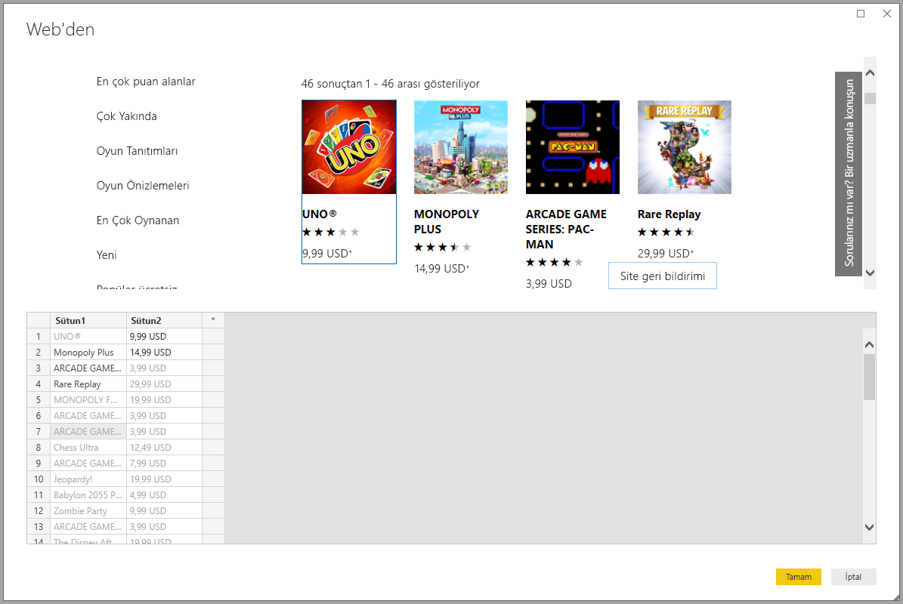
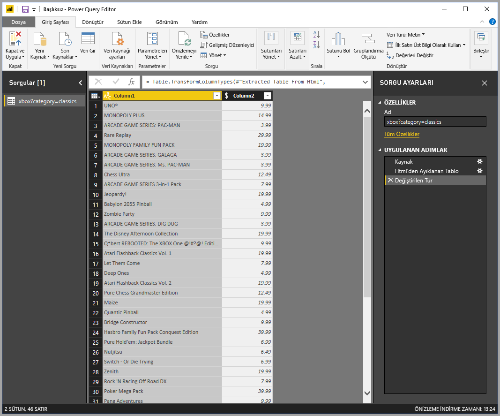

# Bir örnek vererek web sayfasından veri alma (Önizleme)

Bir web sayfasından veri almak, kullanıcıların web sayfalarından kolayca veri ayıklamasına ve bu verileri **Power BI Desktop**’a aktarmasına olanak tanır. Ancak çoğu zaman, web sayfalarındaki veriler kolayca ayıklanabilen düzenli tablolar halinde olmaz. Bu nedenle, yapılandırılmış ve tutarlı olsa bile bu tür sayfalardan veri almak zor olabilir. 

Bunun bir çözümü vardır. **Örneğe göre web’den veri alma** özelliği sayesinde, bağlayıcı iletişim kutusunda bir veya daha fazla örnek vererek ayıklamak istediğiniz verileri **Power BI Desktop**’a gösterebilir, sayfada örneklerinizle eşleşen diğer verileri toplamasını sağlayabilirsiniz. Bu çözüm sayesinde, tablolarda bulunan veriler *ve* diğer tablo dışı veriler dahil olmak üzere Web sayfalarından tüm veri türlerini ayıklayabilirsiniz. 

## Örneğe göre Web'den Veri Alma önizleme özelliğini etkinleştirme

**Örneğe göre Web’den Veri Alma** Önizleme aşamasındadır ve **Power BI Desktop**'ta etkinleştirilmesi gerekir. Bu özelliği etkinleştirmek için, **Dosya > Seçenekler ve Ayarlar > Seçenekler > Önizleme Özellikleri**’ni seçin ve ardından **Web deneyiminden yeni** onay kutusunu işaretleyin. Seçiminizi yaptıktan sonra Power BI Desktop'ı yeniden başlatmanız gerekir.

Önizleme özelliği etkinleştirildikten sonra kullanmaya başlayabilirsiniz. 

## Örneğe göre Web’den Veri Alma özelliğini kullanma

**Örneğe göre Web’den Veri Alma** özelliğini kullanmak için **Giriş** şerit menüsünden **Veri Al**’ı seçin. Görüntülenen pencerede, sol bölmedeki kategorilerden **Diğer**’i ve sonra **Web**’i seçin.

Burada, verileri ayıklamak istediğiniz Web sayfasının URL’sini girin. Bu makalede biz Microsoft Store Web sayfasını kullanacağız ve bu bağlayıcının nasıl çalıştığını göstereceğiz. 

Takip etmek isterseniz bu makalede kullandığımız [Microsoft Store URL'sini](https://www.microsoft.com/en-us/store/top-paid/games/xbox?category=classics) kullanabilirsiniz:

    https://www.microsoft.com/en-us/store/top-paid/games/xbox?category=classics

**Tamam**’ı seçtiğinizde, Web sayfasından otomatik olarak algılanan tüm tabloların sunulduğu **Gezgin** iletişim kutusuna gidersiniz. Aşağıdaki görüntüde gösterilen örnekte bir tablo bulunmamıştır ancak sayfanın altında size örnekler sağlayan **Örnekleri kullanarak tablo ayıkla** adlı bir düğme bulunur.

**Örnekleri kullanarak tablo ayıkla** düğmesi seçildiğinde, Web sayfası içeriğinin önizlemesini görebileceğiniz ve ayıklamak istediğiniz verilerin örnek değerlerini girebileceğiniz etkileşimli bir pencere açılır. 

Bu örnekte, sayfadaki her bir oyunun *Ad* ve *Fiyat* verilerini ayıklayacağız. Aşağıdaki görüntüde gösterildiği gibi, her bir sütunun sayfasından birkaç örnek belirterek bunu yapabiliriz. Bu örnekler girildikçe, **Power Query** (Web sayfasından verileri ayıklayan temel teknoloji) akıllı veri ayıklama algoritmalarını kullanarak örnek girişlerinin düzenine uyan verileri ayıklayabilir.

Web sayfasından ayıklanan verilerden memnun kaldığımızda, daha fazla dönüşüm uygulamak veya bu verileri diğer veri kaynaklarımızla birleştirme gibi veri şekillendirme işlemleri yapmak üzere **Tamam**’ı seçerek **Sorgu Düzenleyicisi**’ne gideriz.

Buradan, görseller oluşturabilir veya **Power BI Desktop** raporlarınızı oluştururken web sayfası verilerini diğer şekillerde kullanabilirsiniz.

## Sonraki adımlar
**Power BI Desktop**'ı kullanarak çok çeşitli türlerdeki verilere bağlanabilirsiniz. Veri kaynakları hakkında daha fazla bilgi için aşağıdaki kaynaklara bakın:

* [Örneğe göre sütun ekleme](desktop-add-column-from-example.md)
* [Bir web sayfasına bağlanma](desktop-connect-to-web.md)
* [Power BI Desktop'ta Veri Kaynakları](desktop-data-sources.md)
* [Power BI Desktop'ta Verileri Şekillendirme ve Birleştirme](desktop-shape-and-combine-data.md)
* [Power BI Desktop'ta Excel çalışma kitaplarına bağlanma](desktop-connect-excel.md)   
* [Power BI Desktop'ta CSV dosyalarına bağlanma](desktop-connect-csv.md)   
* [Verileri doğrudan Power BI Desktop'a girme](desktop-enter-data-directly-into-desktop.md)   

