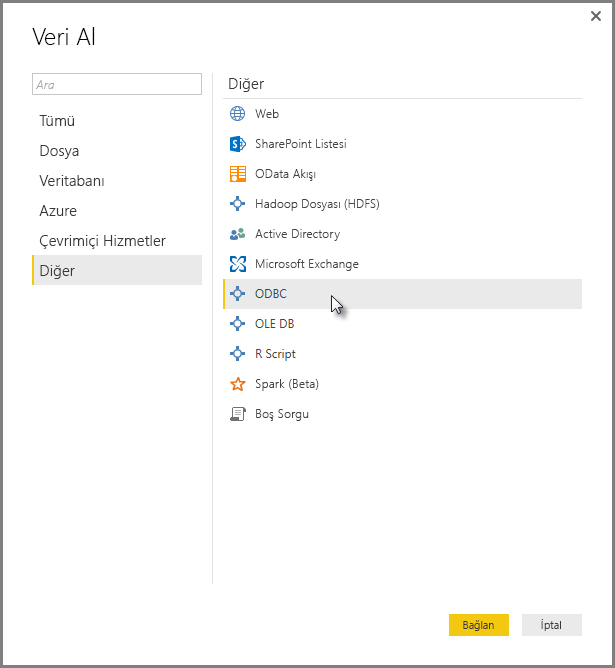
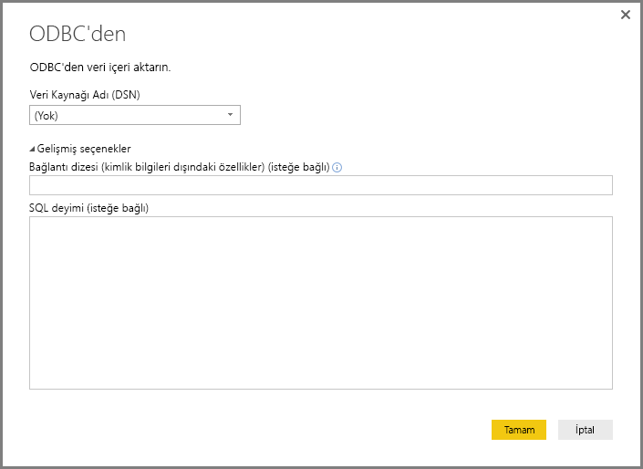
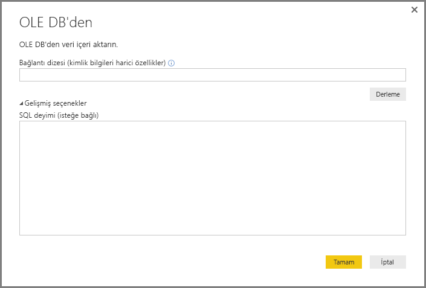
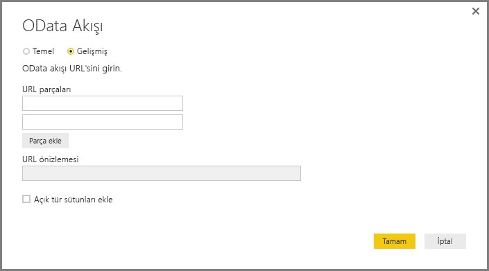
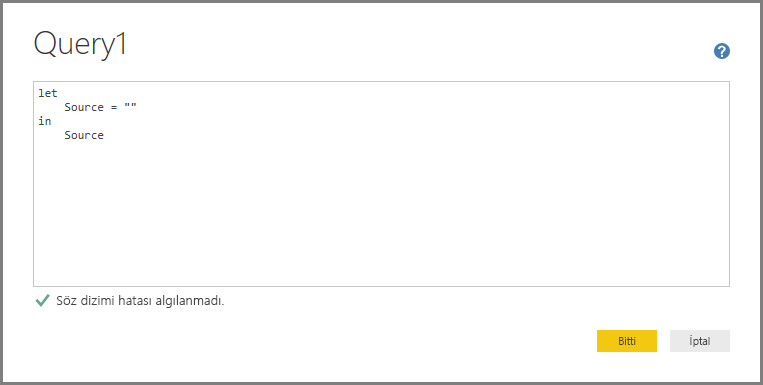
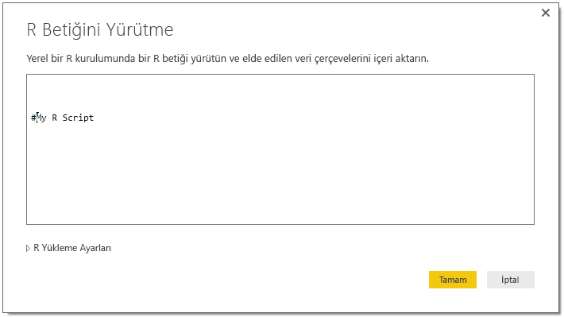

# Power BI Desktop'ta genel arabirimleri kullanarak verilere bağlanma
**Veri Al** penceresinde gösterildiği gibi, **Access veritabanlarından** **Zendesk** kaynaklarına kadar çeşitlilik gösteren yerleşik veri bağlayıcılarını kullanarak **Power BI Desktop**'ta çok sayıda veri kaynağına bağlanabilirsiniz. Ayrıca, **Power BI Desktop**’ta yerleşik olarak bulunan genel arabirimleri (**ODBC** veya **REST API’leri** gibi) kullanarak çok çeşitli *başka* veri kaynaklarına da bağlanabilir, bu sayede bağlantı seçeneklerinizi daha da genişletebilirsiniz.

## Power BI Desktop veri arabirimleri
**Power BI Desktop**, belirli bir veri kaynağına bağlanmak için oluşturulmuş, sürekli büyüyen bir veri bağlayıcısı koleksiyonuna sahiptir. Örneğin, **SharePoint Listesi** veri bağlayıcısı, bağlantı sırasında, **SharePoint Listeleri** için tasarlanmış belirli alanlar ve destekleyici bilgiler sağlar ve bu durum, **Veri Al > Diğer...** (önceki görüntüde verilen) seçeneğini belirlediğinizde açılan penceredeki diğer veri kaynakları için de geçerlidir.

Ayrıca **Power BI Desktop**, aşağıdaki genel veri arabirimlerinden birini kullanarak **Veri Al** listelerinde tanımlanmayan veri kaynaklarına bağlanmanıza da olanak sağlar:

* **ODBC**
* **OLE DB**
* **OData**
* **REST API'leri**
* **R Betikleri**

Bu genel arabirimler tarafından sunulan bağlantı pencerelerinde uygun parametreleri sağlayarak **Power BI Desktop**'ta erişebileceğiniz ve kullanabileceğiniz veri kaynakları dünyası, önemli ölçüde büyümektedir.

Söz konusu genel arabirimler tarafından erişilebilen veri kaynaklarına ait listeleri aşağıdaki bölümlerde bulabilirsiniz.

**Power BI Desktop** ile kullanmak istediğiniz veri kaynağını bulamıyor musunuz? Power BI ekibinin [fikir ve istek listesine](https://ideas.powerbi.com/) fikrinizi gönderin.

## ODBC aracılığıyla erişilebilir veri kaynakları
**Power BI Desktop**'taki **ODBC** bağlayıcısı, yalnızca bir **Veri Kaynağı Adı (DSN)** veya *bağlantı dizesi* belirterek herhangi bir üçüncü taraf ODBC sürücüsünden veri içeri aktarmanıza olanak sağlar. Bir seçenek olarak, ODBC sürücüsüne yönelik olarak yürütmek için bir SQL deyimi de belirtebilirsiniz.

Aşağıdaki listede, **Power BI Desktop**'ın, genel **ODBC** arabirimini kullanarak bağlanabileceği veri kaynaklarına yönelik birkaç örnek verilmiştir.

| Power BI Desktop genel bağlayıcısı | Dış veri kaynağı | Daha fazla bilgi için bağlantı |
| --- | --- | --- |
| ODBC |Cassandra |[Cassandra ODBC sürücüsü](http://www.simba.com/drivers/cassandra-odbc-jdbc/) |
| ODBC |Couchbase DB |[Couchbase ve Power BI](https://powerbi.microsoft.com/en-us/blog/visualizing-data-from-couchbase-server-v4-using-power-bi/) |
| ODBC |DynamoDB |[DynamoDB ODBC sürücüsü](http://www.simba.com/drivers/dynamodb-odbc-jdbc/) |
| ODBC |Google BigQuery |[BigQuery ODBC sürücüsü](http://www.simba.com/drivers/bigquery-odbc-jdbc/) |
| ODBC |Hbase |[Hbase ODBC sürücüsü](http://www.simba.com/drivers/hbase-odbc-jdbc/) |
| ODBC |Hive |[Hive ODBC sürücüsü](http://www.simba.com/drivers/hive-odbc-jdbc/) |
| ODBC |IBM Netezza |[IBM Netezza bilgileri](https://www.ibm.com/support/knowledgecenter/SSULQD_7.2.1/com.ibm.nz.datacon.doc/c_datacon_plg_overview.html) |
| ODBC |Presto |[Presto ODBC sürücüsü](http://www.simba.com/drivers/presto-odbc-jdbc/) |
| ODBC |Project Online |[Project Online makalesi](desktop-project-online-connect-to-data.md) |
| ODBC |Progress OpenEdge |[Progress OpenEdge ODBC sürücüsü blog gönderisi](https://na01.safelinks.protection.outlook.com/?url=https%3A%2F%2Fwww.progress.com%2Fblogs%2Fconnect-microsoft-power-bi-to-openedge-via-odbc-driver&data=02%7C01%7CMatt.Masson%40microsoft.com%7C5e63742e6c454308b58a08d4034b5923%7C72f988bf86f141af91ab2d7cd011db47%7C1%7C0%7C636137069555329811&sdata=gSu2Rq3vZ0uBVOgjaXxd8Y3uBf%2B8DidX6PG33jwAduY%3D&reserved=0) |

## OLE DB aracılığıyla erişilebilir veri kaynakları
**Power BI Desktop**'taki **OLE DB** bağlayıcısı, bir *bağlantı dizesi* belirterek herhangi bir üçüncü taraf OLE DB sürücüsündeki verileri içeri aktarmanıza olanak sağlar. Bir seçenek olarak, OLE DB sürücüsüne yönelik olarak yürütmek için bir SQL deyimi de belirtebilirsiniz.

Aşağıdaki listede, **Power BI Desktop**'ın, genel **OLE DB** arabirimini kullanarak bağlanabileceği veri kaynaklarına yönelik birkaç örnek verilmiştir.

| Power BI Desktop genel bağlayıcısı | Dış veri kaynağı | Daha fazla bilgi için bağlantı |
| --- | --- | --- |
| OLE DB |SAS OLE DB |[OLE DB için SAS sağlayıcısı](https://support.sas.com/downloads/package.htm?pid=648) |
| OLE DB |Sybase OLE DB |[OLE DB için Sybase sağlayıcısı](http://infocenter.sybase.com/help/index.jsp?topic=/com.sybase.infocenter.dc35888.1550/doc/html/jon1256941734395.html) |

## OData aracılığıyla erişilebilir veri kaynakları
**Power BI Desktop**'taki **OData** bağlayıcısı, **OData** URL'sini yazarak veya kopyalayarak herhangi bir **OData** URL'sindeki verileri içeri aktarmanıza olanak sağlar. Bu bağlantıları **OData Akışı** penceresindeki metin kutularına yazarak veya kopyalayarak birden çok URL parçası ekleyebilirsiniz.

Aşağıdaki listede, **Power BI Desktop**'ın, genel **OData** arabirimini kullanarak bağlanabileceği veri kaynaklarına yönelik birkaç örnek verilmiştir.

| Power BI Desktop genel bağlayıcısı | Dış veri kaynağı | Daha fazla bilgi için bağlantı |
| --- | --- | --- |
| OData |Çok yakında |OData veri kaynakları için sayfayı yakında tekrar ziyaret edin |

## REST API'leri aracılığıyla erişilebilir veri kaynakları
**REST API**'lerini kullanarak veri kaynaklarına bağlanabilir ve böylece **REST**'i destekleyen çeşitli veri kaynaklarındaki verileri kullanabilirsiniz.

Aşağıdaki listede, **Power BI Desktop**'ın, genel **REST API'leri** arabirimini kullanarak bağlanabileceği veri kaynaklarına yönelik birkaç örnek verilmiştir.

| Power BI Desktop genel bağlayıcısı | Dış veri kaynağı | Daha fazla bilgi için bağlantı |
| --- | --- | --- |
| REST API'leri |Couchbase DB |[Couchbase REST API'si bilgileri](https://powerbi.microsoft.com/en-us/blog/visualizing-data-from-couchbase-server-v4-using-power-bi/) |

## R Betiği aracılığıyla erişilebilir veri kaynakları
**R betiklerini** kullanarak veri kaynaklarına erişebilir ve bu verileri **Power BI Desktop**'ta kullanabilirsiniz.

Aşağıdaki listede, **Power BI Desktop**'ın, genel **R betikleri** arabirimini kullanarak bağlanabileceği veri kaynaklarına yönelik birkaç örnek verilmiştir.

| Power BI Desktop genel bağlayıcısı | Dış veri kaynağı | Daha fazla bilgi için bağlantı |
| --- | --- | --- |
| R Betiği |SAS Dosyaları |[CRAN tarafından sunulan R betiği kılavuzu](https://cran.r-project.org/doc/manuals/R-data.html) |
| R Betiği |SPSS Dosyaları |[CRAN tarafından sunulan R betiği kılavuzu](https://cran.r-project.org/doc/manuals/R-data.html) |
| R Betiği |R İstatistik Dosyaları |[CRAN tarafından sunulan R betiği kılavuzu](https://cran.r-project.org/doc/manuals/R-data.html) |

## Sonraki adımlar
**Power BI Desktop**’ı kullanarak çok çeşitli türlerdeki veri kaynaklarına bağlanabilirsiniz. Veri kaynakları hakkında daha fazla bilgi için aşağıdaki kaynaklara bakın:

* [Power BI Desktop ile çalışmaya başlama](desktop-getting-started.md)
* [Power BI Desktop'taki veri kaynakları](desktop-data-sources.md)
* [Power BI Desktop'ta Verileri Şekillendirme ve Birleştirme](desktop-shape-and-combine-data.md)
* [Power BI Desktop'ta Excel çalışma kitaplarına bağlanma](desktop-connect-excel.md)   
* [Verileri doğrudan Power BI Desktop'a girme](desktop-enter-data-directly-into-desktop.md)   

