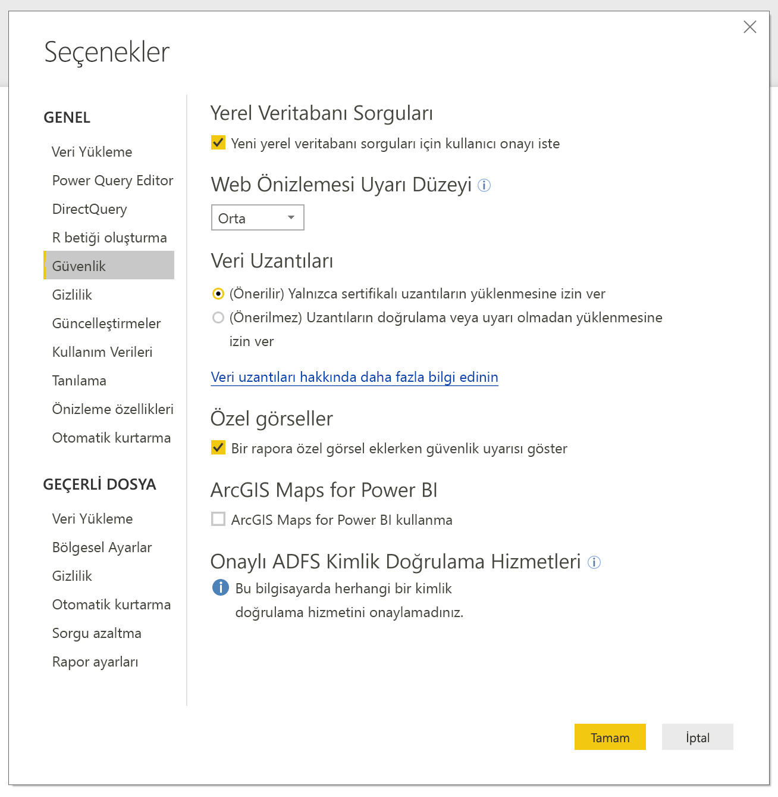
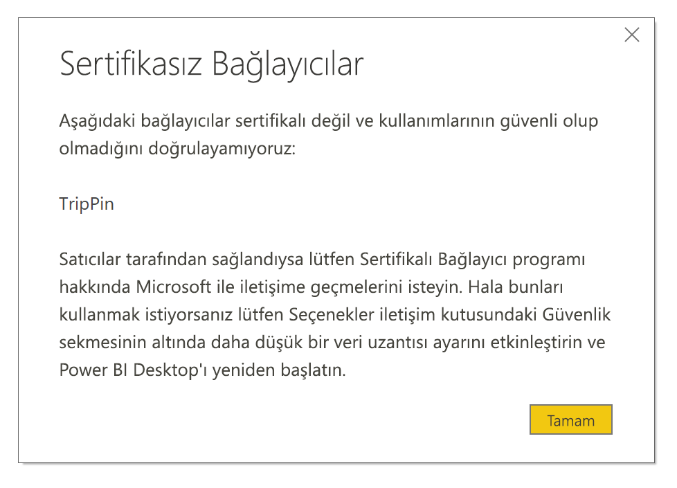

# Power BI’da bağlayıcı genişletilebilirliği

Power BI; var olan bağlayıcıları ve ODBC, OData, OLE DB, Web, CSV, XML ve JSON gibi genel veri kaynaklarını kullanarak verilere bağlanabilir. Alternatif olarak geliştiriciler, *özel bağlayıcılar* olarak adlandırılan özel veri uzantılarını kullanarak yeni veri kaynaklarını etkinleştirebilir. Bazı özel bağlayıcılar sertifikalıdır ve Microsoft tarafından *sertifikalı bağlayıcılar* adı altında dağıtılır.

Kendi geliştirdiğiniz veya üçüncü tarafların geliştirdiği sertifikalı olmayan özel bağlayıcıları kullanmak için Power BI Desktop güvenlik ayarlarını, uzantıların doğrulama veya uyarı olmadan yüklenmesine izin verecek şekilde düzenlemeniz gerekir. Bu kod kimlik bilgilerini işleyebileceğinden (bu bilgileri HTTP üzerinden göndermek de dahil) ve gizlilik düzeylerini yoksayabileceğinden bu güvenlik ayarını yalnızca özel bağlayıcılarınıza güveniyorsanız kullanmanız gerekir.

Diğer bir seçenek de geliştiricinin bağlayıcıyı bir sertifika ile imzalaması ve güvenlik ayarlarınızı değiştirmeden kullanabilmeniz için gerekli bilgileri sağlamasıdır. Daha fazla bilgi için bkz. [Güvenilen üçüncü taraf bağlayıcılar hakkında](desktop-trusted-third-party-connectors.md).

## Özel bağlayıcılar

Sertifikalı olmayan özel bağlayıcılar, küçük işletmeler için kritik öneme sahip API'lerden Microsoft'un bağlayıcı yayımlamadığı sektöre özgü büyük hizmetlere kadar çok farklı özelliklere sahip olabilir. Birçok bağlayıcı satıcılar tarafından dağıtılır. Belirli bir veri bağlayıcısına ihtiyacınız varsa satıcıyla iletişime geçin. 

Sertifikalı olmayan bir özel bağlayıcıyı kullanmak için *.pq*, *.pqx*, *.m*, veya *.mez* dosyasını *\[Belgeler]\\Power BI Desktop\\Özel Bağlayıcılar* klasörüne yerleştirin. Bu klasör mevcut değilse oluşturun.

Veri uzantısı güvenlik ayarlarını şu şekilde düzenleyin:

Power BI Desktop'ta **Dosya** > **Seçenekler ve ayarlar** > **Seçenekler** > **Güvenlik** yolunu izleyin.

**Veri Uzantıları**'nın altında **(Önerilmez) Uzantıların doğrulama veya uyarı olmadan yüklenmesine izin ver**'i seçin. **Tamam**'ı seçin ve Power BI Desktop'ı yeniden başlatın. 

Varsayılan Power BI Desktop veri uzantısı güvenlik ayarı **(Önerilir) Yalnızca Microsoft sertifikalı ve diğer güvenilen üçüncü taraf uzantılarının yüklenmesine izin ver** şeklindedir. Bu ayar seçili olduğunda, sisteminizde sertifikalı olmayan özel bağlayıcılar varsa Power BI Desktop açıldığında güvenli bir şekilde yüklenemeyen bağlayıcıların listelendiği **Sertifikasız Bağlayıcılar** iletişim kutusu açılır.

Bu hatayı gidermek için **Veri Uzantıları** güvenlik ayarını değiştirebilir veya *Özel Bağlayıcılar* klasöründeki sertifikasız bağlayıcıları kaldırabilirsiniz.

## Sertifikalı bağlayıcılar

Veri uzantılarının sınırlı bir alt kümesi *sertifikalı* olarak kabul edilir. Microsoft bağlayıcıları dağıtmasına rağmen performansından veya işlevlerinin devamlılığından sorumlu değildir. Bağlayıcının bakımı ve desteği bağlayıcıyı oluşturan üçüncü taraf geliştiricinin sorumluluğundadır. 

Power BI Desktop'ta sertifikalı üçüncü taraf bağlayıcıları, genel ve yaygın kullanılan bağlayıcılarla birlikte **Veri Al** iletişim kutusundaki listede görünür. Sertifikalı bağlayıcıları kullanmak için güvenlik ayarlarını değiştirmeniz gerekmez.

Özel bağlayıcınızın sertifikalı hale gelmesini istiyorsanız satıcınızdan dataconnectors@microsoft.com ile iletişime geçmesini isteyin.
