# Power BI Desktop'ta ilişki oluşturma ve ilişkileri yönetme
Birden çok tabloyu içeri aktardığınızda, çözümleme yaparken büyük olasılıkla tüm bu tablolardaki verileri kullanırsınız. Sonuçların düzgün şekilde hesaplanması ve raporlarınızda doğru bilgilerin gösterilmesi için bu tablolar arasında ilişki oluşturulması gerekir. Power BI Desktop, bu ilişkilerin oluşturulmasını kolaylaştırır. Aslında çoğu durumda bir şey yapmanız gerekmez ve Otomatik Algıla özelliği sizin yerinize bunları yapar. Ancak, bazı durumlarda ilişkileri kendiniz oluşturmanız veya bir ilişkide bazı değişiklikler yapmanız gerekebilir. Her iki durumda da, Power BI Desktop'taki ilişkileri ve bunların nasıl oluşturulup düzenlendiğini anlamanız önemlidir.

## Yükleme sırasında otomatik algılama
Aynı anda iki veya daha fazla tablo sorgularsanız veriler yüklendiğinde Power BI Desktop, sizin yerinize bu ilişkileri bulup oluşturmayı dener. Kardinalite, Çapraz filtre yönü ve Etkin özellikler otomatik olarak ayarlanır. Power BI Desktop, olası bir ilişki olup olmadığını belirlemek için, sorguladığınız tablolardaki sütun adlarına bakar. Böyle bir olasılık söz konusuysa bu ilişkiler otomatik olarak oluşturulur. Power BI Desktop bir eşleşme olduğundan tam olarak emin değilse ilişki otomatik olarak oluşturulmaz. İlişki oluşturmak veya ilişkileri düzenlemek için İlişkileri Yönet iletişim kutusunu kullanmaya devam edebilirsiniz.

## Otomatik Algıla özelliğini kullanarak ilişki oluşturma
**Giriş** sekmesinde **İlişkileri Yönet**\>**Otomatik Algıla**'ya tıklayın.

## Elle ilişki oluşturma
1. **Giriş** sekmesinde **İlişkileri Yönet**\>**Yeni**'ye tıklayın.
2. **İlişki Oluştur** iletişim kutusundaki birinci tablonun açılan listesinde bir tablo seçin ve ardından ilişkide kullanmak istediğiniz sütunu seçin.
3. İkinci tablonun açılan listesinde, ilişkide olmasını istediğiniz diğer tabloyu seçin, ardından kullanmak istediğiniz diğer sütunu seçip **Tamam**'a tıklayın.

Varsayılan olarak, Power BI Desktop Kardinaliteyi (yön), Çapraz filtre yönünü ve yeni ilişkiniz için Etkin özellikleri otomatik olarak yapılandırır. Ancak, gerekirse bunları değiştirebilirsiniz. Daha fazla bilgi edinmek için, bu makalenin devamındaki Ek seçenekleri anlama bölümüne bakın.

İlişki için seçilen tabloların hiçbiri benzersiz değerlere sahip değilse *Sütunlardan biri benzersiz değerlere sahip olmalıdır* şeklinde bir hata iletisi görürsünüz. İlişkideki tablolardan en az biri, tüm ilişkisel veritabanı teknolojilerinde ortak bir gereksinim olarak farklı ve benzersiz bir anahtar değerleri listesi *içermelidir*. 

Bu hatayla karşılaşırsanız, sorunu düzeltmenin birkaç yolu vardır:

* Benzersiz değerler içeren bir sütun oluşturmak için "Yinelenen Satırları Kaldır" seçeneğini kullanın. Bu yaklaşımın bir dezavantajı, yinelenen satırlar kaldırıldığında bilgilerin kaybedilmesi ve genellikle bir anahtarın (satırın) iyi bir nedenle yinelenmesidir.
* Modele, daha sonra ilişkideki her iki özgün sütuna bağlanacak farklı anahtar değerlerinin listesinden oluşan bir ara tablo ekleyin.

Daha ayrıntılı bilgi için, bu konuyu ayrıntılı olarak ele alan [blog gönderisine](https://blogs.technet.microsoft.com/cansql/2016/12/19/relationships-in-power-bi-fixing-one-of-the-columns-must-have-unique-values-error-message/) bakın.

## Bir ilişkiyi düzenleme
1. **Giriş** sekmesinde **İlişkileri Yönet**'e tıklayın.
2. **İlişkileri Yönet** iletişim kutusunda ilişkiyi seçin ve ardından **Düzenle**'ye tıklayın.

## Ek seçenekleri yapılandırma
İlişki oluşturduğunuzda veya düzenlediğinizde, ek seçenekleri yapılandırabilirsiniz.  Varsayılan olarak, ek seçenekler en iyi tahmin doğrultusunda otomatik olarak yapılandırılır. Bu, sütunlardaki verileri temel alan her bir ilişki için farklı olabilir.

## Kardinalite
**Çok - Tek (\*: 1):** En sık kullanılan varsayılan türdür. Bu, bir tablodaki sütunda bir değerin birden çok örneği olabileceği ve genellikle Arama tablosu olarak bilinen diğer ilişkili tabloda bir değerin yalnızca bir örneği olduğu anlamına gelir.

**Tek - Tek (1:1):** Bu, bir tablodaki sütunda belirli bir değerin yalnızca bir örneği olduğu ve diğer ilişkili tabloda belirli bir değerin yalnızca bir örneği olduğu anlamına gelir.

Kardinalitenin ne zaman değiştirileceği hakkında daha ayrıntılı bilgi için bu makalenin devamındaki Ek seçenekleri anlama bölümüne bakın.

## Çapraz filtre yönü
**Her ikisi de**: En sık kullanılan varsayılan yön budur. Bu, filtreleme amacıyla her iki tablonun da tek bir tabloymuş gibi kabul edildiği anlamına gelir.  Bu seçenek, bir dizi arama tablosu içeren tek bir tabloda kullanıldığında oldukça kullanışlıdır.  Departman için bir arama tablosuna sahip Satış değerleri tablosu buna bir örnektir.  Buna genellikle Yıldız şeması yapılandırması (birkaç arama tablosuna sahip merkezi bir tablo) denir.  Ancak, arama tablolarına sahip (bazıları ortak olmak üzere) iki veya daha fazla tablonuz varsa Her ikisi de ayarını kullanmanız gerekebilir.  Önceki örneği devam ettirirsek, bu durumda her bir departman için hedef bütçenin kaydedildiği bir bütçe satış tablonuz da olur.  Ayrıca, departman tablosu hem satış hem de bütçe tablosuna bağlıdır.  Bu tür bir yapılandırma için Her ikisi de ayarını kullanmayın.

**Tek:** Bağlı tablolardaki filtreleme seçimlerinin, değerlerin toplandığı tablolarda çalıştığı anlamına gelir. Excel 2013 veya önceki sürümlerinden bir Power Pivot veri modeli aktarırsanız tüm ilişkilerin tek bir yönü olur. 

Çapraz filtre yönünün ne zaman değiştirileceği hakkında daha fazla bilgi için bu makalenin devamındaki Ek seçenekleri anlama bölümüne bakın.

## Bu ilişkiyi etkinleştir
Bu seçeneğin işaretlenmesi, ilişkinin varsayılan etkin ilişki olduğu anlamına gelir.  İki tablo arasında birden çok ilişkinin olduğu durumlarda, etkin ilişki sayesinde, Power BI Desktop'ın otomatik olarak her iki tabloyu da içeren görselleştirmeler oluşturması için bir yol sağlanır.

Belirli bir ilişkinin ne zaman etkin hale getirileceği hakkında daha fazla bilgi için bu makalenin devamındaki Ek seçenekleri anlama bölümüne bakın.

## İlişkileri anlama
İki tabloyu bir ilişki ile birbirine bağladıktan sonra, her iki tablodaki verilerle tek bir tablodaymış gibi çalışabilirsiniz. Böylece ilişki ayrıntılarını düşünmenize veya bu tabloları içeri aktarmadan önce sıkıştırmanıza gerek kalmaz.  Power BI Desktop birçok durumda ilişkileri sizin yerinize otomatik olarak oluşturabilir, bu nedenle kendiniz oluşturmanız bile gerekmeyebilir. Ancak, Power BI Desktop iki tablo arasında bir ilişki olması gerektiğinden tam olarak emin değilse, ilişki otomatik olarak oluşturulmaz. Bu durumda ilişkiyi sizin oluşturmanız gerekir.   

Power BI Desktop'ta ilişkilerin nasıl çalıştığını daha iyi anlamanız için küçük bir eğitim hazırladık.

>[!TIP]
>Bu eğitimi kendiniz tamamlayabilirsiniz. Aşağıdaki ProjectHours tablosunu bir Excel çalışma sayfasına kopyalayın, tüm hücreleri seçin, **EKLE**\>**Tablo**'ya tıklayın. **Tablo Oluştur** iletişim kutusunda, yalnızca **Tamam**'a tıklayın. Ardından, **Tablo Adı**'na **ProjectHours** yazın. Aynı işlemleri CompanyProject tablosu için de tekrarlayın. Ardından, Power BI Desktop'ta **Veri Al**'ı kullanarak verileri içeri aktarabilirsiniz. Veri kaynağı olarak çalışma kitabı ve tablolarınızı seçin.

ProjectHours adlı birinci tablo, bir kişinin belirli bir projede çalıştığı sürenin saat cinsinden kaydedildiği bir iş kartı kaydıdır.  

**ProjectHours**

| **Ticket** | **SubmittedBy** | **Hours** | **Project** | **DateSubmit** |
| ---:|:--- | ---:|:--- | ---:|
| 1001 |Brewer, Alan |22 |Blue |1/1/2013 |
| 1002 |Brewer, Alan |26 |Red |2/1/2013 |
| 1003 |Ito, Shu |34 |Yellow |12/4/2012 |
| 1004 |Brewer, Alan |13 |Orange |1/2/2012 |
| 1005 |Bowen, Eli |29 |Purple |10/1/2013 |
| 1006 |Bento, Nuno |35 |Green |2/1/2013 |
| 1007 |Hamilton, David |10 |Yellow |10/1/2013 |
| 1008 |Han, Mu |28 |Orange |1/2/2012 |
| 1009 |Ito, Shu |22 |Purple |2/1/2013 |
| 1010 |Bowen, Eli |28 |Green |10/1/2013 |
| 1011 |Bowen, Eli |9 |Blue |10/15/2013 |

CompanyProject adlı bu ikinci tablo A, B veya C olmak üzere atanmış bir önceliğe sahip projelerin listesidir. 

**CompanyProject**

| **ProjName** | **Priority** |
| --- | --- |
| Blue |A |
| Red |B |
| Green |C |
| Yellow |C |
| Purple |B |
| Orange |C |

Her tabloda bir proje sütunu olduğuna dikkat edin. Her biri farklı adlandırılmış olsa da değerler aynı gibi görünür. Bu önemli bir noktadır ve buna birazdan geri döneceğiz.

Bir modele aktarılmış iki tablomuz olduğuna göre, bir rapor oluşturabiliriz. Elde etmek istediğimiz ilk veri, proje önceliğine göre kaydedilen saat sayısı olduğu için Alanlar bölmesinde **Priority** ve **Hours**'u seçiyoruz.

 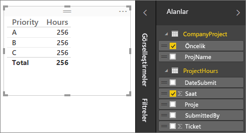

Tablomuza Rapor tuvalinde bakarsak her bir proje için saat sayısının **256.00** olduğunu ve bunun toplam değer olduğunu görürüz. Bunun doğru olmadığı açıktır. Neden mi? Bunun nedeni, bir değer toplamını, aralarında hiçbir ilişki olmaksızın başka bir tablodaki (CompanyProject tablosundaki Priority) değerlerle bölünmüş bir tablodan (Project tablosundaki Hours) hesaplayamayacağımızdır.

O halde bu iki tablo arasında bir ilişki oluşturalım.

Proje adı olan ve değerleri birbirine benzeyen her iki tabloda da gördüğümüz sütunları hatırladınız mı? Tablolarımız arasında bir ilişki oluşturmak için bu iki sütunu kullanacağız.

Neden bu sütunları kullandığımızı biliyor musunuz? ProjectHours tablosundaki Project sütununa bakarsak Blue, Red, Yellow, Orange gibi değerler görürüz. Aslında aynı değere sahip birkaç satır görüyoruz. Project sütunu için kullanılabilecek çok sayıda renk değeri vardır.

CompanyProject tablosundaki ProjName sütununa bakarsak proje için her bir rengin yalnızca bir kez kullanıldığını görürüz. Bu tablodaki her bir renk değeri benzersizdir ve bu durum, bu iki tablo arasında bir ilişki oluşturabilmemiz açısından önemlidir. Bu durumda ilişkimiz çok - tek türünde bir ilişkidir. Çok - tek türündeki ilişkilerde, tablolardan birinde en az bir sütunda benzersiz değerler olmalıdır. Bazı ilişkiler için birtakım ek seçenekler bulunur ve bunlara daha sonra değineceğiz. Şimdilik iki tablomuzun her biri için Project sütunları arasında bir ilişki oluşturalım.

### Yeni ilişki oluşturmak için
1. **İlişkileri Yönet**'e tıklayın.
2. **İlişkileri Yönet** penceresinde **Yeni**'ye tıklayın. Bu işlemin ardından **İlişki Oluştur** iletişim kutusu açılır. Burada, ilişkimiz için istediğimiz tabloları, sütunları ve ek ayarları seçebiliriz.
3. Birinci tabloda **ProjectHours** seçeneğini belirleyip ardından **Project** sütununu seçin. Bu, ilişkimizin çok olarak adlandırılan tarafıdır.
4. İkinci tabloda **CompanyProject** seçeneğini belirleyip ardından **ProjName** sütununu seçin. Bu, ilişkimizin tek olarak adlandırılan tarafıdır.  
5. Hem **İlişki Oluştur** hem de **İlişkileri Yönet** iletişim kutusunda **Tamam**'a tıklayın.

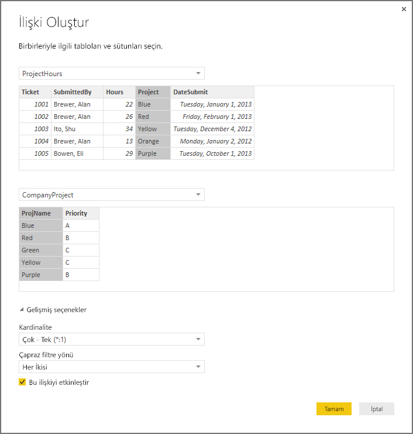

Doğrusunu söylemek gerekirse, bu ilişkiyi daha zor olan yolu kullanarak oluşturdunuz. İlişkileri Yönet iletişim kutusunda Otomatik Algıla düğmesine tıklamanız da yeterli olurdu. Aslında, her iki sütun da aynı şekilde adlandırılmış olsaydı verileri yüklediğinizde Otomatik Algıla özelliği sizin için bu işlemi zaten yapardı. Peki buradaki zorluk nedir?

Şimdi Rapor tuvalimizdeki tabloya bakalım.

 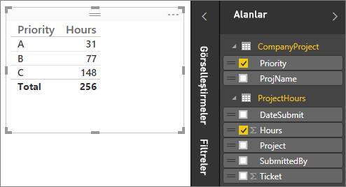

Artık çok daha iyi görünüyor, değil mi?

Saatleri Priority'ye göre topladığımızda Power BI Desktop, CompanyProject arama tablosunda benzersiz renk değerlerinin tüm örneklerini arar, ardından CompanyProject tablosunda bu değerlerin her birinin tüm örneklerini arar ve her bir benzersiz değer için bir genel toplam hesaplar.

Bu çok kolaydı. Aslında, Otomatik Algıla özelliği ile bu kadarını bile yapmanız gerekmeyebilir.

## Ek seçenekleri anlama
Bir ilişki oluşturulduğunda (Otomatik Algıla özelliği tarafından veya elle) Power BI Desktop, tablolarınızdaki verileri temel alarak ek seçenekleri otomatik olarak yapılandırır. Bu ek ilişki özelliklerini, Oluştur/Düzenle ilişkisi iletişim kutusunun en alt kısmında yapılandırabilirsiniz.

 

Söz ettiğimiz üzere, bunlar genellikle otomatik olarak ayarlanır ve düzenlenmesi gerekmez. Ancak, bu seçenekleri kendiniz yapılandırmak isteyebileceğiniz birkaç durum mevcuttur.

## Veriler güncelleştirildiğinde farklı bir kardinalite gerekir
Normalde, Power BI Desktop ilişki için en iyi kardinaliteyi otomatik olarak belirleyebilir.  Verilerin daha sonra değişeceğini bildiğiniz için otomatik ayarı geçersiz kılmanız gerekirse bunu Kardinalite denetiminde seçebilirsiniz. Farklı bir kardinalite seçmemiz gereken bir örneğe bakalım.

Aşağıdaki CompanyProjectPriority tablosu, tüm şirket projelerinin ve proje önceliklerinin yer aldığı bir listedir. ProjectBudget tablosunda, bütçesi onaylanmış projeler yer alır.

**ProjectBudget**

| **Approved Projects** | **BudgetAllocation** | **AllocationDate** |
|:--- | ---:| ---:|
| Blue |40,000 |12/1/2012 |
| Red |100,000 |12/1/2012 |
| Green |50,000 |12/1/2012 |

**CompanyProjectPriority**

| **Project** | **Priority** |
| --- | --- |
| Blue |A |
| Red |B |
| Green |C |
| Yellow |C |
| Purple |B |
| Orange |C |

CompanyProjectPriority tablosundaki Project sütunu ile ProjectBudget tablosundaki ApprovedProjects sütunu arasında bir ilişki oluşturursak aşağıdaki gibi görünür:

 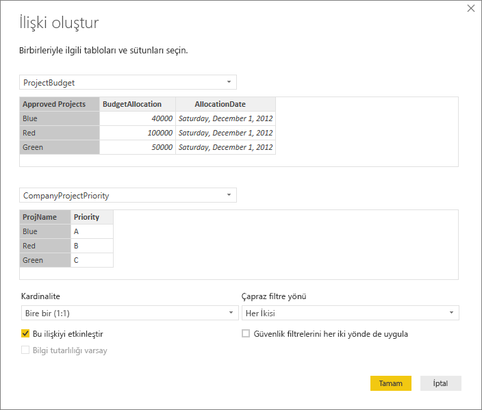

Kardinalite otomatik olarak Tek - Tek (1:1) ve çapraz filtreleme yönü Her ikisi de (gösterildiği gibi) şeklinde ayarlanır.  Bunun nedeni, Power BI Desktop için bu iki tablonun en iyi birleşiminin aşağıdaki gibi olmasıdır:

| **Project** | **Priority** | **BudgetAllocation** | **AllocationDate** |
|:--- | --- | ---:| ---:|
| Blue |A |40,000 |12/1/2012 |
| Red |B |100,000 |12/1/2012 |
| Green |C |50,000 |12/1/2012 |
| Yellow |C |  |  |
| Purple |B |  |  |
| Orange |C |  |  |

Birleştirilen tablonun Project sütununda yinelenen değer olmaması nedeniyle, iki tablomuz arasında tek - tek türünde bir ilişki bulunur. Project sütunu, her değer yalnızca bir kez kullanıldığı için benzersizdir. Bu nedenle, bu iki tablodaki satırlar herhangi bir çoğaltma olmadan doğrudan birleştirilebilir.

Ancak, sonraki yenilemede verilerin değişeceğini bildiğinizi varsayalım. ProjectBudget tablosunun yenilenmiş bir sürümünde artık Blue ve Red için ek satırlar bulunur:

**ProjectBudget**

| **Approved Projects** | **BudgetAllocation** | **AllocationDate** |
| --- | ---:| ---:|
| Blue |40,000 |12/1/2012 |
| Red |100,000 |12/1/2012 |
| Green |50,000 |12/1/2012 |
| Blue |80,000 |6/1/2013 |
| Red |90,000 |6/1/2013 |

 Başka bir deyişle, bu iki tablonun en iyi birleşimi artık şu şekildedir: 

| **Project** | **Priority** | **BudgetAllocation** | **AllocationDate** |
| --- | --- | ---:| ---:|
| Blue |A |40,000 |12/1/2012 |
| Red |B |100,000 |12/1/2012 |
| Green |C |50,000 |12/1/2012 |
| Yellow |C |  |  |
| Purple |B |  |  |
| Orange |C |  |  |
| Blue |A |80000 |6/1/2013 |
| Red |B |90000 |6/1/2013 |

Bu yeni birleşik tabloda, Project sütunu yineleyen değerler içeriyor.  Tablo yenilendikten sonra bu iki özgün tabloda tek - tek türünde ilişki olmaz. Bu durumda, gelecekteki güncelleştirmelerin Project sütununda yinelemelere neden olacağını bildiğimiz için, Kardinalite ayarını ProjectBudget tarafı Çok ve CompanyProject tarafı Tek olacak şekilde Çok - Tek (\*:1) olarak ayarlamamız gerekir.

## Karmaşık bir tablolar ve ilişkiler kümesi için çapraz filtre yönü ayarlama
Çoğu ilişki için çapraz filtre yönü "Her ikisi de" olarak ayarlanır.  Ancak, bunu varsayılandan farklı ayarlamanızı gerektirebilecek bazı az rastlanan durumlar da mevcuttur. Örneğin, Power Pivot'ın önceki bir sürümünden, her ilişkinin tek bir yöne ayarlandığı bir modeli içeri aktarıyor olabilirsiniz. 

Her ikisi de ayarı, bağlı tabloların tüm özelliklerinin Power BI Desktop tarafından tek bir tablo gibi değerlendirilmesini sağlar.  Ancak, bir ilişkinin çapraz filtre yönünün Power BI Desktop tarafından "Her ikisi de" şeklinde ayarlanamadığı ve raporlama amacıyla kullanılabilecek anlaşılır bir varsayılanlar kümesinin tutulduğu bazı durumlar bulunur. Bir ilişkinin çapraz filtre yönü Her ikisi de olarak ayarlanmamışsa bunun nedeni, söz konusu ayarın belirsizlik yaratacak olmasıdır.  Varsayılan çapraz filtre ayarı sizin için uygun değilse belirli bir tablo veya Her ikisi de olarak ayarlamayı deneyin.

Tek yönlü çapraz filtreleme birçok durumda işe yarar.  Excel 2013 veya önceki sürümlerinden bir Power Pivot modeli aktardıysanız tüm ilişkiler tek yön şeklinde ayarlanır.  Tek yön, bağlı tablolardaki filtreleme seçimlerinin, toplama işleminin gerçekleştiği tablolarda çalıştığı anlamına gelir.  Bazı durumlarda çapraz filtreleme biraz zor anlaşılabilir, bu nedenle bir örneğe bakalım.

 

Tek yönlü çapraz filtreleme ile, proje saatlerini özetleyen bir rapor oluşturursanız CompanyProject, Priority veya CompanyEmployee, City'ye göre özetlemeyi (veya filtrelemeyi) seçebilirsiniz.   Ancak, proje başına çalışan sayısını hesaplamak isterseniz (daha az karşılaşılan bir soru) işe yaramaz. Tüm değerlerin aynı olduğu bir sütun elde edersiniz.  Aşağıdaki örnekte her iki ilişkinin de çapraz filtreleme yönü, ProjectHours tablosuna doğru tek yönlü olarak ayarlanmıştır:

 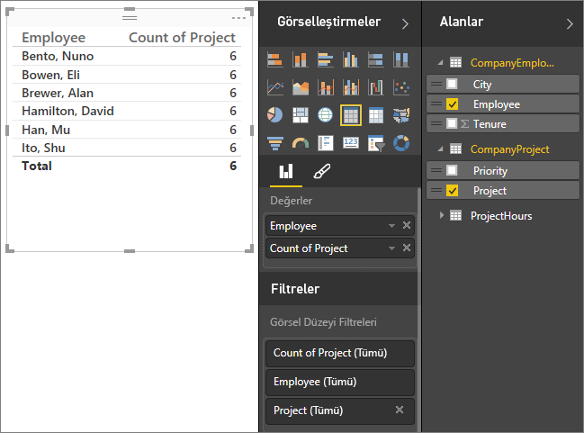

Filtre belirtimi akışı, CompanyProject'ten CompanyEmployee'ye doğru gerçekleşir (aşağıdaki görüntüde gösterildiği gibi) ancak CompanyEmployee'ye doğru gerçekleşmez.  Ancak, çapraz filtreleme yönünü Her ikisi de olarak ayarlarsanız çalışır.  Her ikisi de ayarı, filtrede belirtilenlerin Employee'ye iletilmesini sağlar.

 

Çapraz filtreleme yönü Her İkisi olarak ayarlandığında raporumuz artık doğru görünür:

 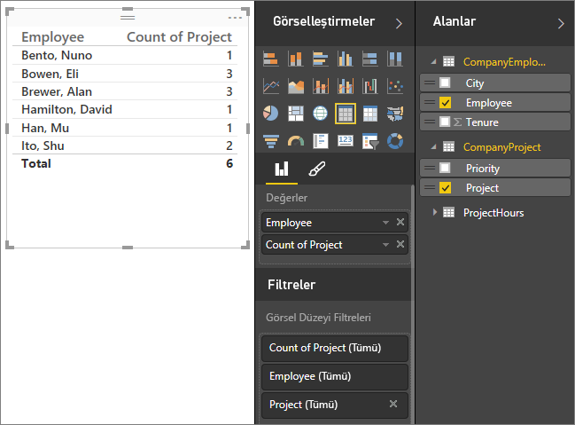

Her iki yönde çapraz filtreleme, yukarıdaki desen gibi görünen tablo ilişkileri deseni için düzgün çalışır. Bu genellikle yıldız şeması olarak adlandırılır ve şu şekildedir:

 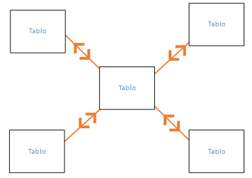

Çapraz filtreleme yönü, veritabanlarında sıklıkla bulunan daha genel bir desenle düzgün çalışmaz. Aşağıdaki diyagram buna örnek verilebilir:

 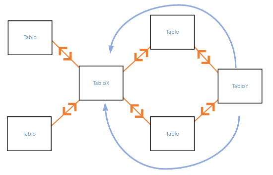

Bunun gibi döngülere sahip bir tablo deseniniz varsa çapraz filtreleme, belirsiz bir ilişki kümesi oluşturabilir. Örneğin, TableX'teki bir alanı toplar ve TableY'deki bir alana göre filtrelemeyi seçerseniz filtrenin hangi yönde ilerleyeceği (en üstteki tablodan veya en alttaki tablodan) net olmaz. Bu tür desenlere ilişkin sık kullanılan bir örnek olarak, TableX'in, gerçek verilere sahip bir Satış tablosu ve TableY'nin de bütçe verileri olduğunu düşünün. Ortadaki tablolar, her iki tablonun da kullandığı Division veya Region gibi arama tablolarıdır. 

Power BI Desktop, etkin/etkin olmayan ilişkilerde olduğu gibi, raporlarda belirsizlik oluşmasına neden olacaksa bir ilişkinin Her ikisi de olarak ayarlanmasına izin vermez. Bu sorunu çözmenin birkaç farklı yolu vardır. En sık kullanılan iki yöntem aşağıda belirtilmiştir:

* Belirsizliği azaltmak için ilişkileri silin veya etkin değil olarak işaretleyin. Bu şekilde bir ilişkinin çapraz filtreleme yönünü Her ikisi de olarak ayarlayabilirsiniz.
* Döngüleri ortadan kaldırmak için bir tabloyu iki kez (ikinci seferde farklı bir ad ile) getirin.  Bu şekilde, ilişkilerin deseni bir yıldız şeması haline gelir.  Yıldız şeması ile tüm ilişkiler Her ikisi de olarak ayarlanabilir.

## Yanlış etkin ilişki
Power BI Desktop otomatik olarak ilişki oluşturduğunda, bazen iki tablo arasında birden çok ilişki ile karşılaşır.  Bu gerçekleştiğinde ilişkilerin yalnızca biri etkin olarak ayarlanır.  Etkin ilişki, varsayılan ilişki görevi görür. Böylece, iki farklı tablodan alan seçtiğinizde Power BI Desktop sizin için otomatik olarak bir görselleştirme oluşturabilir.  Ancak, bazı durumlarda otomatik olarak seçilen ilişki yanlış olabilir.  Bir ilişkiyi etkin veya etkin değil şeklinde ayarlamak için İlişkileri Yönet iletişim kutusunu kullanabilir veya İlişkiyi düzenle iletişim kutusunda etkin ilişkiyi ayarlayabilirsiniz. 

Varsayılan bir ilişki olduğundan emin olmak için, Power BI Desktop belirli bir zamanda iki tablo arasında yalnızca tek etkin bir ilişki olmasına izin verir.  Bu nedenle öncelikle, geçerli ilişkiyi etkin değil olarak ayarlamanız ve ardından etkin olmasını istediğiniz ilişkiyi belirlemeniz gerekir.

Bir örneğe göz atalım. Birinci tablo ProjectTickets, ikinci tablo ise EmployeeRole olarak adlandırılmıştır.

**ProjectTickets**

| **Ticket** | **OpenedBy** | **SubmittedBy** | **Hours** | **Project** | **DateSubmit** |
| ---:|:--- |:--- | ---:|:--- | ---:|
| 1001 |Perham, Tom |Brewer, Alan |22 |Blue |1/1/2013 |
| 1002 |Roman, Daniel |Brewer, Alan |26 |Red |2/1/2013 |
| 1003 |Roth, Daniel |Ito, Shu |34 |Yellow |12/4/2012 |
| 1004 |Perham, Tom |Brewer, Alan |13 |Orange |1/2/2012 |
| 1005 |Roman, Daniel |Bowen, Eli |29 |Purple |10/1/2013 |
| 1006 |Roth, Daniel |Bento, Nuno |35 |Green |2/1/2013 |
| 1007 |Roth, Daniel |Hamilton, David |10 |Yellow |10/1/2013 |
| 1008 |Perham, Tom |Han, Mu |28 |Orange |1/2/2012 |
| 1009 |Roman, Daniel |Ito, Shu |22 |Purple |2/1/2013 |
| 1010 |Roth, Daniel |Bowen, Eli |28 |Green |10/1/2013 |
| 1011 |Perham, Tom |Bowen, Eli |9 |Blue |10/15/2013 |

**EmployeeRole**

| **Employee** | **Role** |
| --- | --- |
| Bento, Nuno |Project Manager |
| Bowen, Eli |Project Lead |
| Brewer, Alan |Project Manager |
| Hamilton, David |Project Lead |
| Han, Mu |Project Lead |
| Ito, Shu |Project Lead |
| Perham, Tom |Project Sponsor |
| Roman, Daniel |Project Sponsor |
| Roth, Daniel |Project Sponsor |

Burada aslında iki ilişki bulunur. Biri ProjectTickets tablosundaki SubmittedBy ile EmployeeRole tablosundaki Employee arasında, diğeri de ProjectTickets tablosundaki OpenedBy ile EmployeeRole tablosundaki Employee arasındadır.

 

Her iki ilişkiyi de modele (öncelikle OpenedBy) eklersek İlişkileri Yönet iletişim kutusu OpenedBy'ın etkin olduğunu gösterir:

 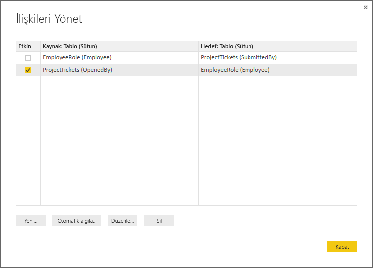

Şimdi, Rapor tuvalindeki bir tablo görselleştirmesinde Employee Role tablosundaki Role ve Employee alanlarının ve ProjectTickets tablosundaki Hours alanının kullanıldığı bir rapor oluşturursak yalnızca proje sponsorlarını görürüz. Bunun nedeni, yalnızca proje sponsorlarının proje bileti açmış olmasıdır.

 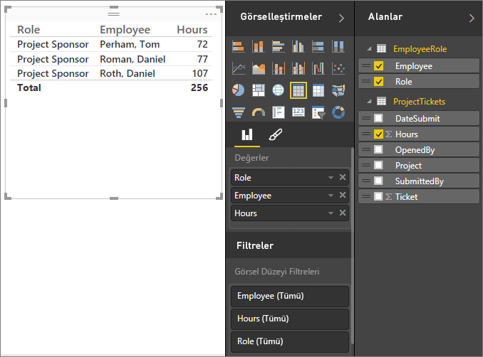

Etkin ilişkiyi değiştirebilir ve OpenedBy tablosu yerine SubmittedBy tablosunu alabiliriz. İlişkileri Yönet iletişim kutusunda ProjectTickets(OpenedBy) ile EmployeeRole(Employee) ilişkisinin seçimini kaldırırız ve ardından Project Tickets(SubmittedBy) ile EmployeeRole(Employee) ilişkisini işaretleriz.

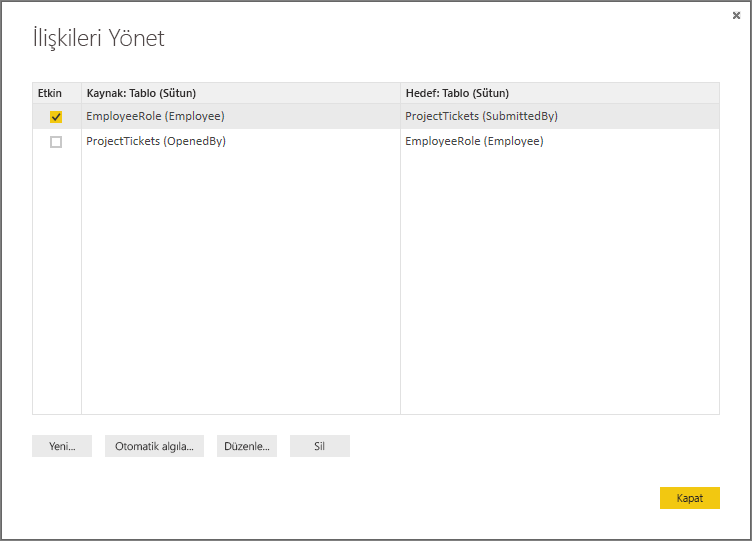

## İlişki Görünümü'nde ilişkilerinizin tümünü görüntüleme
Bazen modelinizin birden çok tablosu olur ve bunlar arasında karmaşık ilişkiler bulunur. Power BI Desktop'taki İlişki Görünümü, modelinizdeki tüm ilişkileri, bunların yönünü ve kardinalitesini kolay anlaşılır ve özelleştirilebilir bir diyagramda gösterir. Daha fazla bilgi edinmek için bkz. [Power BI Desktop'taki İlişki Görünümü](desktop-relationship-view.md).

