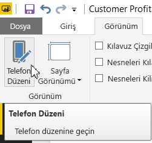
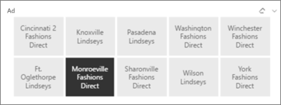
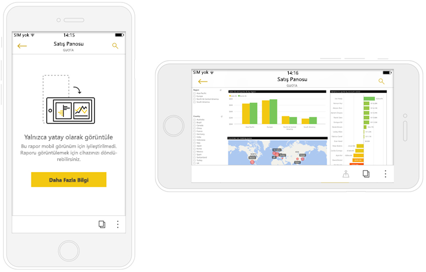

# Power BI mobil uygulamaları için en iyi duruma getirilmiş raporlar oluşturma
Telefon veya tabletteki mobil uygulamalarda raporlarınızı görüntüleme deneyimini geliştirebilirsiniz. Özel olarak telefonlar ve tabletler için raporun dikey bir düzenini oluşturun. Power BI Desktop’ta ve Power BI hizmetinde en iyi deneyimi elde etmek için görselleri dikey bir düzende yeniden yerleştirip yeniden boyutlandırarak raporunuzu uyarlarsınız. Tümünü eklemek zorunda değilsiniz. Bununla birlikte, telefonda görüntülendiğinde uygun şekilde yeniden boyutlandırılan [*esnek* görseller](#optimize-a-visual-for-any-size) ve [esnek dilimleyiciler](#enhance-slicers-to-work-well-in-phone-reports) oluşturabilirsiniz. Ayrıca, raporunuza filtre eklediyseniz bu filtreler en iyi duruma getirilmiş raporda otomatik olarak görüntülenir. Raporunuzu okuyanlar bu filtreleri görebilir ve rapora uygulayabilir.

## Rapor sayfasının dikey sürümünü düzenleme

Bir rapor oluşturduktan sonra, telefonlar ve tabletler için bunu iyileştirebilirsiniz.

1. Power BI Desktop’ın Rapor Görünümü’nde, **Görünüm** sekmesinde **Telefon Düzeni**’ni seçin.  
   
    
   
    Power BI hizmetinde, **Raporu Düzenle** > **Mobil Düzen**’i seçin.

    Şekli telefona benzeyen boş bir tuval görürsünüz. Özgün rapor sayfanızdaki tüm görseller sağ taraftaki Görsel Öğeler bölmesinde listelenir.

3. Telefon düzenine eklemek istediğiniz görselleri Görsel Öğeler bölmesinden telefon tuvaline sürükleyin.
   
    Telefon raporları kılavuz düzeni kullanır. Mobil tuvale sürüklediğiniz görseller bu kılavuza yapışır.
   
    
   
    Ana rapor sayfasındaki görsellerin bazılarını veya tümünü telefon rapor sayfasına ekleyebilirsiniz. Her görseli yalnızca bir kez ekleyebilirsiniz.

4. Kılavuz üzerindeki görselleri panolardaki ve mobil panolardaki kutucuklar gibi yeniden boyutlandırabilirsiniz.
   
   Telefon raporu kılavuzu farklı boyutlardaki telefonlara göre değişir. Bu sayede raporunuz hem küçük hem de büyük ekranlı telefonlarda güzel görünür.
   
   

## Görseli tüm boyutlar için en iyi duruma getirme
Panonuzdaki veya raporunuzdaki görselleri *değişken* olacak şekilde ayarlayabilirsiniz. Ekran boyutu ne olursa olsun maksimum sayıda veri ve içgörü görüntüleyecek şekilde dinamik olarak değişebilirler. 

Power BI, veri görüntüleme önceliğini görsel boyutuna göre değiştirir. Örneğin görselin küçülse dahi bilgilendirici olması için otomatik olarak boşluğu kaldırabilir ve açıklamayı görselin üst tarafına taşıyabilir.

Her bir görsel için esneklik seçeneğini açıp kapatabilirsiniz. [Görselleri en iyi duruma getirme](visuals/desktop-create-responsive-visuals.md) hakkında daha fazla bilgi edinin.

## Telefon rapor düzenlerini oluştururken dikkat edilecek noktalar
* Çok sayfalı raporlarda tüm sayfaları veya yalnızca birkaç tanesini en iyi duruma getirebilirsiniz. 
* Belirli bir rapor sayfası için arka plan rengi tanımladıysanız telefon raporunda da aynı arka plan rengi kullanılır.
* Biçimlendirme ayarlarını yalnızca telefon düzeni için değiştiremezsiniz. Ana ve mobil düzenlerin biçimlendirme özellikleri ortaktır. Örneğin yazı tipi boyutu aynı olacaktır.
* Bir görselin biçimini, veri kümesini, filtrelerini veya diğer özniteliklerini değiştirmek için normal rapor oluşturma moduna geçin.
* Power BI, mobil uygulamada telefon raporları için varsayılan başlıkları ve sayfa adlarını kullanır. Raporunuzdaki başlıklar ve sayfa adları için metin görselleri oluşturduysanız bunları telefon raporlarına eklemeniz önerilmez.     

## Telefon düzenindeki görselleri kaldırma
* Telefon tuvali üzerinde kaldırmak istediğiniz görselin sağ üst köşesindeki X simgesine tıklayın veya görseli seçip **Sil**'e tıklayın.
  
   Bu işlem görseli yalnızca telefon düzeni tuvalinden kaldırır. Görsel ve özgün rapor etkilenmez.
  
   

## Dilimleyicileri telefon raporlarında iyi çalışacak şekilde geliştirme
Dilimleyiciler, rapor verilerinizin tuval üzerinde filtrelenmesini sağlar. Dilimleyicileri normal rapor oluşturma modunda tasarlarken telefon raporlarında daha kullanışlı hale getirmek için bazı dilimleyici ayarlarını değiştirebilirsiniz:

* Raporu okuyanların bir veya daha fazla öğeyi seçip seçemeyeceğine karar verin.
* Dilimleyicinin etrafına bir kutu yerleştirerek raporu taramayı kolaylaştırın.
* Dilimleyiciyi dikey, yatay veya *esnek* hale getirin. 

Dilimleyiciyi esnek hale getirirseniz boyutunu veya şeklini değiştirdiğinizde daha fazla ya da daha az seçenek görüntülenir. Dilimleyici uzun, kısa, geniş veya dar olabilir. Yeterince küçültürseniz rapor sayfasında bir filtre simgesine dönüşür. 

[Esnek dilimleyiciler oluşturma](power-bi-slicer-filter-responsive.md) hakkında daha fazla bilgi edinin.

## Telefon raporu yayımlama
* Raporunuzun telefon sürümünü yayımlamak için [ana raporu Power BI Desktop'tan Power BI hizmetine yayımlamanız](desktop-upload-desktop-files.md) yeterlidir, telefon sürümü de aynı anda yayımlanır.
  
    [Power BI'da paylaşım ve izinler](service-how-to-collaborate-distribute-dashboards-reports.md) hakkında daha fazla bilgi edinin.

## En iyi duruma getirilmiş ve getirilmemiş raporları telefonda veya tablette görüntüleme
Telefonlardaki mobil uygulamalarda Power BI en iyi duruma getirilmiş ve getirilmemiş telefon raporlarını otomatik olarak algılar. Telefon için en iyi duruma getirilmiş rapor varsa Power BI telefon uygulaması ilgili raporu otomatik olarak telefon raporu modunda açar.

Telefon için en iyi duruma getirilmiş rapor yoksa rapor en iyi duruma getirilmemiş, yatay görünümde açılır.  

Telefon raporu açıkken telefonun yatay hale getirilmesi durumunda raporun en iyi duruma getirilmiş olma durumundan bağımsız olarak rapor, özgün rapor düzeniyle ve en iyi duruma getirilmemiş görünümde açılır.

Yalnızca sayfaların bazılarını en iyi duruma getirdiyseniz okuyucular dikey görünümde raporun yalnızca yatay görünümde kullanılacağına dair bir ileti görür.

Raporu okuyanlar sayfayı yatay modda görmek için telefonlarını veya tabletlerini döndürebilir. [Dikey mod için en iyi duruma getirilmiş Power BI raporlarıyla etkileşimli çalışma](consumer/mobile/mobile-apps-view-phone-report.md) hakkında daha fazla bilgi edinin.

## Sonraki adımlar
* [Power BI'da bir panonun telefon görünümünü oluşturma](service-create-dashboard-mobile-phone-view.md)
* [Telefonunuz için en iyi duruma getirilmiş Power BI raporlarını görüntüleme](consumer/mobile/mobile-apps-view-phone-report.md)
* [Tüm boyutlar için en iyi duruma getirilmiş esnek görseller oluşturma](visuals/desktop-create-responsive-visuals.md)
* Başka bir sorunuz mu var? [Power BI Topluluğu'na sorun](http://community.powerbi.com/)

