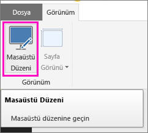
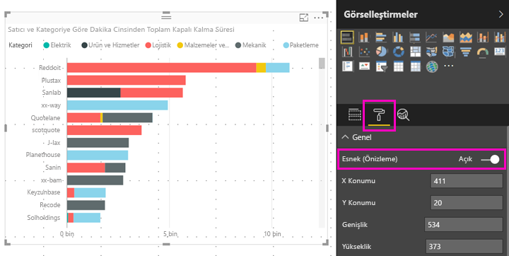

# Power BI görselini tüm boyutlar için en iyi duruma getirme
Pano veya raporunuzdaki görsellerin *yanıt verir* duruma gelip ekran boyutu ne olursa olsun maksimum sayıda veri ve öngörü görüntüleyecek şekilde dinamik olarak değişmesini sağlayabilirsiniz.

Power BI, veri görünümü önceliğini görsel boyutuna göre değiştirir. Örneğin, görselin küçülse bile bilgilendirici olması için otomatik olarak boşluğu kaldırır ve açıklamayı görselin üst tarafına taşır. Yanıt verme özellikle telefonlarda kullanılan Power BI mobil uygulamalarındaki görseller için faydalıdır.

Yanıt verme özelliğini X ve Y ekseni ile dilimleyicilere sahip tüm görseller için etkinleştirebilirsiniz.

## Power BI Desktop'ta yanıt verme özelliğini etkinleştirme
1. Power BI Desktop'ın **Görünüm** sekmesinden **Masaüstü Düzeni**'nde olduğunuzdan emin olun.
   
    
2. Bir görsel seçtikten sonra **Görsel Öğeler** bölmesinin **Biçim** bölümünü seçin.
3. **Genel** bölümünü genişletip **Yanıt veriyor** ayarını **Açık** olarak belirleyin.
   
    
   
     [Telefon için en iyi duruma getirilmiş bir rapor oluşturup](desktop-create-phone-report.md) bu görseli eklediğinizde yanıt veren boyutlandırma gerçekleşecektir.

## Power BI hizmetinde yanıt verme özelliğini etkinleştirme
Power BI hizmetindeki bir raporda bulunan bir görsel için yanıt verme özelliğini etkinleştirebilirsiniz. Bunun için raporu düzenleme iznine sahip olmanız gerekir.

1. Power BI hizmetinde ([https://powerbi.com](https://powerbi.com)) bulunan bir raporda **Raporu Düzenle**'yi seçin.
2. Bir görsel seçtikten sonra **Görsel Öğeler** bölmesinin **Biçim** bölümünü seçin.
3. **Genel** bölümünü genişletip **Yanıt veriyor** ayarını **Açık** olarak belirleyin.
   
    
   
     [Bir panonun telefon görünümünü oluşturup](service-create-dashboard-mobile-phone-view.md) bu görseli eklediğinizde esnek boyutlandırma gerçekleşecektir.

## Sonraki adımlar
* [Power BI telefon uygulamaları için en iyi duruma getirilmiş raporlar oluşturma](desktop-create-phone-report.md)
* [Power BI'da bir panonun telefon görünümünü oluşturma](service-create-dashboard-mobile-phone-view.md)
* [View Power BI reports optimized for your phone (Telefonunuz için en iyi duruma getirilmiş Power BI raporlarını görüntüleme)](mobile-apps-view-phone-report.md)
* Başka bir sorunuz mu var? [Power BI Topluluğu'na sorun](http://community.powerbi.com/)

