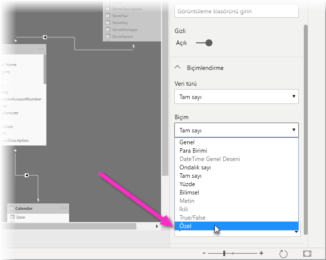
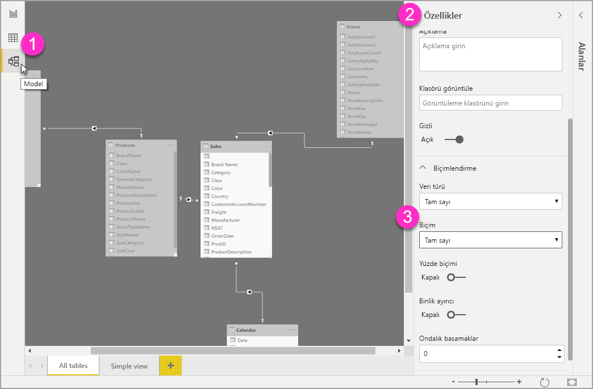

# Power BI Desktop’ta özel biçim dizelerini kullanma

**Power BI Desktop**’taki özel biçim dizelerini kullanarak alanların görsellerde nasıl göründüğünü özelleştirebilir ve raporlarınızın tam istediğiniz gibi göründüğünden emin olabilirsiniz.

## Özel biçim dizeleri nasıl kullanılır?

Özel biçim dizeleri oluşturmak için, **Modelleme** görünümünde alanı seçin ve ardından **Özellikler** bölmesinden **Biçim**'i seçin.

**Biçim** açılır listesinden **Özel**’i seçtikten sonra yaygın olarak kullanılan biçim dizeleri listesinden seçim yapabilirsiniz. 

## Desteklenen özel biçim söz dizimi

Özel biçim dizeleri, Excel ve diğer Microsoft ürünlerinde ortak olan VBA stili söz dizimini izler ancak diğer ürünlerde kullanılan tüm söz dizimini desteklemez. 

Aşağıdaki tablolar Power BI’da desteklenen söz dizimini tanımlar.

Aşağıdaki tabloda desteklenen **Tarih sembolleri** gösterilmektedir:

| **Sembol** | **Aralık** |
| --- | --- |
| _d_ | 1-31 (Önünde sıfır olmadan ayın günü) |
| _dd_ | 01-31 (Önünde sıfır olan ayın günü) |
| _m_ | 1-12 (Ocak = 1’den başlayarak önünde sıfır olmayan yılın ayı) |
| _mm_ | 01-12 (Ocak = 01’den başlayarak önünde sıfır olan yılın ayı) |
| _mmm_ | Kısaltılmış ay adlarını gösterir (Hicri ay adlarının kısaltması yoktur) |
| _mmmm_ | Tam ay adlarını gösterir |
| _yy_ | 00-99 (Yılın son iki hanesi) |
| _yyyy_ | 100-9999 (Üç veya Dört basamaklı yıl) |

Aşağıdaki tabloda desteklenen **Saat sembolleri** gösterilmektedir:

| **Sembol** | **Aralık** |
| --- | --- |
| _h_ | 0-23 (&quot;AM&quot; veya &quot;PM&quot; eklenerek 1-12) (Başında sıfır olmadan günün saati) |
| _hh_ | 00-23 (&quot;AM&quot; veya &quot;PM&quot; eklenerek 01-12) (Başında sıfır olmadan günün saati) |
| _n_ | 0-59 (Başında sıfır olmadan saat dakikası) |
| _nn_ | 00-59 (Başında sıfır olan saat dakikası) |
| _m_ | 0-59 (Başında sıfır olmadan saat dakikası). Yalnızca öncesinde _h_ veya _hh_ varsa |
| _mm_ | 00-59 (Başında sıfır olan saat dakikası). Yalnızca öncesinde _h_ veya _hh_ varsa |
| _s_ | 0-59 (Başında sıfır olmadan dakika saniyesi) |
| _ss_ | 00-59 (Başında sıfır olan dakika saniyesi) |

Özel değer dizelerinin nasıl biçimlendirileceğini gösteren bir [örneği](https://docs.microsoft.com/office/vba/language/reference/user-interface-help/format-function-visual-basic-for-applications#example) görebilirsiniz.

Sayılara yönelik kullanıcı tanımlı bir biçim ifadesinin noktalı virgülle ayrılmış bir ila üç bölümü olabilir. Aralarında hiçbir şey olmadan noktalı virgül eklerseniz, eksik bölüm gösterilmez (&quot;&quot; olur). Noktalı virgül belirtilmezse pozitif biçimi kullanır.

Farklı değer dizeleri için farklı biçimlerin örnekleri aşağıda verilmiştir:

|   | **Biçim Dizeleri** |   |   |   |
| --- | --- | --- | --- | --- |
| **Değerler** | **0,00;-0,0;&quot;Sıfır&quot;** | **0,00;;** | **0,00;-0,0;** | **0,00;** |
| **-1,234** | -1,2 | &quot;&quot; | -1,2 | &quot;&quot; |
| **0** | &quot;Sıfır&quot; | &quot;&quot; | &quot;&quot; | 0,00 |
| **1,234** | 1,23 | 1,23 | 1,23 | 1,23 |

Aşağıdaki tabloda önceden tanımlı **adlandırılmış tarih ve saat biçimleri** tanımlanmaktadır:

| **Biçim adı** | **Açıklama** |
| --- | --- |
| **Genel Tarih** | Bir tarih ve/veya saat görüntüler; örneğin, 03.04.93 17.34. Kesirli bölüm yoksa yalnızca bir tarih görüntüler; örneğin, 03.04.93. Tamsayı bölümü yoksa yalnızca saati görüntüler; örneğin, 17.34. Tarih görünümü, sistem ayarlarınıza göre belirlenir. |
| **Uzun Tarih** | Sistemin uzun tarih biçimine uygun olarak bir tarih görüntüler. |
| **Kısa Tarih** | Sistemin kısa tarih biçimini kullanarak bir tarih görüntüler. |
| **Uzun Saat** | Sisteminizin uzun saat biçimini kullanarak bir saat görüntüler; saat, dakika, saniye içerir. |
| **Kısa Saat** | 24 saat biçimini kullanarak bir saat görüntüler; örneğin, 17.45. |

Adlandırılmış sayısal biçimler

Aşağıdaki tabloda önceden tanımlı **adlandırılmış sayısal biçimler** tanımlanmaktadır:

| **Biçim adı** | **Açıklama** |
| --- | --- |
| **Genel Sayı** | Binlik ayıracı olmadan sayı görüntüler. |
| **Para Birimi** | Uygunsa binlik ayıracı ile sayıyı görüntüler; ondalık ayırıcısının sağında iki basamak gösterir. Çıktı, sistemin yerel ayarlarını temel alır. |
| **Sabit** | Sol tarafta en az bir basamak ve ondalık ayırıcısının sağında iki basamak gösterir. |
| **Standart** | Sol tarafta en az bir basamak ve ondalık ayırıcısının sağında iki basamak olmak üzere binlik ayıracı ile sayıyı gösterir. |
| **Yüzde** | Sayıyı 100 ile çarpıp sağına bir yüzde işareti ( **%** ) ekleyerek gösterir; ondalık ayırıcısının sağ tarafında her zaman iki basamak gösterir. |
| **Bilimsel** | Standart bilimsel gösterimi kullanır. |

Aşağıdaki tabloda **kullanıcı tanımlı tarih/saat biçimleri** oluşturmak için kullanabileceğiniz karakterler tanımlanmaktadır.

| **Karakter** | **Açıklama** |
| --- | --- |
| ( **:** ) | Tarih ayırıcısı. Bazı yerel ayarlarda, saat ayırıcısını temsil etmek için başka karakterler kullanılabilir. Saat ayırıcısı, saat değerleri biçimlendirilirken saat, dakika ve saniyeleri ayırır. Biçimlendirilmiş çıktıda saat ayırıcısı olarak kullanılan gerçek karakter, sistem ayarlarınıza göre belirlenir. |
| ( **/** ) | Tarih ayırıcısı. Bazı yerel ayarlarda, tarih ayırıcısını temsil etmek için başka karakterler kullanılabilir. Tarih ayırıcısı, tarih değerleri biçimlendirilirken gün, ay ve yılı ayırır. Biçimlendirilmiş çıktıda tarih ayırıcısı olarak kullanılan gerçek karakter, sistem ayarlarınıza göre belirlenir. |
| d | Gün değerini, önünde sıfır olmadan bir sayı (1-31) olarak görüntüler. |
| dd | Gün değerini, önüne sıfır koyarak bir sayı (01-31) olarak görüntüler. |
| ddd | Gün değerini kısaltma (Paz-Cts) olarak görüntüler. Yerelleştirilmiştir. |
| dddd | Günü tam adıyla (Pazar–Cumartesi) gösterir. Yerelleştirilmiştir. |
| m | Ay değerini, önünde sıfır olmadan bir sayı (1-12) olarak görüntüler. h veya hh’nin hemen ardından m geliyorsa ay yerine dakika gösterilir. |
| mm | Ay değerini, önüne sıfır koyarak bir sayı (01-12) olarak görüntüler. h veya hh’nin hemen ardından m geliyorsa ay yerine dakika gösterilir. |
| mmm | Ay değerini kısaltma (Oca-Ara) olarak görüntüler. Yerelleştirilmiştir. |
| mmmm | Ay değerini tam ay adıyla (Ocak-Aralık) görüntüler. Yerelleştirilmiştir. |
| yy | Yılı 2 basamaklı bir sayı (00–99) olarak gösterir. |
| yyyy | Yılı 4 basamaklı bir sayı (100–9999) olarak gösterir. |
| h | Saat değerini, önünde sıfır olmadan bir sayı (0-23) olarak görüntüler. |
| hh | Saat değerini, önüne sıfır koyarak bir sayı (00-23) olarak görüntüler. |
| n | Dakika değerini, önünde sıfır olmadan bir sayı (0-59) olarak görüntüler. |
| nn | Dakika değerini, önüne sıfır koyarak bir sayı (00-59) olarak görüntüler. |
| s | Saniye değerini, önünde sıfır olmadan bir sayı (0-59) olarak görüntüler. |
| ss | Saniye değerini, önüne sıfır koyarak bir sayı (00-59) olarak görüntüler. |
| AM/PM | 12 saatlik zamanı kullanır ve öğleden önceki herhangi bir saati büyük harfli AM ile birlikte gösterir; öğle ile 23.59 arasındaki herhangi bir saati büyük harfli PM ile birlikte gösterir. |

Aşağıdaki tabloda **kullanıcı tanımlı sayı biçimleri** oluşturmak için kullanabileceğiniz karakterler tanımlanmaktadır.

| **Karakter** | **Açıklama** |
| --- | --- |
| Yok | Sayıyı biçimlendirme olmadan görüntüler. |
| ( **0** ) | Basamak yer tutucusu. Bir basamak veya sıfır görüntüler. İfade, biçim dizesinde 0’ın göründüğü yerde bir basamak içeriyorsa görüntüler; aksi takdirde o konumda bir sıfır gösterir. Sayı, biçim ifadesinde sıfırlardan daha az basamak içeriyorsa (ondalık ayırıcısının her iki tarafında), baştaki veya sondaki sıfırları görüntüler. Sayının ondalık ayırıcısının sağındaki basamak sayısı biçim ifadesindeki ondalık ayırıcısının sağında bulunan sıfırlardan daha fazlaysa, sayıyı sıfır sayısı kadar ondalık basamak olacak şekilde yuvarlar. Sayının ondalık ayırıcısının solundaki basamak sayısı biçim ifadesindeki ondalık ayırıcısının solunda bulunan sıfırlardan daha fazlaysa, fazla basamakları değiştirmeden görüntüler. |
| ( **#** ) | Basamak yer tutucusu. Bir basamak görüntüler veya hiçbir şey görüntülemez. İfade, biçim dizesinde # işaretinin göründüğü yerde bir basamak içeriyorsa görüntüler; aksi takdirde o konumda hiçbir şey göstermez. Bu sembol 0 rakamı yer tutucusu gibi çalışır; ancak sayının basamak sayısı, biçim ifadesindeki ondalık ayırıcısının her iki tarafındaki # karakteri sayısına eşit veya daha düşükse baştaki ve sondaki sıfırlar gösterilmez. |
| ( **.** ) | Ondalık yer tutucusu. Bazı yerel ayarlarda, ondalık ayırıcısı olarak virgül kullanılır. Ondalık yer tutucusu, ondalık basamağının solunda ve sağında kaç tane basamağın gösterildiğini belirler. Biçim ifadesi bu sembolün solunda yalnızca sayı işaretlerini içeriyorsa, 1'den küçük sayılar ondalık ayırıcısıyla başlar. Kesirli sayıların başında bir sıfır göstermek için, ondalık ayırıcısının solundaki birinci basamak yer tutucusu olarak 0 kullanın. Biçimlendirilen çıktıda ondalık yer tutucusu olarak kullanılan gerçek karakter, sisteminiz tarafından tanınan Sayı Biçimine bağlıdır. |
| ( **%)** | Yüzde yer tutucusu. İfade 100 ile çarpılır. Biçim dizesinde göründüğü konuma yüzde karakteri ( **%** ) eklenir. |
| ( **,** ) | Binlik ayıracı. Bazı yerel ayarlarda, binlik ayıracı olarak nokta kullanılır. Binlik ayıracı, ondalık ayırıcısının solunda dört veya daha fazla basamağı olan bir sayının içinde binleri yüzlerden ayırır. Biçim, başında ve sonunda basamak yer tutucuları ( **0** veya **#** ) olan bir binlik ayıracı içeriyorsa, binlik ayracının standart kullanımı belirtilir. İki bitişik binlik ayıracı veya ondalık ayırıcısının hemen solunda bulunan bir binlik ayıracı (ondalık belirtilmiş olsun veya olmasın), &quot;sayıyı 1000’e bölüp gerektiğinde yuvarlayarak ölçeklendirme&quot; anlamına gelir. Örneğin, 100 milyonu 100 olarak ifade etmek için &quot;##0,,&quot; biçim dizesini kullanabilirsiniz. 1 milyondan küçük sayılar 0 olarak gösterilir. Ondalık ayırıcısının hemen solu dışında herhangi bir konumdaki ili bitişik binlik ayracının, binlik ayıracı kullanımını belirttiği kabul edilir. Biçimlendirilen çıktıda binlik ayıracı olarak kullanılan gerçek karakter, sisteminiz tarafından tanınan Sayı Biçimine bağlıdır. |
| ( **:** ) | Tarih ayırıcısı. Bazı yerel ayarlarda, saat ayırıcısını temsil etmek için başka karakterler kullanılabilir. Saat ayırıcısı, saat değerleri biçimlendirilirken saat, dakika ve saniyeleri ayırır. Biçimlendirilmiş çıktıda saat ayırıcısı olarak kullanılan gerçek karakter, sistem ayarlarınıza göre belirlenir. |
| ( **/** ) | Tarih ayırıcısı. Bazı yerel ayarlarda, tarih ayırıcısını temsil etmek için başka karakterler kullanılabilir. Tarih ayırıcısı, tarih değerleri biçimlendirilirken gün, ay ve yılı ayırır. Biçimlendirilmiş çıktıda tarih ayırıcısı olarak kullanılan gerçek karakter, sistem ayarlarınıza göre belirlenir. |
| ( **E- E+ e- e+** ) | Bilimsel biçim. Biçim ifadesi E-, E+, e- veya e+ sembolünün sağında en az bir basamak yer tutucusu ( **0** veya **#** ) içeriyorsa, bu sayı bilimsel biçimde gösterilir veya sayı ile üssü arasına eklenir. Sağdaki basamak yer tutucularının sayısı, üs içindeki basamak sayısını belirler. Negatif üslerin yanına eksi işareti yerleştirmek için E-veya e- kullanın. Negatif üslerin yanına eksi işareti ve pozitif üslerin yanına artı işareti yerleştirmek için E+ veya e+ kullanın. |
| **- + $**  ( ) | Değişmez bir karakter görüntüler. Listelenenlerin dışında bir karakter görüntülemek için karakterin önüne bir ters eğik çizgi koyun (\)) veya bunu çift tırnak işareti (&quot; &quot;) içine alın. |
| ( * *\** ) | Biçim dizesinde bir sonraki karakteri görüntüler. Özel anlamı olan bir karakteri değişmez karakter olarak görüntülemek için önüne bir ters eğik çizgi (\)) koyun. Ters eğik çizgi gösterilmez. Ters eğik çizgi kullanmak, sonraki karakteri çift tırnak işaretleri içine almakla aynıdır. Bir ters eğik çizgiyi göstermek için iki ters eğik çizgi (\\) kullanın. Tarih biçimlendirme ve saat biçimlendirme karakterleri (a, c, d, h, m, n, p, q, s, t, w, / ve :), sayısal biçimlendirme karakterleri (#, 0, %, E, e, virgül ve nokta) ve dize biçimlendirme karakterleri (@, &amp;, \&lt;, \&gt; ve !), değişmez karakter olarak gösterilemeyen karakterlerin örneklerindendir. |
| (&quot;ABC&quot;) | Dizeyi çift tırnak işaretleri (&quot; &quot;) içinde görüntüler. |

## Sonraki adımlar
Aşağıdaki makaleler de ilginizi çekebilir:

* [VBA biçim dizeleri](https://docs.microsoft.com/office/vba/language/reference/user-interface-help/format-function-visual-basic-for-applications#example)
* [Power BI Desktop’taki ölçümler](desktop-measures.md)
* [Power BI Desktop'taki veri türleri](desktop-data-types.md)
* [Tablolarda koşullu biçimlendirme](desktop-conditional-table-formatting.md)

