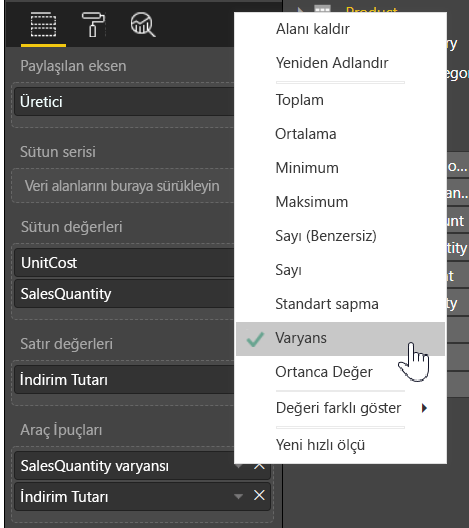

# Power BI Desktop'taki Araç İpuçlarını özelleştirme
Araç ipuçları, görseller üzerinde daha fazla bağlamsal bilgi ve daha ayrıntılı veri noktaları sağlamak için kullanılan mükemmel bir yoldur. Aşağıdaki görüntüde, Power BI Desktop'taki bir grafiğe uygulanmış bir araç ipucu gösterilmektedir.

Bir görselleştirme oluşturulduğunda varsayılan araç ipucu, veri noktasının değerini ve kategorisini görüntüler. Araç ipucu bilgisini özelleştirmenin faydalı olduğu ve kullanıcıların görseli görüntülerken faydalanabilecekleri ek bağlam ve bilgi sağlayabilecek pek çok örnek bulunur. Özel araç ipuçları, araç ipucunun bir parçası olarak görüntülenebilecek ek veri noktaları belirlemenize olanak sağlar.

## Araç ipuçlarını özelleştirme
Özelleştirilmiş bir araç ipucu oluşturmak için **Görsel Öğeler** bölmesinin **Alanlar** kutusunda, aşağıdaki görüntüde gösterildiği şekilde bir alanı **Araç ipuçları** demetine sürüklemeniz yeterlidir. Aşağıdaki görüntüde, **Araç ipuçları** demetine iki alan yerleştirilmiş olarak gösterilmektedir.

Araç ipuçları alan kutusuna eklendikten sonra görselleştirme üzerinde bir veri noktası üzerine gelindiğinde araç ipucundaki o alanlara yönelik değerler görüntülenir.

## Toplama ya da Hızlı Hesaplamalar ile araç ipuçlarını özelleştirme
Bir toplama işlevi seçerek ya da **Araç ipuçları** demetinde bulunan alanın yanındaki oku seçip görüntülenen seçeneklerden *Hızlı Hesaplama* işlevini seçerek araç ipucunu daha da ayrıntılı bir şekilde özelleştirebilirsiniz.

Hızlı bilgileri ve öngörüleri, panolarınızı ve raporlarınızı görüntüleyen kullanıcılara sunmak için veri kümenizde kullanılabilir olan herhangi bir alanı kullanarak **Araç ipuçlarını** özelleştirmenin pek çok yolu bulunur.

