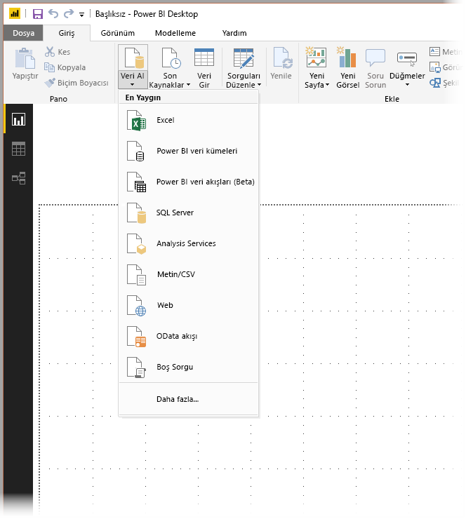
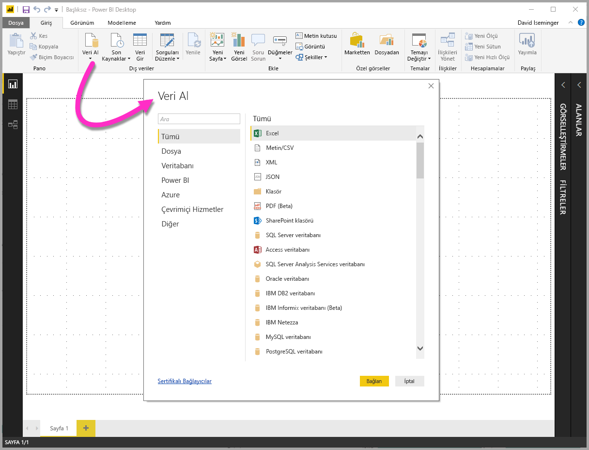
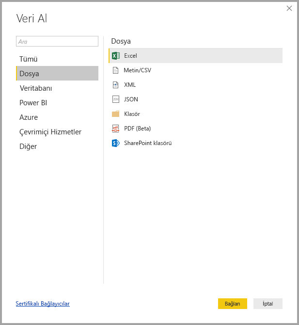
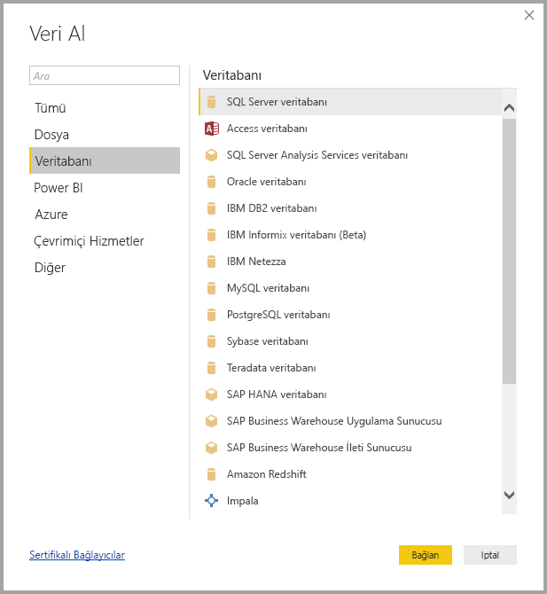
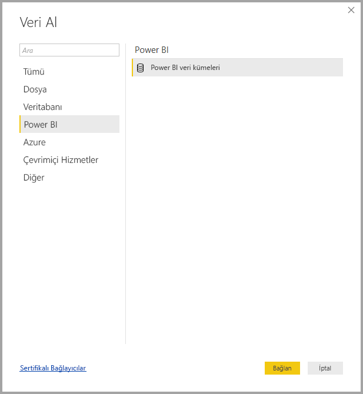
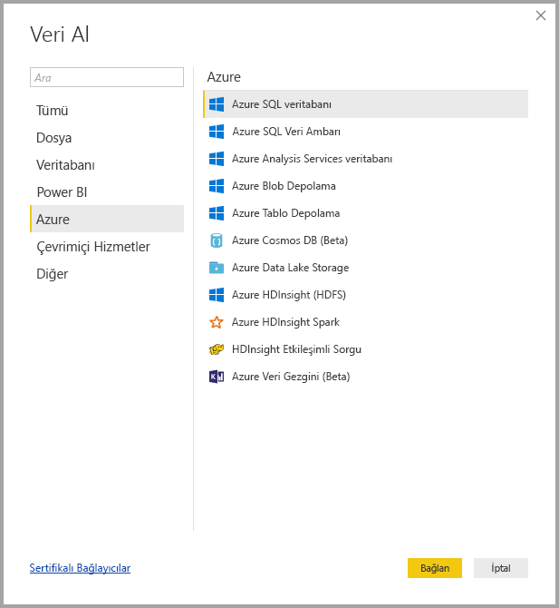
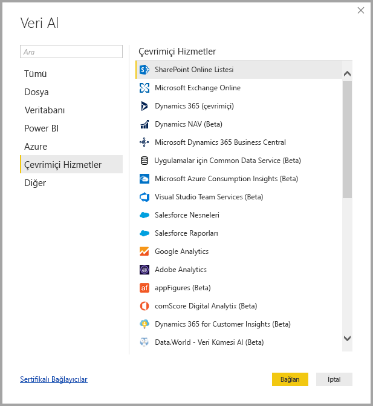
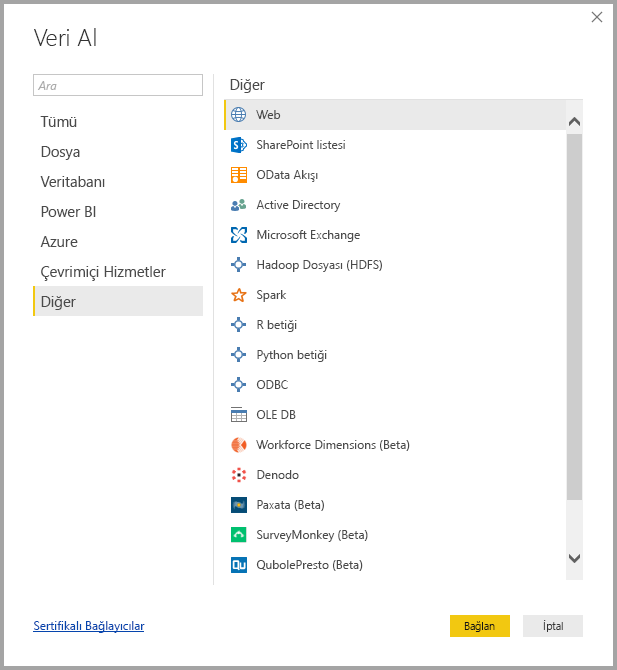
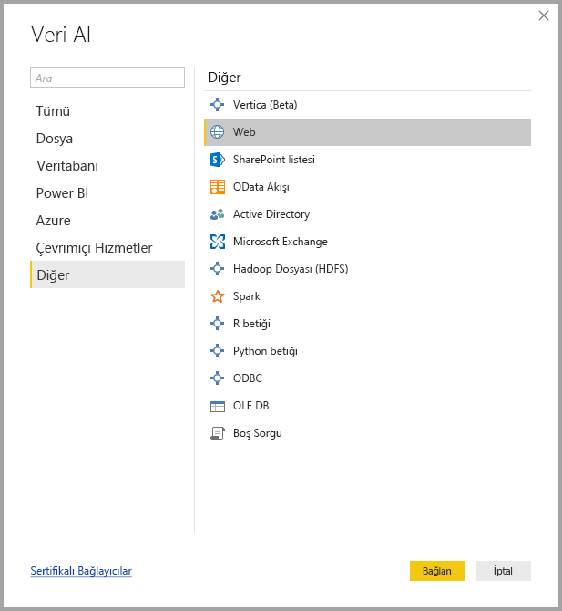

# Power BI Desktop'taki veri kaynakları
Power BI Desktop ile birçok farklı kaynaktaki verilere bağlanabilirsiniz. Bu sayfanın en altında, kullanabileceğiniz veri kaynaklarının tam listesi yer almaktadır.

Verilere bağlanmak için **Giriş** şeridindeki **Veri Al** seçeneğini belirleyin. Düğmedeki aşağı oku veya **Veri Al** metnini seçtiğinizde, **En Yaygın** veri türlerinin yer aldığı menü görüntülenir. (Aşağıda gösterilmektedir.)

**En Yaygın** menüsündeki **Diğer...** seçeneğini belirlediğinizde **Veri Al** penceresi görüntülenir. Ayrıca **Veri Al** **simgesinin bulunduğu düğmeyi** seçtiğinizde **En Yaygın** menüsünü atlayarak **Veri Al** penceresini doğrudan görüntüleyebilirsiniz.

> [!NOTE]
> Power BI ekibi, **Power BI Desktop** ve **Power BI hizmetinde** kullanıma sunulan veri kaynaklarının sayısını sürekli olarak artırmaktadır. Bu nedenle, sık sık *Beta* veya *Önizleme* olarak işaretlenmiş veri kaynaklarıyla karşılaşırsınız. Bunlar, üzerinde çalışılmakta olan veri kaynaklarının ilk sürümleridir. *Beta* veya *Önizleme* olarak işaretlenen veri kaynakları için destek ve işlevsellik sınırlıdır. Bunlar, üretim ortamlarında kullanılmamalıdır.
> 
> 

## Veri Kaynakları
Veri türleri, aşağıdaki kategoriler halinde düzenlenmiştir:

* Tümü
* Dosya
* Veritabanı
* Power BI
* Azure
* Çevrimiçi Hizmetler
* Diğer

**Tümü** kategorisi, tüm kategorilerdeki bütün veri bağlantı türlerini içerir.

**Dosya** kategorisinde, aşağıdaki veri bağlantıları sağlanır:

* Excel
* Metin/CSV
* XML
* JSON
* Klasör
* SharePoint Klasörü

Aşağıda, **Dosya** kategorisine ilişkin **Veri Al** penceresi gösterilmektedir.

**Veritabanı** kategorisinde aşağıdaki veri bağlantıları sağlanır:

* SQL Server Veritabanı
* Access Veritabanı
* SQL Server Analysis Services Veritabanı
* Oracle Veritabanı
* IBM DB2 Veritabanı
* IBM Informix veritabanı (Beta)
* IBM Netezza
* MySQL Veritabanı
* PostgreSQL Veritabanı
* Sybase Veritabanı
* Teradata Veritabanı
* SAP HANA Veritabanı
* SAP Business Warehouse Uygulama Sunucusu
* SAP Business Warehouse İleti Sunucusu (Beta)
* Amazon Redshift
* Impala
* Google BigQuery
* Snowflake
* Exasol

> [!NOTE]
> Bazı veri bağlayıcıları için **Dosya > Seçenekler ve ayarlar > Seçenekler** bölümüne gidip **Önizleme Özellikleri**'ni seçerek ilgili bağlayıcıyı etkinleştirmeniz gerekir. Yukarıda belirtilen bağlayıcılardan bazılarını görmüyorsanız söz konusu bağlayıcıları kullanmak için **Önizleme Özellikleri** ayarlarınızı kontrol edin. Ayrıca, *Beta* veya *Önizleme* olarak işaretlenen veri kaynakları için destek ve işlevselliğin sınırlı olduğunu ve bunların, üretim ortamlarında kullanılmaması gerektiğini unutmayın.
> 
> 

Aşağıda, **Veritabanı** kategorisine ilişkin **Veri Al** penceresi gösterilmektedir.

**Power BI** kategorisinde aşağıdaki veri bağlantıları sağlanır:

* Power BI veri kümeleri
* Power BI veri havuzları (beta)

Aşağıda, **Power BI** kategorisine ilişkin **Veri Al** penceresi gösterilmektedir.

**Azure** kategorisinde, aşağıdaki veri bağlantıları sağlanır:

* Azure SQL Veritabanı
* Azure SQL Veri Ambarı
* Azure Analysis Services veritabanı
* Azure Blob Depolama
* Azure Tablo Depolama
* Azure Cosmos DB (Beta)
* Azure Data Lake Store
* Azure HDInsight (HDFS)
* Azure HDInsight Spark (Beta)
* HDInsight Etkileşimli Sorgu (Beta)
* Azure KustoDB (beta)

Aşağıda, **Azure** kategorisine ilişkin **Veri Al** penceresi gösterilmektedir.

**Çevrimiçi Hizmetler** kategorisinde, aşağıdaki veri bağlantıları sağlanır:

* SharePoint Online Listesi
* Microsoft Exchange Online
* Dynamics 365 (çevrimiçi)
* Dynamics NAV (Beta)
* Dynamics 365 Business Central
* Uygulamalar için Common Data Service (Beta)
* Common Data Service (Beta)
* Microsoft Azure Tüketim Öngörüleri (Beta)
* Visual Studio Team Services (Beta)
* Salesforce Nesneleri
* Salesforce Raporları
* Google Analytics
* Adobe Analytics
* appFigures (Beta)
* comScore Digital Analytix (Beta)
* Customer Insights için Dynamics 365 (Beta)
* Data.World - Veri Kümesi Al (Beta)
* Facebook
* GitHub (Beta)
* MailChimp (Beta)
* Marketo (Beta)
* Mixpanel (Beta)
* Planview Enterprise (Beta)
* Planview Projectplace (Beta)
* QuickBooks Online (Beta)
* Smartsheet
* SparkPost (Beta)
* Stripe (Beta)
* SweetIQ (Beta)
* Planview Enterprise One - CMT (Beta)
* Twilio (Beta)
* tyGraph (Beta)
* Webtrends (Beta)
* Zendesk (Beta)
* TeamDesk (Beta)

Aşağıda, **Çevrimiçi Hizmetler** kategorisine ilişkin **Veri Al** penceresi gösterilmektedir.

**Diğer** kategorisinde, aşağıdaki veri bağlantıları sağlanır:

* Vertica (Beta)
* Web
* SharePoint Listesi
* OData Akışı
* Active Directory
* Microsoft Exchange
* Hadoop Dosyası (HDFS)
* Spark (Beta)
* R Betiği
* ODBC
* OLE DB
* Boş Sorgu

Aşağıda, **Diğer** kategorisine ilişkin **Veri Al** penceresi gösterilmektedir.

> [!NOTE]
> Şu anda, güvenliği Azure Active Directory ile sağlanan özel veri kaynaklarına bağlanılamamaktadır.
> 
> 

## Veri Kaynaklarına Bağlanma
Bir veri kaynağına bağlanmak için **Veri Al** penceresinde söz konusu veri kaynağını seçin ve ardından **Bağlan** seçeneğini belirleyin. Aşağıdaki görüntüde, **Diğer** veri bağlantısı kategorisinde yer alan **Web** seçeneği belirlenmiştir.

Veri bağlantısının türüne özel bir bağlantı penceresi görüntülenir. Gerekli olması halinde kimlik bilgilerinizi girmeniz istenir. Aşağıdaki görüntüde, bir Web veri kaynağına bağlanmak için girilen bir URL gösterilmektedir.

URL veya kaynak bağlantı bilgilerini girdikten sonra **Tamam**'ı seçin. Power BI Desktop veri kaynağı bağlantısını gerçekleştirir ve kullanabileceğiniz veri kaynaklarını **Gezgin** penceresinde görüntüler.

**Gezgin** bölmesinin alt kısmındaki **Yükle** düğmesini seçerek verileri yükleyebilir veya verileri yüklemeden önce sorguyu düzenlemek isterseniz **Düzenle** düğmesini seçebilirsiniz.

Power BI Desktop'ta veri kaynaklarına bağlanmak için tüm yapmanız gereken bu! Sayısı sürekli artan veri kaynaklarımızdaki verilere bağlanın ve veri kaynaklarımızın bulunduğu listeyi sık sık kontrol edin. Yeni veri kaynakları eklemeye devam edeceğiz.

## Sonraki adımlar
Power BI Desktop ile yapabileceğiniz çok şey var. Özellikler hakkında daha fazla bilgi edinmek için aşağıdaki kaynaklara bakın:

* [Power BI Desktop ile Çalışmaya Başlama](desktop-getting-started.md)
* [Power BI Desktop ile Sorgulara Genel Bakış](desktop-query-overview.md)
* [Power BI Desktop'taki Veri Türleri](desktop-data-types.md)
* [Power BI Desktop'ta Verileri Şekillendirme ve Birleştirme](desktop-shape-and-combine-data.md)
* [Power BI Desktop'taki Genel Sorgu Görevleri](desktop-common-query-tasks.md)    
