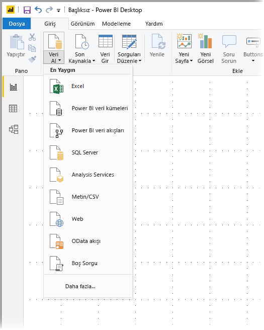
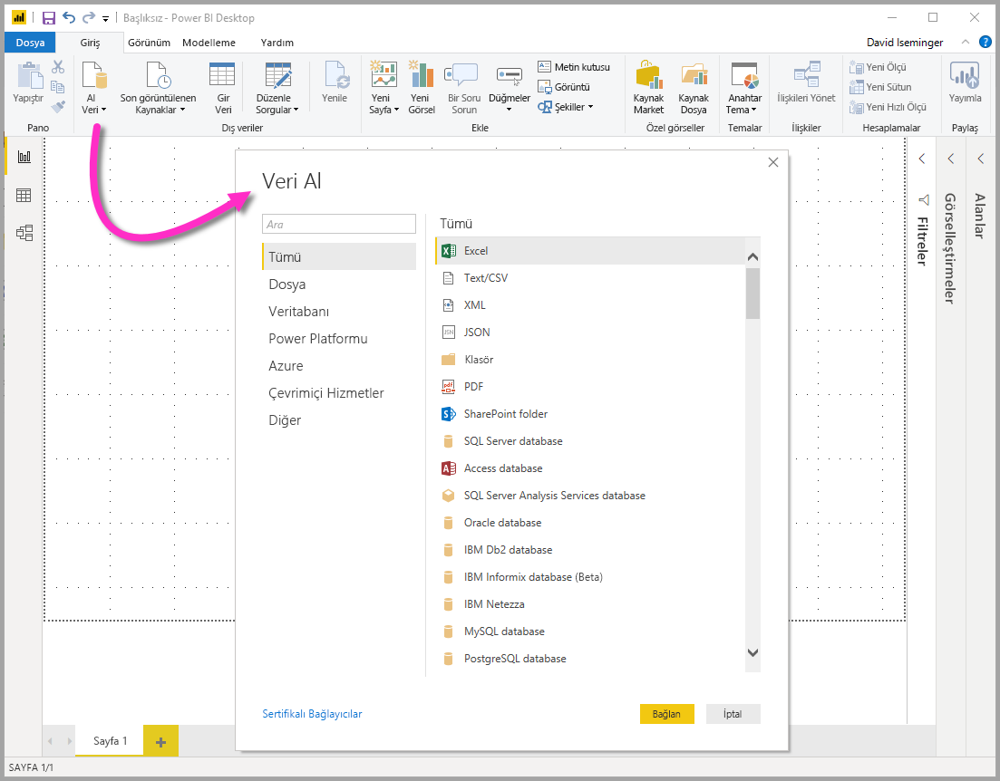
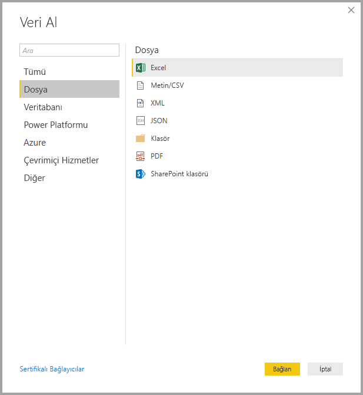
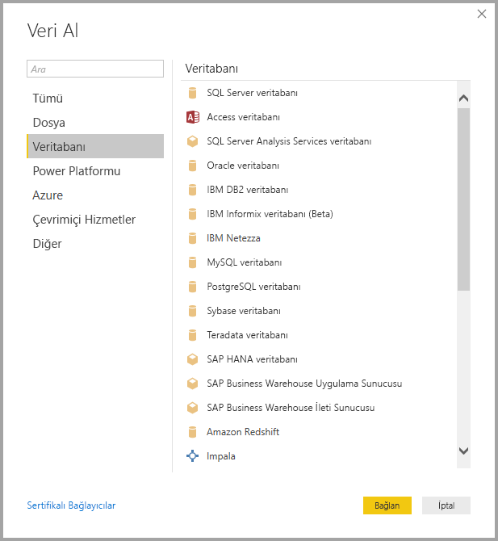
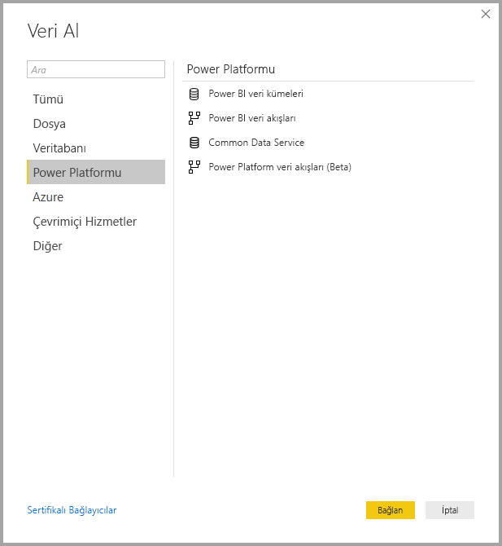
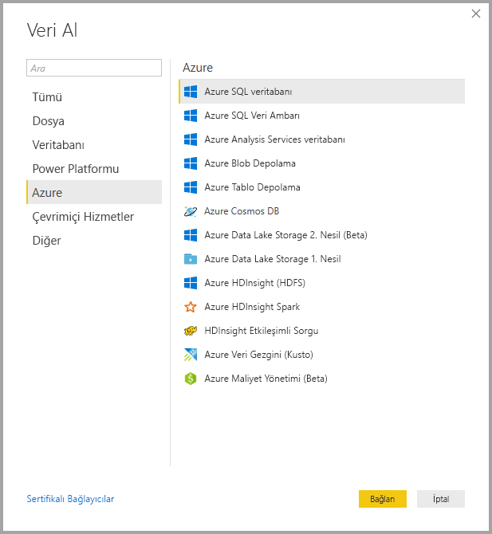
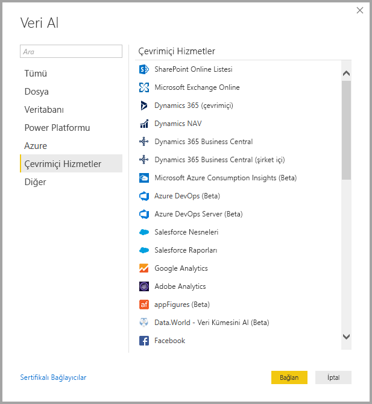
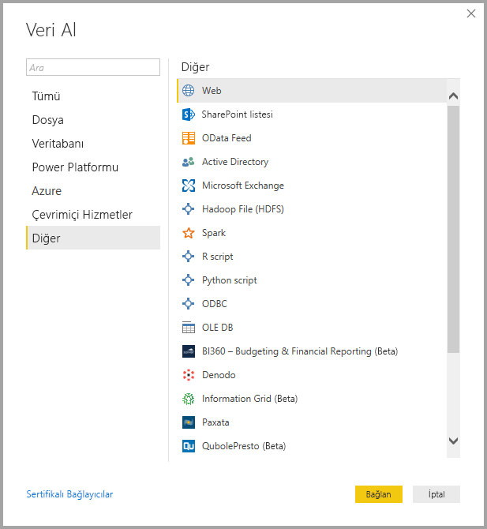
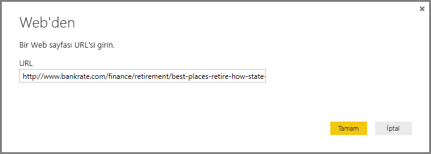
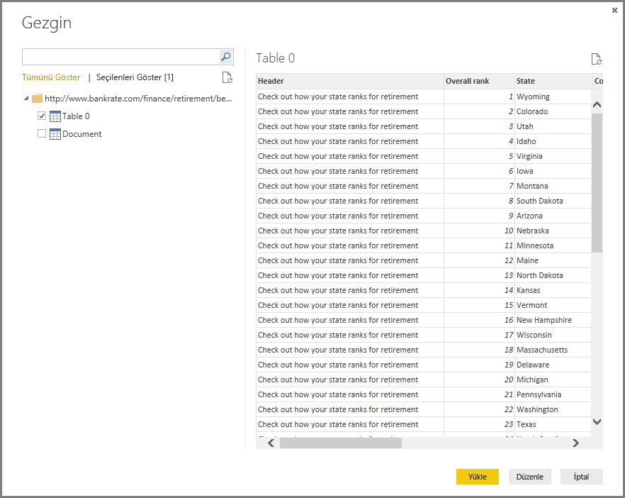

# <a name="data-sources-in-power-bi-desktop"></a>Power BI Desktop'taki veri kaynakları

Power BI Desktop ile birçok farklı kaynaktaki verilere bağlanabilirsiniz. Kullanılabilir veri kaynaklarının tam listesi için bkz. [Power BI veri kaynakları](power-bi-data-sources.md).

Verilere bağlanmak için **Giriş** şeridindeki **Veri Al** seçeneğini belirleyin. Düğmedeki aşağı oku veya **Veri Al** metnini seçtiğinizde, **En Yaygın** veri türlerinin yer aldığı menü görüntülenir. (Aşağıda gösterilmektedir.)



**En Yaygın** menüsündeki **Diğer...** seçeneğini belirlediğinizde **Veri Al** penceresi görüntülenir. Ayrıca **Veri Al** **simgesinin bulunduğu düğmeyi** seçtiğinizde **En Yaygın** menüsünü atlayarak **Veri Al** penceresini doğrudan görüntüleyebilirsiniz.



> [!NOTE]
> Power BI ekibi, **Power BI Desktop** ve **Power BI hizmetinde** kullanıma sunulan veri kaynaklarının sayısını sürekli olarak artırmaktadır. Bu nedenle, sık sık *Beta* veya *Önizleme* olarak işaretlenmiş veri kaynaklarıyla karşılaşırsınız. Bunlar, üzerinde çalışılmakta olan veri kaynaklarının ilk sürümleridir. *Beta* veya *Önizleme* olarak işaretlenen veri kaynakları için destek ve işlevsellik sınırlıdır. Bunlar, üretim ortamlarında kullanılmamalıdır. 

> Ayrıca, **Power BI Desktop** için *Beta* veya *Önizleme* olarak işaretlenen herhangi bir veri kaynağı, genel olarak kullanılabilir (GA) hale gelene kadar **Power BI hizmetinde** veya diğer Microsoft hizmetlerinde kullanılamayabilir.

## <a name="data-sources"></a>Veri Kaynakları
Veri türleri, aşağıdaki kategoriler halinde düzenlenmiştir:

* Tümü
* Dosya
* Veritabanı
* Power BI
* Azure
* Çevrimiçi Hizmetler
* Diğer

**Tümü** kategorisi, tüm kategorilerdeki bütün veri bağlantı türlerini içerir.

**Dosya** kategorisinde, aşağıdaki veri bağlantıları sağlanır:

* Excel
* Metin/CSV
* XML
* JSON
* Klasör
* PDF
* SharePoint Klasörü

Aşağıda, **Dosya** kategorisine ilişkin **Veri Al** penceresi gösterilmektedir.



**Veritabanı** kategorisinde aşağıdaki veri bağlantıları sağlanır:

* SQL Server Veritabanı
* Access Veritabanı
* SQL Server Analysis Services Veritabanı
* Oracle Veritabanı
* IBM DB2 Veritabanı
* IBM Informix veritabanı (Beta)
* IBM Netezza
* MySQL Veritabanı
* PostgreSQL Veritabanı
* Sybase Veritabanı
* Teradata
* SAP HANA Veritabanı
* SAP Business Warehouse Uygulama Sunucusu
* SAP Business Warehouse İleti Sunucusu
* Amazon Redshift
* Impala
* Google BigQuery
* Vertica
* Snowflake
* Essbase
* AtScale küpleri (Beta)
* BI Bağlayıcısı
* Dremio
* Exasol
* Indexima (Beta)
* InterSystems IRIS (Beta)
* Jethro (Beta)
* Kyligence Enterprise (Beta)
* MarkLogic (Beta)

> [!NOTE]
> Bazı veri bağlayıcıları için **Dosya > Seçenekler ve ayarlar > Seçenekler** bölümüne gidip **Önizleme Özellikleri**'ni seçerek ilgili bağlayıcıyı etkinleştirmeniz gerekir. Yukarıda belirtilen bağlayıcılardan bazılarını görmüyorsanız söz konusu bağlayıcıları kullanmak için **Önizleme Özellikleri** ayarlarınızı kontrol edin. Ayrıca, *Beta* veya *Önizleme* olarak işaretlenen veri kaynakları için destek ve işlevselliğin sınırlı olduğunu ve bunların, üretim ortamlarında kullanılmaması gerektiğini unutmayın.

Aşağıda, **Veritabanı** kategorisine ilişkin **Veri Al** penceresi gösterilmektedir.



**Power Platform** kategorisinde aşağıdaki veri bağlantıları sağlanır:

* Power BI veri kümeleri
* Power BI veri akışları
* Common Data Service
* Power Platform veri akışları (Beta)

Aşağıdaki görüntüde **Power Platform** kategorisine ilişkin **Veri Al** penceresi gösterilmektedir.



**Azure** kategorisinde, aşağıdaki veri bağlantıları sağlanır:

* Azure SQL Veritabanı
* Azure SQL Veri Ambarı
* Azure Analysis Services veritabanı
* Azure Blob Depolama
* Azure Tablo Depolama
* Azure Cosmos DB
* Azure Data Lake Storage 2. Nesil (Beta)
* Azure Data Lake Storage 1. Nesil
* Azure HDInsight (HDFS)
* Azure HDInsight Spark
* HDInsight Etkileşimli Sorgu
* Azure Veri Gezgini (Kusto)
* Azure Maliyet Yönetimi (Beta)

Aşağıda, **Azure** kategorisine ilişkin **Veri Al** penceresi gösterilmektedir.



**Çevrimiçi Hizmetler** kategorisinde, aşağıdaki veri bağlantıları sağlanır:

* SharePoint Online Listesi
* Microsoft Exchange Online
* Dynamics 365 (çevrimiçi)
* Dynamics NAV
* Dynamics 365 Business Central
* Dynamics 365 Business Central (şirket içi)
* Microsoft Azure Consumption Insights (Beta)
* Azure DevOps (Beta)
* Azure DevOps Server (Beta)
* Salesforce Nesneleri
* Salesforce Raporları
* Google Analytics
* Adobe Analytics
* appFigures (Beta)
* Data.World - Veri Kümesi Al (Beta)
* Facebook
* GitHub (Beta)
* MailChimp (Beta)
* Marketo (Beta)
* Mixpanel (Beta)
* Planview Enterprise One - PRM (Beta)
* Planview Projectplace (Beta)
* QuickBooks Online (Beta)
* Smartsheet
* SparkPost (Beta)
* Stripe (Beta)
* SweetIQ (Beta)
* Planview Enterprise One - CMT (Beta)
* Twilio (Beta)
* tyGraph (Beta)
* Webtrends (Beta)
* Zendesk (Beta)
* Dynamics 365 Customer Insights (Beta)
* Emigo Data Source (Beta)
* Entersoft Business Suite (Beta)
* Industrial App Store
* Intune Veri Ambarı (Beta)
* Microsoft Graph Güvenliği (Beta)
* Quick Base
* TeamDesk (Beta)


Aşağıda, **Çevrimiçi Hizmetler** kategorisine ilişkin **Veri Al** penceresi gösterilmektedir.



**Diğer** kategorisinde, aşağıdaki veri bağlantıları sağlanır:

* Web
* SharePoint Listesi
* OData Akışı
* Active Directory
* Microsoft Exchange
* Hadoop Dosyası (HDFS)
* Spark
* R Betiği
* Python betiği
* ODBC
* OLE DB
* BI360 - Budgeting & Financial Reporting (Beta)
* Denodo
* Information Grid (Beta)
* Paxata 
* QubolePresto (Beta)
* Roamler (Beta)
* SurveyMonkey (Beta)
* Tenforce (Smart)List (Beta)
* Workforce Dimensions (Beta)
* Boş Sorgu

Aşağıda, **Diğer** kategorisine ilişkin **Veri Al** penceresi gösterilmektedir.



> [!NOTE]
> Şu anda, güvenliği Azure Active Directory ile sağlanan özel veri kaynaklarına bağlanılamamaktadır.

## <a name="connecting-to-a-data-source"></a>Veri Kaynaklarına Bağlanma
Bir veri kaynağına bağlanmak için **Veri Al** penceresinde söz konusu veri kaynağını seçin ve ardından **Bağlan** seçeneğini belirleyin. Aşağıdaki görüntüde, **Diğer** veri bağlantısı kategorisinde yer alan **Web** seçeneği belirlenmiştir.


Veri bağlantısının türüne özel bir bağlantı penceresi görüntülenir. Gerekli olması halinde kimlik bilgilerinizi girmeniz istenir. Aşağıdaki görüntüde, bir Web veri kaynağına bağlanmak için girilen bir URL gösterilmektedir.



URL veya kaynak bağlantı bilgilerini girdikten sonra **Tamam**'ı seçin. Power BI Desktop veri kaynağı bağlantısını gerçekleştirir ve kullanabileceğiniz veri kaynaklarını **Gezgin** penceresinde görüntüler.



**Gezgin** bölmesinin alt kısmındaki **Yükle** düğmesini seçerek verileri yükleyebilir veya verileri yüklemeden önce sorguyu düzenlemek isterseniz **Düzenle** düğmesini seçebilirsiniz.

Power BI Desktop'ta veri kaynaklarına bağlanmak için tüm yapmanız gereken bu! Sayısı sürekli artan veri kaynaklarımızdaki verilere bağlanın ve veri kaynaklarımızın bulunduğu listeyi sık sık kontrol edin. Yeni veri kaynakları eklemeye devam edeceğiz.

## <a name="using-pbids-files-to-get-data"></a>Verileri almak için PBIDS dosyalarını kullanma

PBIDS dosyaları, belirli bir yapıya sahip olan ve Power BI veri kaynağı dosyası olarak tanımlanması için .PBIDS uzantısına sahip olan Power BI Desktop dosyalarıdır.

Kuruluşunuzda rapor oluşturanlara yönelik **Veri Al** deneyimini kolaylaştırmak için bir .PBIDS dosyası oluşturabilirsiniz. Yöneticilerin, yeni rapor yazarları için PBIDS dosyalarının kullanımını kolaylaştırmak amacıyla yaygın olarak kullanılan bağlantılar için bu dosyaları oluşturması önerilir. 

Bir yazar .PBIDS dosyasını açtığında Power BI Desktop açılır ve kullanıcıdan kimlik doğrulaması yapıp dosyada belirtilen veri kaynağına bağlanması için kimlik bilgileri istenir. Gezinti iletişim kutusu görüntülenir ve kullanıcı, veri kaynağından modele yüklenecek tabloları seçmelidir. Kullanıcıların, .PBIDS dosyasında belirtilmemişse, veritabanlarını seçmesi de gerekebilir. 

Bu noktadan itibaren kullanıcı, görselleştirmeler oluşturmaya başlayabilir veya modele yeni bir tablo kümesi yüklemek için *Son kaynaklar*’ı yeniden ziyaret edebilir. 

Şu anda .PBIDS dosyaları tek bir dosyada yalnızca tek bir veri kaynağını destekler. Birden fazla veri kaynağı belirtilmesi bir hatayla sonuçlanır. 

Yöneticiler, .PBIDS dosyası oluşturmak için tek bir bağlantıya yönelik gerekli girdileri belirtmelidir ve bağlantı modunu **DirectQuery** veya **İçeri Aktarma** olarak belirtebilir. Dosyada **mode** eksikse veya null ise, Power BI Desktop’ta dosyayı açan kullanıcıdan DirectQuery veya İçeri Aktarma’yı seçmesi istenir. 

### <a name="pbids-file-examples"></a>PBIDS dosyası örnekleri

Bu bölümde, yaygın olarak kullanılan veri kaynaklarından bazı örnekler sağlanmaktadır. .PBIDS dosya türü yalnızca Power BI Desktop’ta da desteklenen veri bağlantılarını destekler. Bunun yalnızca iki istisnası vardır: Live Connect ve Boş sorgu. 

.PBIDS dosyası, kimlik doğrulaması bilgilerini ve tablo ve şema bilgilerini *içermez*.  

Aşağıda, .PBIDS dosyasının birkaç yaygın örneği verilmekte olup bu örnekler tamamını kapsamaz. Diğer veri kaynakları için, [Protokol ve adres bilgileri için Veri Kaynağı Başvurusu (DSR) biçimi](https://docs.microsoft.com/azure/data-catalog/data-catalog-dsr#data-source-reference-specification) bölümüne bakabilirsiniz.

Bu örnekler yalnızca kolaylık sağlamak için verilmiş olup tüm örnekleri kapsayıcı değildir ve DSR biçiminde desteklenen tüm bağlayıcıları içermez. Yöneticiler veya kuruluşlar kılavuz olarak bu örnekleri kullanarak kendi veri kaynaklarını oluşturabilir. Bu örnekler sayesinde kendi veri kaynağı dosyalarını oluşturup destekleyebilirler. 


**Azure AS**
```
{ 
    "version": "0.1", 
    "connections": [ 
    { 
        "details": { 
        "protocol": "analysis-services", 
        "address": { 
            "server": "server-here" 
        }, 
        } 
    } 
    ] 
}
```


 

**Klasör**
```
{ 
  "version": "0.1", 
  "connections": [ 
    { 
      "details": { 
        "protocol": "folder", 
        "address": { 
            "path": "folder-path-here" 
        } 
      } 
    } 
  ] 
} 
```

**OData**
```
{ 
  "version": "0.1", 
  "connections": [ 
    { 
      "details": { 
        "protocol": "odata", 
        "address": { 
            "url": "URL-here" 
        } 
      } 
    } 
  ] 
} 
```
 
**SAP BW**
```
{ 
  "version": "0.1", 
  "connections": [ 
    { 
      "details": { 
        "protocol": "sap-bw-olap", 
        "address": { 
          "server": "server-name-here", 
          "systemNumber": "system-number-here", 
          "clientId": "client-id-here" 
        }, 
      } 
    } 
  ] 
} 
```
 
**SAP Hana**
```
{ 
  "version": "0.1", 
  "connections": [ 
    { 
      "details": { 
        "protocol": "sap-hana-sql", 
        "address": { 
          "server": "server-name-here:port-here" 
        }, 
      } 
    } 
  ] 
} 
```

**SharePoint Listesi**

URL, SharePoint sitesi içindeki bir listeyi değil, SharePoint sitesinin kendisini işaret etmelidir. Kullanıcılar, bu siteden bir veya daha fazla liste seçmesine olanak sağlayan bir gezgin alır. Bu listelerin her biri modelde bir tablo olur. 
```
{ 
  "version": "0.1", 
  "connections": [ 
    { 
      "details": { 
        "protocol": "sharepoint-list", 
        "address": { 
          "url": "URL-here" 
        }, 
       } 
    } 
  ] 
} 
```
 
 
**SQL Server**
```
{ 
  "version": "0.1", 
  "connections": [ 
    { 
      "details": { 
        "protocol": "tds", 
        "address": { 
          "server": "server-name-here", 
          "database": "db-name-here (optional) "
        } 
      }, 
      "options": {}, 
      "mode": "DirectQuery" 
    } 
  ] 
} 
```
 

**Metin dosyası**
```
{ 
  "version": "0.1", 
  "connections": [ 
    { 
      "details": { 
        "protocol": "file", 
        "address": { 
            "path": "path-here" 
        } 
      } 
    } 
  ] 
} 
```
 

**Web**
```
{ 
  "version": "0.1", 
  "connections": [ 
    { 
      "details": { 
        "protocol": "http", 
        "address": { 
            "url": "URL-here" 
        } 
      } 
    } 
  ] 
} 
```
 

**Veri akışı**
```
{
  "version": "0.1",
  "connections": [
    {
      "details": {
        "protocol": "powerbi-dataflows",
        "address": {
          "workspace":"workspace id (Guid)",
          "dataflow":"optional dataflow id (Guid)",
          "entity":"optional entity name"
        }
       }
    }
  ]
}
```


## <a name="next-steps"></a>Sonraki adımlar
Power BI Desktop ile yapabileceğiniz çok şey var. Özellikler hakkında daha fazla bilgi edinmek için aşağıdaki kaynaklara bakın:

* [Power BI Desktop nedir?](desktop-what-is-desktop.md)
* [Power BI Desktop ile Sorgulara Genel Bakış](desktop-query-overview.md)
* [Power BI Desktop'taki Veri Türleri](desktop-data-types.md)
* [Power BI Desktop'ta Verileri Şekillendirme ve Birleştirme](desktop-shape-and-combine-data.md)
* [Power BI Desktop'taki Genel Sorgu Görevleri](desktop-common-query-tasks.md)    
