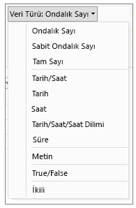
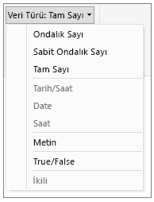

# Power BI Desktop'taki veri türleri
Bu makalede, Power BI Desktop ve Veri Çözümleme İfadeleri (DAX) tarafından desteklenen veri türleri açıklanmaktadır. 

Power BI Desktop'a veri yüklediğinizde bu uygulama, kaynak sütunun veri türünü; depolama verimliliğini, hesaplamaları ve veri görselleştirme işlemlerini daha iyi destekleyecek bir veri türüne dönüştürmeye çalışır. Örneğin, Excel'den içeri aktardığınız bir değer sütununda hiç kesirli değer yoksa Power BI Desktop, veri sütununun tamamını Tam Sayı veri türüne dönüştürür. Bu veri türü, tam sayıların depolanması için daha iyi bir seçenektir.

Bazı DAX işlevleri için özel veri türü gereksinimleri bulunduğundan bu önemli bir kavramdır. DAX çoğu durumda veri türlerini sizin için örtük olarak dönüştürürken bazı durumlarda bu işlemi gerçekleştirmez.  Örneğin, bir DAX işlevi için Tarih veri türü gerekli olduğunda sütununuzun veri türü Metin ise DAX işlevi düzgün çalışmaz.  Bu nedenle, sütunlar için doğru veri türlerinin belirlenmesi hem önemli hem de faydalı bir işlemdir. Örtük dönüştürme işlemleri bu makalenin sonraki bölümlerinde açıklanmıştır.

## Bir sütunun veri türünü belirleme ve belirtme
Power BI Desktop'ta bir sütunun veri türünü Sorgu Düzenleyicisi'nde, Veri Görünümü'nde veya Rapor Görünümü'nde belirleyebilir ve belirtebilirsiniz:

**Sorgu Düzenleyicisi'ndeki veri türleri**

**Veri Görünümü veya Rapor Görünümü'ndeki veri türleri**

Sorgu Düzenleyicisi'ndeki Veri Türü açılan listesinde, şu anda Veri veya Rapor Görünümü'nde yer almayan iki veri türü bulunur: **Tarih/Saat/Saat Dilimi** ve **Süre**. Modele bu veri türlerini içeren bir sütun yüklendiğinde ve söz konusu model Veri veya Rapor görünümü'nde görüntülendiğinde; Tarih/Saat/Saat Dilimi veri türündeki sütunlar Tarih/Saat veri türüne, Süre veri türündeki sütunlar ise Ondalık Sayı veri türüne dönüştürülür.

### Sayı türleri
Power BI Desktop üç sayı türünü destekler:

**Ondalık Sayı**: 64 bit (sekiz bayt) kayan noktalı sayı değerlerini temsil eder. En yaygın sayı türüdür ve alışık olduğunuz sayı kavramına karşılık gelir.  Kesirli değer içeren sayılar için tasarlanmış olsa da tam sayıları da işler.  Ondalık Sayı türü, -1.79E +308 ila -2.23E -308 arasındaki negatif değerleri, 0 değerini ve 2.23E -308 ila 1.79E + 308 arasındaki pozitif değerleri işleyebilir. Örneğin, 34, 34,01 ve 34,000367063 gibi sayılar geçerli ondalık sayılardır. Ondalık Sayı türünde gösterilebilecek veriler maksimum 15 basamak uzunluğunda olmalıdır.  Ondalık ayırıcısı sayısında herhangi bir yere kullanılabilir. Ondalık Sayı türü, Excel'in sayıları depolama biçimine karşılık gelir.

**Sabit Ondalık Sayı**: Ondalık ayırıcısı için sabit bir konum belirlenmiştir. Ondalık ayırıcısının sağında her zaman dört basamak bulunur ve en fazla 19 basamaktan oluşan anlamlı değerlere izin verilir.  Bu sayı türü ile gösterilebilecek en büyük değer şudur: 922.337.203.685.477,5807 (pozitif veya negatif).  Sabit Ondalık Sayı türü, yuvarlama işleminin hatalara neden olabileceği durumlarda kullanışlıdır.  Küçük kesirli değerlere sahip birçok sayı ile çalıştığınızda bu değerler bazen toplanarak sayıların az da olsa hatalı olmasına neden olabilir.  Ondalık ayırıcısının sağındaki dört basamaktan sonra gelen değerler kesildiğinden, Sabit Ondalık türü bu tür hatalarla karşılaşmamanıza yardımcı olabilir.   SQL Server kullananlar için bu veri türü SQL Server'daki Ondalık veri türüne (19,4) veya Power Pivot'taki Para Birimi veri türüne karşılık gelir. 

**Tam Sayı**: 64 bit (sekiz bayt) tam sayı değerlerini temsil eder. Tam sayılardan söz ettiğimiz için ondalık basamağın sağında herhangi bir basamak bulunmaz. Bu türde -9,223,372,036,854,775,807 (-2^63+1) ile 9,223,372,036,854,775,806 (2^63-2) arasındaki pozitif veya negatif tam sayılara ve toplamda 19 basamağa izin verilir. Çeşitli sayısal veri türleri arasında mümkün olan en büyük sayı değerini temsil edebilir.  Sabit Ondalık türünde olduğu gibi Tam Sayı türü de yuvarlamayı denetlemeniz gereken durumlarda kullanışlı olabilir. 

> [!NOTE]
>  Power BI Desktop veri modeli 64 bit tamsayı değerlerini destekler ama JavaScript sınırlamalarından dolayı güvenle gösterilebilecek en fazla görsel sayısı 9.007.199.254.740.991'dir (2^53-1). Veri modelinizde bundan daha büyük sayılarla çalışıyorsanız, sayıları görsele eklemeden önce hesaplamalar yaparak boyutu küçültebilirsiniz 
> 
>

### Tarih/saat türleri
Power BI Desktop, Sorgu Görünümü'nde beş Tarih/Saat veri türünü; Rapor Görünümü'nde ve modelde ise üç veri türünü destekler.   Modele yükleme sırasında hem Tarih/Saat/Saat Dilimi hem de Süre veri türleri dönüştürülür.

**Tarih/Saat**: Hem tarih hem de saat değerini gösterir.  Aslında, Tarih/Saat değerleri de Ondalık Sayı Türü olarak saklanır.  Dolayısıyla bu iki tür arasında dönüştürme yapabilirsiniz.   Tarihlerin saat kısmı, 1/300 saniyenin (3,33 ms) tam katlarına gelen kesirli değerler olarak saklanır.  1900 ve 9999 arasındaki yıllar desteklenir.

**Tarih**: Yalnızca Tarih (saat kısmı olmadan) değerini gösterir.  Modele dönüştürme yapıldığında Tarih değeri, kesirli değeri sıfır olan Tarih/Saat değeri ile aynıdır.

**Saat**: Yalnızca Saat (tarih kısmı olmadan) değerini gösterir.  Modele dönüştürme yapıldığında Saat değeri, ondalık basamağının solunda hiç basamak olmayan Tarih/Saat değeri ile aynıdır.

**Tarih/Saat/Saat Dilimi**: UTC Tarih/Saat değerlerini gösterir.  Geçerli olarak, modele yüklendiğinde Tarih/Saat türüne dönüştürülür.

**Süre**: Bir zaman uzunluğunu gösterir. Modele yüklendiğinde Ondalık Sayı türüne dönüştürülür.  Bir Ondalık Sayı türü olarak Tarih/Saat alanına eklendiğinde veya bu alandan çıkarıldığında doğru sonuçlar elde edilebilir.  Bunu bir Ondalık Sayı türü olarak görselleştirmelerde büyüklüğü göstermek için kolayca kullanabilirsiniz.

### Metin türü
**Metin**: Unicode karakter veri dizesi. Metin biçiminde gösterilmiş dizeler, sayılar veya tarihler olabilir. Maksimum dize uzunluğu 268.435.456 Unicode karakter (256 mega karakter) veya 536.870.912 bayttır.

### True/False türü
**True/False**: True veya False olan bir Boole değeri.

### Boş/null değer türü
**Boş**: DAX'ta, SQL'deki null değerleri temsil eden ve bunların yerini alan veri türü. [BLANK](https://msdn.microsoft.com/library/ee634820.aspx) işlevini kullanarak boş değer oluşturabilir ve [ISBLANK](https://msdn.microsoft.com/library/ee634204.aspx) mantıksal işlevi ile boş değer olup olmadığını test edebilirsiniz.

### Tablo veri türü
DAX, birçok işlevde (toplama ve akıllı zaman gösterimi hesaplamaları gibi) tablo veri türünü kullanır. Bazı işlevler bir tabloya başvurulmasını gerektirirken bazı işlevler, diğer işlevler için giriş olarak kullanılabilecek bir tablo döndürür. Giriş olarak tablo gerektiren bazı işlevlerde tablo döndüren bir ifade belirtebilirsiniz. Bazı işlevlerde ise temel tablolara başvuru yapılması gerekir. Belirli işlevlerin gereksinimleri hakkında bilgi için bkz. [DAX Function Reference (DAX İşlev Başvurusu)](https://msdn.microsoft.com/library/ee634396.aspx).

## DAX formüllerinde örtük ve açık olarak gerçekleştirilen veri türü dönüştürme işlemleri
Her DAX işlevinin, giriş ve çıkış olarak kullanılan veri türlerine ilişkin belirli gereksinimleri vardır. Örneğin, bazı işlevlerde belirli bağımsız değişkenler için tam sayı gerekirken diğerleri için tarih gerekli olabilir. Aynı şekilde, bazı işlevler için metin veya tabloların kullanılması gerekebilir.

Bağımsız değişken olarak belirttiğiniz sütundaki veriler, işlev için gerekli veri türü ile uyumlu değilse DAX çoğu durumda hata döndürür. Ancak, DAX mümkün olan her durumda, geçerli veri türünü örtük olarak gerekli veri türüne dönüştürmeye çalışır. Örnek:

* Dize olarak bir tarih girdiğinizde DAX, dizeyi ayrıştırır ve Windows tarih/saat biçimlerinden birine dönüştürür.
* TRUE + 1 ifadesini girdiğinizde 2 sonucunu elde edersiniz. Bunun nedeni, TRUE değerinin örtük olarak 1 sayısına dönüştürülmesi ve 1+1 işleminin gerçekleştirilmiş olmasıdır.
* İki sütuna, biri metin ("12") diğeri ise sayı (12) olarak gösterilen değerler eklerseniz DAX, dizeyi örtük olarak sayıya dönüştürür ve toplama işlemi gerçekleştirerek sayısal bir sonuç elde eder. Şu ifade 44 sonucunu döndürür: = "22" + 22.
* İki sayıyı birleştirmek isterseniz Excel, bu sayıları dize olarak gösterip birleştirir. Şu ifade "1234" sonucunu döndürür: = 12 & 34.

### Örtük veri dönüştürme tablosu
Dönüştürme işleminin türü işleç tarafından belirlenir. İşleç, istenen işlemi gerçekleştirmeden önce gerekli değerleri dönüştürür. Bu tablolarda işleçlerle birlikte, sütundaki her bir veri türünün kesişen satırdaki veri türü ile birlikte kullanıldığında gerçekleştirilecek olan dönüştürme türü belirtilmiştir.

> [!NOTE]
>  Metin veri türleri bu tablolara dahil edilmemiştir. Bir sayı metin biçiminde gösterildiğinde Power BI bazı durumlarda sayı türünü belirlemeye ve değeri bir sayı olarak göstermeye çalışır.
> 
> 

**Toplama (+)**

| İşleç (+) | TAMSAYI | PARA BİRİMİ | GERÇEK SAYI | Tarih/saat |
| --- | --- | --- | --- | --- |
| TAMSAYI |TAMSAYI |PARA BİRİMİ |GERÇEK SAYI |Tarih/saat |
| PARA BİRİMİ |PARA BİRİMİ |PARA BİRİMİ |GERÇEK SAYI |Tarih/saat |
| GERÇEK SAYI |GERÇEK SAYI |GERÇEK SAYI |GERÇEK SAYI |Tarih/saat |
| Tarih/saat |Tarih/saat |Tarih/saat |Tarih/saat |Tarih/saat |

Örneğin, bir gerçek sayı ile para birimi verisi toplanacağı zaman her iki değer de GERÇEK SAYI türüne dönüştürülür ve sonuç GERÇEK SAYI türünde döndürülür.

**Çıkarma (-)**

Aşağıdaki tabloda satır başlığı, çıkarılan sayıyı (sol taraf) sütun başlığı ise çıkan sayıyı (sağ taraf) temsil etmektedir.

| İşleç (-) | TAMSAYI | PARA BİRİMİ | GERÇEK SAYI | Tarih/saat |
| --- | --- | --- | --- | --- |
| TAMSAYI |TAMSAYI |PARA BİRİMİ |GERÇEK SAYI |GERÇEK SAYI |
| PARA BİRİMİ |PARA BİRİMİ |PARA BİRİMİ |GERÇEK SAYI |GERÇEK SAYI |
| GERÇEK SAYI |GERÇEK SAYI |GERÇEK SAYI |GERÇEK SAYI |GERÇEK SAYI |
| Tarih/saat |Tarih/saat |Tarih/saat |Tarih/saat |Tarih/saat |

Örneğin, bir tarih başka bir veri türüyle çıkarma işleminde kullanıldığında her iki değer de tarihe dönüştürülür; sonuç olarak bir tarih değeri döndürülür.

> [!NOTE]
>    Veri modelleri aynı zamanda - (negatif) birli işlecini de destekler ancak bu işleç, işlenenin veri türünü değiştirmez.
> 
> 

**Çarpma (*)**

| İşleç (\*) | TAMSAYI | PARA BİRİMİ | GERÇEK SAYI | Tarih/saat |
| --- | --- | --- | --- | --- |
| TAMSAYI |TAMSAYI |PARA BİRİMİ |GERÇEK SAYI |TAMSAYI |
| PARA BİRİMİ |PARA BİRİMİ |GERÇEK SAYI |PARA BİRİMİ |PARA BİRİMİ |
| GERÇEK SAYI |GERÇEK SAYI |PARA BİRİMİ |GERÇEK SAYI |GERÇEK SAYI |

Örneğin, bir tam sayı ile gerçek sayı bir çarpma işleminde birlikte kullanıldığında her iki sayı da gerçek sayıya dönüştürülür ve bir GERÇEK SAYI değeri döndürülür.

**Bölme (/)**

Aşağıdaki tabloda satır başlığı, payı; sütun başlığı ise paydayı temsil eder.

| İşleç (/) (Satır/Sütun) | TAMSAYI | PARA BİRİMİ | GERÇEK SAYI | Tarih/saat |
| --- | --- | --- | --- | --- |
| TAMSAYI |GERÇEK SAYI |PARA BİRİMİ |GERÇEK SAYI |GERÇEK SAYI |
| PARA BİRİMİ |PARA BİRİMİ |GERÇEK SAYI |PARA BİRİMİ |GERÇEK SAYI |
| GERÇEK SAYI |GERÇEK SAYI |GERÇEK SAYI |GERÇEK SAYI |GERÇEK SAYI |
| Tarih/saat |GERÇEK SAYI |GERÇEK SAYI |GERÇEK SAYI |GERÇEK SAYI |

Örneğin, bir tam sayı ile para birimi değeri bir bölme işleminde birlikte kullanıldığında her iki değer de gerçek sayıya dönüştürülür ve sonuç olarak bir gerçek sayı döndürülür.

### Karşılaştırma işleçleri
Karşılaştırma ifadelerinde Boole değerlerinin dize değerlerinden, dize değerlerinin de sayısal değerlerden veya tarih/saat değerlerinden büyük olduğu; sayıların ve tarih/saat değerlerinin ise aynı derecede olduğu kabul edilir. Boole veya dize değerleri için herhangi bir örtük dönüştürme işlemi gerçekleştirilmez. BLANK değerleri veya boş değerler, karşılaştırılan diğer değerin veri türüne bağlı olarak 0/""/false değerlerine dönüştürülür.

Aşağıdaki DAX ifadelerinde bu davranış görülmektedir:

=IF(FALSE()\>"true","Expression is true", "Expression is false") ifadesi için "Expression is true" değeri döndürülür.

=IF("12"\>12,"Expression is true", "Expression is false") ifadesi için "Expression is true" değeri döndürülür

=IF("12"=12,"Expression is true", "Expression is false") ifadesi için "Expression is false" değeri döndürülür.

Sayısal türler veya tarih/saat türleri için dönüştürme işlemleri, aşağıdaki tabloda açıklanan şekilde örtük olarak gerçekleştirilir:

| Karşılaştırma İşleci | TAMSAYI | PARA BİRİMİ | GERÇEK SAYI | Tarih/saat |
| --- | --- | --- | --- | --- |
| TAMSAYI |TAMSAYI |PARA BİRİMİ |GERÇEK SAYI |GERÇEK SAYI |
| PARA BİRİMİ |PARA BİRİMİ |PARA BİRİMİ |GERÇEK SAYI |GERÇEK SAYI |
| GERÇEK SAYI |GERÇEK SAYI |GERÇEK SAYI |GERÇEK SAYI |GERÇEK SAYI |
| Tarih/saat |GERÇEK SAYI |GERÇEK SAYI |GERÇEK SAYI |Tarih/Saat |

### Boş değerleri, boş dizeleri ve sıfır değerlerini işleme
DAX'ta null değerler, boş değerler, boş hücreler veya eksik değerlerin tamamı yeni bir değer türü olan BLANK ile gösterilir. Ayrıca boş değer oluşturmak için BLANK işlevini veya boş değer olup olmadığını test etmek için ISBLANK işlevini kullanabilirsiniz.

Toplama veya birleştirme gibi işlemlerde boş değerlerin nasıl işleneceği, işleve bağlı olarak değişir. Aşağıdaki tabloda, boş değerlerin nasıl işlendiğiyle ilgili olarak DAX ve Microsoft Excel formülleri arasındaki farklar özetlenmiştir.

| İfade | DAX | Excel |
| --- | --- | --- |
| BLANK + BLANK |BLANK |0 (sıfır) |
| BLANK + 5 |5 |5 |
| BLANK * 5 |BLANK |0 (sıfır) |
| 5/BLANK |Sonsuz |Hata |
| 0/BLANK |NaN |Hata |
| BLANK/BLANK |BLANK |Hata |
| FALSE OR BLANK |FALSE |FALSE |
| FALSE AND BLANK |FALSE |FALSE |
| TRUE OR BLANK |TRUE |TRUE |
| TRUE AND BLANK |FALSE |TRUE |
| BLANK OR BLANK |BLANK |Hata |
| BLANK AND BLANK |BLANK |Hata |

