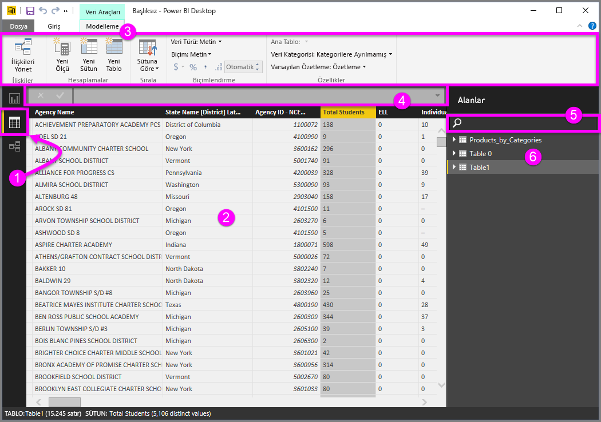
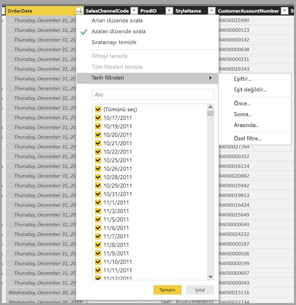

# Power BI Desktop'taki Veri görünümüyle çalışma
**Veri Görünümü**, **Power BI Desktop** modelinizdeki verileri incelemenize, araştırmanıza ve anlamanıza yardımcı olur. Tabloları, sütunları ve verileri **Sorgu Düzenleyicisi**'nde görüntülemekten farklıdır. Veri Görünümü ile verilerinizin modele yüklendikten *sonraki* halini incelersiniz.

Bazen verilerinizi modellerken rapor tuvalinde görsel oluşturmadan bir tablo veya sütundaki verileri satır düzeyinde görmek istersiniz. Bu, özellikle ölçü ve hesaplanmış sütun oluşturduğunuzda veya bir veri türü ya da veri kategorisi tanımlamanız gerektiğinde yararlıdır.

**Veri Görünümü**’nde bulunan öğelerden bazılarına daha yakından bakalım.

1. **Veri Görünümü simgesi**: Veri Görünümü’ne girmek için bu simgeyi seçin.

2. **Veri Kılavuzu**: Seçilen tabloyu ve içindeki tüm sütunlarla satırları gösterir. **Rapor Görünümü**’nde gizlenen sütunlar gri renkte görünür. Bir sütuna sağ tıklayarak seçeneklere ulaşabilirsiniz.

3. **Modelleme şeridi**: Buradan ilişkileri yönetebilir, hesaplama oluşturabilir, bir sütunun veri türünü, biçimini ve veri kategorisini değiştirebilirsiniz.

4. **Formül çubuğu**: Ölçüler ve Hesaplanmış sütunlar için DAX formülleri girebilirsiniz.

5. **Ara**: Modelinizdeki bir tabloyu veya sütunu arayabilirsiniz.

6. **Alanlar listesi**: Veri kılavuzunda görüntülemek istediğiniz tabloyu veya sütunu seçebilirsiniz.

## Veri Görünümünde Filtreleme

**Veri Görünümü**’nde ayrıca verileri filtreleyebilir ve sıralayabilirsiniz. Her sütunda sıralama yönünü (uygulanması durumunda) belirleyen bir simge gösterilir.

Değerleri tek tek filtreleyebilir veya sütundaki verileri temel alarak gelişmiş filtrelemeyi kullanabilirsiniz. 

> [!NOTE]
> Bir Power BI modeli geçerli kullanıcı arabiriminizden farklı bir kültürde oluşturulduğunda (örneğin İngilizce-ABD dilinde oluşturulmuş modeli İspanyolca görüntülediğinizde) arama kutusu metin alanları dışındaki Veri Görünümü kullanıcı arabirimi bölümlerinde görünmez.
