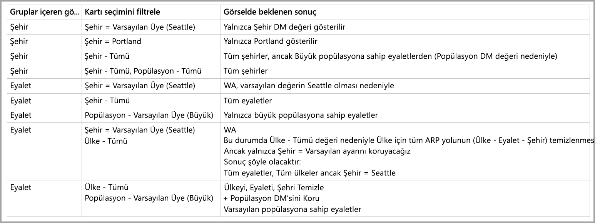

# Power BI’da çok boyutlu modellerde varsayılan üye

Power BI'da çok boyutlu modellere bağlanabilir ve modelin içindeki her tür veriyi görselleştiren raporlar oluşturabilirsiniz. Çok boyutlu modellerle çalışırken, Power BI *varsayılan üye* olarak hangi sütunun tanımlandığına dayanarak verileri nasıl işleyeceğine ilişkin kurallar uygular. 

Çok boyutlu modellerle çalışırken, Power BI modelden gelen verileri **DefaultMember** özniteliğini içeren sütunun nerede kullanıldığına dayanarak işler. Çok boyutlu modeldeki belirli bir sütun için *DefaultMember* özniteliği CSDL'de (Kavramsal Şema Tanımlama Dili) ayarlanır. [Öznitelik özellikleri makalesinde](https://docs.microsoft.com/sql/analysis-services/multidimensional-models/attribute-properties-define-a-default-member?view=sql-server-2017), varsayılan üye hakkında bilgi edinebilirsiniz. DAX sorgusu yürütüldüğünde, modelde belirtilen varsayılan üye otomatik olarak uygulanır.

Bu makalede, *varsayılan üyenin* nerede bulunduğuna bağlı olarak Power BI'ın çok boyutlu modellerle çalışırken çeşitli koşullarda nasıl davrandığı açıklandı. 

## Filtre kartlarıyla çalışma

Varsayılan üyenin bulunduğu bir alanda filtre kartı oluştururken, filtre kartında varsayılan üye alanının değeri otomatik olarak seçilir. Sonuçta filtre kartının etkilediği tüm görseller veritabanında kendi varsayılan modellerini korur. Bu tür filtre kartlarındaki değerler söz konusu varsayılan üyeyi yansıtır.

Varsayılan üye kaldırılırsa, değerin seçiminin kaldırılması onu filtre kartının uygulandığı tüm görsellerden temizler ve görüntülenen değerler varsayılan üyeyi yansıtmaz.

Örneğin, varsayılan üyesi *USD* olarak ayarlanmış bir *Currency* sütununuz olduğunu düşünün:

* Bu örnek durumda *Total Sales* değerinin gösterildiği bir kartımız varsa, değere varsayılan üye uygulanır ve "USD" ayarına karşılık gelen satışları görürüz.
* Filtre kartı bölmesine *Currency* alanını sürüklersek, seçilen varsayılan değer olarak *USD*'yi görürüz. Varsayılan üye uygulandığından *Total Sales* alanının değeri aynı kalır.
* Öte yandan, filtre kartında *USD* değerinin seçimini kaldırırsak, *Currency* için varsayılan üye kaldırılır ve artık *Total Sales* tüm para birimlerini yansıtır.
* Sonuç olarak, filtre kartında başka bir değer seçtiğimizde (diyelim ki *EURO*'yu seçtik), varsayılan üyeyle birlikte *Total Sales* de *Currency IN {USD, EURO}* filtresini yansıtır.

## Gruplandırma davranışı

Power BI'da *varsayılan üyesi* olan bir sütunda bir görseli gruplandırırsanız, Power BI söz konusu sütunun *varsayılan üyesini* ve onun öznitelik ilişkisi yolunu temizler. Bu da görselin yalnızca varsayılan değerleri değil tüm değerleri görüntülemesini güvence altına alır.

## Öznitelik ilişkisi yolları (ARP)

Öznitelik ilişkisi yolları (ARP) *varsayılan üyelere* güçlü özellikler sağlar ama aynı zamanda belirli bir düzeyde karmaşıklık da getirir. ARP'lerle karşılaşıldığında, Power BI görseller için tutarlı ve hassas veri işlemesi sağlamak üzere diğer sütunların ek varsayılan üyelerini temizlemek için ARP'nin yollarını izler.

Bu davranışı netleştirmek için şimdi bir örneğe göz atalım. Aşağıdaki ARP yapılandırmasını düşünün:

Şimdi de şu sütunlar için aşağıdaki *varsayılan üyelerin* ayarlandığını düşünün:

* City > Seattle
* State > WA
* Country > US
* Population > Large

Artık sütunların her biri Power BI'da kullanıldığında ne olduğunu inceleyebiliriz. Görseller aşağıdaki sütunlarda gruplandırıldığında, sonuçlar şöyle olur:

* **City** - Power BI **City**, *State* ve *Country* için tüm *varsayılan üyeleri* temizleyerek tüm şehirleri görüntüler ama **Population** sütununun *varsayılan üyesini* korur; Power BI *City* için ARP'nin tamamını temizlemiştir.
    > [!NOTE]
    > *Population*, *City*'nin ARP yolunda değildir, yalnızca *State* ile ilgilidir ve bu nedenle Power BI bunu temizlemez.
* **State** - Power BI *City*, **State**, *Country* ve *Population* için tüm *varsayılan üyeleri* temizleyerek tüm *State* değerlerini görüntüler.
* **Country** - Power BI **City**, *State* ve *Country* için tüm *varsayılan üyeleri* temizleyerek tüm ülkeleri görüntüler ama **Population** sütununun *varsayılan üyesini* korur.
* **City ve State** - Power BI tüm sütunların tüm **varsayılan üyelerini** temizler.

Görselde görüntülenen grupların tüm ARP yolu temizlenmiştir. 

Görselde bir grup görüntülenmiyorsa ama başka bir gruplandırma sütununa ilişkin ARP yolunun parçasıysa, aşağıdaki durum geçerli olur:

* ARP yolunun tüm dalları otomatik olarak temizlenmez.
* Bu grup yine de temizlenmemiş olan **varsayılan üye** ile filtrelenir.

### Dilimleyiciler ve filtre kartları

Dilimleyiciler ve filtre kartlarıyla çalışırken aşağıdaki davranışlar gerçekleşir:

* Dilimleyiciye veya filtre kartına veri yüklendiğinde, Power BI görseldeki sütuna göre gruplandırır; dolayısıyla, görüntüleme davranışı önceki bölümde açıklanan davranışla aynıdır.

Dilimleyiciler ve filtre kartları sıklıkla diğer görsellerle etkileşim kurmak için kullanıldığından, etkilenen görseller için **varsayılan üyeleri** temizlemenin mantığı aşağıdaki tabloda açıklandığı gibidir. 

Bu tabloda, bu makalede daha önce kullanılmış olan örnek verileri kullandık:

Bu koşullarda Power BI'ın davranışında aşağıdaki kurallar geçerlidir.

Aşağıdaki durumlarda Power BI belirli bir sütunun **varsayılan üyesini** temizler:

* Power BI o sütuna göre gruplandırıyordur
* Power BI o sütunla ilişkili bir sütuna (yukarıda veya aşağıda, ARP'nin herhangi bir yerinde) göre gruplandırıyordur
* Power BI ARP'de yer alan (yukarıda veya aşağıda) bir sütuna göre filtreliyordur
* Sütunun *TÜM* eyalet ayarını içeren bir filtre kartı vardır
* Sütunun, herhangi bir değerin seçili olduğu bir filtre kartı vardır (Power BI sütundan bir filtre alır)

Aşağıdaki durumlarda Power BI belirli bir sütunun **varsayılan üyesini** temizlemez:

* Sütunun varsayılan eyalet değerini içeren bir filtre kartı vardır ve Power BI ARP'sindeki bir sütuna göre gruplandırıyordur.
* Sütun ARP'deki diğer bir sütunun üstündedir ve Power BI'ın bu diğer sütun için varsayılan eyalet değerini içeren bir filtre kartı vardır.

## Sonraki adımlar

Bu makalede, çok boyutlu modellerde varsayılan üyelerle çalışırken Power BI'ın davranışı açıklanmıştır. Aşağıdaki makaleler de ilginizi çekebilir: 

* [Power BI'da öğeleri veri olmadan gösterme](desktop-show-items-no-data.md)
* [Power BI Desktop'ta veri kaynakları](desktop-data-sources.md)
