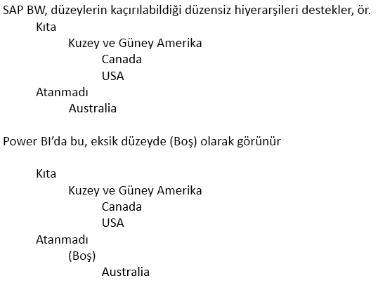

# DirectQuery ve SAP Business Warehouse (BW)
**SAP Business Warehouse (BW)** veri kaynaklarına **DirectQuery** kullanarak doğrudan bağlanabilirsiniz. SAP BW'nun OLAP/çok boyutlu yapısı göz önünde bulundurulduğunda DirectQuery'ye SAP BW üzerinden bağlanmakla SQL Server gibi ilişkisel kaynaklar üzerinden bağlanmak arasında birçok önemli farkı vardır. Bu farklar aşağıda özetlenmiştir:

* İlişkisel kaynaklar üzerinden **DirectQuery**'de, alan listesinde kullanılabilir verileri mantıksal olarak tanımlayan bir dizi sorgu (**Veri Al** veya **Sorgu Düzenleyicisi** iletişim kutusunda tanımlanan şekilde) vardır. Bu durum, SAP BW gibi bir OLAP kaynağına bağlanırken söz konusu *değildir*. Bunun yerine, **Veri Al** ile SAP sunucusuna bağlanıldığında, sadece Infocube veya BEx Sorgusu seçilidir. Ardından, seçili Infocube/BEx Sorgusu'nun tüm Önemli Rakamları ve boyutları, alan listesinde kullanılabilir duruma gelir.   
* Benzer şekilde, SAP BW'ya bağlanırken bir **Sorgu Düzenleyicisi** yoktur. Veri kaynağı ayarları (örneğin, sunucu adı) **Sorguları Düzenle > Veri kaynağı ayarları** seçilerek değiştirilebilir. Herhangi bir Parametre ayarı, **Sorguları Düzenle > Parametreleri Yönet** seçilerek değiştirilebilir.
* OLAP kaynakların kendine özgü yapısı göz önünde bulundurulduğunda, DirectQuery için uygulanan kısıtlamalara ek olarak başka kısıtlamalar (hem modelleme hem de görselleştirmelerde) söz konusudur. Bu kısıtlamalar, makalenin sonraki bölümlerinde açıklanmıştır.

Ayrıca, SAP BW'nun Power BI'da desteklenmeyen birçok özelliğinin olduğunu, ve SAP BW'nun ortak arabiriminin yapısı nedeniyle Power BI'da görünen sonuçların bir SAP aracı kullanırken görünen sonuçlarla eşleşmeyeceği önemli durumlar olabileceğini anlamak *son derece önemlidir*. Bu sınırlamalar, makalenin sonraki bölümlerinde açıklanmıştır. SAP ortak arabiriminden döndürülen sonuçların Power BI'da görüntülenmesi sırasında doğru yorumlandığından emin olabilmek için bu sınırlamaların ve davranış farklılıklarının dikkatlice gözden geçirilmesi gerekir.  

> [!NOTE]
> SAP BW üzerinde DirectQuery’yi kullanma özelliği, Power BI Desktop’ta gerçekleştirilen Mart 2018 güncelleştirmesine kadar önizlemedeydi. Önizleme sırasında alınan geri bildirimler ve iyileştirme önerileri, önizleme sürümü kullanılarak oluşturulmuş raporları etkileyen bir değişiklikle sonuçlandı. SAP BW üzerinde DirectQuery’nin Genel Kullanılabilirlik (GA) sürümü kullanıma sunulduğuna göre, önceki GA sürümü ile oluşturulmuş tüm mevcut (önizleme tabanlı) raporları SAP BW üzerinde DirectQuery’yi kullanarak atmanız *gerekir*. SAP BW üzerinde DirecQuery’nin önceki GA sürümüyle oluşturulmuş raporlarda, meta verileri temel alınan SAP BW küpünde yapılan değişikliklerle yenileme girişimi nedeniyle, Yenileme çağrıldıktan sonra söz konusu önceki GA raporlarında hatalar oluşur. Lütfen SAP BW üzerinde DirectQuery’nin GA sürümünü kullanarak bu raporları boş bir rapordan yeniden oluşturun. 

## Modellemeye İlişkin Ek Kısıtlamalar
Power BI'da DirectQuery kullanarak SAP BW'ya bağlanmanın ek olarak getireceği başlıca modelleme kısıtlamaları aşağıdaki gibidir:

* **Hesaplanmış sütunlar desteklenmez:** Hesaplanmış sütun oluşturma özelliği devre dışı bırakılmıştır. Bu, hesaplanmış sütunlar oluşturan Gruplandırma ve Kümeleme özelliklerinin de kullanılamadığı anlamına gelir.
* **Ölçüler için ek sınırlamalar:** Ölçülerde kullanılan DAX ifadelerinde, SAP BW tarafından sunulan destek düzeyini yansıtan ek sınırlamalar söz konusudur.
* **İlişki tanımlama desteklenmez:** İlişkiler dış SAP kaynağında belirlidir ve modelde bunlara ek olarak yeni ilişkiler tanımlanamaz.
* **Veri Görünümü yoktur:** **Veri Görünümü** normalde tabloda ayrıntı düzeyindeki verileri gösterir. SAP BW gibi OLAP kaynakların yapısı gereği bu görünüm, SAP BW üzerinde kullanılamaz.
* **Sütun ve ölçü ayrıntıları sabittir:** Alan listesinde görünen sütunlar ve ölçüler listesi, temel alınan kaynak tarafından sabitlenmiştir ve değiştirilemez. Örneğin, bir sütunu silmek ya da veri türünü değiştirmek mümkün değildir. (Ancak yeniden adlandırmak mümkündür.)
* **DAX'taki ek sınırlamalar:** Ölçü tanımlarında kullanılabilecek DAX'ta, kaynaktaki sınırlamaları yansıtan ek sınırlamalar söz konusudur. Örneğin, bir tablo üzerinde toplama işlevini kullanmak mümkün değildir.

## Görselleştirmelere ilişkin Ek Kısıtlamalar
Power BI'da DirectQuery kullanarak SAP BW'ya bağlanmanın ek olarak getireceği başlıca ek görselleştirme kısıtlamaları aşağıdaki gibidir:

* **Sütunlarda toplama yoktur:** Görseldeki sütun için toplamayı değiştirmek mümkün değildir; her zaman *Özetleme* şeklindedir.
* **Ölçü filtreleme devre dışıdır:** SAP BW tarafından sunulan desteği yansıtması için ölçü filtreleme devre dışı bırakılmıştır.
* **Çoklu seçim ve ekleme/dışlama:** Görseldeki veri noktalarında çoklu seçim yapma özelliği, noktalar birden fazla sütundaki değerleri temsil ediyorsa devre dışıdır. Örneğin, Ülke'ye göre Satışlar'ı gösteren ve Açıklama'da Kategori olan bir çubuk grafiğinde, (ABD, Bisiklet) ve (Fransa, Giyim)'i temsil eden noktayı seçmek mümkün değildir. Benzer şekilde, (ABD, Bisiklet) noktasını seçip görselden dışlamak da mümkün olmaz. Her iki sınırlama da SAP BW tarafından sunulan desteği yansıtmak için uygulanmaktadır.

## SAP BW özellikleri için destek
Aşağıdaki tabloda, tam olarak desteklenmeyen veya Power BI kullanıldığında davranışı farklılık gösterecek olan tüm SAP BW özellikleri listelenmiştir.   

| Özellik | Açıklama |
| --- | --- |
| Yerel hesaplamalar |Bir BEx Sorgusu'nda tanımlanmış yerel hesaplamalar, sayıları BEx Analyzer gibi araçlarla görüntülenen şekilde değiştirir. Ancak bunlar, SAP'den ortak MDX arabirimi yoluyla SAP'den döndürülen sayılara yansıtılmaz.     **Bu nedenle, bir Power BI görselinde görülen sayılar, bir SAP aracında o görsele karşılık gelen görseldeki sayılarla her durumda eşleşmeyebilir.**     Örneğin, toplama işlemi Toplamı (geçerli toplam) göstermek üzere ayarlanmış bir BEx sorgusundan bir sorgu küpüne bağlanırken, Power BI o ayarı yok sayarak taban sayılarına döner.  Elbette bir analist daha sonra Power BI'da yerel olarak bir geçerli toplam hesaplaması yapabilir ancak yapmayacak olursa sayıları yorumlarken dikkatli olması gerekir. |
| Toplamalar |Bazı durumlarda (özellikle birden çok para birimi ile çalışırken) SAP araçlarının gösterdiği sayılarla SAP ortak arabiriminin döndürdüğü sayılar eşleşmez.     **Bu nedenle, bir Power BI görselinde görülen sayılar, bir SAP aracında o görsele karşılık gelen görseldeki sayılarla her durumda eşleşmeyebilir.**     Örneğin, farklı para birimlerinin toplamı BEx Analyzer'da "*" olarak görünür, ancak SAP ortak arabirimi bu toplamı döndürse de toplamın anlamsız olduğu bilgisini vermez. Bu yüzden Power BI (örneğin $, EUR ve AUD toplamı olan) bu sayıyı görüntüler. |
| Para birimi biçimlendirme |Power BI'da herhangi bir para birimi biçimlendirmesi (örneğin, 2300 $ veya 4000 AUD) yansıtılmaz. |
| Ölçü birimleri |Ölçü birimleri (örneğin 230 KG) Power BI'da yansıtılmaz. |
| Anahtar veya metin (kısa, orta, uzun) |CostCenter gibi bir SAP BW karakteristiği için alan listesi tek bir Cost Center sütunu gösterecektir.  Bu sütun kullanıldığında varsayılan metin görüntülenir.  Gizli alanları göstererek benzersiz ad sütununu (SAP BW tarafından atanmış bir benzersiz adı döndürür ve benzersizliğin temelidir) görmek de mümkündür.     Anahtar ve diğer metin alanları kullanılamaz. |
| Bir karakteristiğin birden çok hiyerarşisi |**SAP**'de, bir karakteristik birden çok hiyerarşiye sahip olabilir. BEx Analyzer gibi araçlarda bir karakteristik sorguya eklendiğinde kullanıcı, kullanmak istediği hiyerarşiyi seçebilir.     **Power BI**'da birbirinden farklı hiyerarşiler, alan listesinde aynı boyutta olan farklı hiyerarşiler olarak görünebilir.  Ancak, aynı boyutta olan iki farklı hiyerarşiyi aynı anda seçmek, SAP tarafından boş veri döndürülmesine neden olur. |
| Düzensiz hiyerarşiler için yapılan işlem | |
| Ölçeklendirme çarpanı/işareti tersine çevirme |SAP'de, bir önemli rakam için biçimlendirme seçeneği olarak bir ölçeklendirme çarpanı (örneğin, 1000) tanımlanabilir. Diğer bir deyişle, görüntülenen her şey bu çarpana göre ölçeklendirilir.     Benzer şekilde, işareti tersine çevirecek bir özellik ayarı da vardır. Böyle bir önemli rakamın Power BI'da (bir görselde veya bir hesaplamanın parçası olarak) kullanılması, ölçeklendirilmemiş rakamın kullanılmasına (ve işaretin tersine çevrilmemesine) neden olur. Temel alınan ölçeklendirme çarpanı kullanılamaz. Power BI görsellerinde, eksende gösterilen ölçek birimleri (K,M,B) görsel biçimlendirmenin bir parçası olarak denetlenebilir. |
| Düzeylerin dinamik olarak belirdiği/kaybolduğu hiyerarşiler |SAP BW'ya bağlanma işleminin başında, bir hiyerarşinin düzey bilgileri alınır ve alan listesinde bir alan kümesi oluşur. Bu önbelleğe alınır ve düzey kümesi değişirse Yenile çağrılana kadar alan kümesi değişmez.     Bu yalnızca **Power BI Desktop**'ta mümkündür. Düzey değişikliklerini yansıtacak olan Yenile, Yayımla'dan sonra Power BI hizmetinde çağrılamaz. |
| Varsayılan filtre |Bir BEx sorgusu Varsayılan Filtreler içerebilir ve bunlar, SAP BEx Analyzer tarafından otomatik olarak uygulanır. Bunlar açıkça sunulmaz. Bu nedenle, Power BI'da eşdeğer bir kullanım, aynı filtreleri varsayılan olarak uygulamaz. |
| Gizli Önemli rakamlar |Bir Bex sorgusu Önemli Rakamların görünürlüğünü denetleyebilir ve gizli olanlar SAP BEx Analyzer'da görünmez. Ancak bunlar genel API'de yansıtılmadığı için gizli önemli rakamlar alan listesinde yine de görünür. Ancak, daha sonra Power BI içinde gizlenebilirler. |
| Sayısal biçimlendirme |Herhangi bir sayısal biçimlendirme (ondalık basamak sayısı, ondalık ayırıcı vb.) Power BI'da otomatik olarak yansıtılmaz. Ancak, Power BI içinden bu tür biçimlendirmeleri denetlemek mümkündür. |
| Hiyerarşi sürümü oluşturma |SAP BW bir hiyerarşinin farklı sürümlerinin korunmasına izin verir, örneğin, maliyet merkezi hiyerarşisinin 2007 ve 2008 sürümleri. Sürüm bilgileri genel API tarafından açıkça sunulmadığı için Power BI'da yalnızca en son sürüm kullanılabilir. |
| Zamana bağlı hiyerarşiler |Power BI kullanırken zamana bağlı hiyerarşiler geçerli tarihte değerlendirilir. |
| Para birimi dönüştürme |SAP BW küpte tutulan kurlara göre para birimi dönüştürmeyi destekler. Bu gibi özellikler genel API tarafından açıkça sunulmadığı için Power BI'da kullanılamaz. |
| Sıralama Düzeni |Bir karakteristiğin sıralama düzeni (Metne göre veya Anahtara göre) SAP içinde tanımlanabilir. Bu sıralama düzeni Power BI'da yansıtılmaz. Örneğin, aylar "April" (Nisan), "Aug" (Ağu) ve benzeri biçimlerde görünebilir.     Power BI'da bu sıralama düzenini değiştirmek mümkün değildir. |
| Teknik adlar |**Veri Al**'da hem karakterstik/ölçü adları (açıklamalar) hem de teknik adlar görülebilir. Alan listesi yalnızca karakteristik/ölçü adlarını (açıklamaları) içerir. |
| Öznitelikler |Power BI içinde bir karakteristiğin özniteliklerine erişmek mümkün değildir. |
| Son kullanıcı dil ayarı |SAP BW'ya için bağlanmak için kullanılan yerel ayarlar, bağlantı ayrıntılarının bir parçası olarak belirlenmiştir ve son rapor kullanıcısının yerel ayarlarını yansıtmaz. |
| Metin Değişkenleri |SAP BW, alan adlarının değişkenler için yer tutucular içermesine izin verir (örneğin "$YEAR$ Fiili Değerleri") ve bunlar daha sonra seçilmiş değerle değiştirilir. Örneğin, bu değişken için 2016 yılı seçildiyse bu alan BEx araçlarında "2016 Fiili Değerleri" olarak görünür.     Power BI'da sütunun adı değişken değerine göre değiştirilmez ve bu nedenle "$YEAR$ Fiili Değerleri" olarak görünür.  Ancak, sütun adı Power BI'da daha sonra değiştirilebilir. |
| Müşteri Çıkış Değişkenleri | Müşteri Çıkış değişkenleri genel API tarafından açıkça sunulmadığı için Power BI tarafından desteklenmez. |
| Özellik Yapıları | Temel SAP BW kaynağındaki tüm özellik yapıları, Power BI'da sunulmakta olan ölçümlerde bir 'patlama' yaşanmasına neden olur. Örneğin, Satışlar ve Maliyetler adlı iki ölçüm ile Bütçe ve Gerçek özelliklerini içeren bir özellik yapısı olduğunda dört ölçüm sunulur: Satış.Bütçe, Satış.Gerçek, Maliyetler.Bütçe, Maliyetler.Gerçek. |

## Sonraki adımlar
DirectQuery hakkında daha fazla bilgi için aşağıdaki kaynaklara bakın:

* [Power BI'da DirectQuery](desktop-directquery-about.md)
* [DirectQuery tarafından desteklenen Veri Kaynakları](desktop-directquery-data-sources.md)
* [DirectQuery ve SAP HANA](desktop-directquery-sap-hana.md)

