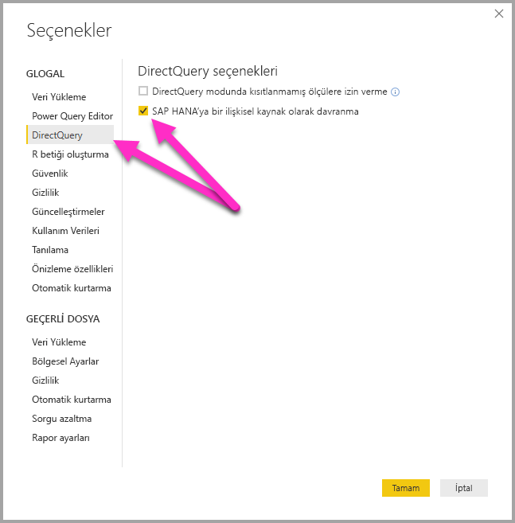
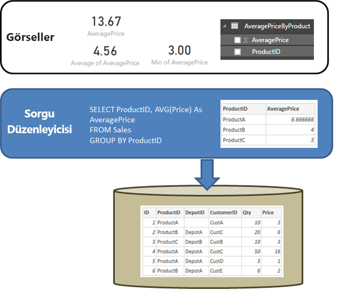

# DirectQuery ve SAP HANA
**DirectQuery** kullanarak **SAP HANA** veri kaynaklarına doğrudan bağlanabilirsiniz. SAP HANA’ya bağlanmak için kullanabileceğiniz iki seçenek vardır:

* **SAP HANA’ya çok boyutlu bir kaynak olarak davranma (varsayılan):**  Bu durumdaki davranış, Power BI SAP Business Warehouse veya Analysis Services gibi diğer çok boyutlu kaynaklara bağlanmaya benzer. Bu ayar, tek bir analiz veya hesaplama görünümü seçilir ve tüm ölçüler kullanılarak SAP HANA'ya bağlanılırken hiyerarşileri ve bu görünümün öznitelikleri alan listesinde kullanılabilir. Görseller oluşturulurken toplu veriler her zaman SAP HANA’dan alınır. Bu, önerilen yaklaşımdır ve SAP HANA üzerinden yeni DirectQuery raporları için varsayılandır.

* **SAP HANA’ya bir ilişkisel kaynak olarak davranma:** Bu durumda, Power BI SAP HANA’yı ilişkisel bir kaynak olarak kabul eder. Bu, daha fazla esneklik sunar. Bakım ölçülerin beklendiği gibi toplandığından emin olmak ve performans sorunlarından kaçınmak için bu yaklaşımı atılmalıdır.

Bir genel aracı seçeneği belirlenerek ayarlanır bağlantı yaklaşımı belirlenir **Dosya > Seçenekler ve ayarlar** ardından **Seçenekler > DirectQuery**, i  **SAP HANA'ya bir ilişkisel kaynak olarak davranma**, aşağıdaki görüntüde gösterildiği gibi. 

SAP HANA’ya bir ilişkisel kaynak olarak davranma seçeneği, SAP HANA üzerinden DirectQuery kullanılarak oluşturulan tüm *yeni* raporlar için kullanılan yaklaşımı belirler. Bunun, geçerli rapordaki hiçbir mevcut SAP HANA bağlantısı üzerinde ya da diğer açık raporlardaki bağlantılar üzerinde etkisi yoktur. Bu nedenle, o sırada seçenek işaretli değilse **Veri Al** kullanılarak SAP HANA’ya yeni bir bağlantı eklendiğinde bu bağlantının SAP HANA’yı çok boyutlu bir kaynak olarak kabul etmesi sağlanır. Ancak, farklı bir rapor açılırsa, SAP HANA'ya bağlanan sonra söz konusu raporun ayarlanan seçeneği göre davranmaya devam edecek *oluşturulduğu zaman*, anlamına olan, SAP HANA'ya bağlanan tüm raporlar Şubat 2018'e oluşturulan önceden, SAP HANA'ya bir ilişkisel kaynak olarak davranma devam eder. 

Farklı bir davranış iki yaklaşım oluşturur ve mevcut bir raporun bir yaklaşım diğerine geçmek mümkün değildir. 

Bu iki yaklaşımın her birine ilişkin diğer ayrıntılara sırasıyla göz atalım.

## SAP HANA’ya çok boyutlu bir kaynak olarak davranma (varsayılan)

SAP HANA ile kurulan tüm yeni bağlantılar varsayılan olarak bu bağlantı yöntemini kullanıp SAP HANA’yı çok boyutlu bir kaynak olarak kabul eder. SAP HANA ile kurulan bir bağlantıyı ilişkisel bir kaynak olarak kabul etmek için **Dosya > Seçenekler ve ayarlar > Seçenekler** adımlarını izleyip **Direct Query > SAP HANA’ya bir ilişkisel kaynak olarak davran** seçeneğinin altındaki kutuyu işaretlemeniz gerekir. Bu özellik **Önizlemede** olduğu sürece, çok boyutlu yaklaşım kullanılarak oluşturulan raporlar Power BI hizmetinde *yayımlanamaz* ve bunun yapılması durumunda rapor Power BI hizmetinde açılınca hatalar oluşur.  

SAP HANA'ya çok boyutlu bir kaynak olarak bağlanılırken aşağıdaki maddeler geçerlidir:

* **Veri Al Gezgini**’nde tek bir SAP HANA görünümü seçilebilir. Tek tek ölçü veya özniteliklerin seçilmesi mümkün değildir. Verilerin içeri aktarılmasından veya SAP HANA’ya ilişkisel bir kaynak olarak davranılırken DirectQuery kullanılmasından farklı olarak bağlanma sırasında sorgu tanımlanmaz. Bu, ayrıca bu bağlantı yöntemi seçilirken doğrudan bir SAP HANA SQL sorgusu kullanmanın mümkün olmadığı anlamına anlamına gelir.

* Seçili görünümün tüm ölçüleri, hiyerarşileri ve öznitelikleri alan listesinde görüntülenir. 

* Bir ölçü bir görselde kullanılırken görsel için gerekli bir toplama düzeyinde ölçü değerini almak üzere SAP HANA sorgulanır. Bu nedenle, eklenebilir olmayan ölçülerle (sayaçlar, oranlar, vb.) işlem yapılırken tüm toplamalar SAP HANA tarafından gerçekleştirilir ve Power BI tarafından başka toplama gerçekleştirilmez. 

* SAP HANA’dan her zaman doğru toplama değerlerinin elde edilebilmesini sağlamak için belirli kısıtlamaların uygulanması gerekir. Örneğin, hesaplanan sütunlar eklemek ya da birden çok SAP HANA görünümünden alınan verileri aynı raporda birleştirmek mümkün değildir. 

SAP HANA’ya çok boyutlu bir kaynak olarak davranılması, alternatif *ilişkisel* yaklaşım tarafından sağlanan düzeyde yüksek esneklik sağlamaz, ancak daha basittir ve daha karmaşık SAP HANA ölçüleri ile işlem yapılırken doğru toplama değerlerinin elde edilmesini ve genel olarak performansın artmasını sağlar. 

**Alan** listesi, SAP HANA görünümünden alınan tüm ölçülerin, özniteliklerin ve hiyerarşilerin listesini içerir. Bu bağlantı yöntemi kullanılırken geçerli olan aşağıdaki davranışlara dikkat edin:

* En az bir hiyerarşiye dahil edilen herhangi bir öznitelik varsayılan olarak gizlenir. Bununla birlikte, bunlar gerekirse alan listesinden **Gizli öğeleri görüntüle** seçilerek görülebilir. Bunlar gerekirse aynı bağlam menüsünden görünür hale getirilebilir.

* SAP HANA’da bir öznitelik, etiketi olarak başka bir özniteliği kullanacak şekilde tanımlanabilir. Örneğin, **ürün** (ile değerleri 1,2,3, vb.) kullanabilirsiniz **ProductName** (ile bisiklet, gömlek, Eldiven vb. değerler) etiket olarak. Bu durumda, alan listesinde Bisiklet, Gömlek, Eldiven, vb. değerlerine sahip **Ürün** adlı tek bir alan gösterilir, ancak bu değerlerin sıralanması ve benzersizlik durumlarının belirlenmesi 1,2,3 anahtar değerlerine göre gerçekleştirilir. Gerekirse temel anahtar değerlerine erişim imkanı tanıyan gizli bir **Product.Key** sütunu da oluşturulur. 

Temel alınan SAP HANA görünümünde tanımlanan tüm değişkenler bağlanma sırasında görüntülenir ve gerekli değerler girilebilir. Bu değerler daha sonra seçerek değiştirilebilir **sorguları Düzenle** Şeritten ardından **parametreleri Yönet** görüntülenen açılan menüden. 

SAP HANA’dan her zaman doğru toplama verilerinin alınabilmesini sağlama gereksinimi göz önünde bulundurulduğunda, izin verilen modelleme işlemleri DirectQuery’nin kullanıldığı genel duruma göre daha kısıtlıdır. Bununla birlikte, ölçü tanımlama, alanları yeniden adlandırıp gizleme ve görüntü biçimleri tanımlama dahil olmak üzere birçok ekleme ve değişiklik yapılabilir. Yenileme sırasında tüm bu değişiklikler korunur ve SAP HANA görünümünde gerçekleştirilen, çakışmayan tüm değişiklikler uygulanır. 

### Modellemeye ilişkin ek kısıtlamalar

DirectQuery kullanılarak SAP HANA’ya bağlanılırken (çok boyutlu kaynak olarak davranma) geçerli olan birincil ek modelleme kısıtlamaları şunlardır: 

* **Hesaplanmış sütunlar desteklenmez:** Hesaplanmış sütun oluşturma özelliği devre dışı bırakılmıştır. Bu, hesaplanmış sütunlar oluşturan Gruplandırma ve Kümeleme özelliklerinin de kullanılamadığı anlamına gelir.
* **Ölçüler için ek sınırlamalar:** Ölçülerde kullanılan DAX ifadelerinde, SAP HANA tarafından sunulan destek düzeyini yansıtan ek sınırlamalar söz konusudur.
* **İlişki tanımlama desteklenmez:** Bir raporun içinde tek bir görünüm sorgulanabilir ve bu nedenle ilişki tanımlama desteklenmez.
* **Veri Görünümü yoktur:** **Veri Görünümü** normalde tabloda ayrıntı düzeyindeki verileri gösterir. SAP HANA gibi OLAP kaynakların yapısı gereği bu görünüm, SAP HANA üzerinden kullanılamaz.
* **Sütun ve ölçü ayrıntıları sabittir:** Alan listesinde görünen sütunlar ve ölçüler listesi, temel alınan kaynak tarafından sabitlenmiştir ve değiştirilemez. Örneğin, bir sütunu silmek ya da veri türünü değiştirmek mümkün değildir (ancak yeniden adlandırmak mümkündür).
* **DAX'taki ek sınırlamalar:** Ölçü tanımlarında kullanılabilecek DAX'ta, kaynaktaki sınırlamaları yansıtan ek sınırlamalar söz konusudur. Örneğin, bir tablo üzerinden toplama işlevini kullanmak mümkün değildir.

### Görselleştirmelere ilişkin ek kısıtlamalar

DirectQuery kullanılarak SAP HANA’ya bağlanılırken (çok boyutlu kaynak olarak davranma) görsellerde kısıtlamalar söz konusudur: 
* **Sütunlarda toplama yoktur:** Görseldeki sütun için toplamayı değiştirmek mümkün değildir ve her zaman *Özetleme* şeklindedir.

## SAP HANA’ya bir ilişkisel kaynak olarak davranma 

SAP HANA’ya ilişkisel bir kaynak olarak bağlanma seçilirken bazı ek esneklik seçenekleri kullanılabilir hale gelir. Örneğin, hesaplanan sütunlar oluşturabilir, birden çok SAP HANA görünümden veri ekleyebilir ve sonuçta elde edilen tablolar arasında ilişki oluşturabilirsiniz. Bununla birlikte, SAP HANA bu şekilde kullanılırken, aşağıdakilerin sağlanması için bağlantılara nasıl davranıldığına ilişkin belirli boyutların anlaşılması önemlidir: 

* SAP HANA görünümü eklenebilir olmayan ölçüler (örneğin; basit toplamlar yerine ayrı sayımlar veya ortalamalar) içeriyorsa sonuçlar beklendiği gibi olur.
* Sonuçta elde edilen sorguların verimli olması

**Veri Al** veya **Soru Düzenleyicisi**'nde tanımlanan sorgu ile bir toplama işlemi gerçekleştirirken SQL Server gibi bir ilişkisel kaynağın davranışını açıklayarak işe başlamakta fayda vardır. Sonraki örnekte, **Sorgu Düzenleyicisi**'nde tanımlanan bir sorgu, *ProductID*'ye göre ortalama fiyat sonucunu döndürmektedir.  

Veri Power BI'a aktarılıyorsa (DirectQuery kullanmak yerine) aşağıdaki sonuç elde edilir:

* Veri, **Sorgu Düzenleyicisi**'nde oluşturulan sorgu tarafından tanımlanan toplam düzeyinde içeri aktarılır. Örneğin, ürüne göre ortalama fiyat. Bu işlemle, *ProductID* ve *AveragePrice* olmak üzere görsellerde kullanılabilecek iki sütunlu bir tablo elde edilir.
* Bir görselde, sonraki herhangi bir toplama işlemi (*Toplam*, *Ortalama*, *Minimum* ve diğerleri gibi), içeri aktarılan bu veriler üzerinden gerçekleştirilir. Örneğin, bir görsele *AveragePrice* eklendiğinde varsayılan olarak *Toplam* toplama işlemi kullanılır ve her bir *ProductID* için *AveragePrice* üzerinden toplam döndürülür. Bu örnekte 13,67 sonucu elde edilir. Aynı durum, görselde kullanılan tüm alternatif toplama işlevleri (*Minimum*, *Ortalama* vb. gibi) için de geçerlidir. Örneğin, *ortalama* , *AveragePrice* 6,66, 4 ve da 4.56 için anlaşmadan, 3, ortalama ve değil ortalamasını döndürür *fiyat* temel altı kayıtlar 5.17 olan tablo.
  
İçeri aktarma yerine **DirectQuery** (aynı ilişkisel kaynak üzerinden) kullanılıyorsa aynı semantik geçerli olur ve tam olarak aynı sonuçlar elde edilir:  

* Aynı sorgu ele alındığında, veriler gerçekte içeri aktarılmasa bile raporlama katmanına mantıksal olarak aynı veriler sunulur.

* Bir görselde bulunan herhangi bir sonraki toplama işlemi (*Toplam*, *Ortalama*, *Minimum* ve diğerleri gibi), yine sorgudan alınan mantıksal tablo üzerinden gerçekleştirilir. *AveragePrice*'ın *Ortalama* değerini içeren bir görsel yine aynı 4,56 değerini döndürür.
  
Şimdi de bağlantıya ilişkisel bir kaynak olarak davranıldığında SAP HANA’yı ele alalım. Power BI, SAP HANA'da her ikisi de ölçüler içeren *Analitik Görünümleri* ve *Hesaplama Görünümleri* ile birlikte çalışabilir. Yine de bugünkü SAP HANA yaklaşımı, bu bölümde daha önce açıklanan ilkelerle aynı doğrultudadır: **Veri Al** veya **Sorgu Düzenleyicisi**'nde tanımlanan sorgu, kullanılabilir verileri belirler, ardından bir görselde gerçekleştirilen sonraki toplama işlemleri bu veriler üzerinden yapılır ve hem İçeri Aktar hem de DirectQuery seçeneği için aynı durum geçerlidir.  
Ancak SAP HANA’nın yapısı göz önünde bulundurulduğunda, başlangıçtaki **Veri Al** iletişim kutusunda veya **Sorgu Düzenleyicisi**’nde tanımlanan sorgu her zaman bir toplama sorgusudur ve genellikle, kullanılacak olan gerçek toplamın, SAP HANA görünümü tarafından tanımlandığı ölçüleri içerir.

Yukarıdaki SQL Server örneğinin eş değeri olarak, görünümde *Average of Price* olarak tanımlı *ID*, *ProductID*, *DepotID*’yi içeren ve *AveragePrice* dahil olmak üzere ölçüler barındıran bir SAP HANA görünümü bulunur.  
    
Sahipse **Veri Al** deneyimi, yaptığınız seçimleri için olan **ProductID** ve **AveragePrice** ölçüsüne olan, isteyen ve görünüm üzerinden, bir sorgu tanımlanıyor demektir Toplu veriler (önceki örnekte, kolaylık olması için sözde SQL SAP HANA SQL'in tam söz eşleşmeyen kullanılır). Bir görselde tanımlanan diğer toplamalar, bu sorgudan elde edilen sonuçlar için toplam değeri yeniden hesaplar. Bu, SQL Server için yukarıda açıklandığı gibi hem İçeri aktar hem de DirectQuery seçeneği için geçerlidir. DirectQuery durumda, sorgudan **Veri Al** veya **sorgu Düzenleyicisi** SAP HANA'ya gönderilen tek bir sorgu içindeki bir alt seçimde kullanılır ve bu nedenle, önceki tüm verilerin okunacağı çalışmasını gerçekten değil diğer toplama işlemlerinden için.  

Tüm bu dikkat gerektiren noktalar ve davranışlar, SAP HANA üzerinden DirectQuery kullanılırken aşağıdaki önemli noktalara dikkat edilmesini gerektirir:  

* SAP HANA’daki ölçü eklenebilir olmadığında (örneğin, basit bir *Toplam*, *Minimum* veya *Maksimum* olmadığında) görsellerde gerçekleştirilen diğer toplama işlemlerine dikkat edilmelidir.

* **Veri Al** veya **Sorgu Düzenleyicisi**’nde, gerekli verileri almak için yalnızca gerekli sütunlar dahil edilmelidir. Bu durumda, sonuç bir sorgu olacaktır ve bu sorgu, SAP HANA’ya gönderilebilecek makul bir sorgu olmalıdır. Düzinelerce sütun seçildiyse, sonraki görsellerde gerekli olabileceği döndürülebileceği bakımından, sonra DirectQuery için bile basit bir görsel alt seçimde kullanılan toplama sorgusu bu onlarca genellikle olacak sütun içerecek anlamına gelir sonlanmayacağından.
  
Bir örneğe göz atalım. Aşağıdaki örnekte gösterildiği gibi, **Veri Al** iletişim kutusunda *OrderQuantity* ölçüsüyle birlikte beş sütun (**CalendarQuarter**, **Color**, **LastName**, **ProductLine**, **SalesOrderNumber**) seçilmesi, daha sonra Min OrderQuantity’yi içeren basit bir görsel oluşturulduğunda SAP HANA’ya aşağıdaki SQL sorgusunun gönderilmesine neden olur. Gölgeli öğe alt seçimdir ve **Veri Al** / **Sorgu Düzenleyicisi**'nden yapılan sorguyu içerir. Bu alt seçim yüksek bir kardinalite sonucu verirse sonra elde edilen SAP HANA performansı büyük olasılıkla düşük olacaktır.  

   
Bu davranış nedeniyle, **Veri Al** veya **Sorgu Düzenleyicisi**’nde seçilen öğelerin gerekli öğelerle sınırlı tutulması önerilir. Bu durumda yine SAP HANA için makul bir sorgu elde edilecektir.  

## En iyi yöntemler 

SAP HANA’ya bağlanmaya yönelik her iki yaklaşım için, özellikle de iyi bir performans sağlamaya yönelik olan DirectQuery kullanma önerileri SAP HANA için de geçerlidir. Bu öneriler [Power BI'da DirectQuery kullanma](desktop-directquery-about.md) makalesinde ayrıntılı olarak açıklanmıştır.
   
## Sınırlamalar

Aşağıdaki tabloda, tam olarak desteklenmeyen veya Power BI kullanıldığında farklı davranan tüm SAP HANA özellikleri listelenmiştir. 

* **Üst Alt Öğe Hiyerarşileri**: Üst alt öğe hiyerarşileri Power BI'da görünmez.
Power BI, SAP HANA’ya SQL arabirimini kullanarak erişir ve SQL aracılığıyla üst alt öğe hiyerarşilerine tam olarak erişilemez.
* **Diğer hiyerarşi meta verileri**: Power BI’da hiyerarşilerin temel yapısı gösterilir, ancak bazı hiyerarşi meta verileri (düzensiz hiyerarşiler için davranışı denetleme gibi) etkili olmaz.
Tekrar belirtmek gerekirse, bunun nedeni SQL arabirimi tarafından uygulanan kısıtlamalardır.
* **SSL kullanarak bağlanma** - içeri aktarma kullanarak bağlantı kurabilir ve SSL içeren çok boyutlu, satın alma ilişkisel bağlayıcı için SSL kullanacak şekilde yapılandırılmış SAP HANA örneklerine bağlanamıyor.
* **Öznitelik görünümleri için destek** - Power BI, Analitik görünümlere ve Hesaplama görünümlerine erişebilir, ancak Öznitelik görünümlerine doğrudan bağlanamaz.
* **Katalog nesneleri için destek**: Power BI, Katalog nesnelerine bağlanamaz.
* **Yayımlama işleminden sonra Değişkenleri değiştirme**: Rapor yayımlandıktan sonra doğrudan Power BI hizmetinde herhangi bir SAP HANA değişkenini değiştiremezsiniz. 
 
## Bilinen sorunlar 
Aşağıdaki listede, Power BI kullanılarak SAP HANA’ya (DirectQuery) bağlanılırken yaşandığı bilinen tüm sorunlar açıklanmıştır. 

* **Sayaçlar ve diğer ölçüler sorgulanırken karşılaşılan SAP HANA sorunu**: Bir Analitik Görünüme bağlanılıyorsa SAP HANA’dan yanlış veriler döndürülür ve aynı görsele bir Sayaç ölçüsü ile diğer bazı oran ölçüleri eklenir. Bu, 2128928 numaralı SAP Notu’nda (Hesaplanan Sütun ve Sayaç sorgulanırken beklenmeyen sonuçlar) ele alınmıştır. Bu durumda oran ölçüsü yanlış olur. 

* **Tek SAP HANA sütunundan birden çok Power BI sütunu**: Bir SAP HANA sütununun birden çok hiyerarşide kullanıldığı bazı hesaplama görünümleri için SAP HANA bunu iki ayrı öznitelik olarak kullanıma sunar. Bu, Power BI'da iki sütun oluşturulmasıyla sonuçlanır.  Bu sütun varsayılan olarak gizlidir, ancak hiyerarşiler veya sütunlar ile doğrudan ilgili olan hiçbir sorgu doğru şekilde davranmaz. 
 
## Sonraki adımlar

DirectQuery hakkında daha fazla bilgi için aşağıdaki kaynaklara bakın:

* [Power BI'da DirectQuery](desktop-directquery-about.md)
* [DirectQuery tarafından desteklenen veri kaynakları](desktop-directquery-data-sources.md)
* [DirectQuery ve SAP BW](desktop-directquery-sap-bw.md)
* [Şirket içi veri ağ geçidi](service-gateway-onprem.md)

