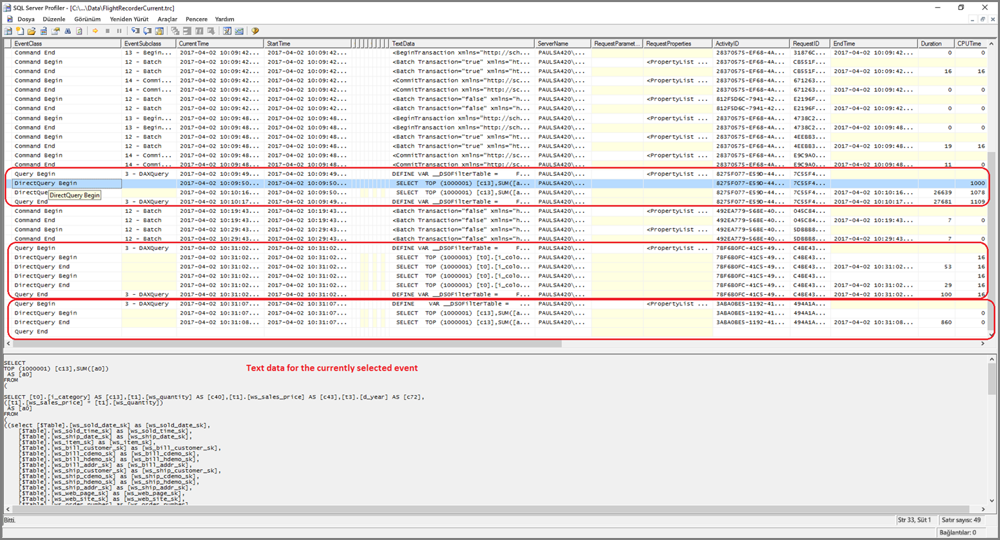
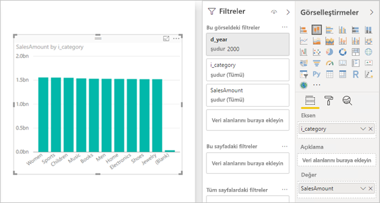

# <a name="directquery-model-troubleshooting-in-power-bi-desktop"></a>Power BI Desktop’ta DirectQuery modeli sorunlarını giderme

Bu makale, Power BI Desktop veya Power BI hizmeti kullanılarak geliştirilen Power BI DirectQuery modellerini geliştiren veri modelleyicilerini hedeflemektedir. Performans sorunlarının nasıl tanılanacağı ve raporların iyileştirilebilmesi için ayrıntılı bilginin nasıl alınacağı açıklanmaktadır.

## <a name="performance-analyzer"></a>Performans Analizi

Performans sorunlarının tanılanmasına Power BI (hizmet veya Power BI Rapor Sunucusu) yerine Power BI Desktop'ta başlanması önemle tavsiye edilir. Performans sorunları genellikle, temel alınan veri kaynağının performans düzeyine bağlıdır ve bunlar, Power BI Desktop'ın çok daha yalıtılmış ortamında daha kolay şekilde belirlenir ve tanılanır. Bu ortamda öncelikle belirli bileşenler (Power BI ağ geçidi gibi) ortadan kaldırılır. Araştırma sırasında yalnızca, performans sorunlarının Power BI Desktop'tan kaynaklanmadığı belirlenirse Power BI’daki raporun ayrıntılarına odaklanılmalıdır. [Performans Analizi](desktop-performance-analyzer.md), bu işlem boyunca oluşabilecek sorunları tanımlamaya yönelik yararlı bir özelliktir.

Benzer şekilde, sayfada bulunan birçok görsel yerine öncelikle tek bir görseldeki sorunların giderilmesi önerilir.

Bu adımların (bu konunun önceki paragraflarında bulunanlar) uygulandığını ve Power BI Desktop'taki bir sayfada yine de yavaş olan tek bir görselimiz olduğunu varsayalım. Power BI Desktop tarafından temel alınan kaynağa hangi sorguların gönderildiğini belirlemek için Performans Analizi’ni kullanabilirsiniz. Temel alınan veri kaynağı tarafından yayılan izlemeleri/tanılama bilgilerini görüntülemek de mümkündür. Bu izleme dosyaları, sorgunun nasıl yürütüldüğüne ve nasıl iyileştirilebileceğine yönelik ayrıntılar hakkında faydalı bilgiler içerebilir.

Ayrıca, sonraki bölümlerde açıklandığı üzere, kaynaktan bu tür izleme dosyalarının gelmemesi durumunda bile Power BI tarafından gönderilen sorguları, yürütme süreleriyle birlikte görüntüleyebilirsiniz.

## <a name="review-trace-files"></a>İzleme dosyalarını inceleme

Varsayılan olarak, Power BI Desktop belirli bir oturum sırasındaki olayları **FlightRecorderCurrent.trc** adlı bir izleme dosyasına kaydeder.

Bazı DirectQuery kaynakları için bu günlük, temel alınan veri kaynağına gönderilen tüm sorguları içerir. (Diğer DirectQuery kaynakları gelecekte desteklenebilir). Günlüğe sorgu yazan kaynaklar aşağıda belirtilmiştir:

- SQL Server
- Azure SQL Veritabanı
- Azure SQL Veri Ambarı
- Oracle
- Teradata
- SAP HANA

Geçerli kullanıcı için izleme dosyası **AppData** klasöründe bulunur: _\\\<User>\AppData\Local\Microsoft\Power BI Desktop\AnalysisServicesWorkspaces_

Bu klasöre kolayca ulaşmak için: Power BI Desktop'ta _Dosya > Seçenekler ve ayalar > Seçenekler_'i ve ardından **Tanılama** sayfasını seçin. Aşağıdaki iletişim kutusu penceresi görünür:


Kilitlenme Dökümü Koleksiyonu altındaki **Kilitlenme dökümü/izleme klasörü** bağlantısını seçtiğinizde aşağıdaki klasör açılır: _\\\<User>\AppData\Local\Microsoft\Power BI Desktop\Traces_

Bu klasörün üst klasörüne gidildiğinde _AnalysisServicesWorkspaces_ klasörünü içeren klasör görüntülenir. Bu klasör, açık olan her bir Power BI Desktop örneği için bir çalışma alanı alt klasörü içerir. Bu alt klasörler, _AnalysisServicesWorkspace2058279583_ örneğinde olduğu gibi bir tamsayı sonekiyle adlandırılır.

Bu klasörün içinde, geçerli Power BI oturumuna ilişkin FlightRecorderCurrent.trc izleme dosyasını içeren _\Data_ alt klasörü bulunur. İlişkili Power BI Desktop oturumu sona erdiğinde ilgili çalışma alanı klasörü silinir.

İzleme dosyaları SQL Server Management Studio ile birlikte ücretsiz indirilebilen SQL Server Profiler aracı kullanılarak açılabilir. [Bu sayfadan](/sql/ssms/download-sql-server-management-studio-ssms?view=sql-server-2017) edinebilirsiniz.

SQL Server Management Studio'yu indirip yükledikten sonra SQL Server Profiler'ı çalıştırın.



İzleme dosyasını açmak için şu adımları uygulayın:

1. SQL Server Profiler'da _Dosya > Aç > İzleme dosyası_'nı seçin
2. Şu anda açık olan Power BI oturumu için izleme dosyasının yolunu girin. Örnek: _\\\<User>\AppData\Local\Microsoft\Power BI Desktop\AnalysisServicesWorkspaces\AnalysisServicesWorkspace2058279583\Data_
3. _FlightRecorderCurrent.trc_ dosyasını açın

Geçerli oturumun tüm olayları görüntülenir. Aşağıda olay gruplarını vurgulayan, açıklama eklenmiş bir örnek verilmiştir. Her bir grup şunları içerir:

- Kullanıcı arabirimi tarafından oluşturulan (örneğin, bir görselden veya kullanıcı arabirimi filtresinde bir değerler listesi doldurarak) DAX sorgusunun başını ve sonunu temsil eden bir _Sorgu Başlangıç_ ve _Sorgu Bitiş_ olayı
- DAX sorgusunu değerlendirme işleminin parçası olarak, temel alınan veri kaynağına gönderilen bir sorguyu temsil eden bir veya daha çok _DirectQuery Başlangıç_ ve _DirectQuery Bitiş_ olay çifti

Birden fazla DAX sorgusunun paralel olarak yürütülebileceğini unutmayın. Böylece, farklı gruplardan olaylar araya eklenebilir. ActivityID değeri, hangi olayların aynı gruba dahil olduğunu belirlemek için kullanılabilir.


İlgili diğer sütunlar şunlardır:

- **TextData:** Olayın metinsel ayrıntıları. _Sorgu Başlangıç/Bitiş_ olayları için bu, DAX sorgusudur. _DirectQuery Başlangıç/Bitiş_ olayları için, temel alınan kaynağa gönderilen SQL sorgusudur. Seçili olan olay için _TextData_ değeri en alttaki bölümde de gösterilir.
- **EndTime:** Olayın tamamlandığı zaman.
- **Duration:** DAX veya SQL sorgusunu yürütmek için gereken süre (milisaniye cinsinden).
- **Error:** Hata oluşup oluşmadığını belirtir. Hata durumunda olay kırmızı renkte gösterilir.

Yukarıdaki görüntüde, daha çok ilgi çeken sütunların kolayca görülebilmesi için az ilgi çeken sütunlar daraltılmıştır.

Olası bir performans sorununun tanılanmasına yardımcı olmak üzere izleme dosyası yakalama işleminde önerilen yaklaşım şu şekildedir:

- Tek bir Power BI Desktop oturumu açın (birden çok çalışma alanı klasörünün oluşturacağı karışıklığı önlemek için)
- Power BI Desktop'ta ilgili eylemleri gerçekleştirin. İlgili olayların izleme dosyasına aktarıldığından emin olmak için birkaç eylem daha gerçekleştirin.
- Önceki bir bölümde açıklanan şekilde, SQL Server Profiler'ı açın ve izleme dosyasını inceleyin. Power BI Desktop'ı kapattığınızda izleme dosyasının silineceğini unutmayın. Ayrıca, Power BI Desktop'ta yapılan ek eylemler hemen görünmez. Yeni olayların görünmesi için izleme dosyasının kapatılıp yeniden açılması gerekir.
- İzleme dosyasının kolayca yorumlanabilmesi için tek tek oturumları makul şekilde kısa (yüzlerce değil 10 saniyelik eylemler) tutun (izleme dosyasının boyutunda sınır olduğundan, uzun oturumlarda erken gerçekleşen olayların bırakılma riski olur).

## <a name="understand-the-form-of-query-sent-by-power-bi-desktop"></a>Power BI Desktop tarafından gönderilen sorgu biçimini anlama

Power BI Desktop tarafından oluşturulan ve gönderilen sorguların genel biçimi, başvurulan model tablolarının her biri için alt sorgular kullanır ve bunlarda alt sorgu, Power Query sorgusu ile tanımlanır. Örneğin, aşağıdaki TPC-DS tablolarının SQL Server ilişkisel veritabanında olduğunu varsayalım:


**SalesAmount** ölçüsünün aşağıdaki ifadeyle tanımlandığına dikkat ederek aşağıdaki görseli ve yapılandırmasını göz önünde bulundurun:

```dax

SalesAmount = SUMX(Web_Sales, [ws_sales_price] * [ws_quantity])

```



Bu görsel yenilendiğinde, sonraki paragrafın altında gösterilen T-SQL sorgusu oluşturulur. Görebileceğiniz gibi **Web_Sales**, **Item** ve **Date_dim** model tabloları için üç alt sorgu mevcuttur. Görsel gerçekte yalnızca dört sütuna başvursa bile bu tabloların her biri tüm model tablosu sütunlarını döndürür. Bu alt sorgular (gölgelenmiştir) tam olarak Power Query sorgularının tanımıdır. Alt sorguların bu şekilde kullanılmasının, şu ana kadar DirectQuery için desteklenen veri kaynakları için performans üzerinde herhangi etkisi ile karşılaşılmadı. SQL Server gibi veri kaynakları, kullanılmayan sütunlara yönelik başvuruları iyileştirir.

Power BI’ın bu modeli kullanmasının bir nedeni, belirli bir sorgu deyimi kullanmak için bir Power Query sorgusu tanımlayabilmenizdir. Bu nedenle, yeniden yazma girişimi olmadan "verildiği gibi" kullanılır. Bu modelin Ortak Tablo İfadeleri (CTEs) ve saklı yordamlar kullanan sorgu deyimlerini kullanmayı kısıtladığını unutmayın. Bu deyimler alt sorgularda kullanılamaz.


## <a name="gateway-performance"></a>Ağ geçidi performansı

Ağ geçidi performansıyla ilgili sorunları giderme hakkında bilgi için [Ağ geçidiyle ilgili sorunları giderme - Power BI](service-gateway-onprem-tshoot.md) makalesini okuyun.

## <a name="next-steps"></a>Sonraki adımlar

DirectQuery hakkında daha fazla bilgi için aşağıdaki kaynaklara bakın:

- [Power BI Desktop'ta DirectQuery'yi kullanma](desktop-use-directquery.md)
- [Power BI Desktop’ta DirectQuery modelleri](desktop-directquery-about.md)
- [Power BI Desktop’ta DirectQuery modeli kılavuzu](guidance/directquery-model-guidance.md)
- Sorularınız mı var? [Power BI Topluluğu'na sorun](https://community.powerbi.com/)
