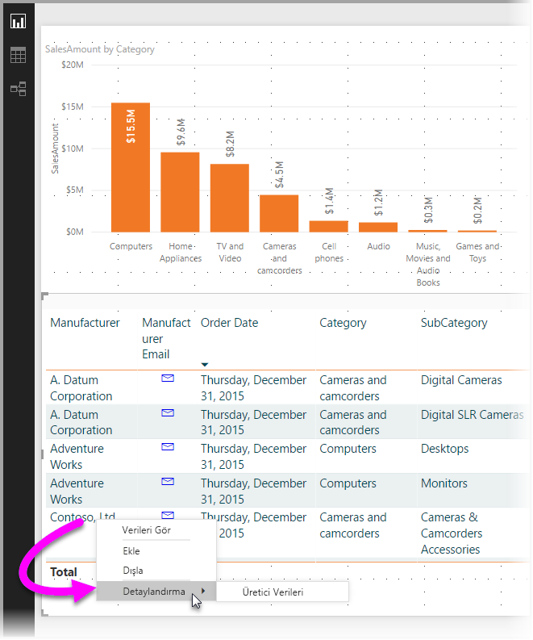
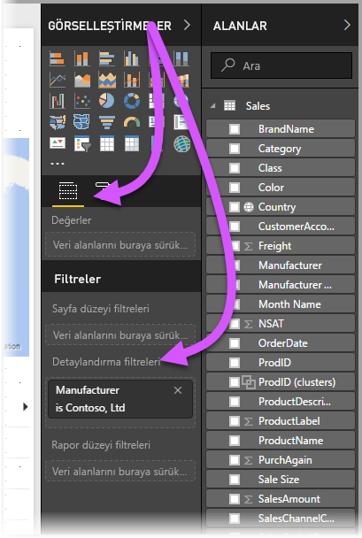
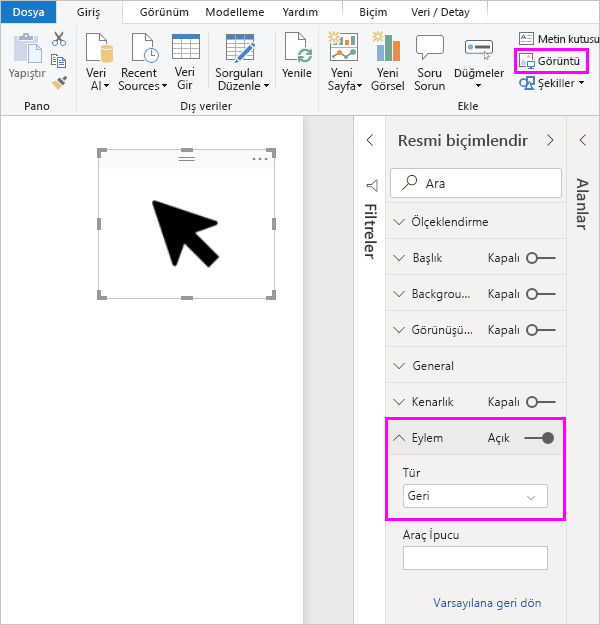
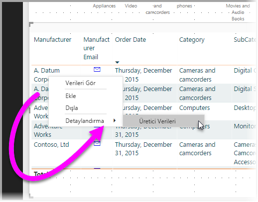
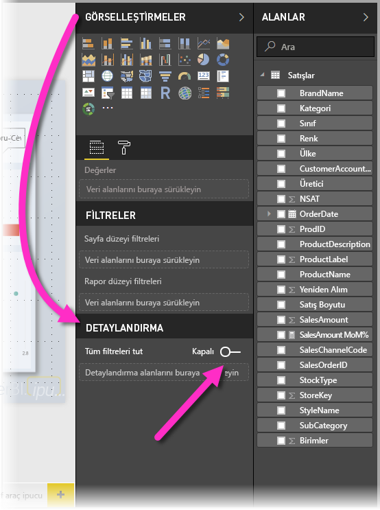
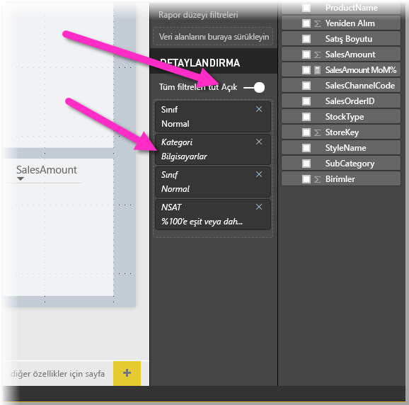
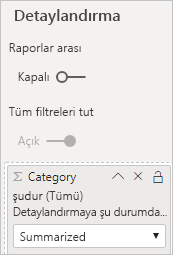

# Power BI Desktop'ta detaylandırma özelliğini kullanma
Power BI Desktop'ta *detaylandırma* özelliğini kullanarak raporunuzda tedarikçi, müşteri veya üretici gibi belirli bir varlığa odaklanan bir sayfa oluşturabilirsiniz. Detaylandırmayı kullanmak için, diğer rapor sayfalarındaki bir veri noktasına sağ tıklayıp bunu seçer ve ilgili bağlama göre filtrelenmiş olan ayrıntılara ulaşmak için odaklanmış sayfayı detaylandırırsınız.

## Detaylandırmayı kullanma
1. Detaylandırma özelliğini kullanmak isterseniz detaylandırma yapacağınız varlık türü için görmek istediğiniz görsellere sahip olan bir rapor sayfası oluşturun. 

    Örneğin üreticiler için detaylandırma yapmak istediğinizi düşünelim. Bu örnekte toplam satış, gönderilen toplam ürün sayısı, kategoriye göre satış rakamları, bölgeye göre satış rakamları gibi görsellere sahip bir detaylandırma sayfası oluşturabilirsiniz. Bu sayede ilgili sayfada detaylandırma gerçekleştirdiğinizde görseller seçtiğiniz üreticiye özgü hale gelir.

2. Ardından söz konusu detaylandırma sayfasındaki **Görsel Öğeler** bölmesinin **Alanlar** bölümünde, detaylandırmayı etkinleştirmek istediğiniz alanı **Detaylandırma filtreleri** kutusuna sürüklemeniz gerekir.

    

    **Detaylandırma filtreleri** kutusuna bir alan eklediğinizde Power BI Desktop otomatik olarak bir *geri* düğmesi görseli oluşturur. Bu görsel yayımlanmış raporlarda düğme haline gelir. Power BI hizmetinde raporunuzu inceleyen kullanıcılar daha önce bulundukları rapor sayfasına geri dönmek için bu düğmeyi kullanır.

    

## Geri düğmesi için kendi görüntünüzü kullanma    
 Geri düğmesi bir görüntü olduğu için istediğiniz görüntüyle değiştirebilirsiniz. Raporunuzu inceleyen kullanıcıların geldikleri sayfaya geri dönebilmesi için geri düğmesi olarak çalışmaya devam eder. 

Geri düğmesi için kendi görüntünüzü kullanmak istiyorsanız şu adımları izleyin:

1. **Giriş** sekmesinde **Görüntü**'yü seçin. Ardından görüntünüzü bulun ve detaylandırma sayfasına yerleştirin.

2. Detaylandırma sayfasında yeni görüntünüzü seçin. **Resmi biçimlendir** bölmesinin altında **Eylem** kaydırıcısını **Açık** konuma getirin ve **Tür** olarak **Geri** seçeneğine ayarlayın. Görüntünüz artık geri düğmesi olarak işlev görür.

    

    
     Artık kullanıcılar raporunuzdaki bir veri noktasına sağ tıklayıp sayfayı detaylandırma seçeneği sunan bir bağlam menüsüne erişebilir. 

    

    Rapor kullanıcıları detaylandırmayı seçtiğinde, sayfa, tıkladıkları veri noktası hakkındaki bilgileri gösterecek şekilde filtrelenir. Örneğin kullanıcının bir üretici olan Contoso'yla ilgili bir veri noktasına sağ tıklayıp detaylandırma seçeneğini belirlediğini düşünelim. Açılan detaylandırma sayfası da Contoso için filtrelenmiş olur.

## Detaylandırmadaki tüm filtreleri geçirme

Power BI Desktop’ın Mayıs 2018 sürümünden itibaren tüm uygulanan filtreleri, detaylandırma penceresine geçirebilirsiniz. Örneğin, söz konusu kategoriye filtrelenen görsellerin ve ürünlerin yalnızca belirli bir kategorisini seçebilir ve sonra detaylandırmayı seçebilirsiniz. Tüm bu filtreler uygulandığında detaylandırmanın nasıl göründüğünü merak edebilirsiniz.

Tüm uygulanan filtreleri tutmak için **Görselleştirmeler** bölmesinin **Detaylandırma** bölümünde **Tüm filtreleri tut** seçeneğini **Açık** olarak ayarlayın. 

Mayıs 2018’den önce yayımlanmış olan Power BI Desktop sürümlerinde bu davranış, bu iki durumlu düğmenin **Kapalı** olarak ayarlanmasına eşdeğerdir.

Daha sonra bir görsel üzerinde detaylandırma yaptığınızda, kaynak görselde geçici filtrelerin uygulanması sonucunda hangi filtrelerin uygulandığını görebilirsiniz. **Görselleştirme** bölmesinin **Detaylandırma** bölümünde penceresinde bu geçici filtreler italik olarak gösterilir. 

Araç ipuçları sayfalarında bunu kullanabilirsiniz ama araç ipucu düzgün çalışıyor gibi görünmeyeceğinden bu sorunlu bir deneyim olacaktır. Bu nedenle araç ipuçlarıyla bu işlemin gerçekleştirilmesi önerilmez.

## Detaylandırmak için bir ölçü ekleyin

Tüm filtreleri detaylandırma penceresine geçirmeye ek olarak detaylandırma alanına bir ölçü de (veya özetlenen sayısal sütun) ekleyebilirsiniz. Detaylandırma alanını **Detaylandırma** kartına sürükleyerek uygulayabilirsiniz. 

Bir ölçü veya özetlenen sayısal sütun eklediğinizde, alan bir görselin *Değer* alanında kullanılıyorsa sayfayı detaylandırabilirsiniz.

Raporlarınızda detaylandırma özelliğini kullanmak için yapmanız gerekenler bu kadardır. Bu, detaylandırma filtreniz için seçtiğiniz varlık bilgilerini genişletilmiş görünümde göstermek için idealdir.

## Sonraki adımlar

Aşağıdaki makaleler de ilginizi çekebilir:

* [Power BI Desktop'ta çapraz rapor detaylandırma özelliğini kullanma](desktop-cross-report-drill-through.md)
* [Power BI Desktop’ta dilimleyicileri kullanma](visuals/power-bi-visualization-slicers.md)

