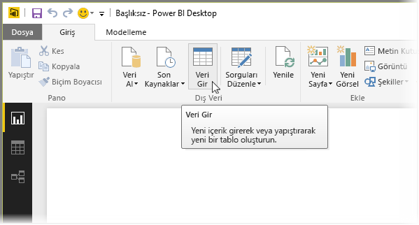
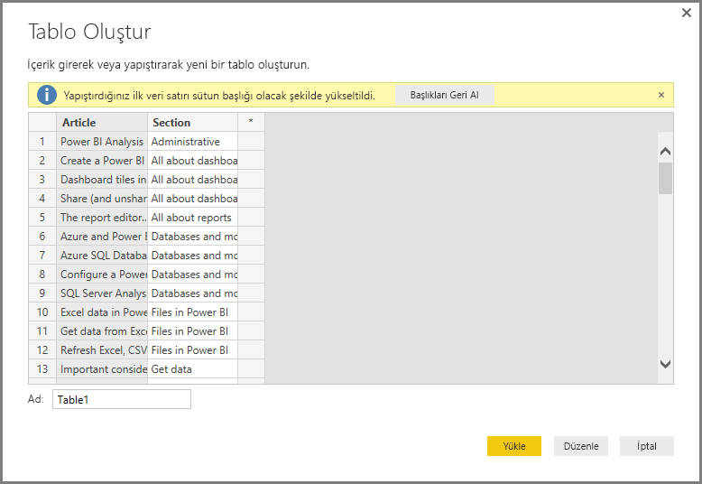
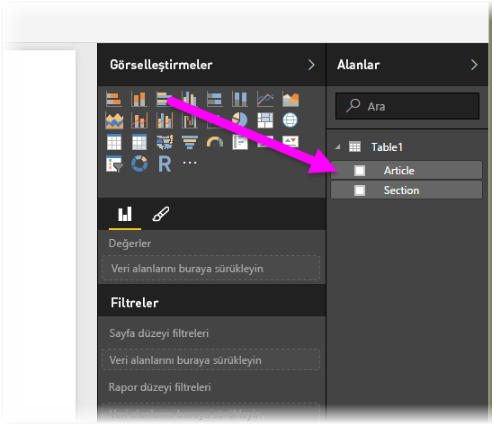

# Verileri doğrudan Power BI Desktop'a girme
Power BI Desktop ile verileri doğrudan girebilir ve bunları raporlarınızın yanı sıra görselleştirmelerinizde kullanabilirsiniz. Örneğin, bir çalışma kitabının veya web sayfasının bölümlerini kopyalayıp Power BI Desktop'a yapıştırabilirsiniz.

Verileri doğrudan girmek için, **Giriş** şeridindeki **Verileri Girin** seçeneğini belirleyin.

Power BI Desktop, tıpkı herhangi bir kaynaktan veri yüklediğinizde gerçekleştirdiği gibi, uygun durumlarda verilere küçük dönüştürmeler uygulamaya çalışabilir. Örneğin, aşağıdaki örnekte verilerin ilk satırları başlık olarak yükseltilmiştir.

Girdiğiniz verileri (veya yapıştırdığınız) şekillendirmek istiyorsanız verileri Power BI Desktop'a aktarmadan önce şekillendirip dönüştürebileceğiniz **Sorgu Düzenleyicisi**'nin açılmasını sağlamak üzere Düzenle düğmesini seçebilirsiniz. Alternatif olarak, verileri oldukları gibi içeri aktarmak için **Yükle** düğmesini de seçebilirsiniz.

**Yükle** düğmesini seçtiğinizde Power BI Desktop, verilerinizden yeni bir tablo oluşturur ve bu tabloyu **Alanlar** bölmesine ekler. Aşağıdaki görüntüde Power BI Desktop, yeni tablomu (varsayılan olarak *Tablo1* adı verilir) ve bu tabloda oluşturulmuş iki alanı göstermektedir.

Gördüğünüz gibi Power BI Desktop'a veri girmek bu kadar kolaydır.

Artık görsel ve rapor oluşturmak veya diğer Excel çalışma kitapları, veritabanları ya da başka bir veri kaynağı gibi, bağlanmak veya içeri aktarmak isteyebileceğiniz verilerle etkileşime geçmek için Power BI Desktop'taki verileri kullanmaya hazırsınız.

### Sonraki adımlar
Power BI Desktop'ı kullanarak çok çeşitli türlerdeki verilere bağlanabilirsiniz. Veri kaynakları hakkında daha fazla bilgi için aşağıdaki kaynaklara bakın:

* [Power BI Desktop ile çalışmaya başlama](desktop-getting-started.md)
* [Power BI Desktop'taki veri kaynakları](desktop-data-sources.md)
* [Power BI Desktop'ta Verileri Şekillendirme ve Birleştirme](desktop-shape-and-combine-data.md)
* [Power BI Desktop'ta Excel çalışma kitaplarına bağlanma](desktop-connect-excel.md)   
* [Power BI Desktop'ta CSV dosyalarına bağlanma](desktop-connect-csv.md)   

