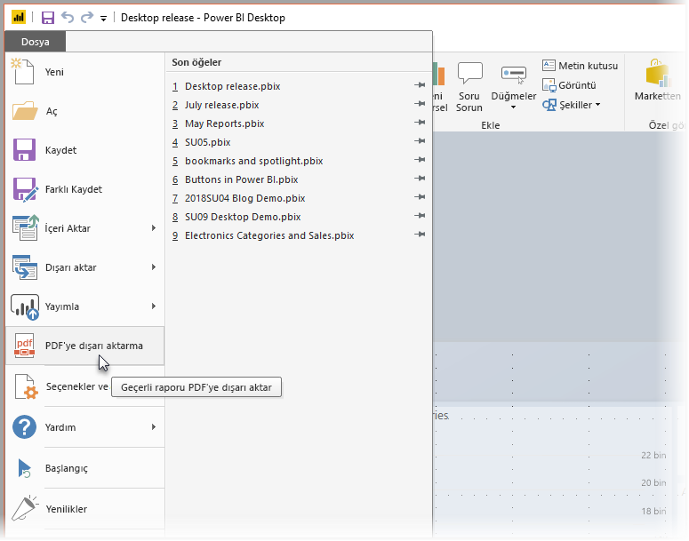
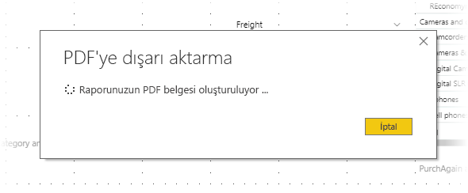

# Power BI Desktop'taki raporları PDF olarak dışarı aktarma
**Power BI Desktop** veya Power BI hizmetindeki raporlarınızı PDF dosyası biçiminde dışarı aktarabilir, bu PDF raporları kolayca paylaşabilir veya yazdırabilirsiniz.

Raporunuzu **Power BI Desktop**'ten PDF'ye dışarı aktarmak ve bu PDF'yi yazdırmak veya PDF belgesini başkalarıyla paylaşmak oldukça kolaydır. Power BI Desktop uygulamasında **Dosya > PDF'ye dışarı aktar**'ı seçmeniz yeterlidir.

**PDF'ye dışarı aktar** işlemi rapordaki tüm *görünür* sayfaları dışarı aktarır ve raporun her sayfası PDF'deki bir sayfaya karşılık gelir. Araç ipuçları veya gizli sayfalar gibi görünür olmayan rapor sayfaları PDF dosyasına aktarılmaz. 

**Dosya > PDF'ye dışarı aktar**'ı seçtiğinizde dışarı aktarma işlemi başlatılır ve işlemin devam ettiğini gösteren bir iletişim kutusu açılır. Dışarı aktarma işlemi tamamlanana kadar bu iletişim kutusu açık kalır. Dışarı aktarma işlemi sırasında raporla ilgili tüm eylemler devre dışı bırakılır. Raporla etkileşim kurmanın tek yolu dışarı aktarma işlemi bitene kadar beklemek veya işlemi iptal etmektir. 

Dışarı aktarma işlemi tamamlandığında PDF dosyası bilgisayarınızdaki varsayılan PDF görüntüleyici ile açılır. 

## Önemli noktalar ve sınırlamalar
**PDF'ye dışarı aktar** özelliği ile ilgili olarak göz önünde bulundurmanız gereken bazı önemli noktalar vardır:

* Bu seçenek Power BI görsellerini dışarı aktarır ancak rapora uygulamış olabileceğiniz duvar kağıtlarını *dışarı aktarmaz*.

Duvar kağıdı PDF'ye aktarılmadığından koyu renkli duvar kağıdı kullanılan raporlara özellikle dikkat etmeniz gerekir. Raporunuzda koyu renkli duvar kağıdının önünde görünmesi için açık veya beyaz renkli metin kullanıldıysa, duvar kağıdı raporun kalanıyla dışarı aktarılmayacağından PDF'ye dışarı aktarma işleminin ardından bu metnin okunması zor veya imkansız olabilir. 

## Sonraki adımlar
**Power BI Desktop**'ta birçok farklı ilgi çekici görsel öğe ve özellik vardır. Daha fazla bilgi için aşağıdaki kaynaklara bakın:

* [Görsel öğeler kullanarak Power BI raporlarını geliştirme](desktop-visual-elements-for-reports.md)
* [Power BI Desktop nedir?](desktop-what-is-desktop.md)

