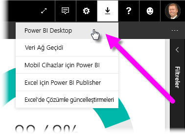
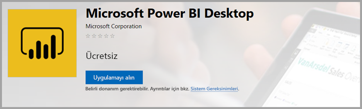
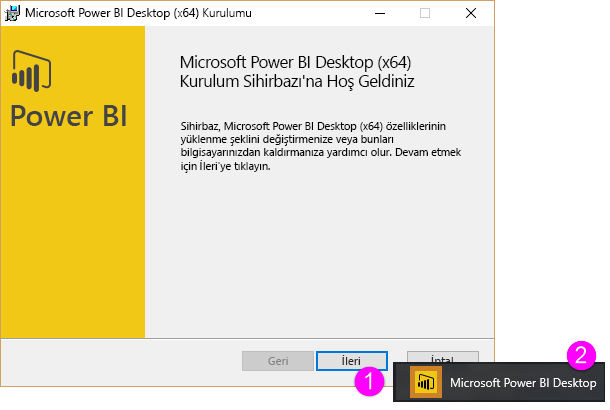

# <a name="get-power-bi-desktop"></a>Power BI Desktop uygulamasını edinme
Power BI Desktop verileri görselleştiren gelişmiş sorgular, modeller ve raporlar oluşturmanıza olanak sağlar. Power BI Desktop ile veri modelleri kurabilir, raporlar oluşturabilir ve Power BI hizmetinde yayımlayarak işinizi paylaşabilirsiniz. Power BI Desktop ücretsiz olarak indirilir.

Power BI Desktop'ı aşağıda açıklanan iki yöntemden birini kullanarak edinebilirsiniz:

* [Microsoft Store’dan bir uygulama olarak yükleme](#install-as-an-app-from-the-microsoft-store).
* [Bilgisayarınıza indirdiğiniz ve yüklediğiniz bir yürütülebilir dosya olarak doğrudan indirme](#download-power-bi-desktop-directly).

Her iki yöntemle de bilgisayarınıza Power BI Desktop'ın en son sürümünü almış olursunuz ama dikkat edilmesi gereken ve aşağıdaki bölümlerde açıklanan bazı farklılıklar söz konusudur.

## <a name="install-as-an-app-from-the-microsoft-store"></a>Microsoft Store’dan bir uygulama olarak yükleme
Microsoft Store'dan Power BI Desktop'ın en son sürümüne birkaç yolla erişilebilir. 

1. Microsoft Store'un **Power BI Desktop** sayfasını açmak için aşağıdaki seçeneklerden birini kullanın:

   - Tarayıcıyı açın ve doğrudan Microsoft Store'un [Power BI Desktop sayfasına](https://aka.ms/pbidesktopstore) gidin.

    - [Power BI hizmetinde](https://docs.microsoft.com/power-bi/service-get-started), sağ üst köşedeki **İndir** simgesini seçin ve sonra da **Power BI Desktop**'ı seçin.

      

   - [Power BI Desktop ürün sayfasına](https://powerbi.microsoft.com/desktop/) gidin ve **Ücretsiz İndir**'i seçin.
  
2. Microsoft Store'un **Power BI Desktop** sayfasına geldikten sonra **Yükle**'yi seçin.

     

Power BI Desktop’ı Microsoft Store’dan edinmenin bazı avantajları vardır:

* **Otomatik güncelleştirmeler**: Windows, en son sürümü, kullanılabilir olduğunda arka planda otomatik olarak indirir. Böylece, sürümünüz her zaman güncel kalır.
* **Daha küçük indirmeler**: Microsoft Store yalnızca her güncelleştirmede değiştirilen bileşenlerin makinenize indirilmesini sağlar, bu da her güncelleştirme için daha küçük boyutta indirmeler gerçekleştirileceği anlamına gelir.
* **Yönetici ayrıcalığı gerekmez**: Paketi doğrudan indirip yüklediğinizde yüklemenin başarıyla tamamlanması için yönetici olmanız gerekir. Power BI Desktop’ı Microsoft Store’dan alırsanız yönetici ayrıcalığı gerekli *değildir*.
* **BT tarafından kullanıma sunulabilir**: İş için Microsoft Store aracılığıyla, Power BI Desktop'ı kuruluşunuzdaki herkese çok daha kolay dağıtabilir veya *kullanıma sunabilirsiniz*

* **Dil algılama**: Microsoft Store sürümü desteklenen tüm dilleri içerir ve her başlatıldığında bilgisayarınızda kullanılan dili denetler. Bu dil desteği Power BI Desktop'ta oluşturulan modellerin yerelleştirilmesini de etkiler. Örneğin, yerleşik tarih hiyerarşileri Power BI Desktop'ın .pbix dosyası oluşturulurken kullandığı dille eşleşir.

Power BI Desktop'ı Microsoft Store'dan yüklediğinizde aşağıdaki önemli noktalar ve sınırlamalar geçerlidir:

* SAP bağlayıcısını kullanıyorsanız SAP sürücü dosyalarınızı *Windows\System32* klasörüne taşımanız gerekir.
* Power BI Desktop Microsoft Store’dan yüklendiğinde, .exe sürümünden kullanıcı ayarları kopyalanmaz. Yeni veri kaynaklarınıza yeniden bağlanmanız ve veri kaynağı kimlik bilgilerinizi yeniden girmeniz gerekebilir. 

> [!NOTE]
> Power BI Desktop'ın Power BI Rapor Sunucusu sürümü için bu makalede ele alınan sürümlerden ayrı ve farklı bir yükleme gereklidir. Power BI Desktop'ın Power BI Rapor Sunucusu sürümü hakkında daha fazla bilgi için bkz. [Power BI Rapor Sunucusu için Power BI raporu oluşturma](report-server/quickstart-create-powerbi-report.md).
> 
> 

## <a name="download-power-bi-desktop-directly"></a>Power BI Desktop'ı doğrudan indirme
  
  İndirme Merkezi'nden Power BI Desktop yürütülebilir dosyasını indirmek için [İndirme Merkezi sayfasından](https://www.microsoft.com/download/details.aspx?id=58494) **İndir**'i seçin. Ardından indirmek üzere 32 bit veya 64 bit yükleme dosyasını belirtin.

  

### <a name="install-power-bi-desktop-after-downloading-it"></a>İndirdikten sonra Power BI Desktop'ı yükleyin
İndirmeyi bitirdiğinizde yükleme dosyasını çalışmanız istenir.

Haziran 2019 sürümünden başlayarak, Power BI Desktop desteklenen tüm dilleri içeren tek bir .exe yükleme paketi olarak gönderilmektedir. 32 bit ve 64 bit sürümleri için ayrı .exe dosyaları vardır. .msi paketleri Eylül 2019 sürümünden itibaren kullanımdan kaldırılmıştır; bu nedenle yükleme için .exe yürütülebilir dosyası gereklidir. Bu yaklaşım dağıtım, güncelleştirme ve yüklemeyi (özellikle Yöneticiler için) çok daha kolay ve daha kullanışlı hale getirir. Ayrıca [Yükleme sırasında komut satırı seçeneklerini kullanma](#using-command-line-options-during-installation) bölümünde açıklandığı gibi, komut satırı parametrelerini kullanarak yükleme işlemini özelleştirebilirsiniz.

Yükleme paketini başlattıktan sonra Power BI Desktop bir uygulama olarak yüklenir ve masaüstünüzde çalışır.



> [!NOTE]
> Power BI Desktop’ın indirilen (MSI) sürümünü (kullanımdan kaldırıldı) ve Microsoft Store sürümünü aynı bilgisayara yükleme işlemi (bazı durumlarda *yan yana* yükleme olarak adlandırılır) desteklenmemektedir. Power BI Desktop'ı Microsoft Store'dan indirmeden önce bilgisayardan el ile kaldırın.
> 

## <a name="using-power-bi-desktop"></a>Power BI Desktop'ı kullanma
Power BI Desktop'ı başlattığınızda hoş geldiniz ekranı görüntülenir.


Power BI Desktop'ı ilk kez kullanıyorsanız (yani yükleme bir yükseltme değilse), devam etmeden önce bir form doldurmanız veya Power BI hizmetinde oturum açmanız istenir.

Buradan veri modelleri veya raporlar oluşturmaya başlayabilir ve ardından bu raporları, Power BI hizmetinde başkalarıyla paylaşabilirsiniz. Power BI Desktop'ı kullanmaya başlarken size yardımcı olacak kılavuzların listesi için [Sonraki adımlar](#next-steps) bölümünü gözden geçirin.

## <a name="minimum-requirements"></a>Minimum gereksinimler
Power BI Desktop'ı çalıştırmaya yönelik minimum gereksinimler aşağıdaki listede verilmiştir:

* Windows 7/Windows Server 2008 R2 veya sonraki sürümler
* .NET 4.5
* Internet Explorer 10 veya sonraki sürümler
* Bellek (RAM): En az 1 GB kullanılabilir bellek. (1,5 GB veya daha fazla bellek önerilir.)
* Ekran: En az 1440x900 veya 1600x900 (16:9) ekran önerilir. Belirli denetimler (başlangıç ekranını kapatma gibi) bu çözünürlükleri aşacağı için 1024x768 veya 1280x800 gibi daha düşük çözünürlükler önerilmez.
* Windows görüntü ayarları: Görüntü ayarlarınızı metin, uygulama ve diğer öğelerin boyutunu %100'den fazla değiştirecek şekilde belirlerseniz Power BI Desktop'ı kullanmaya devam etmek için etkileşimli çalışmanız gereken bazı iletişim kutularını göremeyebilirsiniz. Bu sorunla karşılaşırsanız Windows'da **Ayarlar** > **Sistem** > **Görüntü**'ye gidip görüntü ayarlarınızı denetleyin ve kaydırıcıyı kullanarak görüntü ayarlarını %100'e getirin.
* CPU: 1 gigahertz (GHz) veya daha hızlı 32 bit veya 64 bit x86 işlemci önerilir.

## <a name="considerations-and-limitations"></a>Önemli noktalar ve sınırlamalar

Power BI Desktop ile harika bir deneyim yaşamanızı istiyoruz. Power BI Desktop'ta sorunlarla karşılaştığınız noktalar olabileceğinden, bu bölümde söz konusu sorunlarla ilgili çözümlere veya önerilere yer verilmiştir. 

### <a name="using-command-line-options-during-installation"></a>Yükleme sırasında komut satırı seçeneklerini kullanma 

Power BI Desktop'ı yüklerken komut satırı geçişleriyle özellikleri ve seçenekleri ayarlayabilirsiniz. Bu ayarlar özellikle kuruluş genelinde Power BI Desktop yüklemesini yöneten veya kolaylaştıran Yöneticiler için yararlıdır. Bu seçenekler .msi ve .exe yüklemeleri için geçerlidir. 


|Komut satırı araçları  |Davranış  |
|---------|---------|
|-q, -quiet, -s, -silent     |Sessiz yükleme         |
|-passive     |Yalnızca yükleme sırasında ilerleme çubuğunu göster         |
|-norestart     |Bilgisayar yeniden başlatma gereksinimini gösterme         |
|-forcerestart     |Yüklemeden sonra bilgisayarı sormadan yeniden başlat         |
|-promptrestart     |Bilgisayarın yeniden başlatılması gerekiyorsa kullanıcıya sor (varsayılan)         |
|-l<>, -log<>     |Yüklemeyi <> içinde belirtilen dosyayla belirli bir dosyaya kaydet         |
|-uninstall     |Power BI Desktop’ı kaldır         |
|-repair     |Yüklemeyi onar (veya şu anda yüklü değilse yükle)         |
|-package, -update     |Power BI Desktop’ı yükle (varsayılan olarak, -uninstall veya -repair belirtilmediğinde)         |

Ayrıca, *özellik = değer* söz dizimiyle belirttiğiniz aşağıdaki söz dizimi parametrelerini kullanabilirsiniz:

|Parametre  |Anlamı  |
|---------|---------|
|ACCEPT_EULA     |EULA belgesini otomatik olarak kabul etmek için 1 değeri gerektirir         |
|ENABLECXP     |1 değeri, ürün kullanımına ilişkin telemetri yakalayan müşteri deneyimi programına kaydolur         |
|INSTALLDESKTOPSHORTCUT     |1 değeri, Masaüstüne bir kısayol ekler         |
|INSTALLLOCATION     |Yüklenmesini istediğiniz dosya yolu         |
|LANGUAGE     |Uygulamanın varsayılan dilini zorlamak için yerel ayar kodu (örneğin, en-US, de-DE, PR-BR). Dil belirtmezseniz, Power BI Desktop Windows işletim sistemi dilini görüntüler. Bu ayarı **Seçenekler** iletişim kutusunda değiştirebilirsiniz.         |
|REG_SHOWLEADGENDIALOG     |0 değeri, Power BI Desktop’ta oturum açmadan önce görüntülenen iletişim kutusunu göstermeyi devre dışı bırakır.         |
|DISABLE_UPDATE_NOTIFICATION     |1 değeri güncelleştirme bildirimlerini devre dışı bırakır.         |


Örneğin, Almanca dilini kullanarak herhangi bir kullanıcı arabirimi olmadan yüklemek için Power BI Desktop'ı aşağıdaki seçenekler ve parametrelerle çalıştırabilirsiniz: 

```-quiet LANG=de-DE ACCEPT_EULA=1```

### <a name="installing-power-bi-desktop-on-remote-machines"></a>Uzak makinelere Power BI Desktop yükleme

Kullanıcılarınıza Windows Installer dosyası (.msi dosyası) gerektiren bir araçla Power BI Desktop dağıtıyorsanız, .msi dosyasını Power BI Desktop installer .exe dosyasından ayıklayabilirsiniz. WiX Toolset gibi bir üçüncü taraf aracını kullanın.

> [!NOTE]
> Üçüncü taraf ürün olarak WiX Toolset seçenekleri bildirimde bulunulmadan değişebilir. En güncel bilgiler için belgelerini gözden geçirin ve yardım almak için kullanıcı posta listesine başvurun.

1. Power BI Desktop yükleyicisini indirdiğiniz bilgisayarda [WiX Toolset](https://wixtoolset.org/)’in en son sürümünü yükleyin.
2. Yönetici olarak bir komut satırı penceresi açın ve WiX Toolset’i yüklediğiniz klasöre gidin.
3. Aşağıdaki komutu çalıştırın: 
    
    ```Dark.exe <path to Power BI Desktop installer> -x <output folder>```

    Örnek:

    ``` Dark.exe C:\PBIDesktop_x64.exe -x C:\output```

    Çıkış klasöründe .msi dosyalarını içeren *AttachedContainer* adlı bir klasör bulunur.


### <a name="issues-when-using-previous-releases-of-power-bi-desktop"></a>Power BI Desktop'ın önceki sürümlerini kullanırken ortaya çıkan sorunlar

Power BI Desktop'ın eski bir sürümünü kullanan bazı kullanıcılar aşağıdaki iletiye benzer bir hata iletisiyle karşılaşabilir: 

*Kaydedilen veritabanını modele geri yükleyemedik.* 

Power BI Desktop’ın geçerli sürümüne güncelleştirme yapıldığında sorun genellikle çözülür.

### <a name="disabling-notifications"></a>Bildirimleri devre dışı bırakma
Özellik, performans, kararlılık alanlarındaki ve diğer konulardaki gelişmelerden faydalanabilmeniz için Power BI Desktop'ı en son sürümüne güncelleştirmenizi öneririz. Bazı kuruluşlar kullanıcıların yeni bir sürüm çıktığında güncelleştirme yapmasını istemeyebilir. Aşağıdaki adımları izleyerek kayıt defterinde yapacağınız bir değişiklikle bildirimleri devre dışı bırakabilirsiniz:

1. Kayıt Defteri Düzenleyicisi'nde **HKEY_LOCAL_MACHINE\SOFTWARE\Microsoft\Microsoft Power BI Desktop** anahtarına gidin.
2. Anahtarda şu adda yeni bir **REG_DWORD** girdisi oluşturun: **DisableUpdateNotification**.
3. Yeni girişin değerini **1** olarak belirleyin.
4. Bu değişikliğin geçerlilik kazanması için bilgisayarınızı yeniden başlatın.

### <a name="power-bi-desktop-loads-with-a-partial-screen"></a>Power BI Desktop ekranı tam olarak yüklenmiyor

Belirli ekran çözünürlüğü yapılandırmalarında bazı kullanıcılar Power BI Desktop'ta büyük siyah alanların görüntülendiğini görebilir. Bu sorun genellikle doğrudan Power BI Desktop'ın içerik sunmasıyla ilgili değil yapılan son işletim sistemi güncelleştirmelerinin öğelerin işlenme şeklini etkilemesiyle ilgilidir. Bu sorunu çözmek için şu adımları izleyin:

1. **Başlat** düğmesine basın ve görüntülenen arama çubuğuna *blurry* girin.
2. Açılan iletişim kutusunda şu seçeneği belirtin: **Bulanık uygulamaları Windows'un düzeltmesine izin ver.**
3. Power BI Desktop'ı yeniden başlatın.

Bu sorun sonraki Windows güncelleştirmeleriyle birlikte giderilebilir. 
 

## <a name="next-steps"></a>Sonraki adımlar
Power BI Desktop uygulamasını yükledikten sonra aşağıdaki içerik hızla çalışmaya başlamanıza yardımcı olabilir:

* [Power BI Desktop nedir?](desktop-what-is-desktop.md)
* [Power BI Desktop'ta sorgulara genel bakış](desktop-query-overview.md)
* [Power BI Desktop'ta veri kaynakları](desktop-data-sources.md)
* [Power BI Desktop'ta verilere bağlanma](desktop-connect-to-data.md)
* [Power BI Desktop'ta verileri şekillendirme ve birleştirme](desktop-shape-and-combine-data.md)
* [Power BI Desktop'taki genel sorgu görevleri](desktop-common-query-tasks.md)   

