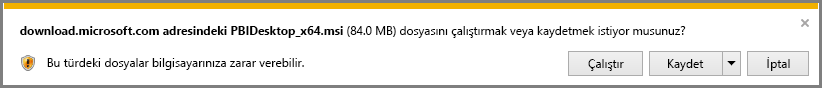

# Power BI Desktop uygulamasını edinme
**Power BI Desktop** verileri görselleştiren gelişmiş sorgular, modeller ve raporlar oluşturmanıza olanak sağlar. **Power BI Desktop** ile veri modelleri kurabilir, raporlar oluşturabilir ve Power BI hizmetinde yayımlayarak işinizi paylaşabilirsiniz.  **Power BI Desktop** ücretsiz olarak indirilir.

**Power BI Desktop**'ı aşağıda açıklanan iki yöntemden birini kullanarak edinebilirsiniz:

* Doğrudan **indirme** (bilgisayarınıza indirip yüklediğiniz bir MSI paketi)
* **Microsoft Store**’dan bir uygulama olarak yükleme

Her iki yöntemle de bilgisayarınıza **Power BI Desktop**'ın en son sürümünü indirmiş olursunuz ancak dikkat edilmesi gereken ve aşağıda açıklanan birkaç farklılık söz konusudur.

## Power BI Desktop'ı indirme
**Power BI Desktop**'ın en yeni sürümünü indirmek için Power BI hizmetinin sağ üst köşesindeki indirme simgesini seçip **Power BI Desktop** seçeneğini belirleyebilirsiniz.

Power BI Desktop'ın en son sürümünü şu indirme sayfasından da indirebilirsiniz:

* [**Power BI Desktop indirme** (32 ve 64 bit sürümleri)](https://powerbi.microsoft.com/desktop).
  
  

Seçtiğiniz indirme yönteminden bağımsız olarak, **Power BI Desktop**'ı indirdiğinizde yükleme dosyasını çalıştırmanız istenir:

**Power BI Desktop** bir uygulama olarak yüklenir ve masaüstünüzde çalıştırılır.

> [!NOTE]
> **Power BI Desktop**’ın indirilen (MSI) sürümünü ve **Microsoft Store** sürümünü aynı bilgisayara yükleme işlemi (bazı durumlarda *yan yana* yükleme olarak adlandırılır) desteklenmemektedir.
> 
> 

## Microsoft Store’dan bir uygulama olarak yükleme
**Power BI Desktop**’ı, şu bağlantıyı kullanarak Microsoft Store’dan da edinebilirsiniz:

* [**Microsoft Store**’dan **Power BI Desktop**’ı yükleme](http://aka.ms/pbidesktopstore)

**Power BI Desktop**’ı Microsoft Store’dan edinmenin bazı avantajları vardır:

* **Otomatik güncelleştirmeler**: Windows, en son sürümü, kullanılabilir olduğunda arka planda otomatik olarak indirir. Böylece, sürümünüz her zaman güncel kalır.
* **Daha küçük indirmeler**: **Microsoft Store** yalnızca her güncelleştirmede değiştirilen bileşenlerin makinenize indirilmesini sağlar, bu da her güncelleştirme için daha küçük boyutta indirmeler gerçekleştirileceği anlamına gelir.
* **Yönetici ayrıcalığı gerekmez**: MSI'yi doğrudan indirip yüklediğinizde yüklemenin başarıyla tamamlanması için yönetici olmanız gerekir. **Power BI Desktop**’ı Microsoft Store’dan alırsanız yönetici ayrıcalığı gerekli *değildir*.
* **BT tarafından kullanıma sunulabilir**: **Microsoft Store** sürümü, kuruluşunuzdaki herkese kolayca dağıtılabilir veya kolaylıkla *kullanıma sunulabilir*; bunun yanı sıra **Power BI Desktop**’a **İş için Microsoft Store** aracılığıyla da ulaşılabilir.
* **Dil algılama**: **Microsoft Store** sürümü, desteklenen tüm dilleri içerir ve her başlatıldığında bilgisayarda kullanılan dilleri denetler. Bu durum, **Power BI Desktop**'ta oluşturulan modellerin yerelleştirmesini de etkiler; örneğin, yerleşik tarih hiyerarşileri, **Power BI Desktop**'ın .pbix dosyası oluşturulurken kullandığı dil ile eşleşir.

**Power BI Desktop**’ı Microsoft Store’dan yükleme konusunda aşağıda verilen bazı önemli noktalar ve sınırlamalar söz konusudur:

* SAP bağlayıcısını kullanıyorsanız SAP sürücü dosyalarınızı *Windows\System32* klasörüne taşımanız gerekir.
* **Power BI Desktop**, Microsoft Store’dan yüklendiğinde, MSI sürümünden kullanıcı ayarları kopyalanmaz. Yeni veri kaynaklarınıza yeniden bağlanmanız ve veri kaynağı kimlik bilgilerinizi yeniden girmeniz gerekebilir. 

> [!NOTE]
> **Power BI Desktop**’ın indirilen (MSI) sürümünü ve **Microsoft Store** sürümünü aynı bilgisayara yükleme işlemi (bazı durumlarda *yan yana* yükleme olarak adlandırılır) desteklenmemektedir. **Power BI Desktop**’ı **Microsoft Store**’dan indirmeden önce el ile kaldırmanız gerekir
> 
> [!NOTE]
> **Power BI Desktop**'ın Power BI Rapor Sunucusu sürümü için bu makalede ele alınan sürümlerden ayrı ve farklı bir yükleme gereklidir. **Power BI Desktop**'ın Power BI Rapor Sunucusu sürümü hakkında daha fazla bilgi için bkz. [Power BI Rapor Sunucusu için Power BI raporu oluşturma](report-server/quickstart-create-powerbi-report.md).
> 
> 

## Power BI Desktop'ı kullanma
**Power BI Desktop**'ı başlattığınızda *Hoş Geldiniz* ekranı görüntülenir.

**Power BI Desktop**'ı ilk kez kullanacaksanız (yükleme bir yükseltme değilse) devam edebilmek için önce birkaç soruluk bir form doldurmanız veya **Power BI hizmetinde** oturum açmanız istenir.

Buradan veri modelleri veya raporlar oluşturmaya başlayabilir ve ardından bu raporları, Power BI hizmetinde başkalarıyla paylaşabilirsiniz. **Power BI Desktop**'ı kullanmaya başlama konusunda yardımcı olabilecek kılavuzlara ilişkin bağlantılar için bu makalenin sonundaki **Daha fazla bilgi** bağlantılarına başvurun.

## Minimum gereksinimler
**Power BI Desktop**'ı çalıştırmaya yönelik minimum gereksinimler aşağıdaki listede verilmiştir:

* Windows 7/Windows Server 2008 R2 veya sonraki sürümler
* .NET 4.5
* Internet Explorer 9 veya sonraki sürümler
* **Bellek (RAM):** En az 1 GB kullanılabilir bellek. (1,5 GB veya daha fazla bellek önerilir.)
* **Ekran:** En az 1440x900 veya 1600x900 (16:9) ekran önerilir. Belirli denetimler (başlangıç ekranını kapatma gibi) bu çözünürlükleri aşacağı için 1024x768 veya 1280x800 gibi daha düşük çözünürlükler önerilmez.
* **Windows Görüntü ayarları:** Görüntü ayarlarınız metin, uygulama ve diğer öğelerin boyutunu %100'den fazla değiştirecek şekilde belirlendiyse **Power BI Desktop**'ı kullanmaya devam etmek için kapatılması veya yanıt verilmesi gereken bazı iletişim kutularını göremeyebilirsiniz. Bu sorunla karşılaşırsanız Windows'da **Ayarlar > Sistem > Görüntü** yolunu izleyerek **Görüntü ayarları**'nı denetleyin ve kaydırıcıyı kullanarak görüntü ayarlarını %100'e döndürün.
* **CPU:** 1 gigahertz (GHz) veya daha hızlı x86 veya x64 bit işlemci önerilir.

## Önemli Noktalar ve Sınırlamalar

Power BI Desktop ile her zaman harika bir deneyim yaşamanızı istiyoruz. Power BI Desktop'ta sorunlarla karşılaştığınız noktalar olabilir. Bu bölümde ortaya çıkabilecek sorunlarla ilgili çözümlere veya önerilere yer verilmiştir. 

### Power BI Desktop'ın önceki sürümlerini kullanırken ortaya çıkan sorunlar

Bazı kullanıcılar, **Power BI Desktop**’ın eski bir sürümü kullanıldığında aşağıdakine benzer bir hata ile karşılaşır: 

    "We weren't able to restore the saved database to the model" 

Power BI Desktop’ın geçerli sürümüne güncelleştirme yapıldığında sorun genellikle çözülür.

### Bildirimleri devre dışı bırakma
Özellik, performans, kararlılık alanlarındaki ve diğer konulardaki gelişmelerden faydalanabilmeniz için Power BI Desktop'ı en son sürümüne güncelleştirmenizi öneririz. Bazı kuruluşlar kullanıcıların yeni bir sürüm çıktığında güncelleştirme yapmasını istemeyebilir. Aşağıdaki adımları izleyerek kayıt defterinde yapacağınız bir değişiklikle bildirimleri devre dışı bırakabilirsiniz:

1. Kayıt Defteri Düzenleyicisi'ni kullanarak şu konuma gidin: *HKEY_LOCAL_MACHINE\SOFTWARE\Microsoft\Microsoft Power BI Desktop*
2. Orada aşağıdaki ayarlarla yeni girdi oluşturun: *REG_DWORD : DisableUpdateNotification*
3. Yeni girişin değerini **1** olarak belirleyin.

Değişikliğin etkili olabilmesi için bilgisayarınızı yeniden başlatmanız gerekir.

### Power BI Desktop ekranı tam olarak yüklenmiyor

Belirli ekran çözünürlüğü yapılandırmalarında bazı kullanıcılar Power BI Desktop'ta büyük siyah alanların görüntülendiğini görebilir. Bu durum genellikle doğrudan Power BI Desktop'ın içerik sunmasıyla ilgili değil yapılan son işletim sistemi güncelleştirmelerinin öğelerin işlenme şeklini etkilemesiyle ilgilidir. Nedeni her ne olursa olsun büyük siyah alanların göze hoş görünmediğini biliyoruz. Bu sorunu gidermek için aşağıdaki adımları izleyebilirsiniz:

1. Başlat tuşuna basın ve açılan arama çubuğuna *bulanık* yazın.
2. Açılan iletişim kutusunda şu seçeneği belirtin: *Bulanık uygulamaları Windows'un düzeltmesine izin ver.*
3. Power BI Desktop'ı yeniden başlatın.

Bu sorun sonraki Windows güncelleştirmeleriyle birlikte giderilebilir. 
 

## Sonraki adımlar
**Power BI Desktop** uygulamasını yükledikten sonra aşağıdaki makaleler hızlı bir şekilde çalışmaya başlamanızı sağlayabilir:

* [Power BI Desktop nedir?](desktop-what-is-desktop.md)
* [Power BI Desktop ile Sorgulara Genel Bakış](desktop-query-overview.md)
* [Power BI Desktop'ta Veri Kaynakları](desktop-data-sources.md)
* [Power BI Desktop'taki Verilere Bağlanma](desktop-connect-to-data.md)
* [Power BI Desktop'ta Verileri Şekillendirme ve Birleştirme](desktop-shape-and-combine-data.md)
* [Power BI Desktop'taki Genel Sorgu Görevleri](desktop-common-query-tasks.md)   

