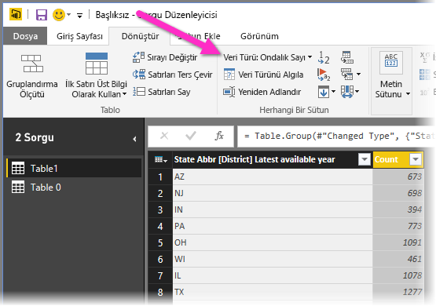

# Power BI Desktop ile çalışmaya başlama
Power BI Desktop'la çalışmaya başlama kılavuzuna hoş geldiniz. Bu turda Power BI Desktop'ın nasıl çalıştığı, neler yapabileceği ve iş zekanızı artırmak için nasıl güçlü veri modelleri ve büyüleyici raporlar oluşturulabileceği gösterilir.

Power BI Desktop'ın nasıl çalıştığına ve nasıl kullanılacağına hızlı bir genel bakış için, yalnızca birkaç dakika içinde bu kılavuzdaki ekranları tarayabilirsiniz. Daha iyi anlamak için her bölümü okuyabilir, adımları uygulayabilir ve kendi Power BI Desktop dosyanızı oluşturup bunu [Power BI hizmetine](https://app.powerbi.com/) gönderebilir ve başkalarıyla paylaşabilirsiniz.

Ayrıca [Power BI Desktop ile Çalışmaya Başlama](https://www.youtube.com/watch?v=Qgam9M8I0xA) videosunu izleyebilir ve videoyla birlikte takip etmek üzere [Finansal Örnek](https://go.microsoft.com/fwlink/?LinkID=521962) adlı Excel çalışma kitabını indirebilirsiniz.

## Power BI Desktop nasıl çalışır?
Power BI Desktop ile şunları yapabilirsiniz:
1. Birden çok veri kaynağı da dahil olmak üzere verilere bağlanma.
1. Bilgilendirici, cazip veri modelleri oluşturan sorgularla verileri şekillendirme.
1. Görselleştirmeleri ve raporları oluşturmak için veri modellerini kullanma. 
1. Başkalarının yararlanması, temel alması ve paylaşması için raporlarınızı paylaşma. Power BI Desktop *.pbix* dosyalarını aynı diğer dosyalar gibi paylaşabilirsiniz ama en cazip yöntem bu dosyaları [Power BI hizmetine](https://preview.powerbi.com/) yüklemektir. 

Power BI Desktop başarısı kanıtlanmış Microsoft sorgu altyapısını, veri modellemesini ve görselleştirme teknolojilerini tümleştirir. Veri analistleri ve diğer kullanıcılar sorgu, veri bağlantısı, model ve rapor koleksiyonları oluşturabilir ve bunları başkalarıyla kolayca paylaşabilir. Power BI Desktop ile Power BI hizmetinin bileşimi sayesinde, veri dünyasından alınan yeni içgörülerin modellenmesi, oluşturulması, paylaşılması ve genişletilmesi kolaylaşır.

Power BI Desktop, normalde dağınık, kopuk ve zahmetli bir işlem olan iş zekası depolarını ve raporlarını tasarlama ve oluşturma işlemini merkezileştirir, sadeleştirir ve kolaylaştırır.
Denemeye hazır mısınız? Haydi başlayalım.

> [!NOTE]
> Şirket içinde kalması gereken veriler ve raporlama için Power BI'ın [Power BI Rapor Sunucusu](report-server/get-started.md) adlı ayrı ve özel bir sürümü vardır. Power BI Rapor Sunucusu, Power BI Desktop'ın yalnızca Rapor Sunucusu sürümüyle çalışan ve Power BI Rapor Sunucusu için Power BI Desktop adlı ayrı ve özel bir sürümünü kullanır. Bu makalede standart Power BI Desktop ile ilgili açıklamalara yer verilmiştir.

## Power BI Desktop'ı yükleme ve çalıştırma
Power BI Desktop'ı indirmek için [Power BI Desktop indirme sayfasına](https://powerbi.microsoft.com/desktop) gidin ve **Ücretsiz İndirin**'i seçin. İndirme seçenekleri için [İndirme ve dil seçeneklerine bakın](https://www.microsoft.com/download/details.aspx?id=58494) bağlantısını da seçebilirsiniz. 

Power BI Desktop uygulamasını Power BI hizmetinden de indirebilirsiniz. Üst menü çubuğunda **İndir** simgesini seçin ve ardından **Power BI Desktop**'ı seçin.

Microsoft Store sayfasında **Al**'ı seçin ve yönergeleri izleyerek bilgisayarınıza Power BI Desktop'ı yükleyin. Windows **Başlat** menüsünden veya Windows görev çubuğundaki simgeden Power BI Desktop'ı başlatın.

Power BI Desktop ilk kez başlatıldığında **Hoş Geldiniz** ekranını görüntüler.

**Hoş Geldiniz** ekranında **Verileri alabilir**, **Son kaynaklara** bakabilir, son raporları açabilir, **Diğer raporları açabilir** veya diğer bağlantıları seçebilirsiniz. Ayrıca başlangıçta her zaman **Hoş Geldiniz** ekranının gösterilip gösterilmeyeceğini de seçebilirsiniz. **Hoş Geldiniz** ekranını kapatmak için kapat simgesini seçin.

Power BI Desktop'ın sol tarafında üç Power BI Desktop görünümünün simgeleri vardır: yukarıdan aşağıya **Rapor**, **Veri** ve **İlişkiler**. Geçerli görünüm sol taraftaki sarı çubukla gösterilir ve simgelerden herhangi birini seçerek görünümleri değiştirebilirsiniz. 

Varsayılan görünüm **Rapor** görünümüdür. 

Power BI Desktop, ayrı pencerede açılan **Power Query Düzenleyicisi**'ni de içerir. **Power Query Düzenleyicisi**'nde sorgular oluşturup verileri dönüştürebilir, ardından daraltılmış veri modelini Power BI Desktop'a yükleyerek raporlar oluşturabilirsiniz.

## Verilere bağlanma
Power BI Desktop yüklendikten sonra, durmadan büyüyen veri dünyasına bağlanmaya hazırsınız. Kullanılabilir birçok veri kaynağı türünü görmek için Power BI Desktop **Giriş** sekmesinde **Veri Al** > **Diğer**'i seçin ve **Veri Al** penceresindeki **Tüm** veri kaynakları listesinde gezinin. Bu hızlı turda birkaç farklı **Web** veri kaynağına bağlanırsınız.

Güneş gözlüğü satan bir perakendeci için veri analisti olarak çalıştığınızı düşünün. Müşterinizin güneş gözlüğü satışlarını en çok güneş alan yerlere hedeflemesine yardımcı olmak istiyorsunuz. Bankrate.com [Best and worst states for retirement](https://www.bankrate.com/retirement/best-and-worst-states-for-retirement/) (Emeklilik için en iyi ve en kötü eyaletler) sayfasında bu konuyla ilgili ilginç veriler bulunur.

Bir web veri kaynağına bağlanmak için Power BI Desktop **Giriş** sekmesinde **Veri Al** > **Web**'i seçin. 

**Web'den** iletişim kutusunda *https:\//www.bankrate.com/retirement/best-and-worst-states-for-retirement/* adresini **URL** alanına yapıştırın ve **Tamam**'ı seçin. 

İstenirse, anonim erişimi kullanmak için **Web İçeriğine Eriş** ekranında **Bağlan**'ı seçin. 

Power BI Desktop'ın sorgu işlevselliği çalışmaya başlar ve web kaynağıyla iletişim kurar. **Gezgin** penceresi web sayfasında bulduğunu döndürür; bu örnekte **Ranking of best and worst states for retirement** adlı tablo ve bir belge döndürülür. Tabloyla ilgileniyorsunuz, bu nedenle önizlemeyi görmek için bunu seçin.

Bu noktada **Yükle**'yi seçerek tabloyu yükleyebilir veya **Veri dönüştürme**'yi seçerek yüklemeden önce tabloda değişiklikler yapabilirsiniz.

**Veri dönüştürme**'yi seçtiğinizde tablonun temsili bir görünümüyle Power Query Düzenleyicisi başlatılır. **Sorgu Ayarları** bölmesi sağ taraftadır veya istediğiniz zaman Power Query Düzenleyicisi'nin **Görünüm** sekmesinde **Sorgu Ayarları**'nı seçerek bu bölmeyi gösterebilirsiniz. 

Verilere bağlanma hakkında daha fazla bilgi için bkz. [Power BI Desktop'taki verilere bağlanma](desktop-connect-to-data.md).

## Verileri şekillendirme
Veri kaynağına bağlandığınıza göre, verileri ihtiyaçlarımızı karşılayacak şekilde ayarlayabilirsiniz. Verileri *şekillendirmek* için Power Query Düzenleyicisi'ne verileri yüklerken ve gösterirken ayarlamaya yönelik adım adım yönergeler sağlarsınız. Şekillendirme özgün veri kaynağını etkilemez yalnızca verilerin bu özel görünümünü etkiler. 

> [!NOTE]
> Bu kılavuzda kullanılan tablo verileri zamanla değişebilir. Bu nedenle, izlemeniz gereken adımlar farklı olabilir; adımları ve sonuçları keşfederken yaratıcılığınıza başvurmanızı gerektirebilir. Bu, öğrenmenin eğlenceli kısmıdır. 

Şekillendirme verileri *dönüştürme*, örneğin sütun veya tabloları yeniden adlandırma, satır veya sütunları kaldırma veya veri türlerini değiştirme anlamına gelebilir. Power Query Düzenleyicisi **Sorgu Ayarları** bölmesindeki **Uygulanan Adımlar**'ın altında bu adımları sıralı olarak yakalar. Bu sorgu veri kaynağına her bağlandığında, verilerin her zaman belirttiğiniz gibi şekillendirilmesi için o adımlar uygulanır. Sorguyu Power BI Desktop'ta kullandığınızda veya herhangi bir kullanıcı paylaştığınız sorguyu kullandığında (örneğin, Power BI hizmetinde) bu işlem gerçekleştirilir. 

**Sorgu Ayarları**'ndaki **Uygulanan Adımlar**'da zaten birkaç adım bulunduğuna dikkat edin. Etkisini görmek için Power Query Düzenleyicisi'nde her adımı seçebilirsiniz. İlk olarak bir web kaynağı belirttiniz ve ardından **Gezgin** penceresinde tablonun önizlemesine baktınız. Üçüncü adım olan **Değiştirilen tür** adımında Power BI dışarı aktarırken tamsayı verilerini tanıdı ve özgün web **Metin** *veri türünü* otomatik **Tamsayı**'ya dönüştürdü. 

Veri türünü değiştirmeniz gerekiyorsa değiştirilecek sütunu veya sütunları seçin. Birkaç bitişik sütunu seçmek için **Shift** tuşunu veya bitişik olmayan birkaç sütunu seçmek için **Ctrl** tuşunu basılı tutun. Sütun başlığına sağ tıklayın, **Türü Değiştir**'i seçin ve ardından menüden yeni bir veri türü seçin veya **Giriş** sekmesinin **Dönüştür** grubunda yer alan **Veri Türü**'nün yanındaki listeyi açın ve yeni bir veri türü seçin.

> [!NOTE]
> Power BI Desktop'ta Power Query Düzenleyicisi, kullanılabilir görevler için şeridi veya sağ tıklama menülerini kullanır. Şeridin **Giriş** veya **Dönüştür** sekmesinde seçebileceğiniz görevlerin çoğu bir öğeye sağ tıklayıp görüntülenen menüden seçerek de kullanılabilir.

Şimdi verilere kendi değişikliklerinizi ve dönüştürmelerinizi uygulayabilir ve bunları **Uygulanan Adımlar**'da görebilirsiniz. 

Örneğin, güneş gözlüğü satışlarında en fazla hava durumu sınıflandırmasıyla ilgilendiğiniz için tabloyu **Overall rank** (Genel sınıflandırma) sütunu yerine **Weather** (Hava durumu) sütununa göre sıralamaya karar verdiniz. **Weather** başlığının yanındaki oka tıklayarak listeyi açın ve **Artan düzende sırala**'yı seçin. Şimdi veriler hava durumu sınıflandırmasına göre sıralanmış olarak gösterilir ve **Uygulanan Adımlar**'da **Sıralanan Satırlar** adımı gösterilir. 

Hava durumunun en kötü olduğu eyaletlerde güneş gözlüğü satışlarıyla pek ilgilenmiyorsunuz, bu nedenle bunları tablodan kaldırmaya karar verdiniz. **Giriş** sekmesinin **Satırları Azalt** grubunda **Satırları Kaldır** > **Alt Satırları Kaldır**'ı seçin. **Alt Satırları Kaldır** iletişim kutusunda *10* girin ve ardından **Tamam**'ı seçin. 

En kötü 10 hava durumu satırı tablodan kaldırılır ve **Uygulanan Adımlar**'da **Alt Satırlar Kaldırıldı** adımı gösterilir.

Tabloda ihtiyacınız olandan daha fazla bilgi bulunduğuna ve **Affordability**, **Crime**, **Culture** ve **Wellness** sütunlarını kaldırmak istediğinize karar verdiniz. Kaldırmak istediğiniz her sütunun başlığını seçin. Birkaç bitişik sütunu seçmek için **Shift** tuşunu veya bitişik olmayan birkaç sütunu seçmek için **Ctrl** tuşunu basılı tutun. 

Ardından **Giriş** sekmesinin **Sütunları Yönet** grubunda **Sütunları Kaldır**'ı seçin. Ayrıca sütun başlıklarından birine sağ tıklayıp menüden **Sütunları Kaldır**'ı da seçebilirsiniz. Seçilen sütunlar kaldırılır ve **Uygulanan Adımlar**'da **Kaldırılan Sütunlar** adımı görüntülenir.

Bir kez daha düşünüldüğünde **Affordability** (Uygun Fiyat) güneş gözlüğü satışlarına uygun olabilir. Bu sütunu geri almak istiyorsunuz. **Uygulanan Adımlar** bölmesinin son adımını, adımın yanındaki **X** silme simgesini seçerek kolayca geri alabilirsiniz. Şimdi yalnızca silmek istediğiniz sütunları seçerek adımı yineleyebilirsiniz. Daha fazla esneklik elde etmek için her sütunu ayrı bir adımda silebilirsiniz. 

**Uygulanan Adımlar** bölmesindeki herhangi bir adıma sağ tıklayabilir ve adımı silmeyi, yeniden adlandırmayı, sırada yukarı veya aşağı taşımayı ya da onu izleyen adımları eklemeyi veya silmeyi seçebilirsiniz. Ara adımlar için, bir değişikliğin sonraki adımları etkileyebileceği ve sorgunuzu kesebileceği durumlarda Power BI Desktop sizi uyarır.  

Örneğin artık tabloyu **Weather** (Hava Durumu) değerine göre sıralamak istemeseydiniz **Sıralanan Satırlar** adımını silebilirdiniz. Power BI Desktop bu adımı silmenin sorgunuzun kesilmesine neden olabileceği konusunda sizi uyarır. Hava durumuna göre sıraladıktan sonra en alttaki 10 satırı kaldırdınız; dolayısıyla sıralamayı kaldırırsanız farklı satırlar kaldırılır. **Sıralanan Satırlar** adımını seçmeniz ve bu noktaya yeni bir ara adım eklemek istemeniz durumunda da uyarı alırsınız.  

Son olarak emeklilikle ilgili olan tablo başlığını güneş gözlüğü satışlarıyla ilgili bir başlıkla değiştirirsiniz. **Sorgu Ayarları** bölmesindeki **Özellikler**'in altında eski başlığı *Best states for sunglass sales* (Güneş gözlüğü satışları için en iyi eyaletler) başlığıyla değiştirin.

Şekillendirilmiş verileriniz için tamamlanan sorgu aşağıdakine benzer:

Verileri şekillendirme hakkında daha fazla bilgi için bkz. [Power BI Desktop'ta verileri şekillendirme ve birleştirme](desktop-shape-and-combine-data.md).

## Verileri birleştirme
Eyaletlerin çeşitli durumları hakkındaki veriler ilgi çekicidir ve ek çözümleme çalışmaları ile sorgular oluşturmak için faydalı olacaktır. Ancak, bu noktada bir sorun var: Gösterilen verilerin çoğunda eyalet kodları için eyaletlerin tam adları yerine iki harfli kısaltmalar kullanılmıştır. Bu verileri kullanmak için, eyalet adlarınızı kısaltmalarıyla ilişkilendirecek bir yönteme ihtiyacımız vardır.

Şanslısınız. Başka bir genel veri kaynağı tam olarak bunu yapar ama verileri güneş gözlüğü tablonuzla *birleştirebilmeniz* için önce bunları belirli bir miktarda şekillendirmeniz gerekir.

Eyalet kısaltması verilerini Power Query Düzenleyicisi'nde içeri aktarmak için şeritteki **Giriş** sekmesinin **Yeni Sorgu** grubunda **Yeni Kaynak** > **Web**'i seçin. 

**Web'den** iletişim kutusunda eyalet kısaltmaları sitesinin URL'sini girin: *https:\//en.wikipedia.org/wiki/List_of_U.S._state_abbreviations*.

**Gezgin** penceresinde **Codes and abbreviations for U.S. states, federal district, territories, and other regions** tablosunu ve ardından **Tamam**'ı seçin. Tablo Power Query Düzenleyicisi'nde açılır.

**Name and status of region**, **Name and status of region2** ve **ANSI** dışındaki tüm sütunları kaldırın. Yalnızca bu sütunları alıkoymak için **Ctrl** tuşunu basılı tutarak sütunları seçin. Ardından sütun başlıklarından birine sağ tıklayın ve **Diğer Sütunları Kaldır**'ı seçin veya **Giriş** sekmesinin **Sütunları Yönet** grubunda **Diğer Sütunları Kaldır**'ı seçin. 

**Name and status of region2** sütun başlığının yanındaki aşağı açılan oka tıklayın ve **Filtreler** > **Eşittir**'i seçin. **Satırları Filtrele** iletişim kutusunda **eşittir**'in yanındaki **Bir değer girin veya seçin** listesini açın ve **State**'i seçin. 

**Veya**'yı seçin ve ikinci **eşittir** alanının yanındaki **State ("Commonwealth")** öğesini seçin. **Tamam**’ı seçin. 

**Federal district** ve **island** gibi fazladan değerler kaldırıldığından artık 50 eyaletten ve onların iki harfli kısaltmalarından oluşan bir listeniz vardır. Sütun başlıklarına sağ tıklayıp **Yeniden Adlandır**'ı seçerek sütunları daha anlamlı olacak şekilde, örneğin **State name** (Eyalet adı), **Status** (Durum) ve **Abbreviation** (Kısaltma) gibi yeniden adlandırabilirsiniz.

Tüm adımların **Sorgu Ayarları** bölmesindeki **Uygulanan Adımlar**'ın altına kaydedildiğine dikkat edin.

Şekillendirilmiş tablonuz şimdi şöyle görünür:

*Sorgu Ayarları*'nın **Özellikler** alanında tabloyu **State codes** (Eyalet kodları) olarak yeniden adlandırın. 

**State codes** tablosu şekillendirildiğinde bu iki tabloyu tek tabloda *birleştirebilirsiniz*. Şu anda sahip olduğunuz tablolar verilere uyguladığınız sorguların sonucu olduğundan, bunlar *sorgular* olarak da adlandırılır. Sorguları birleştirmenin iki temel yolu vardır: *birleştirme* ve *ekleme*. 

Bir veya daha fazla sütunu başka bir sorguya eklemek istediğinizde sorguları *birleştirirsiniz*. Var olan bir sorguya eklemek istediğiniz ek veri satırları olduğunda sorguyu *eklersiniz*.

Bu örnekte *States codes* sorgusunu **Best states for sunglasses** sorgusuyla **birleştirmek** istiyorsunuz. Sorguları birleştirmek için Power Query Düzenleyicisi'nin sol tarafındaki **Sorgular** bölmesinde **Best states for sunglasses** sorgusunu seçerek bu sorguya geçin. Ardından şeritte **Giriş** sekmesinin **Birleştir** grubundaki **Sorguları Birleştir**'i seçin.

**Birleştir** penceresinde alan listesini açarak kullanılabilir diğer sorgulardan **State codes** (Eyalet kodları) öğesini seçin. Her tablodan eşleştirilecek sütunu seçin; bu örnekte **Best states for sunglasses** sorgusundan **State** ve **State codes** sorgusundan **State name** sütunlarıdır. 

**Gizlilik düzeyleri** iletişim kutusunu alırsanız **Bu dosya için gizlilik düzeyleri denetimlerini yoksayın** seçeneğini belirtin ve **Kaydet**'i seçin. **Tamam**’ı seçin. 

**Best states for sunglass sales** tablosunun sağ tarafında **State codes** adlı yeni bir sütun görüntülenir. Güneş gözlüğü satış sorgusuna yönelik en iyi eyaletlerle birleştirdiğiniz eyalet kodu sorgusunu içerir. Birleştirilmiş tablodaki sütunların tümü **State codes** sütununda toplanır. Birleştirilmiş tabloyu *genişletebilir* ve yalnızca istediğiniz sütunları ekleyebilirsiniz. 

Birleştirilen tabloyu genişletmek ve hangi sütunların ekleneceğini belirlemek için sütun başlığındaki **Genişlet** simgesini seçin. **Genişlet** iletişim kutusunda yalnızca **Abbreviation** sütununu seçin. **Ön ek olarak orijinal sütun adını kullan**'ın seçimini kaldırın ve ardından **Tamam**'ı seçin. 

> [!NOTE]
> **State codes** tablosunun nasıl görüntüleneceği konusunda denemeler yapabilirsiniz. Bazı denemeler yapın ve sonuçları beğenmezseniz **Sorgu Düzenleyicisi** bölmesindeki **Uygulanan Adımlar**'dan bu adımı silmeniz yeterlidir. Bu işlem, genişletme işlemi istediğiniz gibi görünene dek dilediğiniz kadar tekrarlayabileceğiniz bir serbest tekrarlamadır.

Şekillendirme ve birleştirme veri adımlarının daha ayrıntılı açıklaması için bkz. [Power BI Desktop'ta verileri şekillendirme ve birleştirme](desktop-shape-and-combine-data.md).

Her biri ihtiyaçlarımıza göre şekillendirilmiş iki veri kaynağının birleştirildiği tek bir sorgu tablosu elde etmiş oldunuz. Bu sorgu, eyaletlerdeki demografik bilgiler, sağlık düzeyleri veya eğlence fırsatları gibi ilgi çekici diğer birçok veri bağlantısı için temel oluşturabilir.

Şimdilik Power BI Desktop'ta birkaç ilgi çekici rapor hazırlamaya yetecek veriniz vardır. Bu bir kilometre taşı olduğundan, değişiklikleri **Power Query Düzenleyicisi**'nde uygulayın ve şeridin **Giriş** sekmesindeki **Kapat ve Uygula**'yı seçerek bunları Power BI Desktop'a yükleyin. Power BI Desktop'ta çalışırken sorguyu Power Query Düzenleyicisi'nde açık tutmak için yalnızca **Uygula**'yı da seçebilirsiniz. 

Tablo Power BI Desktop'a yüklendikten sonra tabloda başka değişiklikler yapabilir ve yaptığınız değişikliklerin uygulanması için modeli yeniden yükleyebilirsiniz. Power BI Desktop'ta **Power Query Düzenleyicisi**'ni yeniden açmak için Power BI Desktop şeridindeki **Giriş** sekmesinde **Sorguları Düzenle**'yi seçin. 

## Rapor oluşturma
Power BI Desktop **Rapor** görünümünde görselleştirmeler ve raporlar oluşturabilirsiniz. **Rapor** görünümünün altı ana alanı vardır:

1. Raporlar ve görselleştirmelerle ilişkili sık kullanılan görevleri görüntüleyen üstteki şerit.
2. Görselleştirmelerin oluşturulduğu ve düzenlendiği ortadaki tuval alanı
3. Rapor sayfası seçmenize veya eklemenize olanak sağlayan, alt taraftaki sayfalar sekmesi
4. Veri görselleştirmelerini filtreleyebildiğiniz **Filtreler** bölmesi.
5. Görselleştirme ekleme, değiştirme veya özelleştirme işlemleri yapabildiğiniz ve detaylandırma uygulayabildiğiniz **Görselleştirmeler** bölmesi.
6. Sorgularınızdaki kullanılabilir alanları gösteren **Alanlar** bölmesi. Görselleştirmeleri oluşturmak veya değiştirmek için bu alanları tuvale, **Filtreler** bölmesine veya **Görselleştirmeler** bölmesine sürükleyebilirsiniz.

Bölmelerin üst kısmındaki okları seçerek **Filtreler**, **Görselleştirmeler** ve **Alanlar** bölmelerini genişletebilir ve daraltabilirsiniz. Bölmelerin daraltılması, tuvalde güzel görselleştirmeler oluşturmak için daha fazla alan sağlar. 

Basit bir görselleştirme oluşturmak için alan listesinden herhangi bir alanı seçin veya bu alanı **Alanlar** listesinden tuvale sürükleyin. Örneğin **Best states for sunglass sales** içindeki **State** alanını tuvale sürükleyin ve neler olduğuna bakın.

Şuna bir bakın! Power BI Desktop, **State** alanında coğrafi konum verilerinin bulunduğunu ve otomatik olarak harita tabanlı bir görselleştirme oluşturulduğunu belirledi. Görselleştirme veri modelinizdeki 40 eyaletin veri noktalarını gösteriyor. 

**Görselleştirmeler** bölmesinde görselleştirme hakkında bilgiler gösterilir ve bunu değiştirmenize olanak tanınır. 

1. Simgeler, oluşturulan görselleştirmenin türünü gösterir. Farklı bir simge seçerek seçilen görselleştirmenin türünü değiştirebilir veya şu anda seçili görselleştirmenin olmadığı bir simge seçerek yeni görselleştirme oluşturabilirsiniz. 
2. **Görselleştirme** bölmesinin **Alanlar** seçeneği bölmede veri alanlarını **Gösterge**'ye ve diğer alan kutularına sürüklemenizi sağlar. 
3. **Biçim** seçeneği görselleştirmelere biçimlendirme ve başka denetimler uygulamanıza olanak tanır. 

**Alanlar** ve **Biçim** bölümlerinde sağlanan seçenekler görselleştirmenin türüne ve sahip olduğunuz verilere bağlıdır.

Harita görselleştirmenizin yalnızca ilk 10 hava durumuna sahip eyaletleri göstermesini istiyorsunuz. Yalnızca ilk 10 eyaleti göstermek için **Filtreler** bölmesinde **State is (All)** öğesinin üzerine gelin ve görüntülenen oku genişletin. **Filtre türü**'nün altındaki listeyi açın ve **İlk N**'yi seçin. **Öğeleri göster**'in altında **Alt**'ı seçin çünkü en düşük sayısal dereceye sahip öğelerin gösterilmesini istiyorsunuz ve sonraki alana *10* girin.

**Weather** alanını **Alanlar** bölmesinden **Değere göre** alanına sürükleyin ve ardından **Filtre uygula**'yı seçin. 

Şimdi harita görselleştirmesinde yalnızca ilk 10 hava durumuna sahip eyaletleri görürsünüz. 

**Görselleştirme** bölmesinde **Biçim** simgesini seçerek, **Başlık**'ı seçerek ve *Başlık metni*'nin altına **Top 10 weather states** yazarak görselleştirmenizin başlığını değiştirin. 

İlk 10 hava durumuna sahip eyaletlerin ve bunların 1 ile 10 arasında derecesinin gösterildiği görselleştirmeyi eklemek için tuvalin boş bir alanını seçin ve sonra da **Görselleştirme** bölmesinde **Sütun grafiği** simgesini seçin. **Alanlar** bölmesinde **State** ve **Weather** seçin. Sütun grafiğinde sorgunuzdaki 40 eyalet, en yüksek sayısal dereceden en düşüğe veya en kötü hava durumundan en iyi hava durumuna doğru derecelendirilmiş olarak gösterilir. 

Derecelendirmenin sırasını önce 1 gösterilecek şekilde değiştirmek için, görselleştirmenin sağ üst kısmındaki **Diğer seçenekler** üç noktasını seçin ve menüden **Artan düzende sırala**'yı seçin. 

Tabloyu ilk 10 eyaletle sınırlandırmak için harita görselleştirmesinde uyguladığınız alt 10 filtresinin aynısını uygulayın. 

Harita görselleştirmesinde yaptığınız gibi görselleştirmenin başlığını değiştirin. Ayrıca **Görselleştirme** bölmesinin **Biçim** bölümünde **Weather** olan **Y ekseni** > **Eksen başlığı** değerini daha anlaşılır olması için *Weather ranking* olarak değiştirin. Ardından **Y ekseni** seçicisini **Kapalı** olarak ayarlayın ve **Veri etiketleri** değerini **Açık** olarak ayarlayın. 

Şimdi ilk 10 hava durumuna sahip eyalet derecelendirme sırasıyla ve sayısal derecelendirmeleriyle gösterilir. 

**Affordability** ve **Overall ranking** alanları için benzer veya farklı görselleştirmeler yapabilir veya birkaç alanı tek görselleştirmede birleştirebilirsiniz. Çeşitli ilgi çekici raporlar ve görselleştirmeler oluşturabilirsiniz. Bu **Tablo** ve **Çizgi ve kümelenmiş sütun grafiği** görselleştirmelerinde ilk 10 hava durumuna sahip eyaletler, bunların uygun fiyat ve genel derecelendirmeleriyle birlikte gösterilir:

Farklı görselleştirmeleri farklı rapor sayfalarında gösterebilirsiniz. Yeni sayfa eklemek için sayfalar çubuğunda bulunan mevcut sayfaların yanındaki **+** simgesini seçin veya şeridin **Giriş** sekmesinde **Ekle** > **Yeni Sayfa**'yı seçin. Sayfayı yeniden adlandırmak için sayfalar çubuğunda sayfa adına çift tıklayın veya sağ tıklayın ve **Sayfayı Yeniden Adlandır**'ı seçin ve yeni adı yazın. Raporun farklı bir sayfasına gitmek için, sayfalar çubuğunda sayfayı seçin. 

**Giriş** sekmesinin **Ekle** grubunda rapor sayfalarınıza metin kutuları, resimler ve düğmeler ekleyebilirsiniz. Görselleştirmelerin biçimlendirme seçeneklerini ayarlamak için, görselleştirmeyi seçin ve sonra da **Görselleştirmeler** bölmesinde **Biçim** simgesini seçin. Sayfa boyutlarını, arka planları ve diğer sayfa bilgilerini yapılandırmak için, görselleştirme seçmeden **Biçim** simgesini seçin.

Sayfalarınızı ve görselleştirmelerinizi oluşturmayı bitirdiğinizde **Dosya** > **Kaydet**'i seçin ve raporunuzu kaydedin. 

Raporlar hakkında daha fazla bilgi için bkz. [Power BI Desktop'taki Rapor Görünümü](desktop-report-view.md).

## Çalışmanızı paylaşma
Artık Power BI Desktop raporunuz olduğuna göre bu raporu diğer kişilerle paylaşabilirsiniz. Çalışmanızı paylaşmanın birkaç yolu var. Raporun *.pbix* dosyasını diğer herhangi bir dosya gibi dağıtabilir, *.pbix* dosyasını Power BI hizmetinden karşıya yükleyebilir veya doğrudan Power BI Desktop'tan Power BI hizmetine yayımlayabilirsiniz. Raporları Power BI hizmetine yayımlayabilmek veya karşıya yükleyebilmek için Power BI hesabınız olmalıdır. 

Power BI Desktop'tan **Power BI** hizmetine yayımlamak için, şeridin **Giriş** sekmesinde **Yayımla**'yı seçin.

Power BI'da oturum açmanız veya hedef seçmeniz istenebilir.

Yayımlama işlemi tamamlandıktan sonra aşağıdaki iletişim kutusuyla karşılaşırsınız.

Raporu Power BI'da açma bağlantısını seçtiğinizde, raporunuz Power BI sitenizde **Çalışma alanım** > **Raporlar**'ın altında açılır. 

Çalışmanızı paylaşmanın başka bir yolu da **Power BI** hizmetinin içinden yüklemektir. Power BI'ı tarayıcıda açmak için *https:\//app.powerbi.com* adresine gidin. Power BI **Giriş** sayfanızın sol alt kısmındaki **Veri al**'ı seçerek Power BI Desktop raporunuzu yükleme işlemini başlatın.

Sonraki sayfada **Dosyalar** bölümünden **Al**'ı seçin.

Sonraki sayfada **Yerel Dosya**'yı seçin. Power BI Desktop *.pbix* dosyanıza göz atın, bu dosyayı seçin ve sonra da **Aç**'ı seçin. 

Dosya içeri aktarıldıktan sonra dosyanın Power BI hizmetinin sol bölmesindeki **Çalışma alanım** > **Raporlar**'ın altında listelendiğini görebilirsiniz.

Dosyayı seçtiğinizde raporun ilk sayfası görüntülenir. Raporun sol tarafındaki sekmelerden farklı sayfalar seçebilirsiniz. 

Rapor tuvalinin üst kısmındaki **Diğer seçenekler** > **Düzenle**'yi seçerek **Power BI** hizmetindeki bir raporda değişiklik yapabilirsiniz. Değişikliklerinizi kaydetmek için **Kopyasını kaydet**’i seçin.

**Power BI** hizmetinde raporunuzu kullanarak birçok ilgi çekici görsel oluşturabilir ve bu görselleri *panolara* sabitleyebilirsiniz. **Power BI** hizmetindeki panolar hakkında daha fazla bilgi için bkz. [Harika bir pano oluşturmaya yönelik ipuçları](service-dashboards-design-tips.md). Pano oluşturma, paylaşma ve değiştirme hakkında daha fazla bilgi için bkz. [Bir panoyu paylaşma](service-share-dashboards.md).

Rapor veya panoyu paylaşmak için, açık rapor veya pano sayfasının üst kısmında **Paylaş**'ı seçin ya da **Çalışma alanım** > **Raporlar** veya **Çalışma alanım** > **Panolar** listelerinde rapor veya pano adının yanındaki **Paylaş** simgesini seçin.

Raporunuzu veya panonuzu başkalarıyla paylaşmak üzere e-posta göndermek veya bağlantı almak için **Raporu paylaş** veya **Panoyu paylaş** ekranını tamamlayın. 

Power BI Desktop'ı ve Power BI hizmetini kullanarak verilerle ilgili birçok ilgi çekici derleme ve görselleştirme oluşturabilirsiniz. 

## Sonraki adımlar
Power BI Desktop bir tanılama bağlantı noktasına bağlanmayı destekler. Tanılama bağlantı noktası, diğer araçların tanılama amacıyla bağlanmasına ve izleme gerçekleştirmesine imkan tanır. Tanılama bağlantı noktası kullanılırken *modelde herhangi bir değişiklik yapılması desteklenmez. Modelde değişiklik yapılması bozulmaya veya veri kaybına yol açabilir.*

Power BI Desktop'ın çok çeşitli özellikleri hakkında daha fazla bilgi için aşağıdaki kaynakları gözden geçirin:

* [Power BI Desktop'ta sorgulara genel bakış](desktop-query-overview.md)
* [Power BI Desktop'ta veri kaynakları](desktop-data-sources.md)
* [Power BI Desktop'ta verilere bağlanma](desktop-connect-to-data.md)
* [Öğretici: Power BI Desktop'ta verileri şekillendirme ve birleştirme](desktop-shape-and-combine-data.md)
* [Power BI Desktop'taki genel sorgu görevleri](desktop-common-query-tasks.md)   