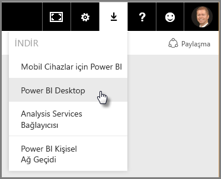
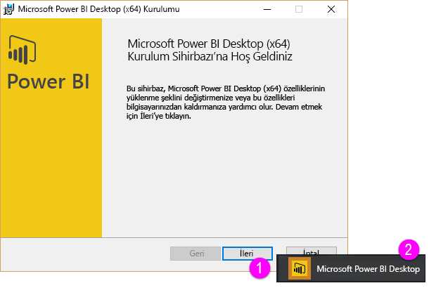
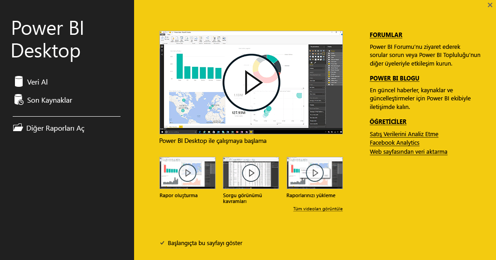
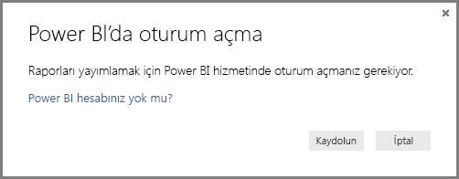

# Power BI Desktop ile çalışmaya başlama
**Power BI Desktop ile Çalışmaya Başlama Kılavuzu**'na hoş geldiniz. Bu kısa Power BI Desktop turu, uygulamanın nasıl çalıştığını size tanıtan, neler yapabileceğini gösteren ve mükemmel raporların yanı sıra, iş zekası girişimlerinizi güçlendiren etkili veri modellerini daha hızlı şekilde oluşturabilmenizi sağlar. 

Okumak yerine izlemeyi mi tercih ediyorsunuz? [Çalışmaya başlama konulu videomuza göz atın](desktop-videos.md). Videoyu izlerken aynı örnek verileri kullanarak birlikte ilerlemek isterseniz [bu örnek Excel çalışma kitabını indirebilirsiniz](http://go.microsoft.com/fwlink/?LinkID=521962).

Power BI Desktop, başkalarıyla kolaylıkla paylaşılabilen bir dizi sorgu, veri bağlantısı ve rapor oluşturmanıza olanak sağlar. Power BI Desktop başarısı kanıtlanmış Microsoft teknolojilerini (güçlü Sorgu altyapısı, veri modelleme ve görselleştirmeler) bir araya getirir ve çevrimiçi [**Power BI hizmeti**](https://app.powerbi.com/) ile sorunsuz bir şekilde çalışır.

Çözümleyicilerin ve diğer kullanıcıların güçlü veri bağlantıları, modeller ve raporlar oluşturmak için kullanabileceği **Power BI Desktop** ile kullanıcıların görüntüleyip etkileşime geçebilmesi için Power BI Desktop raporlarının paylaşılabildiği [**Power BI hizmetinin**](https://preview.powerbi.com/) birleşimi sayesinde veri dünyasına ait yeni öngörüleri modellemek, oluşturmak, paylaşmak ve genişletmek daha kolaydır.

Veri çözümleyicileri veri dünyasına bağlanma ve bu dünyayı şekillendirme, güçlü modeller oluşturma ve iyi yapılandırılmış raporlar hazırlama açısından Power BI Desktop'ın güçlü, esnek ve son derece erişilebilir bir araç olduğunu fark edecektir.

## Bu kılavuz nasıl kullanılır?
Bu kılavuzu birkaç farklı şekilde kullanabilirsiniz: Hızlı bir genel bakış için tarayabilir veya Power BI Desktop'ın nasıl çalıştığını daha iyi anlamak için her bölümü okuyabilirsiniz.

Aceleniz varsa bu kılavuzu yalnızca birkaç dakika içinde tarayabilir ve Power BI Desktop'ın nasıl çalıştığı ve nasıl kullanıldığı hakkında yeterli düzeyde fikir edinebilirsiniz. Bu kılavuzun büyük kısmı, Power BI Desktop'ın nasıl çalıştığını görsellerle gösteren ekranlardan oluşur.

Daha iyi anlamak için her bölümü okuyabilir, adımları uygulayabilir ve kendi Power BI Desktop dosyanızı edinip bunu **Power BI** hizmetine gönderebilir ve başkalarıyla paylaşabilirsiniz.

>[!NOTE]
>**Power BI**'ın [**Power BI Rapor Sunucusu**](report-server/get-started.md) adlı ayrı, özel bir sürümü de mevcuttur. Bu sürüm, veri ve raporlarının şirket içinde kalmasını isteyen müşterilere yöneliktir. **Power BI Desktop**'ın da bu özel sürüm ile kullanıma yönelik **Power BI Rapor Sunucusu için Power BI Desktop** adlı ayrı, özel bir sürümü mevcuttur. Bu sürüm yalnızca, Power BI'ın Rapor Sunucusu sürümü ile kullanılabilir. Bu makalede standart **Power BI Desktop** ile ilgili açıklamalara yer verilmiştir.

## Power BI Desktop nasıl çalışır?
Power BI Desktop ile *verilere bağlanabilir* (genellikle birden çok veri kaynağına), *bu verileri şekillendirebilir* (öngörü sunan, ilgi çekici veri modelleri oluşturan sorgularla) ve bu modeli kullanarak *raporlar oluşturabilirsiniz* (başkaları da bu raporları kullanabilir, geliştirebilir ve paylaşabilir).

Adımlar (bağlanma, şekillendirme ve raporlama) istediğiniz şekilde tamamlandığında, bu çalışmayı Power BI Desktop dosya biçimi olan .pbix uzantısıyla kaydedebilirsiniz. Power BI Desktop dosyaları diğer dosyalar gibi paylaşılabilir, ancak Power BI Desktop dosyalarını paylaşmanın en ilgi çekici yolu bunları [ **Power BI hizmetine**](https://preview.powerbi.com/) yüklemektir (paylaşma). 

Power BI Desktop, normalde dağınık, kopuk ve zahmetli bir işlem olan iş zekası depolarını ve raporlarını tasarlama ve oluşturma işlemini merkezileştirir, sadeleştirir ve kolaylaştırır.

Denemeye hazır mısınız? Başlayalım.

## Power BI Desktop'ı yükleme ve çalıştırma
Power BI Desktop'ı, **Power BI** hizmetinde **dişli** simgesini ve ardından **Power BI Desktop**'ı seçerek indirebilirsiniz.

Power BI Desktop bir uygulama şeklinde yüklenir ve masaüstünüzde çalışır.

Power BI Desktop'ı çalıştırdığınızda bir *Hoş Geldiniz* ekranı görüntülenir.

Doğrudan *Hoş Geldiniz* ekranının sol bölmesindeki bağlantıları kullanarak **Veri Alabilir**, **Son Kaynaklar**'ı görüntüleyebilir veya **Diğer Raporları** **Açabilirsiniz**. Ekranı kapatırsanız (sağ üst köşedeki **x** işaretini seçin) Power BI Desktop'ın **Rapor** görünümü görüntülenir.

Power BI Desktop'ta üç görünüm bulunur: **Rapor** görünümü, **Veri** görünümü ve **İlişkiler** görünümü. Power BI Desktop'ta, ayrı bir pencerede açılan **Sorgu Düzenleyicisi** de bulunur. **Sorgu Düzenleyicisi**'nde sorgular oluşturup verileri dönüştürebilir, ardından daraltılmış veri modelini Power BI Desktop'a yükleyebilir ve raporlar oluşturabilirsiniz.

Aşağıdaki ekranda Power BI Desktop'ın sol tarafındaki üç görünüm simgesi gösterilmektedir: yukarıdan aşağıya **Rapor**, **Veri** ve **İlişkiler**. Sol tarafta bulunan sarı çubuk, görüntülenmekte olan görünümü belirtir. Bu örnekte şu anda **Rapor** görünümü görüntülenmektedir. Bu üç simgeden birini seçerek görünümleri değiştirebilirsiniz.

Power BI Desktop yüklendikten sonra verilere bağlanmaya, verileri şekillendirmeye ve raporlar oluşturmaya (genellikle bu sırayı takip ederek) hazırsınız. Sonraki birkaç bölümde her birini sırasıyla inceleyeceğiz.

## Verilere bağlanma
Power BI Desktop yüklendikten sonra, durmadan büyüyen veri dünyasına bağlanmaya hazırsınız. Sorgu penceresinde *çok çeşitli* veri kaynakları mevcuttur. Aşağıdaki görüntüde **Giriş** şeridi seçildikten sonra **Veri Al \> Diğer...** seçeneği belirlenerek verilere nasıl bağlanılacağı gösterilmiştir.

 

Bu hızlı turda birkaç farklı **Web** veri kaynağına bağlanacağız.

Emekliye ayrıldığınızı (bol güneşli, vergileri uygun ve sağlık hizmeti başarılı bir yerde yaşamak istersiniz) veya bir veri çözümleyicisi olduğunuzu ve müşterilerinize yardımcı olmak için bu bilgilere ihtiyacınız olduğunu düşünün. Örneğin, güneş gözlüğü perakendecinizin en çok güneş alan yerlerdeki satışları hedeflemesine yardımcı olmak istiyor da olabilirsiniz.

İşte size her iki senaryo için de bu konulara yönelik olarak işinize yarayacak veriler içeren bir web kaynağı:

[*http://www.bankrate.com/finance/retirement/best-places-retire-how-state-ranks.aspx*](http://www.bankrate.com/finance/retirement/best-places-retire-how-state-ranks.aspx)

**Veri Al \> Web**'i seçin ve adresi yapıştırın.

 

**Tamam**'ı seçtiğinizde, Power BI Desktop'ın **Sorgu** işlevi çalışmaya başlar. Sorgu, Web kaynağı ile bağlantı kurar ve **Gezgin** penceresi, ilgili Web sayfasında bulduğu öğeleri döndürür. Bu örnekte, bir tablo (*Table 0*) ve genel Web Belgesi bulunmuştur. Tablo ilgimizi çekti, bu nedenle listeden tabloyu seçiyoruz. **Gezgin** penceresi, bir önizleme görüntüler.

 

Bu noktada, tabloyu yükleyebilir veya pencerenin alt kısmından **Düzenle**'yi seçerek tabloyu yüklemeden önce sorguyu düzenleyebiliriz.

**Düzenle**'yi seçtiğimizde Sorgu Düzenleyicisi başlar ve temsili bir tablo görünümü sunulur. **Sorgu Ayarları** bölmesi görüntülenir. (Görüntülenmiyorsa şeritten **Görünüm**'ü ve ardından **Göster \> Sorgu Ayarları**'nı seçip **Sorgu Ayarları** bölmesini görüntüleyebilirsiniz.) Aşağıdaki şekilde görünür.

 

Verilere bağlanma hakkında daha fazla bilgi için bkz. [Power BI Desktop'taki Verilere Bağlanma](desktop-connect-to-data.md).

Sonraki bölümde verileri ihtiyaçlarımızı karşılayacak şekilde ayarlayacağız. Bağlı verileri ayarlama işlemine verileri *şekillendirme* adı verilir.

## Verileri şekillendirme ve birleştirme
Bir veri kaynağına bağlandığımıza göre, verileri ihtiyaçlarımızı karşılayacak şekilde ayarlamamız gerekir. Bazen ayarlama dediğimizde verileri *dönüştürmeyi*; başka bir deyişle, sütunları veya tabloları yeniden adlandırma, metni sayıya çevirme, satırları kaldırma, ilk satırı başlık olarak ayarlama ve benzeri işlemleri kastederiz.

Power BI Desktop'taki Sorgu Düzenleyicisi, şeritte kullanılabilen görevlerin yanı sıra, sağ tıklama menülerini de bolca kullanır. **Dönüştürme** şeridinde seçilebilecek öğelerin çoğu, bir öğeye (örneğin, sütun) sağ tıklandığında görüntülenen menüdeki seçeneklerden biri belirlenerek de kullanılabilir.

## Verileri şekillendirme
**Sorgu Düzenleyicisi**'nde verileri şekillendirdiğinizde, **Sorgu Düzenleyicisi**'nin yüklediği ve sunduğu verilerin ayarlanması için adım adım yönergeler (**Sorgu Düzenleyicisi**'nin sizin için uyguladığı) sağlamış olursunuz. Özgün veri kaynağı etkilenmez. Yalnızca bu belirli veri görünümü ayarlanır veya *şekillendirilir*.

Belirttiğiniz adımlar (bir tabloyu yeniden adlandırma, bir veri türünü dönüştürme veya sütunları silme gibi) **Sorgu Düzenleyicisi** tarafından kaydedilir ve bu sorgu, veri kaynağına her bağlandığında bu adımlar uygulanır. Böylece veriler her zaman sizin belirttiğiniz gibi şekillendirilir. Sorguyu Power BI Desktop'ta her kullandığınızda veya herhangi bir kullanıcı paylaştığınız sorguyu her kullandığında (örneğin, **Power BI** hizmetinde) bu işlem gerçekleştirilir. Bu adımlar, **Sorgu Ayarları** bölmesindeki **Uygulanan Adımlar** bölümünde sırasıyla kaydedilir.

Aşağıdaki görüntüde, şekillendirilmiş bir sorgu için **Sorgu Ayarları** bölmesi gösterilmiştir. Sonraki paragraflarda bu adımların her birini inceleyeceğiz.

 

Bir web veri kaynağına bağlanarak bulduğumuz emeklilik verilerimize geri dönelim ve bu verileri ihtiyaçlarımızı karşılayacak biçimde şekillendirelim.

Öncelikle, çoğu derecelendirme **Sorgu Düzenleyicisi**'ne tam sayı olarak getirilmişti, ancak hepsi bu şekilde değildi. (Bir sütunda hem metin hem de sayılar vardı, diğer bir deyişle sütun otomatik olarak dönüştürülmemişti). Verileri sayıya dönüştürmemiz gerekiyor. Sorun değil. Veri türünü değiştirmek için sütun başlığına sağ tıklayıp **Türü Değiştir \> Tam Sayı**'yı seçmeniz yeterlidir. Birden fazla sütun seçmemiz gerekseydi öncelikle bir sütunu seçip **SHIFT** tuşunu basılı tutar, başka bitişik sütunlar seçer ve bir sütun başlığına sağ tıklayarak seçili tüm sütunları değiştirirdik. Bitişik olmayan sütunları seçmek için **CTRL** tuşunu da kullanabilirsiniz.

 

**Dönüştür** şeridini kullanarak da bu sütunları metin yerine başlık olacak şekilde değiştirebilir veya *dönüştürebilirsiniz*. Aşağıda gördüğünüz üzere, **Dönüştür** şeridindeki **Veri Türü** düğmesinde, geçerli veri türünü başka bir türe dönüştürmenize olanak sağlayan bir ok mevcuttur.

 

Yapılan değişiklikler, **Sorgu Ayarları** bölmesindeki **Uygulanan Adımlar** bölümünde gösterilir. Şekillendirme işlemindeki herhangi bir adımı kaldırmak istersek ilgili adımı belirledikten sonra adımın solundaki **X** işaretini seçmemiz yeterlidir.

 

Sorguyu istediğimiz şekle getirmek için birkaç değişiklik daha yapmamız gerekir:

* *Birinci sütunu kaldırma:* "Check out how your state ranks for retirement" ifadesinin (kaynağın Web tabanlı bir tablo olmasından kaynaklanan bir yapıt) bulunduğu gereksiz satırlar içerdiğinden bu sütuna ihtiyacımız yoktur

<!-- -->

* *Bazı hataları düzeltme:* Web sayfasında sütunların birinde metin ile sayılar karışık şekildeydi. (Bazı eyaletler bir kategoriye alınmıştı.) Bu durum web sitesinde işe yarar, ancak veri çözümlememiz için uygun değildir. Bu örnekte bunu düzeltmek kolaydır. Üstelik hem **Sorgu Düzenleyicisi**'nin hem de **Uygulanan Adımlar** bölümünün bazı harika özellik ve işlevlerini gösterilmektedir

<!-- -->

* *Tablo Adını Değiştirme:* **Table 0** kullanışlı bir tanımlayıcı değildir ancak bunu değiştirmek kolaydır

Bu adımların her biri, **[Power BI Desktop'ta Verileri Şekillendirme ve Birleştirme](desktop-shape-and-combine-data.md)** makalesinde gösterilmiştir. Bu sayfaya göz atın veya sonraki adımlarınızı görmek için bu belgeyi incelemeye devam edin. Yukarıdaki değişiklikler uygulandıktan sonra yapılacak işlemler sonraki bölümde açıklanmaktadır.

## Verileri birleştirme
Eyaletlerin çeşitli durumları hakkındaki bu veriler ilgi çekici; ek çözümleme çalışmaları ve sorgular oluşturmak için faydalı olacaktır. Ancak, bu noktada bir sorun var: Gösterilen verilerin çoğunda eyalet kodları için eyaletin tam adı yerine iki harfli kısaltmalar kullanılmıştır. Eyalet adlarını kısaltmalarıyla ilişkilendirmek için bir yönteme ihtiyacımız var.

Şanslı günümüzdeyiz! Tam da bunu yapan başka bir genel veri kaynağı var, ancak emeklilik tablomuza bağlamadan önce bazı şekillendirme işlemleri yapmamız gerekiyor. Aşağıda eyalet kısaltmalarına yönelik web kaynağına ulaşabilirsiniz:

<http://en.wikipedia.org/wiki/List_of_U.S._state_abbreviations>

**Sorgu Düzenleyicisi**'ndeki **Giriş** şeridinde **Veri Al \> Web**'i seçip adresi yazın, **Tamam**'ı seçtiğinizde ilgili Web sayfasında bulunanlar **Gezgin** penceresinde görüntülenir.

 

İstediğimiz verileri gösterdiği için **Table[edit]**'i seçiyoruz, ancak bu tablonun verilerini eşleştirmemiz için biraz şekillendirme yapmamız gerekecek. Bu adımların her biri **[Power BI Desktop'ta Verileri Şekillendirme ve Birleştirme](desktop-shape-and-combine-data.md)** makalesinde de gösterilmiştir. Bu adımları şu şekilde özetleyebiliriz:

**Düzenle**'yi seçiyoruz ve ardından şunları yapıyoruz:

* *İlk iki satırı kaldırma*: Bunlar Web sayfasına ilişkin tablonun oluşturulma biçiminin bir sonucudur ve bu satırlara ihtiyacımız yok.

<!-- -->

* *Alttaki 26 satırı kaldırma*: Bu satırlar eklememiz gerekmeyen bölgelerdir.

<!-- -->
* *Washington'ı filtreleyerek dışarıda bırakma*: Emeklilik istatistikleri tablosunda Washington bulunmadığı için bu veriyi listemize eklemeyeceğiz.

<!-- -->

* *Gereksiz sütunları kaldırma*: Yalnızca eyaletleri iki harfli resmi kısaltmalarıyla eşlememiz gerekiyor, bu nedenle diğer sütunları kaldırabiliriz.

<!-- -->

* *Birinci satırı başlık olarak kullanma*: İlk üç satırı kaldırdığımızdan, istediğimiz başlık geçerli olan en üst satırdır.

    >[!NOTE]
    >*Sorgu Düzenleyicisi*'nde uygulanan adımların **sırasının** önemli olduğuna ve bu sıranın, verilerin nasıl şekilleneceğini etkileyebildiğine değinmenin zamanı geldi. Bir adımın sonraki diğer adımları nasıl etkileyebileceğinin değerlendirilmesi de önemlidir. **Uygulanan Adımlar**'da bir adımı kaldırmanız durumunda, sorgunun adım sıralamasına etkisi nedeniyle sonraki adımlar, başta planlanan davranışı göstermeyebilir.

* *Sütunları ve tabloyu yeniden adlandırma*: Her zaman olduğu gibi, bir sütunu yeniden adlandırmanın da birkaç yolu vardır ve istediğinizi seçebilirsiniz.

*StateCodes* tablosu şekillendirildiği için, bu iki tabloyu veya sorguyu bir tane olacak şekilde birleştirebiliriz. Şu anda elimizdeki tablolar, verilere uyguladığımız sorguların sonucu olduğundan, bunlara genellikle *sorgu* denir.

Sorguları birleştirmek için izlenebilecek, *birleştirme* ve *ekleme* olmak üzere iki temel yol bulunur.

Bir veya daha fazla sütunu başka bir sorguya eklemek istediğinizde sorguları **birleştirirsiniz**. Var olan bir sorguya eklemek istediğiniz ek veri satırları olduğunda sorguyu **eklersiniz**.

Bu örnekte sorguları birleştirmek istiyoruz. Öncelikle, diğer sorgunun birleşip *içine dahil olmasını* istediğimiz sorguyu seçiyoruz, ardından şeritteki **Giriş** sekmesinden **Sorguları Birleştir**'i seçiyoruz.

 

Seçilen tablo ile hangi tabloyu birleştirmek istediğimizi belirleyeceğimiz ve ardından birleştirme için kullanılacak eşleşen sütunları seçeceğimiz **Birleştir** penceresi görüntülenir. *RetirementStats* tablosunda (sorgu) *State* seçeneğini belirleyin ve ardından *StateCodes* sorgusunu seçin. (Yalnızca iki sorgu bulunduğundan bu örnekte seçim yapmak kolaydır. Birçok veri kaynağına bağlandığınızda arasından seçim yapmanız gereken birçok sorguyla karşılaşırsınız.) Eşleşen doğru sütunları seçtiğimizde (*RetirementStats* tablosundaki *State* sütunu ve *StateCodes* tablosundaki *State Name* sütunu), **Birleştir** penceresi aşağıdaki gibi görünür ve **Tamam** düğmesi etkin hale gelir.

 

Sorgunun sonunda, var olan sorguyla birleştirilen tablonun (sorgunun) içeriği olan **NewColumn** oluşturulur. Birleştirilen sorgunun tüm sütunları **NewColumn**'da yer alacak şekilde daraltılır, ancak **Genişlet** seçeneğini belirleyerek tabloyu genişletebilir ve istediğiniz sütunları dahil edebilirsiniz. Birleştirilen tabloyu genişletmek ve hangi sütunların ekleneceğini seçmek için genişlet simgesini () seçin. **Genişlet** penceresi görünür.

 

Bu örnekte yalnızca *State Code* sütununu istediğimizden, yalnızca bu sütunu seçer ve ardından **Tamam** seçeneğini belirleriz. **Ön ek olarak orijinal sütun adını kullan** ayarına ihtiyacımız olmadığından veya bunu istemediğimizden ilgili onay kutusunu temizleriz. Bu onay kutusunu seçili bırakırsak, birleştirilen sütun *NewColumn.State Code* (sırasıyla orijinal sütun adı veya *NewColumn*, bir nokta ve sorguya aktarılan sütunun adı) şeklinde adlandırılır.

>[!NOTE]
>Söz konusu *NewColumn* tablosunu elde etme konusunda birkaç deneme yapmak ister misiniz? Biraz deneme yapabilirsiniz ve sonuçları beğenmezseniz **Sorgu Düzenleyicisi** bölmesindeki **Uygulanan Adımlar**'dan bu adımı silmeniz yeterlidir. Sorgunuz, bu **Genişlet** adımı uygulanmadan önceki haline geri döner. Bu işlem, genişletme işlemi istediğiniz gibi görünene dek dilediğiniz kadar tekrarlayabileceğiniz bir serbest tekrarlama gibidir.

Her biri ihtiyaçlarımıza göre şekillendirilmiş iki veri kaynağının birleştirildiği tek bir sorgu (tablo) elde etmiş olduk. Bu sorgu, herhangi bir eyaletteki konut maliyeti istatistikleri, demografik bilgiler veya iş fırsatları gibi ilgi çekici diğer birçok veri bağlantısı için temel oluşturabilir.

Tüm bu şekillendirme ve birleştirme veri adımlarının her birine yönelik daha ayrıntılı açıklama için bkz. [Power BI Desktop'ta Verileri Şekillendirme ve Birleştirme](desktop-shape-and-combine-data.md).

Şimdilik, hepsi Power BI Desktop'ta olmak üzere birkaç ilgi çekici rapor hazırlamaya yetecek verimiz var. Bu bir kilometre taşı olduğundan, bu Power BI Desktop dosyasını kaydedelim ve adını **Power BI Desktop ile Çalışmaya Başlama** koyalım. Değişiklikleri **Sorgu Düzenleyicisi**'nde uygulamak ve Power BI Desktop'a yüklemek için **Giriş** şeridinde **Kapat & Uygula**'yı seçin.

## Rapor oluşturma
Tablo yüklendikten sonra ek değişiklikler yapabilir ve yaptığınız değişiklikleri uygulamak için modeli yeniden yükleyebilirsiniz. Ancak şimdilik bu kadarı yeterli. Power BI Desktop **Rapor** görünümünde rapor oluşturmaya başlayabilirsiniz.

**Rapor** görünümünde beş ana alan bulunur:

1. Raporlar ve görselleştirmelerle ilişkili sık kullanılan görevleri görüntüleyen şerit
2. Görselleştirmelerin oluşturulduğu ve düzenlendiği **Rapor** görünümü veya tuval
3. Rapor sayfası seçmenize veya eklemenize olanak sağlayan, alt taraftaki **Sayfalar** sekmesi
4. Görselleştirmeleri değiştirebileceğiniz, renkleri veya eksenleri özelleştirebileceğiniz, filtreler uygulayabileceğiniz, alanları sürükleyebileceğiniz ve daha fazlasını yapabileceğiniz **Görsel Öğeler** bölmesi
5. Sorgu öğelerinin ve filtrelerin, **Rapor** görünümüne veya **Görsel Öğeler** bölmesinin **Filtreler** alanına sürüklenebildiği **Alanlar** bölmesi
   
   

**Görsel Öğeler** ve **Alanlar** bölmeleri, ilgi çekici görselleştirmeler oluşturmak için **Rapor** görünümünde daha fazla alan sağlamak üzere, kenarda bulunan küçük ok seçilerek daraltılabilir. Görselleştirmeleri değiştirirken bu okların yukarı veya aşağı baktığını görebilirsiniz. Bu, söz konusu bölümü uygun şekilde genişletip daraltabileceğinizi gösterir.

 

Görselleştirme oluşturmak için **Alanlar** bölmesindeki bir alanı **Rapor** görünümüne sürüklemeniz yeterlidir. Bu örnekte, *RetirementStats* bölümündeki *State* alanını sürükleyip ne olacağına bakalım.

 

Şuna bir bakın: Power BI Desktop, *State* alanında coğrafi konum verilerinin bulunduğunu belirlediğinden otomatik olarak harita tabanlı bir görselleştirme oluşturdu.

**Görsel Öğeler** bölmesinde farklı görselleştirme türleri seçebildiğimize ve bu simgelerin altındaki bölgede bir Açıklama uygulamak veya görselleştirmeyi başka bir şekilde değiştirmek için alanları başka bölgelere sürükleyebildiğimize dikkat edin.

 

Biraz ilerleyelim ve **Rapor** görünümünün, yeni Rapor sayfalarının yanı sıra, birkaç görselleştirme eklendikten sonra nasıl göründüğüne bakalım. Raporlar hakkında daha fazla bilgi için bkz. [Power BI Desktop'taki Rapor Görünümü](desktop-report-view.md).

Birinci Rapor sayfasında, *Overall rank* sütunu temel alınarak verilere ilişkin bir perspektif sunulmaktadır. Görselleştirmelerden birini seçtiğimizde **Alanlar ve Filtreler** bölmesinde, hangi alanların seçildiği ve görselleştirmenin yapısı (**Paylaşılan Eksen**, **Sütun Değerleri** ve **Çizgi Değerleri**'ne hangi alanların uygulandığı) gösterilir.

 

Bu Raporda, verilerinizin belirli öğelerini görselleştiren altı **Sayfa** bulunur.

1. Yukarıdaki birinci sayfada, *Overall rank* sütunu temel alınarak tüm eyaletler gösterilir.
2. İkinci sayfada, *Overall rank* sütunu temel alınarak ilk on eyalete odaklanılmıştır.
3. Üçüncü sayfa için yaşam maliyeti açısından en iyi 10 eyalet (ve ilişkili veriler) görselleştirilmiştir.
4. Dördüncü sayfada hava durumuna odaklanılmıştır ve en güneşli 15 eyalet filtrelenmiştir.
5. Beşinci sayfada, ilk 15 eyalet için Community well-being sütunu grafik haline getirilmiş ve görselleştirilmiştir.
6. Son olarak da suç istatistikleri görselleştirilmiş ve en iyi (yani en kötü) on eyalet gösterilmiştir.

Yaşam maliyeti odaklı Rapor sayfası aşağıdaki gibi görünür.

 

Çeşitli ilgi çekici raporlar ve görselleştirmeler oluşturabilirsiniz.

## Çalışmanızı paylaşma
Neredeyse tamamlanmış bir Power BI Desktop raporumuz olduğuna göre, raporu **Power BI** hizmetindeki diğer kişilerle paylaşabiliriz. Power BI Desktop'ta çalışmanızı paylaşmanın birkaç yolu var. Çalışmanızı doğrudan **Power BI** hizmetinde yayımlayabilir, .pbix dosyasını doğrudan Power BI hizmetine yükleyebilir veya .pbix dosyasını kaydedip herhangi bir dosya gibi gönderebilirsiniz.

Öncelikle doğrudan Power BI Desktop'tan **Power BI** hizmetinde yayımlama seçeneğine göz atalım. **Giriş** şeridinde **Yayımla**'yı seçin.

Power BI'da oturum açmanız istenebilir.

Oturum açıldıktan ve yayımlama işlemi tamamlandıktan sonra aşağıdaki iletişim kutusuyla karşılaşırsınız.

Power BI'da oturum açtığınızda, yüklemiş olduğunuz Power BI Desktop dosyasını hizmetin **Panolar**, **Raporlar** ve **Veri Kümeleri** bölümlerinde görürsünüz.

Çalışmanızı paylaşmanın başka bir yolu da **Power BI** hizmetinin içinden yüklemektir. Aşağıdaki bağlantıyı kullanarak bir tarayıcıda **Power BI** hizmetini açabilirsiniz:

`https://app.powerbi.com`

Power BI Desktop raporunuzu yükleme işlemini başlatmak için **Veri Al**'ı seçin.

 

Verilerinizi nereden alacağınızı seçebileceğiniz **Veri Al** sayfası görünür. Bu örnekte, **Dosyalar** kutusundaki **Al** seçeneğini belirliyoruz.

**Dosyalar** görünümü belirir. Burada **Yerel Dosya**'yı seçiyoruz.

Seçtiğiniz dosya Power BI tarafından yüklenir.

Dosya yüklendikten sonra, Power BI hizmetinin sol bölmesindeki **Raporlar** bölümünde dosyayı seçebilirsiniz.

**Power BI** hizmeti, raporun ilk sayfasını görüntüler. Raporun istenen sayfasını görüntülemek için sayfanın alt kısmında bulunan herhangi bir sekmeyi seçebilirsiniz.

 

Rapor tuvalinin üst kısmındaki **Raporu Düzenle**'yi seçerek **Power BI** hizmetindeki bir raporda değişiklik yapabilirsiniz.

Raporunuzu kaydetmek için hizmette **Dosya \> Farklı Kaydet**'i seçin. **Power BI** hizmetinde raporunuzu kullanarak birçok ilgi çekici görsel oluşturabilir ve bu görselleri *panolara* sabitleyebilirsiniz. **Power BI** hizmetindeki panolar hakkında daha fazla bilgi için bkz. <strong>[Harika bir pano oluşturmaya yönelik ipuçları](service-dashboards-design-tips.md)</strong>.

 

Raporu kaydettikten sonra ana sayfadaki **Paylaş** simgesini seçin.

 

Burada, panoyu paylaşmak istediğiniz iş arkadaşlarınıza bir e-posta gönderebilirsiniz.

 

Pano oluşturma, paylaşma ve değiştirme hakkında daha fazla bilgi için bkz. [Bir panoyu paylaşma](service-share-dashboards.md).

Power BI Desktop'ı ve Power BI hizmetini kullanarak verilerle ilgili çeşitli ilgi çekici derlemeler ve görselleştirmeler oluşturabilirsiniz. Daha fazla bilgi için sonraki bölüme göz atın.

## Tanılama

Power BI Desktop bir tanılama bağlantı noktasına bağlanmayı destekler. Tanılama bağlantı noktası, diğer araçların tanılama amacıyla bağlanmasına ve izleme gerçekleştirmesine imkan tanır. *Modele herhangi bir değişiklik yapılması desteklenmez! Modelde değişiklik yapılması bozulmaya veya veri kaybına yol açabilir.*

## Sonraki adımlar
Power BI Desktop ile yapabileceğiniz çok şey var. Özellikleri hakkında daha fazla bilgi için aşağıdaki kaynaklara bakın:

* [Power BI Desktop ile Sorgulara Genel Bakış](desktop-query-overview.md)
* [Power BI Desktop'ta Veri Kaynakları](desktop-data-sources.md)
* [Power BI Desktop'taki Verilere Bağlanma](desktop-connect-to-data.md)
* [Power BI Desktop'ta Verileri Şekillendirme ve Birleştirme](desktop-shape-and-combine-data.md)
* [Power BI Desktop'taki Genel Sorgu Görevleri](desktop-common-query-tasks.md)   