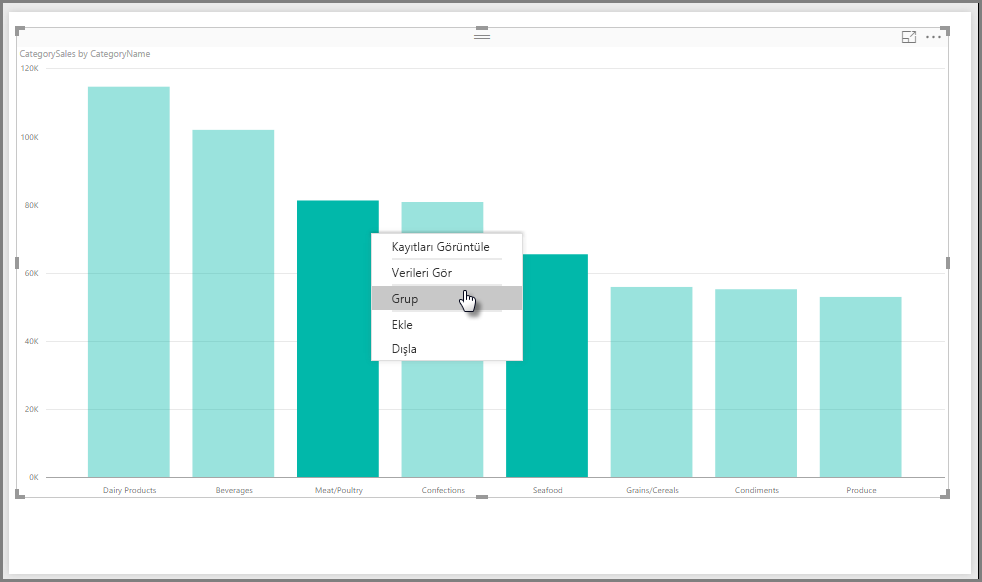
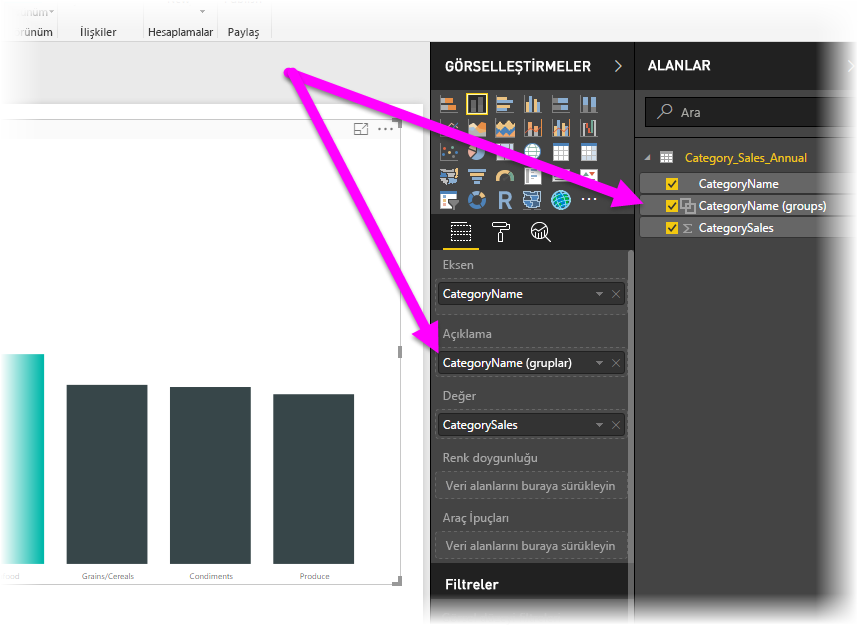
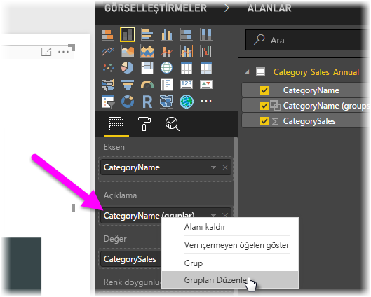
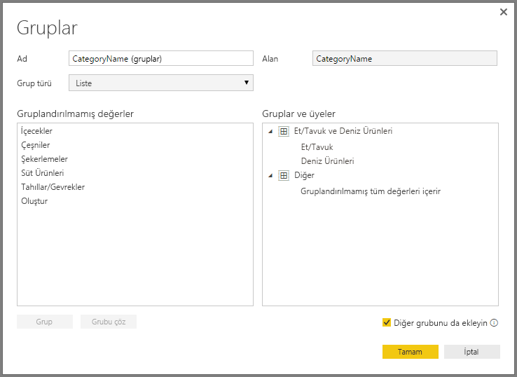
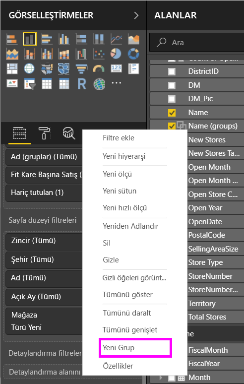
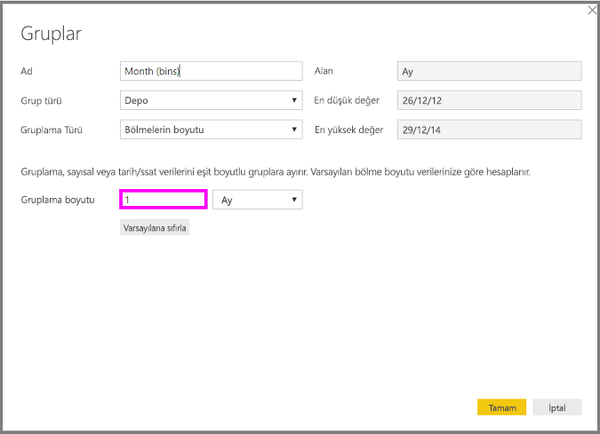
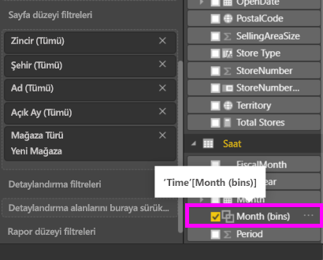

# Power BI Desktop'ta gruplandırma ve gruplama özelliklerini kullanma
**Power BI Desktop** görsel oluştururken, temel alınan verilerde bulunan değerlere bağlı olarak verilerinizi öbekler (veya gruplar) halinde toplar. Genellikle sorun çıkmaz ancak bu öbeklerin sunulma biçimini geliştirmek istediğiniz zamanlar olabilir. Örneğin, üç ürün kategorisini daha büyük bir kategoriye (bir *gruba*) yerleştirmek isteyebilirsiniz. Başka bir örnek vermek gerekirse, satış rakamlarını eşit olarak bölünmüş 923.983 dolarlık gruplar yerine 1.000.000 dolarlık gruplar halinde görmek isteyebilirsiniz.

Power BI Desktop'ta görsellerinizdeki verileri ve eğilimleri daha açık şekilde görüntülemek, çözümlemek ve araştırmak için veri noktalarını **gruplandırabilirsiniz**. Ayrıca, değerleri eşit boyutlu gruplara bölerek verileri anlamlı şekillerde görselleştirmenize olanak sağlayan **Gruplama boyutunu** da tanımlayabilirsiniz. (Genellikle *gruplama* adı verilir.)

## Gruplandırma özelliğini kullanma
Gruplandırma özelliğinden yararlanmak için, öğeleri çoklu olarak seçmek üzere Ctrl tuşunu basılı tutarak görsellerdeki bir veya daha fazla öğeye tıklayabilirsiniz. Ardından, çoklu seçim öğelerinden birine sağ tıklayıp açılan menüden **Grup**'u seçin.

Oluşturulan grup, görselin **Açıklama** demetine eklenir ve ayrıca **Alanlar** listesinde de görünür.

Grup oluşturduktan sonra **Açıklama** demetindeki alana veya **Alanlar** listesine sağ tıklayıp **Grupları Düzenle**'yi seçerek bu grubun üyelerini kolayca düzenleyebilirsiniz.

Açılan **Gruplar** penceresinde yeni grup oluşturabilir veya mevcut grupları değiştirebilirsiniz. Ayrıca, **Gruplar ve üyeler** kutusundaki grup başlığına çift tıklayıp yeni bir ad yazarak da herhangi bir grubu *yeniden adlandırabilirsiniz*.

Grupları kullanarak her türlü işlemi gerçekleştirebilirsiniz. **Gruplandırılmamış değerler** listesindeki öğeleri yeni bir gruba veya mevcut gruplardan birine ekleyebilirsiniz. Yeni bir grup oluşturmak için, **Gruplandırılmamış değerler** kutusundaki iki veya daha fazla öğeyi seçip (Ctrl tuşunu basılı tutup tıklayarak) bu kutunun altındaki **Grup** düğmesine tıklayın.

Gruplandırılmamış bir değeri mevcut bir gruba ekleyebilirsiniz: Bunun için Gruplandırılmamış değeri ve ardından bu değeri eklemek istediğiniz mevcut grubu seçip **Grup** düğmesine tıklamanız yeterlidir. Bir gruptan öğe kaldırmak için söz konusu öğeyi **Gruplar ve üyeler** kutusundan seçip **Grubu Çöz**'e tıklayın. Ayrıca, gruplandırılmamış kategorilerin **Diğer** grubuna yerleştirilip yerleştirilmeyeceğine ya da gruplandırılmadan bırakılıp bırakılmayacağına da karar verebilirsiniz.

> [!NOTE]
> **Alanlar** bölmesinde mevcut bir görselden çoklu seçim yapmak zorunda kalmadan herhangi bir alan için grup oluşturabilirsiniz. Yalnızca söz konusu alana sağ tıklayıp açılan menüden **Yeni Grup**'u seçin.

## Gruplamayı kullanma
**Power BI Desktop**'ta sayısal alanlar ve saat alanları için gruplama boyutunu ayarlayabilirsiniz. **Power BI Desktop**'ın görüntülediği verileri düzgün bir şekilde boyutlandırmak için gruplama özelliğini kullanabilirsiniz.

Bir gruplama boyutu uygulamak için bir **Alan**'a sağ tıklayıp **Yeni Grup**’u seçin.

**Gruplar** penceresinde, **Gruplama boyutunu** istediğiniz boyuta ayarlayın.

**Tamam**'ı seçtiğinizde **Alanlar** bölmesinin *(bölmeler)* eklenmiş olarak görüntülendiğini fark edeceksiniz. Daha sonra gruplama boyutunu bir görselde kullanmak için bu alanı tuvale sürükleyebilirsiniz.

**Gruplamayı** uygulamalı olarak görmek için bu [videoya](https://www.youtube.com/watch?v=BRvdZSfO0DY) göz atın.

Böylece, raporlarınızdaki görsellerin istediğiniz şekilde gösterilmesini sağlamak için **gruplandırma** ve **gruplama** özelliklerini kullanarak gerçekleştirebileceğiniz tüm işlemlere değinmiş olduk.

