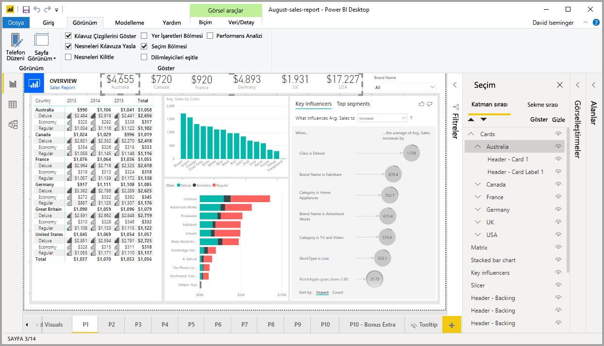
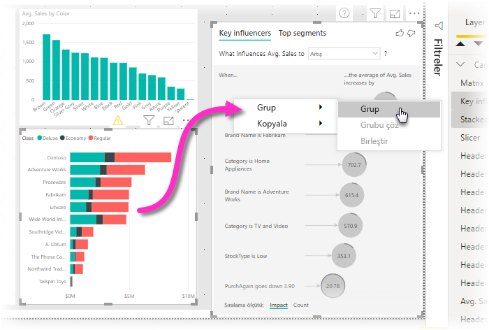
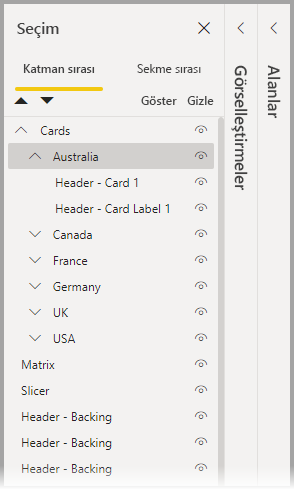
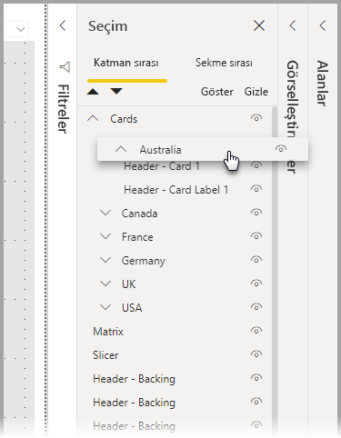
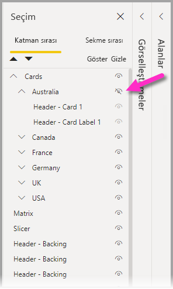
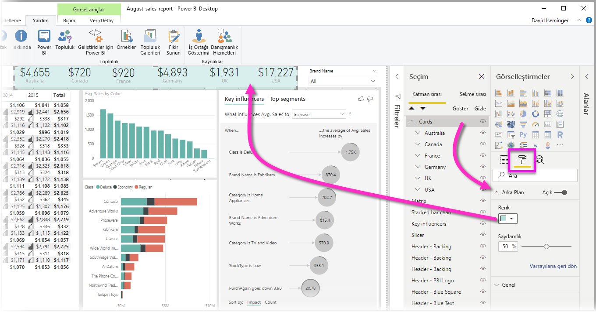

# Power BI Desktop raporlarındaki görselleri gruplandırma
**Power BI Desktop**’ta **gruplandırma** özelliğini kullanarak raporunuzdaki düğmeleri, metin kutularını, şekilleri, görüntüleri ve oluşturduğunuz her türlü görseli gruplandırabilirsiniz. Bir rapordaki görsellerin gruplandırılması, grubu tek bir nesne gibi ele almanızı sağlar, böylece taşımayı, yeniden boyutlandırmayı ve raporunuzdaki katmanlarla çalışmayı daha kolay, daha hızlı ve daha sezgisel hale getirir.

## Grup oluşturma

Power BI Desktop’ta bir görsel grubu oluşturmak için tuvalden ilk görseli seçin, sonra CTRL düğmesini basılı tutarak grupa eklemek istediğiniz bir veya daha fazla görsele daha tıklayın, sonra görsel koleksiyonuna sağ tıklayıp görüntülenen menüden **Grup**’u seçin.

Gruplar **Seçim** bölmesinde görüntülenir. Raporunuz için gereken sayıda görsel grubu oluşturabilir ve ayrıca görsel gruplarını iç içe yerleştirebilirsiniz. Aşağıdaki görüntüde, *Avustralya* grubu *Kartlar* grubunun altına yerleştirilmiştir. Grup adının yanındaki şapka karakterini seçerek grubu genişletebilir, şapka karakterini tekrar seçerek grubu daraltabilirsiniz. 

**Seçim** bölmesinde, görselleri bir gruba eklemek, gruptan çıkarmak, bir grubu iç içe yerleştirmek veya iç içe yerleştirilmiş gruptan tek bir görsel çıkarmak için tek tek sürükleyip bırakabilirsiniz. Ayarlamak istediğiniz görseli sürükleyip istediğiniz yere yerleştirmeniz yeterlidir. Çakışma varsa, görsellerin katmanları *Katman sırası* listesindeki sıralarına göre belirlenir.

Grubu çözmek için grubu seçin, sağ tıklayın ve açılan menüden **grubu çöz**’ü seçin.

## Görselleri veya grupları gizleme ve gösterme

**Seçim** bölmesini kullanarak grupları kolayca gizleyebilir veya gösterebilirsiniz. Bir grubu gizlemek için, grup (veya tek görsel) adının yanındaki göz düğmesini seçerek görseli veya grubu gizli ya da görünür hale getirin. Aşağıdaki görüntüde, *Avustralya* grubu gizlidir ve *Kartlar* grubunda iç içe yerleştirilmiş grupların geri kalanı gösterilmektedir.

Bir grubu gizlediğinizde, o grubun içindeki tüm görseller gizlenir ve bu durum, göz düğmesinin gri olmasıyla gösterilir (tüm grup gizli olduğundan kapatılıp açılamaz). Bir grup içinde yalnızca belirli görselleri gizlemek için, ilgili görselin yanındaki göz düğmesini açık duruma getirdiğinizde yalnızca gruptaki o görsel gizlenir.

## Bir grup içinde görseller seçme

Bir görsel grubu içinde gezinip öğe seçmenin birkaç yolu vardır. Aşağıdaki listede davranış açıklanmaktadır:

* Bir grup içinde boş bir alana tıklandığında (görseller arasındaki boşluk gibi) hiçbir şey seçilmez
* Bir grup içindeki görsele tıklandığında tüm grup seçilir, ikinci kez tıkladığında tek görsel seçilir
* Bir grup ve sonra rapor kanvasındaki başka bir nesneyi seçmek, ardından da sağ tıklama menüsünden **Grup**'u seçmek iç içe yerleştirilmiş bir grup oluşturur
* İki grup seçtikten sonra sağ tıklamak, seçili grupları iç içe yerleştirmek yerine birleştirme seçeneğini gösterir

## Arka plan rengi uygulama

Ayrıca, aşağıdaki görüntüde gösterildiği gibi **Görselleştirmeler** bölmesinin **Biçimlendirme** bölümünü kullanarak bir gruba arka plan rengi uygulayabilirsiniz. 

Arka plan rengi uyguladıktan sonra gruptaki görseller arasında bulunan boşluğa tıkladığınızda grup seçilir (bu işlemi, bir gruptaki görseller arasında bulunan boşluğa tıkladığınızda grubu seçmeyen işlemle karşılaştırın). 

## Sonraki adımlar
Gruplandırma daha fazla bilgi edinmek için aşağıdaki videoya göz atın:

* [Power BI Desktop'ta gruplandırma - video](https://youtu.be/sf4n7VXoQHY?t=10)

Aşağıdaki makaleler de ilginizi çekebilir:

* [Power BI Desktop'ta çapraz rapor detaylandırma özelliğini kullanma](desktop-cross-report-drill-through.md)
* [Power BI Desktop’ta dilimleyicileri kullanma](visuals/power-bi-visualization-slicers.md)

