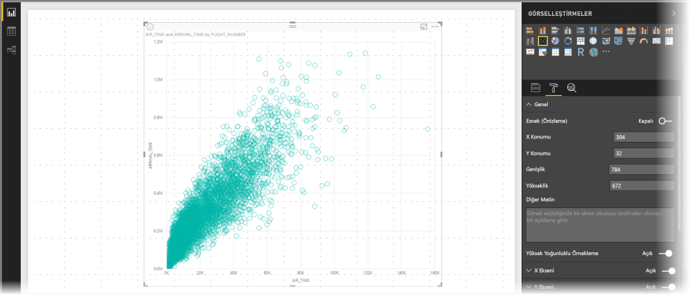
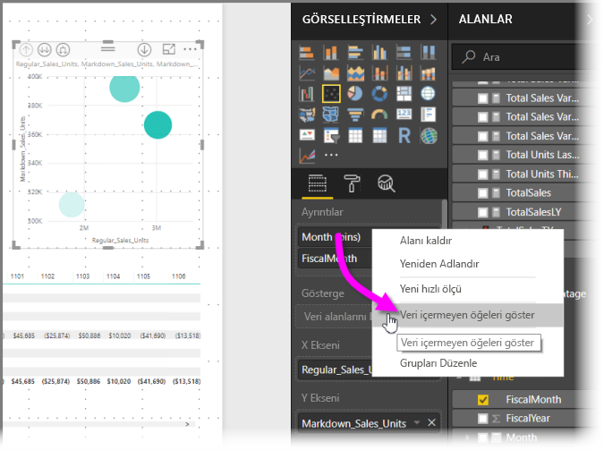
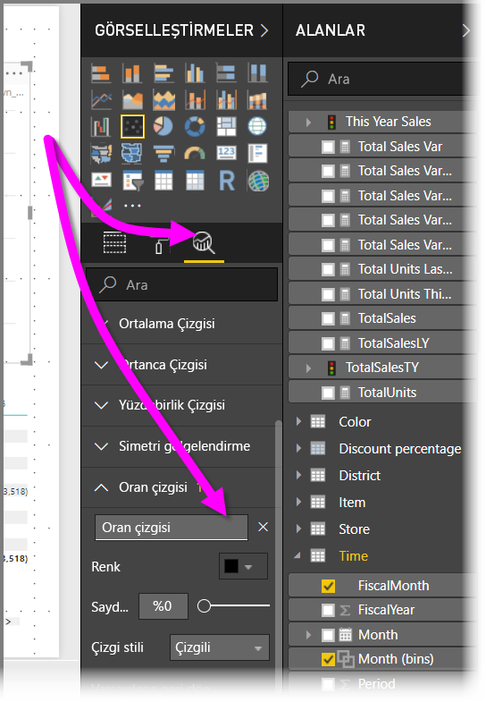
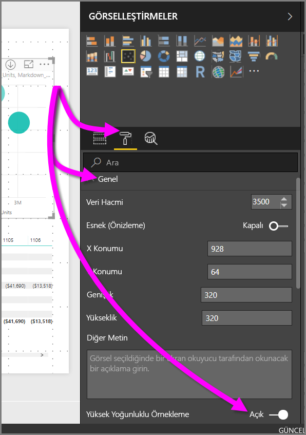

# Power BI dağılım grafiklerinde yüksek yoğunluklu örnekleme
**Power BI Desktop**’ın Eylül 2017 sürümü ve **Power BI hizmetine** yönelik güncelleştirmelerle birlikte yeni bir örnekleme algoritması kullanıma sunuldu. Bu algoritma ile yüksek yoğunluklu verilerin, dağılım grafiklerindeki gösterimi iyileştirildi.

Örneğin, kuruluşunuzun satış etkinliklerine ilişkin bir dağılım grafiği oluşturabilirsiniz. Bu grafikte, her mağaza için yıl başına on binlerce veri noktası bulunur. Bu tür bilgilerin yer aldığı bir dağılım grafiği, mevcut verileri temel alıp satış verilerinin zaman içinde nasıl şekillendiğini göstermek üzere söz konusu verilerin anlamlı bir gösterimini seçerek verileri örnekler ve temel alınan verilerin görüntülendiği bir dağılım grafiği oluşturur. Bu, yüksek yoğunluklu dağılım grafiklerinde sık kullanılan bir yöntemdir. Power BI, ayrıntıları bu makalede açıklanan yüksek yoğunluklu veri örnekleme özelliğini geliştirmiştir.

> [!NOTE]
> Bu makalede açıklanan **Yüksek Yoğunluklu Örnekleme** algoritması hem **Power BI Desktop** hem de **Power BI hizmeti** için dağılım grafiklerinde kullanılabilir.
> 
> 

## Yüksek yoğunluklu dağılım grafikleri nasıl çalışır?
Önceden **Power BI**, dağılım grafiği oluşturmak için belirleyici bir yaklaşım izleyerek, temel alınan verilerin tam aralığında bulunan bir örnek veri noktası koleksiyonu seçiyordu. Daha ayrıntılı şekilde belirtmek gerekirse Power BI, dağılım grafiği serisindeki ilk ve son veri satırlarını seçip kalan satırları eşit olarak bölerek dağılım grafiğinde toplam 3.500 veri noktasının çizilmesini sağlıyordu. Örneğin, örnekte 35.000 satır varsa çizim için ilk ve son satırlar seçildikten sonra her onuncu satır çiziliyordu (35.000/10 = her onuncu satır = 3.500 veri noktası). Ayrıca daha önce, veri serisinde çizilemeyen null değerler veya noktalar (örneğin, metin değerleri) gösterilmiyor ve görsel oluşturulurken dikkate alınmıyordu. Böyle bir örneklemede dağılım grafiğinin algılanan yoğunluğu da temsili veri noktalarına dayanıyor ve görselde yoğunluğu göstermek için, temel alınan verilerin tam koleksiyonu yerine yalnızca örneklenen noktalar temel alınıyordu.

**Yüksek Yoğunluklu Örnekleme**'yi etkinleştirdiğinizde, Power BI çakışan noktaları kaldırır ve görselle etkileşim kurduğunuz sırada görseldeki noktalara ulaşabilmenizi sağlar. Algoritma ayrıca veri kümesindeki tüm noktaların görselde gösterilmesini de sağlar. Üstelik bunu yaparken yalnızca temsili bir örnek çizmek yerine, seçilen noktaların anlamlarıyla ilgili bağlam da sunar.

Tanımı gereği, makul oranda hızlı ve etkileşime duyarlı görselleştirmeler oluşturmak için yüksek yoğunluklu verilerin örneği oluşturulur. Bir görsel öğe üzerinde çok fazla veri noktasının olması, görsel öğeyi çıkmaza sokabilir ve eğilim görselleştirmelerinde değerini düşürebilir. En iyi görselleştirme deneyiminin sunulabilmesi ve tüm verilerin temsil edilebilmesi için verilerin nasıl örneklendiği, örnekleme algoritmasını oluşturma nedenidir. Power BI’daki bu algoritma, veri kümesinin tamamındaki önemli noktalar için yanıtlama, temsil ve koruma konusunda en iyi kombinasyonu sağlayacak şekilde iyileştirildi.

> [!NOTE]
> **Yüksek Yoğunluklu Örnekleme** algoritmasını kullanan dağılım grafikleri için en iyi çizim deneyiminin sunulacağı ortam, diğer tüm dağılım grafiklerinde de olduğu gibi kare görsellerdir.
> 
> 

## Dağılım grafiklerine yönelik yeni örnekleme algoritması nasıl çalışır?
Dağılım grafiklerine yönelik yeni **Yüksek Yoğunluklu Örnekleme** algoritması, temel alınan verileri daha etkin bir şekilde yakalayıp gösteren ve çakışan noktaları kaldıran yöntemler kullanır. İlk olarak, her veri noktası için küçük bir yarıçap (görselleştirmedeki belirli bir nokta için görsel dairesi boyutunda) kullanarak başlar. Daha sonra, tüm veri noktalarının yarıçapı artırılır. İki (veya daha fazla) veri noktasının çakışması halinde, çakışan bu veri noktalarını, yarıçapı artırılmış olan tek bir daire temsil eder. Algoritma, dağılım grafiğinde makul sayıda veri noktası (3.500) görüntülenene kadar veri noktalarının yarıçapını artırmaya devam eder.

Bu algoritmadaki yöntemler, elde edilecek olan görselde aykırı değerlerin gösterilmesini sağlar. Algoritma, çakışmaları belirlerken ölçeği de dikkate alır. Örneğin, üstel ölçekler, temel alınan görselleştirilmiş noktalara uygun şekilde görselleştirilir.

Algoritma dağılım grafiğinin genel şeklini de korur.

> [!NOTE]
> Dağılım grafikleri için **Yüksek Yoğunluklu Örnekleme** algoritmasının kullanımında belirlenen hedef, görseldeki yoğunluğu göstermek *değil*, verilerin *doğru dağılımının* yapılmasıdır. Örneğin, belirli bir alanında çok sayıda çakışan dairenin (yoğunluk) bulunduğu bir dağılım grafiği görebilirsiniz. Bu, çok sayıda veri noktasının burada kümelenmiş olduğu anlamına gelir. **Yüksek Yoğunluklu Örnekleme** algoritması, çok sayıda veri noktasını temsil etmek için tek bir daire kullanabilir. Böylece, görselde yoğunluk (veya "kümeleme") oluşmaz. Belirli bir alanla ilgili daha ayrıntılı bilgi edinmek için görseli yakınlaştırmak üzere dilimleyicileri kullanabilirsiniz.
> 
> 

Ayrıca, çizilemeyen veri noktaları (örneğin, null değerler veya metin değerleri) yok sayılır. Bu tip durumlarda, çizilebilen başka değerler seçilir ve böylece dağılım grafiğinin özgün şekli çok daha iyi bir şekilde korunur.

### Dağılım grafikleri için standart algoritmanın kullanılması
Dağılım grafiklerinde **Yüksek Yoğunluklu Örnekleme**'nin kullanılamadığı bazı koşullarda özgün algoritma kullanılır. Bu koşullar aşağıda belirtilmiştir:

* **Ayrıntılar** altındaki bir değere sağ tıkladıktan sonra menüden **Veri içermeyen öğeleri göster** seçeneğini belirlerseniz dağılım grafiğinde özgün algoritmaya geçiş yapılır.
  
  
* **Yürütme** eksenine herhangi bir değer girilirse dağılım grafiğinde özgün algoritmaya geçiş yapılır.
* Bir dağılım grafiğinde hem X hem de Y ekseni yoksa grafikte özgün algoritmaya geçiş yapılır.
* **Analiz** bölmesinde bir **Oran satırı** kullanılırsa grafikte özgün algoritmaya geçiş yapılır.
  
  

## Dağılım grafikleri için yüksek yoğunluklu örnekleme algoritmasını etkinleştirme
**Yüksek Yoğunluklu Örnekleme**’yi etkinleştirmek için bir dağılım grafiği seçin, **Biçimlendirme** bölmesine gidin, **Genel** kartını genişletin ve bu kartın altındaki **Yüksek Yoğunluklu Örnekleme** kaydırıcısını **Açık** durumuna kaydırın.

> [!NOTE]
> Kaydırıcı etkinleştirildikten sonra Power BI, mümkün olan her durumda **Yüksek Yoğunluklu Örnekleme** algoritmasını kullanmaya çalışır. Algoritma kullanılamadığında (örneğin, *Yürütme* eksenine bir değer girerseniz), kaydırıcı **Açık** durumda kalır ancak grafikte standart algoritmaya geçiş yapılır. Daha sonra, *Yürütme* eksenine girmiş olduğunuz değerleri kaldırırsanız (veya yüksek yoğunluklu örnekleme algoritmasının kullanılabileceği koşullar oluşursa) söz konusu özellik etkin durumda olduğundan grafikte otomatik olarak yüksek yoğunluklu örnekleme kullanılır.
> 
> [!NOTE]
> Veri grupları dizine göre gruplandırılır veya seçilir. Bir açıklamanın olması, algoritmaya ilişkin örneklemeyi etkilemez; yalnızca görselin nasıl sıralanacağını etkiler.
> 
> 

## Önemli noktalar ve sınırlamalar
Yüksek yoğunluklu örnekleme algoritması Power BI için önemli bir iyileştirmedir. Bununla birlikte, yüksek yoğunluklu değerler ve dağılım grafikleri ile çalışırken göz önünde bulundurmanız gereken bazı önemli noktalar vardır.

* **Yüksek Yoğunluklu Örnekleme** algoritması, yalnızca Power BI hizmetini temel alan modellere, içeri aktarılan modellere veya DirectQuery'ye yönelik canlı bağlantılarda kullanılabilir.

## Sonraki adımlar
Diğer grafiklerdeki yüksek yoğunluklu örnekleme işlemleri hakkında daha fazla bilgi için aşağıdaki makaleye göz atın.

* [Power BI'da yüksek yoğunluklu çizgi örnekleme](desktop-high-density-sampling.md)

