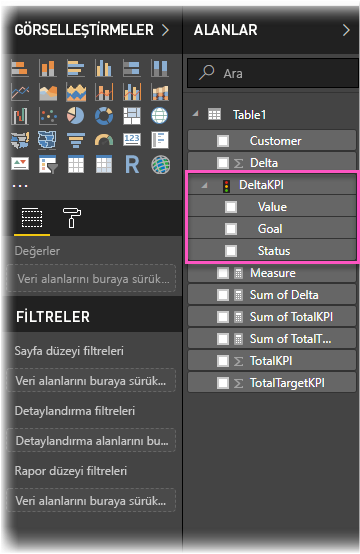
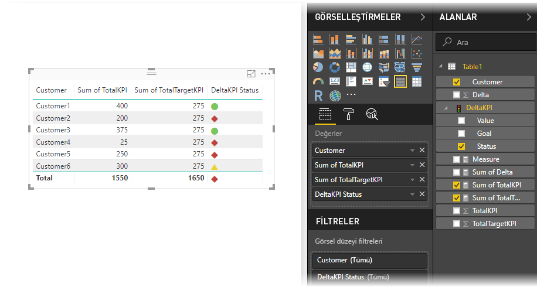

# Power BI'da KPI'leri içeri aktarma ve görüntüleme
**Power BI Desktop** ile KPI'leri içeri aktarabilir ve tablolarda, matrislerde ve kartlarda görüntüleyebilirsiniz.

KPI'leri içeri aktarmak ve görüntülemek için bu adımları takip edin.

1. Power Pivot modeli ve KPI içeren bir Excel çalışma kitabı ile başlayın. Bu alıştırmada *KPIs* (KPI'ler) adlı bir çalışma kitabı kullanılmıştır.

1. **Dosya -> İçeri aktar -> Excel çalışma kitabı içerikleri**’ni kullanarak Excel çalışma kitabını Power BI’ya aktarın. Ayrıca, [çalışma kitaplarının nasıl içeri aktarılacağını öğrenebilirsiniz](desktop-import-excel-workbooks.md). 

1. Power BI’ya aktardıktan sonra, KPI’niz  simgesiyle işaretli olarak **Alanlar** bölmesinde görünür. Raporunuzda KPI kullanmak için **Değer**, **Hedef** ve **Durum** alanlarını ortaya çıkararak içeriklerini genişlettiğinizden emin olun.

    

1. İçeri aktarılan KPI’ler, **Tablo** gibi standart görselleştirme türlerinde en iyi şekilde kullanılır. Power BI, yalnızca yeni KPI’ler oluşturmak için kullanılması gereken **KPI** görselleştirme türünü de içerir.
   
    

İşte bu kadar kolay. KPI'leri önemli eğilimleri, ilerlemeleri ya da diğer önemli göstergeleri vurgulamak için kullanabilirsiniz.
