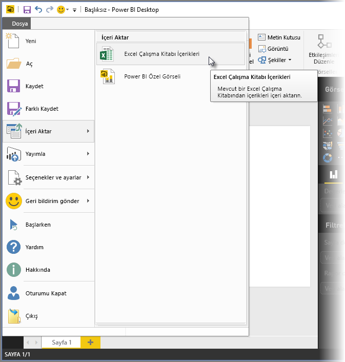
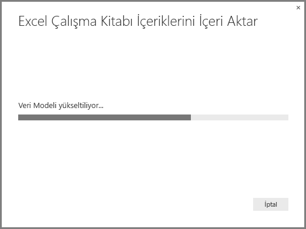
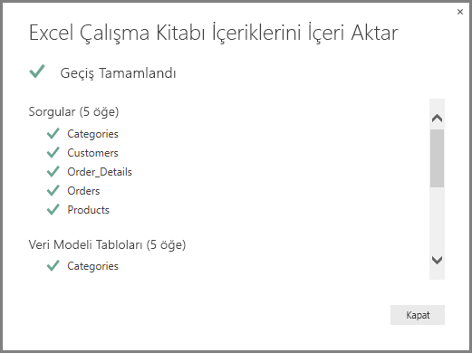
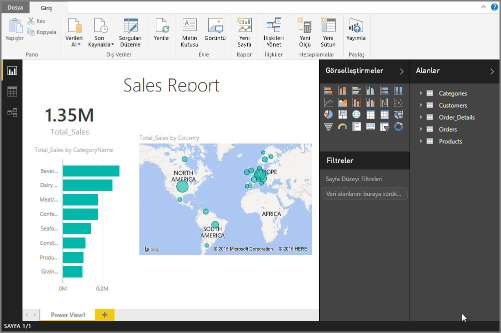

# Power BI Desktop'a Excel çalışma kitabı aktarma
**Power BI Desktop**'ı kullanarak, Power Query sorguları, Power Pivot modelleri ve Power View çalışma sayfaları içeren Excel çalışma kitaplarını, Power BI Desktop'a kolayca aktarabilirsiniz. Raporlar ve görselleştirmeler, Excel çalışma kitabı temel alınarak otomatik olarak oluşturulur ve içeri aktarma işlemini gerçekleştirdikten sonra Power BI Desktop'ı kullanarak, hem var olan özellikler hem de her bir Power BI Desktop aylık güncelleştirmesi ile sunulan yeni özellikler sayesinde bu raporları geliştirmeye ve iyileştirmeye devam edebilirsiniz.

İleride Excel ile Power BI Desktop arasındaki iletişimi artırmayı planlıyoruz (içeri/dışarı aktarma gibi); şu anda var olan, çalışma kitaplarını Power BI Desktop'a aktarma özelliği, mevcut Excel kullanıcılarının Power BI Desktop'ı kullanmaya başlamasını sağlamak için yeterlidir.

## Bir Excel çalışma kitabı nasıl içeri aktarılır?
Bir çalışma kitabını içeri aktarmak için Power BI Desktop'taki **Dosya -\> İçeri aktar -\> Excel Çalışma Kitabı İçerikleri** seçeneğini belirleyin.

İçeri aktarılacak çalışma kitabını seçmenize olanak sağlayan bir pencere açılır. Şu anda çalışma kitabı boyutu veya içindeki nesne sayısı ile ilgili herhangi bir sınırlama yoktur ancak Power BI Desktop'ın daha büyük çalışma kitaplarını çözümlemesi ve içeri aktarması daha uzun zaman alır.

> [!NOTE]
> **Paylaşılan OneDrive İş** klasörlerindeki veya **Office 365 grup** klasörlerindeki Excel dosyalarını yüklemek veya aktarmak için Excel dosyasının URL'sini kullanın ve bu URL'yi Power BI Desktop'taki **Web** veri kaynağına girin. **OneDrive İş** URL'sini doğru şekilde biçimlendirmek için uygulamanız gereken birkaç adım vardır; daha fazla bilgi ve doğru adım dizisi için [Power BI Desktop'ta OneDrive İş bağlantılarını kullanma](desktop-use-onedrive-business-links.md) makalesine başvurun.
> 
> 

Bir çalışma kitabı seçildiğinde Power BI Desktop çalışma kitabını çözümler ve bir Power BI Desktop dosyasına (.pbix) dönüştürür. Bu tek seferlik bir işlemdir. Power BI Desktop dosyası bu adımlar uygulanarak oluşturulduktan sonra dosyanın özgün Excel çalışma kitabına hiçbir bağımlılığı kalmaz ve dosya, özgün çalışma kitabı etkilenmeden değiştirilebilir (ve kaydedilebilir, paylaşılabilir).

İçeri aktarma işlemi bittikten sonra, dönüştürülen öğeleri açıklayan ve aynı zamanda içeri aktarılmayan öğeleri listeleyen bir **Özet** sayfası görüntülenir.

**Kapat**'ı seçtiğinizde rapor Power BI Desktop'a yüklenir. Aşağıdaki görüntüde, Power BI Desktop'ın bir Excel çalışma kitabı içeri aktarıldıktan sonraki durumu gösterilmektedir: Power BI Desktop, çalışma kitabı içeriklerini temel alan raporu otomatik olarak yüklemiştir.

Çalışma kitabı içeri aktarıldığına göre Power BI Desktop'ın sunduğu özellikleri ve yetkinlikleri kullanarak yeni görselleştirmeler oluşturmak, veri eklemek veya yeni rapor sayfaları oluşturmak gibi işlemlerle rapor üzerinde çalışmaya devam edebilirsiniz.

## Çalışma kitabının hangi öğeleri içeri aktarılır?
Power BI Desktop, Excel'de bulunan ve genellikle *nesneler* olarak adlandırılan şu öğeleri içeri aktarabilir.

| Excel Çalışma Kitabın Nesnesi | Power BI Desktop dosyasının Son Durumu |
| --- | --- |
| Power Query sorguları |Excel'den yapılan tüm Power Query sorguları, Power BI Desktop sorgularına dönüştürülür. Excel Çalışma Kitabında tanımlı Sorgu Grupları varsa aynı kuruluş Power BI Desktop'ta çoğaltılır. Excel'de "Yalnızca Bağlantı Oluştur" ayarı yapılmadığı sürece tüm sorgular yüklenir. Yükleme davranışı, Power BI Desktop'taki **Sorgu Düzenleyicisi**'nin **Giriş** sekmesinde bulunan **Özellikler** iletişim kutusundan özelleştirilebilir. |
| Power Pivot Dış Veri Bağlantıları |Tüm Power Pivot Dış Veri Bağlantıları, Power BI Desktop'ta sorgulara dönüştürülür. |
| Bağlantılı Tablolar veya Geçerli Çalışma Kitabı tabloları |Excel'de Veri Modeli veya bir sorgu ile bağlantılı bir çalışma kitabı varsa (M'de *From Table* veya *Excel.CurrentWorkbook()* işlevi kullanılarak) aşağıdaki seçenekler sunulur     1. Tabloyu Power BI Desktop dosyasına aktarın. Bu, verilerin bir defalık anlık görüntüsüdür. Bu işlemden sonra Power BI Desktop'taki tabloda bulunan verileri düzenleyemezsiniz. Bu seçenek kullanılarak oluşturulan tablolar için 1 milyon karakterlik (tüm sütun başlıklarının ve hücrelerin birleşiminden elde edilen toplam) bir boyut sınırlaması vardır.    2. Özgün çalışma kitabıyla bağlantıyı koruyun. Alternatif olarak, özgün Excel Çalışma Kitabı ile bağlantıyı koruyabilirsiniz. Böylece Power BI Desktop, tıpkı Power BI Desktop'taki bir Excel çalışma kitabı için oluşturulan diğer sorgular gibi her yenilemeyle birlikte bu tablodaki en son içeriği alır. |
| Veri Modelindeki Hesaplanmış Sütunlar, Ölçüler, Veri Kategorileri ve İlişkiler |Bu Veri Modeli nesneleri, Power BI Desktop'ta eşdeğer nesnelere dönüştürülür. Power BI Desktop'ta **Resim** gibi belirli Veri Kategorilerinin henüz kullanıma sunulmadığını göz önünde bulundurun. Böyle durumlarda Veri Kategorisi bilgileri, söz konusu sütunlar için sıfırlanır. |
| Power View Çalışma Sayfaları |Excel'deki her bir Power View çalışma sayfası için yeni bir rapor sayfası oluşturulur. Bu rapor sayfalarının adı ve sırası, özgün Excel çalışma kitabı ile eşleşir. |

## Bir çalışma kitabını içeri aktarmaya ilişkin herhangi bir sınırlama var mıdır?
Bir çalışma kitabını Power BI'a aktarmaya ilişkin birkaç sınırlama bulunur ve bu sınırlamalar aşağıdaki gibidir:

1. **Analysis Services Tablolu Modellere yönelik Dış Bağlantılar:** Excel 2013'te SQL Server Analysis Services Tablolu modellere yönelik bağlantı oluşturmak ve verileri içeri aktarmadan bu modellerin üzerinde Power View raporları oluşturmak mümkündür. Bu tür bağlantılar şu anda Excel Çalışma Kitaplarını Power BI Desktop'a aktarma özelliğinin bir parçası olarak desteklenmemektedir ancak gelecek bir güncelleştirmede kullanıma sunulacaktır. Bu sırada, söz konusu dış bağlantıları Power BI Desktop'ta yeniden oluşturmanız gerekir.
2. **KPI'ler:** Bu Veri Modeli nesnesi türü şu anda Power BI Desktop'ta desteklenmemektedir. Bu nedenle, bir Excel çalışma kitabını Power BI Desktop'a aktarma işleminin bir parçası olarak KPI'ler atlanır.
3. **Hiyerarşiler:** Bu Veri Modeli nesnesi türü şu anda Power BI Desktop'ta desteklenmemektedir. Bu nedenle, bir Excel Çalışma Kitabını Power BI Desktop'a aktarma işleminin bir parçası olarak hiyerarşiler atlanır.
4. **İkili veri sütunları:** Bu Veri Modeli sütunu türü şu anda Power BI Desktop'ta desteklenmemektedir. İkili Veri sütunları, Power BI Desktop'ta sonuç olarak elde edilen tabloda bulunmaz.
5. **Desteklenmeyen Power View öğeleri:** Temalar veya belirli görselleştirme türleri (Yürütme Eksenli Dağılım Grafiği, Detaya Git davranışları vb.) gibi Power BI Desktop'ta henüz kullanılabilir olmayan bazı Power View özellikleri bulunmaktadır. Desteklenmeyen görselleştirmeler, Power BI Desktop raporundaki ilgili konumlarında *Desteklenmeyen Görselleştirme* benzer iletilerin bulunmasına neden olur, bu görselleştirmeleri silebilir veya gerektiği şekilde yeniden yapılandırabilirsiniz.
6. **Power Query'de** ***From Table*** **kullanan veya M'de**  ***Excel.CurrentWorkbook***  **kullanan Adlandırılmış Aralıklar:** Bu adlandırılmış aralık verilerini Power BI Desktop'a aktarma işlemi şu anda desteklenmese de Power BI Desktop için planlanmış bir güncelleştirmedir. Bu adlandırılmış aralıklar şu anda Power BI Desktop'a bir dış Excel çalışma kitabı bağlantısı olarak yüklenir.
7. **PowerPivot ile SSRS bağlantısı:** İlgili veriler şu anda Power BI Desktop'ta kullanılabilir olmadığından SQL Server Reporting Services'e (SSRS) yönelik PowerPivot dış bağlantıları şu anda desteklenmemektedir.

