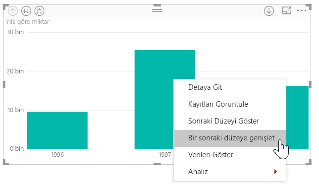
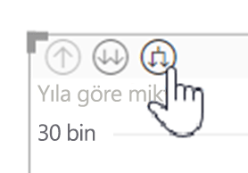
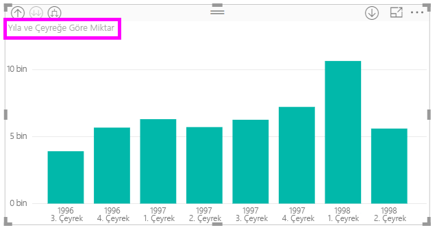
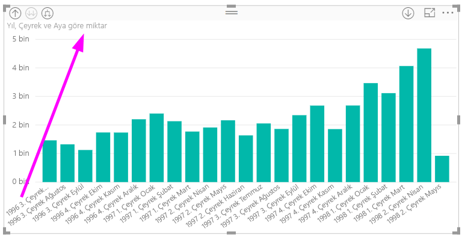
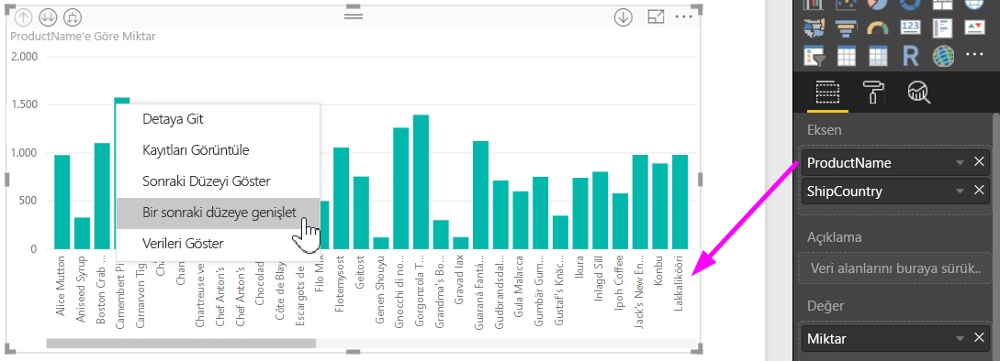
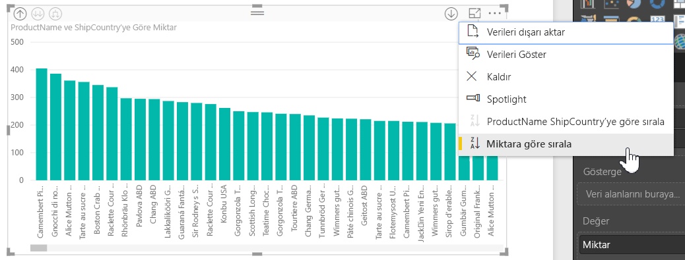
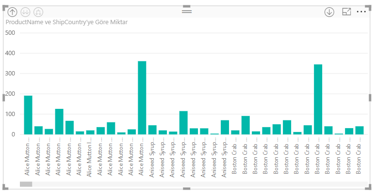

# Power BI Desktop'taki satır içi hiyerarşi etiketlerini kullanma
**Power BI Desktop**, hiyerarşik olarak detaya gitmeyi iyileştirmeye yönelik iki özellikten birincisi olan **satır içi hiyerarşi etiketlerinin** kullanımını destekler. Şu anda geliştirme aşamasında olan ikinci özellik ise iç içe geçmiş hiyerarşi etiketlerini kullanabilme özelliğidir. (Sık sık güncelleştirmeler yayımladığımızdan bu özellik için takipte kalmanızda yarar var.)   

## Satır içi hiyerarşi etiketleri nasıl çalışır?
Satır içi hiyerarşi etiketleri sayesinde, **Tümünü Genişlet** özelliğini kullanarak görselleri genişlettiğinizde hiyerarşi etiketlerini görebilirsiniz. Hiyerarşik verilerinizi genişlettiğinizde bu farklı hiyerarşi etiketlerine göre **sıralama** yapmayı da tercih edebilmeniz söz konusu hiyerarşi etiketlerini görebilmenin sunduğu harika avantajlardan biridir.

### Yerleşik Genişlet özelliğini kullanma (hiyerarşi etiketlerine göre sıralama yapmadan)
Satır içi hiyerarşi etiketlerini uygulamaları olarak görmeden önce, **Bir sonraki düzeye genişlet** özelliğinin varsayılan olarak nasıl davranış gösterdiğini inceleyelim. Bunu gerçekleştirmemiz, satır içi hiyerarşi etiketlerinin ne kadar kullanışlı olabildiğini anlayabilmemize (ve bunun tadını çıkarmamıza) yardımcı olur.

Aşağıdaki görüntüde, yıllık satışlara yönelik bir çubuk grafik görseli bulunmaktadır. Çubuklardan birine sağ tıklayarak **Bir sonraki düzeye genişlet** seçeneğini belirleyebilirsiniz.

> [!NOTE]
> Çubuğa sağ tıklamak yerine görselleştirmenin sol üstündeki *Genişlet* düğmesini de seçebilirsiniz.

  

**Bir sonraki düzeye genişlet** seçeneği belirlendiğinde görsel, aşağıdaki görüntüde gösterildiği gibi tarih hiyerarşisini *Year* (Yıl) ile *Quarter* (Çeyrek) arasında genişletir.

*Year* ve *Quarter* etiketlerinin satır içinde birlikte gösterildiğine dikkat edin. Siz hiyerarşinin altında bulunan **Tümünü Genişlet** seçeneğini belirledikçe bu etiketleme şeması uygulanmaya devam edilir.

İşte *tarih/saat* veri türüne sahip alanlarla ilişkili yerleşik *Tarih* hiyerarşisi böyle davranış gösterir. Şimdi bir sonraki bölüme geçelim ve yeni satır içi hiyerarşi etiketleri özelliğinin nasıl fark yarattığını görelim.

### Satır içi hiyerarşi etiketlerini kullanma
Şimdi de ölçüsüz hiyerarşilerin bulunduğu verilerin kullanıldığı farklı bir grafiğe göz atalım. Aşağıdaki görselde, eksen olarak *ProductName* (ÜrünAdı) seçeneğinin kullanıldığı **Quantity** (Miktar) adlı bir çubuk grafik bulunuyor. Bu verilerde, *ProductName* (ÜrünAdı) ve *ShipCountry* (GönderimÜlkesi) ölçüsüz bir hiyerarşi oluşturur. Burada, hiyerarşide detaya gitmek için *Bir sonraki düzeye genişlet* seçeneğini tekrar belirleyebilirsiniz.

**Bir sonraki düzeye genişlet** seçeneği belirlendiğinde, hiyerarşi etiketlerinin satır içi görüntüsünü içeren bir sonraki düzey gösterilir. Varsayılan olarak, satır içi hiyerarşiler ölçü değerine (bu örnekte, **Quantity**) göre sıralanır. Satır içi hiyerarşi etiketleri etkinleştirildiğinde, aşağıdaki görüntüde gösterildiği gibi sağ üst köşedeki üç nokta ( **...** ) simgesini seçip **Sıralama Ölçütü: ProductName ShipCountry** seçeneğini belirleyerek bu verileri hiyerarşiye göre sıralamayı da tercih edebilirsiniz.

**ShipCountry** seçildiğinde veriler, aşağıdaki görüntüde gösterildiği gibi, ölçüsüz hiyerarşi seçimine göre sıralanır.

> [!NOTE]
> Satır içi hiyerarşi etiketi özelliği henüz yerleşik saat hiyerarşisinin değere göre sıralanmasını desteklememektedir; bu hiyerarşi yalnızca hiyerarşi sırasına göre sıralanabilir.
> 
> 

## Sorun giderme
Görselleriniz, genişletilmiş bir satır içi hiyerarşi düzeyi durumunda takılabilir. Bazı durumlarda, görsellerinizden bazılarının, genişletildikleri modda takıldığını ve detaydan çıkma özelliğinin çalışmadığını görebilirsiniz. Aşağıdaki adımlardan birini uyguladığınızda bu sorunla karşılaşabilirsiniz: (Sorunun çözümüne bu adımların *altında* yer verilmiştir.)

Şu adımlar görselinizin genişletilmiş bir durumda takılmasına neden olabilir:

1. **Satır içi hiyerarşi etiketi** özelliğini etkinleştirmeniz
2. Hiyerarşi içeren görseller oluşturmanız
3. Ardından, **Tümünü Genişlet** seçeneğini belirleyip dosyayı kaydetmeniz
4. Bu işlemi gerçekleştirdikten sonra **Satır içi hiyerarşi etiketi** özelliğini *devre dışı bırakıp* Power BI Desktop'ı yeniden başlatmanız
5. Ardından dosyanızı yeniden açmanız

Söz konusu adımları uygularsanız ve görselleriniz genişletilmiş modda takılırsa görsellerinizle ilgili bu sorunları gidermek için aşağıdakileri gerçekleştirebilirsiniz:

1. **Satır içi hiyerarşi etiketi** özelliğini yeniden etkinleştirin ve ardından Power BI Desktop'ı yeniden başlatın
2. Dosyanızı yeniden açın ve etkilenen görselleriniz için en üst düzeye çıkmak üzere detaydan çıkma özelliğini kullanın
3. Dosyanızı kaydedin
4. **Satır içi hiyerarşi etiketi** özelliğini devre dışı bırakın ve ardından Power BI Desktop'ı yeniden başlatın
5. Dosyanızı yeniden açın

Alternatif olarak, görselinizi silip yeniden oluşturmayı da tercih edebilirsiniz.

