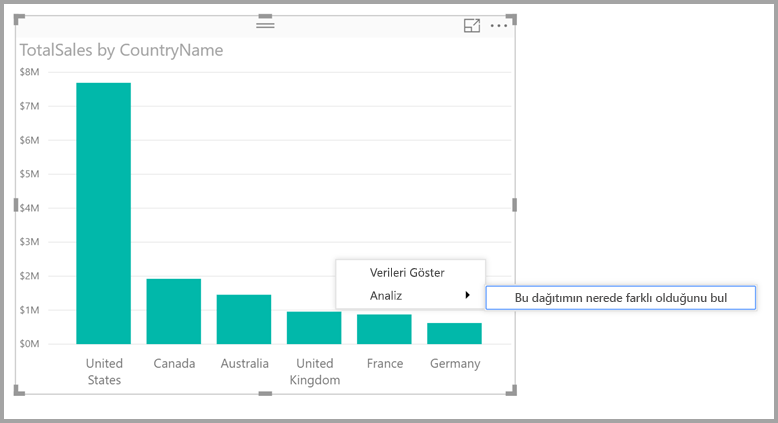
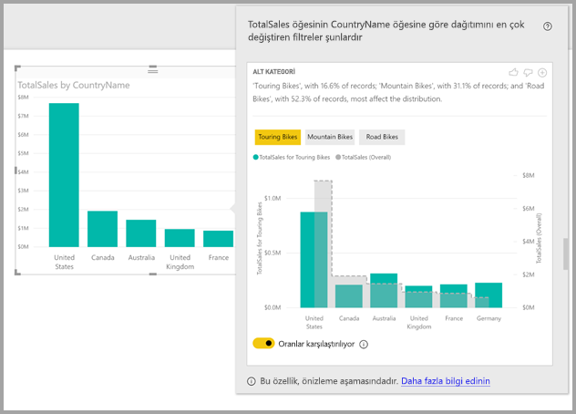

# Power BI Desktop'ta bir dağıtımın farklı olduğu yerleri bulmak için içgörüleri kullanma (Önizleme)

Genellikle görsellerde bir veri noktası görürsünüz ve dağıtımın farklı kategorilerde aynı şekilde olup olmayacağını merak edersiniz. **Power BI Desktop**'taki **içgörüler** sayesinde sorunuzun yanıtını birkaç tıklamayla bulabilirsiniz.

Aşağıdaki *Ülke* ölçütüne göre *Toplam Satışlar* değerini gösteren görseli ele alalım. Grafikte gösterildiği gibi Amerika Birleşik Devletleri'nden gelen satışlar, %57 ile çoğunluğu oluşturmaktadır ve kalan bölüm diğer ülkelerden gelmektedir. Aynı dağıtımın farklı alt popülasyonlarda da görünüp görünmeyeceğini keşfetmek gibi durumlar ilgi çekici olabilir. Örneğin tüm yıllar, tüm satış kanalları ve tüm ürün kategorilerinde durum aynı mı?  Bunun için farklı filtreler uygulayıp sonuçları görsel olarak karşılaştırabilirsiniz, ancak bu yöntem zaman alabilir ve hataya yol açabilir. 

**Power BI Desktop**'tan bir dağıtımın farklı olduğu yerleri bulmasını isteyebilir ve verileriniz hakkında hızlı, otomatik ve içgörü sunan analizlere ulaşabilirsiniz. Bir veri noktasına sağ tıklayıp **Analiz > Bu dağıtımın nerede farklı olduğunu bul** seçeneğini belirlemeniz yeterlidir. İçgörüler, kolayca kullanabileceğiniz bir pencerede gösterilir.

Bu örnekte, otomatik analiz hızlı bir şekilde *Tur Bisikletleri* için satış oranının Amerika Birleşik Devletleri'nde ve Kanada'da daha düşük olduğunu ve diğer ülkelerden gelen oranın daha yüksek olduğunu gösterir.   

> [!NOTE]
> Bu özellik önizleme sürümündedir ve değişikliğe tabidir. Öngörü özelliği **Power BI Desktop** uygulamasının Eylül 2017 sürümünden itibaren varsayılan olarak etkindir. (Etkinleştirmek için Önizleme kutusunu işaretlemenize gerek yoktur.)
> 
> 

## Öngörüleri kullanma
İçgörüleri grafiklerde görünen dağıtımların farklı olduğu yerleri bulma amacıyla kullanmak için, herhangi bir veri noktasına (veya görselin tamamına) sağ tıklamanız ve **Analiz > Bu dağıtımın nerede farklı olduğunu bul** seçeneğini belirlemeniz yeterlidir.

**Power BI Desktop** uygulaması verileri makine öğrenimi algoritmalarından geçirerek pencerede bir görselin yanı sıra dağıtımda en büyük farka neden olan kategorileri (sütunları) ve bu sütunların ilgili değerlerini belirten bir açıklama görüntüler. İçgörüler, aşağıdaki görüntüde gösterildiği gibi sütun grafik olarak sunulur. 

Seçilen filtrenin uygulanmış olduğu değerler, normal varsayılan dil kullanılarak gösterilir. Özgün başlangıç görselinde görüldüğü gibi genel değerler kolay karşılaştırma amacıyla gri renkte gösterilir. En fazla üç farklı filtre dahil edilebilir (bu örnekte *Tur Bisikletleri*, *Dağ Bisikletleri*, *Yol Bisikletleri*) ve üzerine tıklayarak (veya çoklu seçim yapmak için Ctrl tuşunu basılı tutup tıklayarak) birden fazla filtre seçebilirsiniz.

Bu örnekteki *Toplam Satışlar* gibi eklenebilir ölçüler için karşılaştırma mutlak değerlere değil, göreli değerlere göre yapılır. Bu nedenle hiç yapmadığı bir şey bisiklet satış genel satış tüm kategorileri için daha düşük olsa da, varsayılan olarak tüm kategorileri bisiklet ve bisiklet hiç yapmadığı bir şey için farklı ülkelerde üzerinden satış oranı karşılaştırması izin vermek için bir çift eksen görsel kullanır.  Görselin altındaki iki durumlu denetimin değiştirilmesi, iki değerin aynı eksende gösterilerek mutlak değerlerin kolayca karşılaştırılmasını sağlar (aşağıdaki görüntüde gösterildiği gibi).    

Ayrıca açıklayıcı metin, filtreyle eşleşen kayıt sayısına göre filtre değerine eklenebilecek önem düzeyi hakkında bilgi verir. Bu örnekte *Tur Bisikletleri* için dağıtımın önemli ölçüde farklı olabilecek olmasına rağmen kayıtların yalnızca %16,6'sını etkilediğini görebilirsiniz.

Sayfanın en üstündeki *başparmak yukarı* ve *başparmak aşağı* simgelerini kullanarak görsel ve özellik hakkında geri bildirimde bulunabilirsiniz. Bunu yaparak geri bildirim sağlamış olursunuz ancak bu işlem, özelliği bir sonraki kullanımınızda döndürülen sonuçları etkilemek üzere algoritmayı eğitmez.

Daha da önemlisi, görselin en üstünde bulunan **+** düğmesini kullanarak görseli tıpkı kendi oluşturduğunuz bir görsel gibi raporunuza ekleyebilirsiniz. Ardından, raporunuzdaki diğer görsellerde olduğu gibi biçimlendirme ve ayarlama yapabilirsiniz. Seçtiğiniz öngörü görselini yalnızca **Power BI Desktop** uygulamasında rapor düzenleme sırasında ekleyebilirsiniz.

Öngörüleri, okuma veya görüntüleme modunda kullanabilir, bu sayede hem verileri çözümleyebilir hem de raporlarınıza kolayca ekleyebileceğiniz görseller oluşturabilirsiniz.

## Döndürülen sonuçların ayrıntıları
Algoritmanın yaptığı işlemi, modeldeki diğer tüm sütunları almak, bu sütunların tüm değerlerini özgün görsele filtre olarak uygulamak ve bu filtre verilerinin hangisinin özgüne kıyasla en *farklı* sonucu ürettiğini bulmak olarak düşünebilirsiniz.

Büyük olasılıkla ne merak ediyor *farklı* anlamına gelir. Örneğin, satışların ABD ile Kanada arasındaki genel dağılımı şu şekildedir:

|Ülke  |Satışlar (Milyon USD)|
|---------|----------|
|Amerika Birleşik Devletleri      |15        |
|Kanada   |5         |

Ardından belirli bir ürün kategorisi ( *"Yol Bisikleti"* ) için satış dağılımı şu şekilde olabilir:

|Ülke  |Satışlar (Milyon USD)|
|---------|----------|
|Amerika Birleşik Devletleri      |3        |
|Kanada   |1         |

Rakamlar bu tabloların hepsinde farklı olsa da ABD ile Kanada arasındaki göreli değerler aynıdır (genel ve Yol Bisikletleri için %75 ve %25). Bu nedenle bu değerler farklı olarak kabul edilmez. Algoritma, bunun gibi basit eklenebilir ölçüler için *göreli* değerlerdeki farkları inceler.  

Diğer taraftan Kar/Maliyet şeklinde hesaplanan marj gibi bir ölçüm için ABD ve Kanada'nın genel marj rakamlarının aşağıdaki şekilde olduğunu düşünelim

|Ülke  |Marjlar (%)|
|---------|----------|
|Amerika Birleşik Devletleri      |15        |
|Kanada   |5         |

Ardından belirli bir ürün kategorisi ( *"Yol Bisikleti"* ) için satış dağılımı şu şekilde olabilir:

|Ülke  |Marjlar (%)|
|---------|----------|
|Amerika Birleşik Devletleri      |3        |
|Kanada   |1         |

Bu tür ölçümlerin doğası dikkate alındığında bu *durumun* ilgi çekici bir farka sahip olduğu kabul edilir. Algoritma, bu marj örneğindeki gibi eklenebilir olmayan ölçüler için mutlak değerin dışındaki farkları inceler.

Bu nedenle görüntülenen görseller, genel dağıtım (özgün görseldeki gibi) ile belirli bir filtre uygulandıktan sonra elde edilen değer arasında bulunan farkları açıkça göstermeyi amaçlar.  

Bir önceki örnekte olduğu gibi, *Satışlar* gibi eklenebilir ölçülerde göreli değerlerin kolayca karşılaştırılabilmesi için uygun ölçeklendirmeye sahip çift eksenin kullanılabileceği sütun ve çizgi grafik türleri kullanılır. Sütunlarda filtre uygulandıktan sonraki değerler, çizgide ise genel değer gösterilir (sütun ekseni sol tarafta, çizgi ekseni ise sağ tarafta bulunur). Satır kullanılarak gösterilen bir *basamaklı* stiliyle bir kesikli çizgiye gri ile doldurulur. Önceki örnekte, sütun ekseni en yüksek değer 4 ise ve satır eksen maksimum değeri 20 olur. ardından, ABD ve Kanada arasındaki göreli değerlerini filtrelenmiş ve genel değerleri için kolay karşılaştırması çalıştırmasına olanak tanır. 

Benzer şekilde bir önceki örnekte bulunan *Marj* gibi eklenebilir olmayan ölçüler için sütun ve çizgi grafik kullanılır ve tek eksenin kullanılması, mutlak değerlerin kolayca karşılaştırılmasını sağlar. Burada da çizgi (gri dolgulu) genel değeri gösterir. Gerçek veya göreli rakamları karşılaştırma durumundan bağımsız olarak iki dağıtımın farklı olduğu yeri belirlemek, yalnızca değerler arasındaki farklı hesaplamaktan ibaret değildir. Örnek:

* Toplam popülasyonun küçük bir bölümü için geçerli olan farklar istatistiksel açıdan daha az önemli ve daha az ilgi çekici olduğundan popülasyon değerinin büyüklüğü dikkate alınır. Örneğin, bazı ürünlerin ülkelere göre satış rakamları arasında çok fark olabilir, ancak binlerce ürünün mevcut olması ve bu ürünün toplam satış rakamlarının yalnızca küçük bir yüzdesini oluşturması durumunda bu fark ilgi çekici olarak kabul edilmez.

* Özgün değerlerin çok yüksek veya sıfıra yakın olduğu kategorilerin farkı diğerlerine göre daha yüksek olacak şekilde ağırlıklandırılır. Örneğin bir ülkenin satışa olan toplam katkısı %1 ise ancak belirli bir ürün türünde %6'yı oluşturuyorsa, bu durum istatistiksel açıdan daha önemlidir ve bu nedenle payı %50'den %55'e çıkan bir ülkeden daha ilginç olarak kabul edilir. 

* En mantıklı sonuçları seçmek için veriler arasındaki diğer ilişkilerin dikkate alınması gibi birçok farklı buluşsal yöntemlerden faydalanılır.
     
Farklı sütunlar ve bu sütunların değerleri incelendikten sonra en yüksek farkları oluşturan değer kümeleri seçilir. Sonucun kolay anlaşılması için bu değerler sütuna göre gruplandırılır ve değerleri en yüksek farkı oluşturan sütun ilk sırada listelenir. Sütun başına en fazla üç değer gösterilir, ancak daha az büyük bir etkiye sahip üçten değerler varsa veya bazı diğerlerinden daha etkili bir değerler görüntülenebilir. 

Mevcut sürede model içindeki tüm sütunlar incelenemeyebilir ve bu nedenle en çok etkiye sahip sütunların ve değerlerin görüntüleneceğine dair bir garanti verilmez. Ancak en yüksek ihtimale sahip sütunların ilk sırada incelenmesini sağlamak için çeşitli buluşsal yöntemler kullanılır. Örneğin, tüm sütunlar incelendikten sonra aşağıdaki sütunların/değerlerin dağıtımda en yüksek etkiye sahip olduğunun belirlendiğini ve etki düzeyine göre azalan sırada listelendiğini düşünelim:

    Subcategory = Touring Bikes
    Channel = Direct
    Subcategory = Mountain Bikes
    Subcategory = Road Bikes
    Subcategory = Kids Bikes
    Channel = Store

Bu durumda sütun sırası çıkışı şu şekilde olacaktır:

    Subcategory: Touring Bikes, Mountain Bikes, Road Bikes (only three listed, with the text including “...amongst others” to indicate that more than three have a significant impact) 

    Channel = Direct (only Direct listed, if it’s level of impact was much greater than Store)

## Önemli noktalar ve sınırlamalar
**Öngörüler** için desteklenmeyen senaryoların listesi aşağıda verilmiştir:

* Üst N filtreleri
* Ölçü filtreleri
* Sayısal olmayan ölçüler
* "Değeri farklı göster" özelliğinin kullanımı
* Filtrelenmiş ölçüler: Filtrelenmiş ölçüler, belirli bir filtrenin uygulanmış olduğu görsel düzeyinde hesaplamalardır (örneğin: *Fransa için Toplam Satış*) ve içgörüler özelliği tarafından oluşturulan bazı görsellerde kullanılır

Ayrıca aşağıdaki model türleri ve veri kaynakları da öngörüler için desteklenmemektedir:

* DirectQuery
* Canlı bağlantı
* Şirket içi Reporting Services
* Ekleme

## Sonraki adımlar
**Power BI Desktop** ve Power BI Desktop'la çalışmaya başlama hakkında daha fazla bilgi için aşağıdaki makalelere başvurun.

* [Power BI Desktop nedir?](desktop-what-is-desktop.md)
* [Power BI Desktop ile Sorgulara Genel Bakış](desktop-query-overview.md)
* [Power BI Desktop'ta Veri Kaynakları](desktop-data-sources.md)
* [Power BI Desktop'taki Verilere Bağlanma](desktop-connect-to-data.md)
* [Power BI Desktop'ta Verileri Şekillendirme ve Birleştirme](desktop-shape-and-combine-data.md)
* [Power BI Desktop'taki Genel Sorgu Görevleri](desktop-common-query-tasks.md)   

