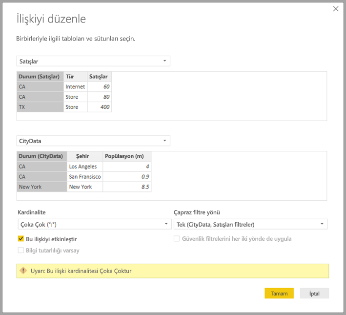
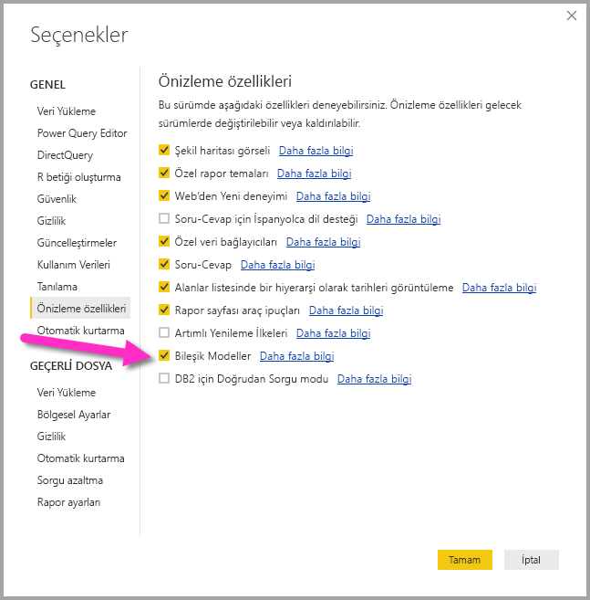

# Power BI Desktop’ta çoka çok ilişkiler (Önizleme)

**Power BI Desktop**'taki **Çoka çok ilişkisi** özelliğinde, **Çoka çok** kardinalitesini kullanarak tabloları birleştirebilir ve birden çok veri kaynağı içeren veri kaynaklarını daha kolay ve sezgisel bir şekilde oluşturabilirsiniz. **Çoka çok ilişkisi** özelliği, **Power BI Desktop**'taki daha kapsamlı **bileşik modeller** özelliğinin bir parçasıdır.

**Power BI Desktop**'taki **çoka çok ilişkileri** özelliği, birbiriyle ilişkili üç özelliğin koleksiyonudur:

* **Bileşik modeller** - raporda DirectQuery bağlantıları ve içeri aktarma da dahil olmak üzere herhangi bir birleşimde birden çok veri bağlantısına izin verir.
* **Çoka çok ilişkiler** - **bileşik modellerle** tablolar arasında **çoka çok ilişkiler** kurabilir, tablolarda benzersiz değer gereksinimlerini kaldırabilir ve yalnızca ilişkileri kurmak için yeni tablolar ekleme gibi önceden yapılacak geçici düzeltmelerden kurtulabilirsiniz. 
* **Depolama modu** - DirectQuery temelinde olsa bile arka uç veri kaynaklarını sorgulama gerektiren ve gerektirmeyen hangi görsellerin içeri aktarılacağını belirtebilir, böylelikle performansı geliştirir ve arka uç yükünü azaltırsınız. Daha önce, sorguları başlatan dilimleyiciler gibi basit görseller bile arka uç kaynaklara gönderiliyordu. 

**Bileşik modeller** için birbiriyle ilgili bu özellik koleksiyonundaki üç özelliğin her biri ayrı makalelerde ele alınıyor:

* **Bileşik modeller**, [Power BI Desktop’ta bileşik modeller (Önizleme)](desktop-composite-models.md) makalesinde ayrıntılarıyla açıklanır.
* Bu makalede ise **Çoka çok ilişkileri** açıklanır.
* **Depolama modu** kendi makalesinde ([Power BI Desktop'ta depolama modu (Önizleme)](desktop-storage-mode.md)) açıklanır.

## Çoka çok ilişkileri önizleme özelliğini etkinleştirme

**Çoka çok ilişkileri** özelliği **bileşik modeller** özelliklerinin bir parçasıdır, Önizleme aşamasındadır ve **Power BI Desktop**'ta etkinleştirilmesi gerekir. **Bileşik modeller** özelliğini etkinleştirmek için, **Dosya > Seçenekler ve Ayarlar > Seçenekler > Önizleme Özellikleri**’ni seçin ve ardından **bileşik modeller** onay kutusunu işaretleyin.

Özelliğin etkinleştirilmesi için **Power BI Desktop**'ı yeniden başlatmanız gerekir.

## Çoka çok ilişkileri nelere çözüm getirir?

**Çoka çok ilişkileri** kullanıma sunulmadan önce, Power BI'da iki tablo arasındaki ilişki tanımlanırken ilişkiye katılan sütunlardan en az birinin benzersiz değerler içermesi gerekiyordu. Öte yandan birçok durumda, tablodaki hiçbir sütun benzersiz değerler içermiyordu. 

Örneğin, iki tabloda da *Ülke* sütunu bulunabiliyor ama *Ülke* değerleri iki tabloda da benzersiz olmuyordu. Bu tür tabloları birleştirmek için, modele gerekli benzersiz değerleri içeren tablolar ekleme gibi geçici bir çözüm bulmak gerekiyordu. **Çoka çok ilişkileri** özelliği alternatif bir yaklaşım getirerek, bu tür tabloların **Çoka çok** kardinalitesi kullanılarak doğrudan birleştirilebilmesine olanak tanır.  

## Çoka çok ilişkilerini kullanma

Power BI'da iki tablo arasındaki ilişkiyi tanımlarken, ilişkinin kardinalitesini tanımlamanız gerekir. Örneğin, *ProductSales* ile *Product* arasındaki ilişki (*ProductSales[ProductCode]* ve *Product[ProductCode]* sütunları kullanılarak) **Çoka Bir** olarak tanımlanabilir çünkü her ürün için birçok satış vardır ve *Product* tablosundaki sütun *(ProductCode)* benzersizdir. İlişki kardinalitesini **Çoka Bir**, **Bire Çok** veya **Bire Bir** olarak tanımlarken, Power BI seçilen kardinalitenin gerçek verilerle eşleştiğinden emin olmak için doğrulama gerçekleştirir.

Örneğin, aşağıdaki görüntüde yer alan basit modele göz atalım.

Sonra *Product* tablosunun yalnızca iki satır içerdiğini varsayalım.

Ayrıca *Sales* tablosunun, *Product* tablosunda yer almayan (bilgi tutarlılığı hatası nedeniyle) **C** ürünün *Sales* değeriyle birlikte yalnızca dört satırı olduğunu da varsayalım.

*ProductName* ve *Price* (*Product* tablosundan) değerleriyle her ürünün toplam *Qty* değerini (*ProductSales* tablosundan) görüntüleyen görsel, aşağıdaki görüntüde gösterilene benzer olabilir: 

Önceki görüntüde de görebileceğiniz gibi, görselde *C* ürününün satışlarıyla ilişkilendirilmiş boş bir *ProductName* satırı olur. Bu boş satırın nedeni şunlardır:

* Bu örnekteki *C* ürünü için gördüğümüz gibi, *ProductSales* tablosundaki satırlardan herhangi birinin *Product* tablosunda ona karşılık gelen satırı yoksa; bu durumda bilgi tutarlılığı sorunu ortaya çıkar.

* *ProductSales* tablosunda, yabancı anahtar sütunu Null olan herhangi bir satır. 

Bu nedenlerden dolayı, her iki durumda da boş satır *ProductName* ve *Price* değerlerinin bilinmediği satışları gösterir.

Öte yandan, bazı durumlarda tablolar iki sütunla birleştirilebilir ama sütunlardan hiçbiri benzersiz değildir. Örneğin, aşağıdaki iki tabloyu inceleyin:

* *Sales* tablosu *State* temelinde satış verilerini içerir ve her satır o eyaletin (CA, WA ve TX eyaletleri) satış türüne ilişkin satış tutarını gösterir 

    

* *CityData* tablosu, şehirlerin nüfus ve eyalet (CA, WA ve New York eyaletleri) verilerini içerir

    

Her iki tabloda da *State* sütunu bulunur ve her Eyaletin toplam nüfusuyla birlikte *State* temelinde *Sales* toplamını raporlamak isteyebilirsiniz ama bir sorun vardır: *State* sütunu iki tabloda da benzersiz değildir. 

## Önceki geçici çözüm

**Power BI Desktop**'ın Temmuz 2018 öncesi sürümlerinde, doğrudan bu iki tablo arasında ilişki oluşturmak mümkün değildi. Bu soruna yaygın bir geçici çözüm olarak aşağıdakiler yapılırdı:

* Yalnızca benzersiz *State* kimliklerini içeren üçüncü bir tablo oluşturulur. Bu hesaplanan bir tablo (DAX kullanılarak tanımlanır) olabileceği gibi, **Sorgu Düzenleyicisi**'nde tanımlanmış bir sorgu kullanılarak tanımlanan ve tablolardan birinden alınmış benzersiz kimlikleri veya birleştirilmiş tam kümeyi içeren bir tabloda da olabilir.

* İki özgün tablo, yaygın **Çoka Bir* ilişkileri kullanılarak yeni tabloyla ilişkilendirilir.

Bu geçici çözüm tablosu görünür durumda bırakılabilir veya alan listesinde gösterilmeyecek şekilde gizlenebilir. İkinci durumda, **Çoka Bir** ilişkileri her iki yönden de filtrelenecek şekilde ayarlanabilir; şöyle ki, her iki tablonun *State* alanı kullanılabilir ve izleyen karşılıklı filtreleme diğer tabloya yayılır. Bu geçici çözüm yaklaşımı aşağıdaki **İlişki görünümü** görüntüsünde gösterilmiştir.

*State* (*CityData* tablosundan) ile toplam *Population* ve toplam *Sales* değerlerini gösteren bir görsel aşağıdaki gibi olacaktır.

Bu geçici çözümde *CityData* tablosundan eyalet değerinin kullanılmasıyla, yalnızca söz konusu tablodaki *State* değerlerinin listelendiğine (ve dolayısıyla TX eyaletinin hariç tutulduğuna) dikkat edin. Aynı zamanda, **Çoka Bir** ilişkilerinden farklı olarak, toplam satırı tüm *Sales* değerlerini (TX eyaletininkiler de dahil) içerirken ayrıntılar bu tür eşleşmeyen satırları kapsayan boş satırı içermez. Benzer biçimde, *State* için null değeri olan herhangi bir *Sales* değerini kapsayacak boş bir satır yoktur.

Bu görsele *City* de eklenirse, *City* başına nüfusun bilinmesi durumunda *City* için gösterilen *Sales* değeri, aşağıdaki görüntüde gösterildiği gibi yalnızca ilgili *State* için *Sales* değerini tekrarlayabilir (zaten herhangi bir toplama ölçüsüyle ilişkili olmayan bir sütunda gruplandırma yapıldığında da bu durum geçerlidir).

Yeni *Sales* tablosu bu geçici çözümdeki tüm *States* değerlerinin birleşimi olarak tanımlandıysa ve alan listesinde görünür durumdaysa, *State* ile (yeni tablodaki) toplam *Population* ve toplam *Sales* değerlerini gösteren aynı görsel aşağıdaki gibi olacaktır.

Bu durumda görselde gösterildiği gibi, *TX* (*Sales* değeri olan ama nüfusu bilinmeyen) ve *New York* (nüfusu bilinen ama *Sales* değeri olmayan) eyaletleri de eklenir. 

Sizin de görebileceğiniz gibi, bu geçici çözüm optimum değildir ve birçok sorunu vardır. **Çoka çok ilişkisinin** oluşturulmasıyla, aşağıdaki bölümde açıklandığı gibi bu sorunlara çözüm getirilmiştir.

## Geçici çözüm yerine çoka çok ilişkilerini kullanma

**Power BI Desktop**'ın Temmuz 2018'le başlayan sürümlerinde, önceki bölümde açıklanan türdeki tabloları bu tür geçici çözümlere başvurmak zorunda kalmadan doğrudan ilişkilendirebilirsiniz. Artık ilişkinin kardinalitesini hiçbir tablonun benzersiz değer içermediğini gösterecek şekilde **Çoka Çok** olarak ayarlayabilirsiniz. Bu tür ilişkiler için, hangi tablonun diğer tabloyu filtrelediğini denetleyebilir veya her iki tablo da birbirini filtrelediğinde iki yönlü filtreleme olmasını sağlayabilirsiniz.  

> [!NOTE]
> **Çoka Çok** ilişkiler oluşturabilme özelliği Önizleme aşamasındadır ve Önizleme sırasında Power BI hizmetine **Çoka Çok** ilişkilerin kullanıldığı modeller yayımlamak mümkün değildir. 

**Power BI Desktop**'ta, hiçbir tablonun ilişkideki sütunlar için benzersiz değerler içermediği saptandığında kardinalite varsayılan olarak **Çoka Çok** olarak ayarlanır. Bu tür durumlarda ilişki ayarının beklediğiniz davranışa uyduğunu, veri sorununa yol açan beklenmedik bir etkisi olmadığını onaylamak için bir uyarı görüntülenir. 

Örneğin, doğrudan *CityData* ile *Sales* arasında Filtrelerin *CityData*'dan*Sales* tablosuna geçeceği bir ilişki oluştururken, aşağıdaki görüntüde gösterilen ilişki iletişim kutusu görüntülenir.

Sonuçta elde edilen **İlişki Görünümü** iki tablo arasında doğrudan **Çoka Çok** ilişkisini içerebilir. **Alanlar** listesinin görünümü ve görseller oluşturulduğunda bunu izleyen davranış, önceki bölümde açıklanan ve fazladan tablonun (içinde ayrı *States* değerlerinin bulunduğu tablo) görünür olmadığı geçici çözümü kullanmakla aynıdır. Örneğin, geçici çözümün açıklandığı önceki bölümde olduğu gibi, *States* ile toplam nüfus ve satışların gösterildiği görsel şöyle olabilir.

Dolayısıyla **Çoka Çok** ilişkileri ile daha tipik olan **Çoka Bir** ilişkileri arasındaki en büyük farklar şunlardır.

* Gösterilen değerler, diğer tablodaki eşleşmeyen satırlara ve ilişkide kullanılan sütunun diğer tabloda null olan satırlarına karşılık gelen boş satırı içermez.
* *RELATED()* işlevini kullanmak mümkün değildir (çünkü birden çok satır ilişkili olabilir)
* Tabloda *ALL()* işlevinin kullanılması, bu tabloyla **Çoka Çok** ilişkisi olan diğer tablolara uygulanan filtreleri kaldırmaz. Örneğin, önceki örnekte aşağıdaki gibi tanımlanmış bir ölçü, ilişkili *CityData* tablosundaki sütunlarda bulunan filtreleri kaldırmaz:

    

    Dolayısıyla *State*, *Sales* ve *Sales total* değerlerini gösteren bir görsel aşağıdaki gibi olacaktır:

    

Bu nedenle, *genel toplamın yüzdesi* gibi *ALL(\<Tablo>)* kullanılarak yapılan hesaplamaların beklenen sonuçları döndürdüğünden emin olmak için özen gösterilmelidir. 

## Sınırlamalar ve önemli noktalar

**Çoka çok ilişkileri** ile **bileşik modellerin** bu sürümünde birkaç sınırlama vardır.

Aşağıdaki çok boyutlu kaynaklar **bileşik modellerle** kullanılamaz:

* SAP HANA
* SAP Business Warehouse
* SQL Server Analysis Services
* Power BI veri kümeleri

Söz konusu çok boyutlu kaynaklara DirectQuery kullanarak bağlandığınızda, başka bir DirectQuery kaynağına bağlanamaz veya içeri aktarılan verilerle birleştiremezsiniz.

DirectQuery kullanımının mevcut sınırlamaları **çoka çok ilişkilerini** kullanırken de geçerlidir. Bu sınırlamaların birçoğu şimdi tablonun **depolama moduna** bağlı olarak tablo başına uygulanır. Örneğin, içeri aktarılan tablodaki hesaplanan sütun başka tablolara başvurabilir ama DirectQuery tablosundaki hesaplanan sütunun başvurabileceği sütunlar yine aynı tablodaki sütunlarla sınırlıdır. Model içindeki tablolardan herhangi biri DirectQuery ise, diğer sınırlamalar modelin tamamına uygulanır. Örneğin, modelin içindeki tablolardan herhangi birinin **depolama modu** DirectQuery olduğunda, modelde **QuickInsights** ve **Soru ve Yanıt** özellikleri kullanılamaz. 

## Sonraki adımlar

Aşağıdaki makalelerde bileşik modellerle ilgili daha fazla açıklama ve DirectQuery'nin ayrıntılı açıklaması bulunabilir.

* [Power BI Desktop’ta Bileşik Modeller (Önizleme)](desktop-composite-models.md)
* [Power BI Desktop’ta depolama Modu (Önizleme)](desktop-storage-mode.md)

DirectQuery makaleleri:

* [Power BI'da DirectQuery kullanma](desktop-directquery-about.md)
* [Power BI'da DirectQuery tarafından desteklenen veri kaynakları](desktop-directquery-data-sources.md)

