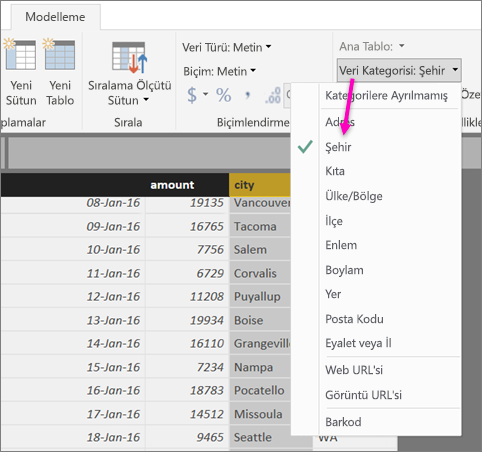
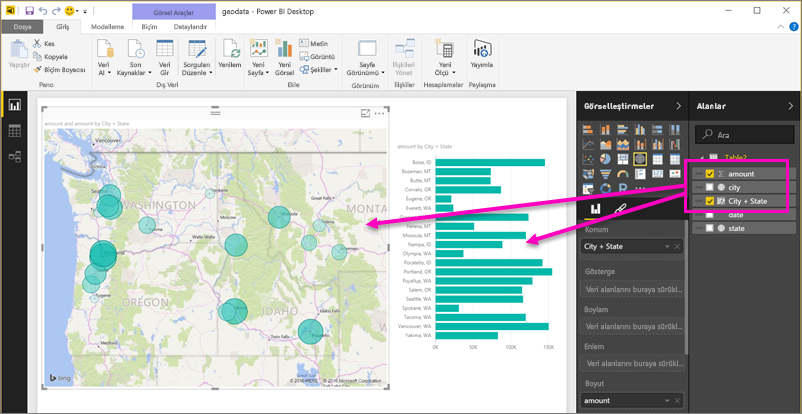
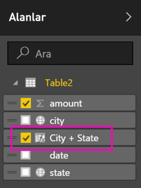
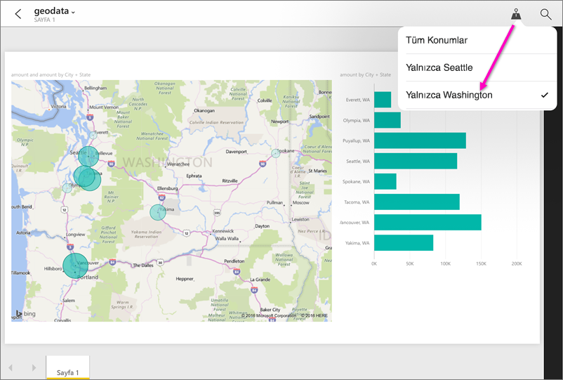

# Mobil uygulamalar için Power BI Desktop'ta coğrafi filtreler ayarlama
Power BI Desktop'ta bir sütunun [coğrafi verilerini kategorilere ayırarak](desktop-data-categorization.md) Power BI Desktop uygulamasının bir rapordaki görsellerde bulunan değerleri nasıl işlemesi gerektiğini belirleyebilirsiniz. Ayrıca siz veya iş arkadaşlarınız söz konusu raporu Power BI mobil uygulamalarında görüntülediğinizde Power BI, otomatik olarak bulunduğunuz konumlarla eşleşen coğrafi filtreler sağlar. 

Örneğin, müşterilerle toplantı yapmaya giden bir satış yöneticisi olduğunuzu ve ziyaret etmeyi planladığınız müşteriyle ilgili toplam satış ve gelir rakamlarını hızlıca filtrelemek istediğinizi düşünelim. Geçerli konumunuza ait verileri eyalet, şehir veya adres kullanarak detaylandırmak istiyorsunuz. Daha sonra zaman kalırsa yakınlardaki diğer müşterileri de ziyaret etmek istiyorsunuz. [Bu müşterileri bulmak için raporu konumunuza göre filtreleyebilirsiniz](consumer/mobile/mobile-apps-geographic-filtering.md).

> [!NOTE]
> Mobil uygulamada konuma göre filtreleme işlemini sadece raporda geçen coğrafi adlar "New York City" ya da "Germany" gibi İngilizce yazılmışsa gerçekleştirebilirsiniz.
> 
> 

## Raporunuzdaki coğrafi verileri tanımlama
1. Power BI Desktop'ta Veri Görünümüne geçin.
2. Şehir sütunu gibi coğrafi veriler içeren bir sütun seçin.
   
    
3. **Modelleme** sekmesinde **Veri Kategorisi**'ni ve ardından ilgili kategoriyi seçin. Bu örnekte **Şehir** kategorisi kullanılmıştır.
   
    
4. Modeldeki diğer alanlar için coğrafi veri kategorileri belirlemeye devam edin. 
   
   > [!NOTE]
   > Modeldeki her veri kategorisi için birden fazla sütun ayarlayabilirsiniz ancak bunu yaparsanız model Power BI mobil uygulamasında coğrafi filtre uygulayamaz. Mobil uygulamalarda coğrafi filtreleme özelliğini kullanmak üzere her kategori için yalnızca bir sütun seçin. Örneğin, tek bir **Şehir** sütunu, tek bir **Eyalet veya İl** sütunu ve tek bir **Ülke** sütunu. 
   > 
   > 

## Coğrafi verilerinizle görsel oluşturma
1. Rapor Görünümüne geçin ve verilerinizdeki coğrafi alanları kullanan görseller oluşturun. 
   
    
   
    Bu örnekte, modelde şehir ve eyaleti tek bir sütunda toplayan hesaplanmış sütun da mevcuttur. [Power BI Desktop'ta hesaplanmış sütun oluşturma](desktop-calculated-columns.md) hakkında bilgi edinin.
   
    
2. Raporu Power BI hizmetinde yayımlayın.

## Raporu Power BI mobil uygulamasında görüntüleme
1. Raporu herhangi bir [Power BI mobil uygulamasında](consumer/mobile/mobile-apps-for-mobile-devices.md) açın.
2. Rapordaki verilerin ait olduğu coğrafi konumlardan birindeyseniz konumunuza göre otomatik olarak filtrelenmesini sağlayabilirsiniz.
   
    

[Power BI mobil uygulamalarında bir raporu konuma göre filtreleme](consumer/mobile/mobile-apps-geographic-filtering.md) hakkında bilgi edinin.

## Sonraki adımlar
* [Power BI Desktop'ta verileri kategorilere ayırma](desktop-data-categorization.md)  
* Sorularınız mı var? [Power BI Topluluğu'na sorun](http://community.powerbi.com/)

