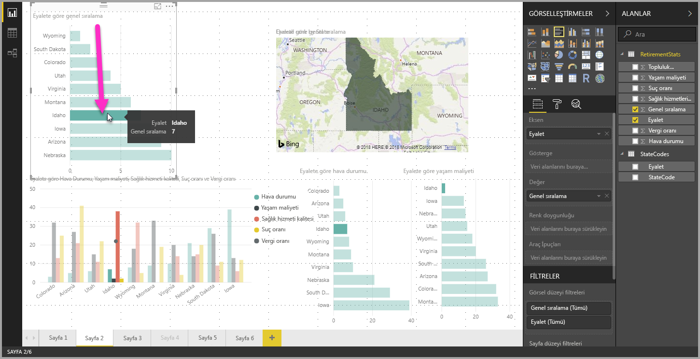
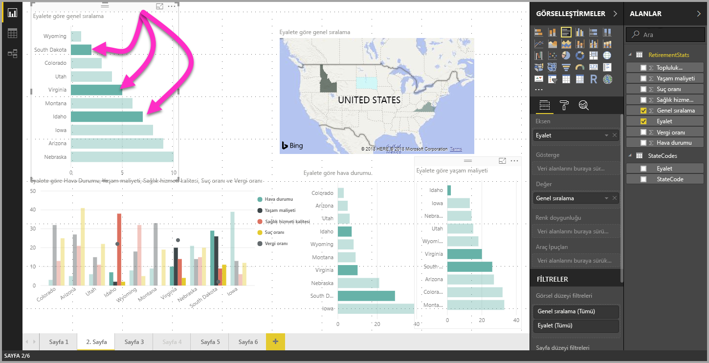

# Power BI Desktop kullanılırken görsellerde çoklu seçim veri öğeleri

**Power BI Desktop**’ta belirli bir görseldeki bir veri noktasını basitçe görselde veri noktasına tıklayarak vurgulu hale getirebilirsiniz. Örneğin, önemli bir çubuk veya grafik öğeniz varsa ve sayfadaki diğer görsellerin yaptığınız seçime göre verileri vurgulamasını istiyorsanız bir görselde veri öğesine tıklayabilir ve sonuçların sayfadaki diğer görsellerde yansıtıldığını görebilirsiniz. Bu, basit veya tekli seçim vurgulamadır. Aşağıdaki görüntüde basit bir vurgulama gösterilmektedir. 

Çoklu seçim ile artık **Power BI Desktop** rapor sayfanızda birden fazla veri noktası seçebilir ve sonucu sayfadaki tüm öğelerde vurgulayabilirsiniz. Bu, bir **ve** deyimine veya işlevine eşdeğerdir (örneğin, "Idaho **ve** Virginia için sonuçları vurgula"). Görsellerdeki veri noktalarına çoklu seçim uygulamak için basitçe **CTRL+Tıklama** ile birden çok veri noktasını seçin. Aşağıdaki resimde seçili olan **birden fazla veri noktası** (çoklu seçim) gösterilmiştir.

Bu basit bir özellik gibi görünse de rapor oluşturma, paylaşma ve raporlarla etkileşim kurma konusunda birçok yeni fırsat sağlar. 

## Sonraki adımlar

Aşağıdaki makaleler de ilginizi çekebilir:

* [Power BI Desktop raporlarında kılavuz çizgilerini ve kılavuza yaslama işlevini kullanma](desktop-gridlines-snap-to-grid.md)
* [Power BI raporlarındaki filtreler ve vurgulama hakkında](power-bi-reports-filters-and-highlighting.md)

