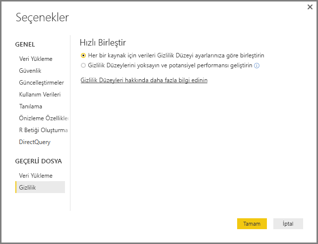
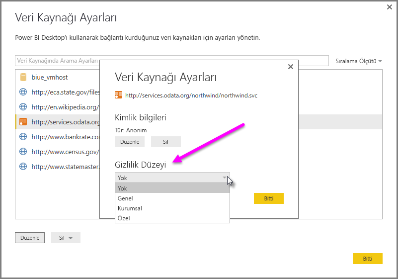

# Power BI Desktop gizlilik düzeyleri
**Power BI Desktop**'ta gizlilik düzeyleri, bir veri kaynağının diğer veri kaynaklarından ne ölçüde yalıtılacağını tanımlayan bir yalıtım düzeyi belirtir. Kısıtlayıcı bir yalıtım düzeyi bilgilerin veri kaynakları arasında paylaşılmasını engellese de işlevselliği azaltabilir ve performansı etkileyebilir.

**Dosya > Seçenekler ve ayarlar > Seçenekler** yoluna gidildiğinde ve ardından **Geçerli Dosya > Gizlilik**'e ulaşıldığında görüntülenebilen **Gizlilik Düzeyleri** ayarı, Power BI Desktop'ın verileri birleştirirken Gizlilik Düzeyi ayarınızı kullanıp kullanmadığını belirler. Bu iletişim kutusunda, Gizlilik Düzeyleri hakkındaki bir Power BI Desktop belgesine (bu makale) yönelik bir bağlantı bulunur.

 Her bir veri kaynağına ilişkin **Gizlilik** ayarları iletişim kutusuna **Dosya > Seçenekler ve ayarlar > Veri kaynağı ayarları** yolunu izleyerek de ulaşabilirsiniz. Veri kaynağını seçin ve ardından **Düzenle**'yi seçin. Aşağıdaki görüntüde gösterildiği gibi, alt kısmındaki açılan menüden uygun gizlilik düzeyini seçebileceğiniz **Veri Kaynağı Ayarları** iletişim kutusu görüntülenir.

 

> [!CAUTION]
> Yüksek düzeyde gizli veya hassas veriler içeren veri kaynaklarını **Gizli** olarak yapılandırmanız gerekir.
> 
> 

## Gizlilik düzeyi yapılandırma
Gizlilik düzeyi ayarlarını kullanarak, bir veri kaynağının diğer veri kaynaklarından ne ölçüde yalıtılacağını tanımlayan bir yalıtım düzeyi belirtebilirsiniz.

| Ayar | Açıklama | Örnek Veri Kaynakları |
| --- | --- | --- |
| **Gizli veri kaynağı** |**Gizli** veri kaynakları gizli veya hassas bilgiler içerir ve veri kaynağının görünürlüğü yetkili kullanıcılarla sınırlandırılabilir. Gizli veri kaynakları diğer veri kaynaklarından tamamen yalıtılır. |Facebook verileri, hisse ikramiyeler içeren bir metin dosyası veya çalışan inceleme bilgilerinin bulunduğu bir çalışma kitabı. |
| **Kuruluş veri kaynağı** |**Kuruluş** veri kaynakları bir veri kaynağının görünürlüğünü güvenilen bir grup kullanıcıyla sınırlar. **Kuruluş** veri kaynakları tüm **Genel** veri kaynaklarından yalıtılır ancak diğer **Kuruluş** veri kaynaklarından yalıtılmaz. |İzinlerin güvenilen bir grup için etkinleştirildiği, intranet SharePoint sitesindeki bir **Microsoft Word** belgesi. |
| **Genel veri kaynağı** |**Genel** veri kaynaklarında bulunan veriler herkes tarafından görülebilir. Yalnızca dosyalar, internet veri kaynakları veya çalışma kitabı verileri **Genel** olarak işaretlenebilir. |Microsoft Azure Marketi'ndeki ücretsiz veriler, Wikipedia sayfalarındaki veriler veya bir web sayfasından kopyalanmış veriler içeren yerel bir dosya |

## Gizlilik düzeyi ayarlarını yapılandırma
Her bir veri kaynağına ilişkin **Gizlilik** ayarları iletişim kutusuna **Dosya > Seçenekler ve ayarlar > Veri kaynağı ayarları** yolunu izleyerek de ulaşabilirsiniz.

Bir veri kaynağı gizlilik düzeyi yapılandırmak için, veri kaynağını seçin ve **Düzenle** seçeneğini belirleyin. Aşağıdaki görüntüde gösterildiği gibi, alt kısmındaki açılan menüden uygun gizlilik düzeyini seçebileceğiniz **Veri Kaynağı Ayarları** iletişim kutusu görüntülenir.

> [!CAUTION]
> Yüksek düzeyde gizli veya hassas veriler içeren veri kaynaklarını **Gizli** olarak yapılandırmanız gerekir.
> 

## Gizlilik Düzeylerini yapılandırma
Varsayılan **Gizlilik Düzeyleri** ayarı **Her bir kaynak için verileri Gizlilik Düzeyi ayarlarınıza göre birleştirin** olarak belirlenir ve bu, **Gizlilik Düzeyleri**'nin henüz etkinleştirilmediğini gösterir.

| Ayar | Açıklama |
| --- | --- |
| **Her bir kaynak için verileri Gizlilik Düzeyi ayarlarınıza göre birleştirin** (Açıktır ve varsayılan ayardır) |Gizlilik düzeyi ayarları, veri birleştirme sırasında veri kaynakları arasındaki yalıtım düzeyini belirlemek için kullanılır. |
| **Gizlilik Düzeylerini yoksayın ve potansiyel performansı geliştirin** (kapalı) |Veriler birleştirilirken gizlilik düzeyleri hesaba katılmaz ancak verilerin performansı ve işlevselliği artabilir. |

> **Güvenlik Notu:** **Gizlilik Düzeyleri** iletişim kutusunda **Gizlilik Düzeylerini yoksayın ve potansiyel performansı geliştirin** seçeneği belirlenerek **Gizlilik Düzeyleri**'nin etkinleştirilmesi, gizli veya hassas verilerin yetkisiz bir kullanıcı tarafından görülebilmesine neden olabilir. Veri kaynağının gizli veya hassas veriler içermediğinden emin olmadığınız sürece **Gizlilik Düzeylerini** etkinleştirmeyin.
> 
> 

**Gizlilik Düzeylerini yapılandırma**

Power BI Desktop'ta veya Sorgu Düzenleyicisi'nde, **Dosya > Seçenekler ve ayarlar > Seçenekler** seçeneğini ve ardından **Geçerli Dosya > Gizlilik** seçeneğini belirleyin.

a. **Her bir kaynak için verileri Gizlilik Düzeyi ayarlarınıza göre birleştirin** seçili olduğunda, veriler Gizlilik Düzeyleri ayarınıza göre birleştirilir. Gizlilik yalıtım alanları arasında veri birleştirmek verilerin arabelleğe alınmasına neden olur.

b. **Gizlilik Düzeylerini yoksayın ve potansiyel performansı geliştirin** seçili olduğunda, veriler Gizlilik Düzeyleriniz yok sayılarak birleştirilir ve bu nedenle, gizli veya hassas veriler yetkisiz bir kullanıcı tarafından görülebilir. Bu ayarın belirlenmesi performansı ve işlevselliği artırabilir.

> **Güvenlik Notu:** **Gizlilik Düzeylerini yoksayın ve potansiyel performansı geliştirin** seçeneğinin belirlenmesi, performansı iyileştirebilir ancak Power BI Desktop dosyasında birleştirilen verilerin gizliliğini garanti edemez.
> 
> 

