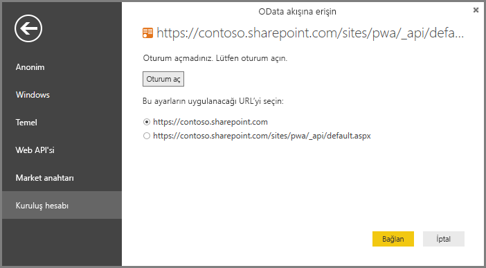

# Project Online: Power BI Desktop aracılığıyla verilere bağlanma
Power BI Desktop aracılığıyla Project Online verilerinize bağlanabilirsiniz.

### 1. Adım: Power BI Desktop'ı indirme
1. [Power BI Desktop'ı indirip](http://go.microsoft.com/fwlink/?LinkID=521662) yükleyiciyi çalıştırarak **Power BI Desktop** uygulamasını bilgisayarınıza yükleyin.

### 2. Adım: OData ile Project Online'a bağlanma
1. **Power BI Desktop**'ı açın.
2. *Hoş Geldiniz* ekranında **Veri Al**'ı seçin.
3. **OData akışı**'nı ve ardından **Bağlan**'ı seçin.
4. URL kutusuna OData akışınızın adresini girip Tamam'a tıklayın.
   
   Project Web sitenizin adresi https://\<kiracıadı\>.sharepoint.com/sites/pwa gibiyse OData Akışı için girmeniz gereken adres https://\<kiracıadı\>.sharepoint.com/sites/pwa/\_api/Projectdata şeklinde olacaktır.
   
   Biz bu örnekte https://contoso.sharepoint.com/sites/pwa/default.aspx seçeneğini kullanıyoruz.
5. Power BI Desktop, Office 365 hesabınızla kimlik doğrulamasından geçmenizi isteyecektir. Kuruluş hesabınızı seçip kimlik bilgilerinizi girin.
   
   

Lütfen OData akışına bağlanmak için kullandığınız hesabın, Project Web App sitesine en az Portföy Görüntüleyicisi düzeyinde erişim izni olması gerektiğini unutmayın. 

Buradan bağlanmak istediğiniz tabloları seçebilir ve sorgu oluşturabilirsiniz.  Nereden başlayacağınızı bilemiyor musunuz?  Aşağıdaki blog gönderisi, Project Online verilerinizden ilerleme grafiği oluşturmayı göstermektedir.  Blog gönderisinde, Project Online'a bağlanmak için Power Query kullanılmaktadır ancak aynı adımlar Power BI Desktop için de geçerlidir.

[Creating burndown charts for Project using Power Pivot and Power Query (Power Pivot ve Power Query kullanarak Project Online için ilerleme grafiği oluşturma)](http://blogs.office.com/2014/03/24/creating-burndown-charts-for-project-using-power-pivot-and-power-query/)

