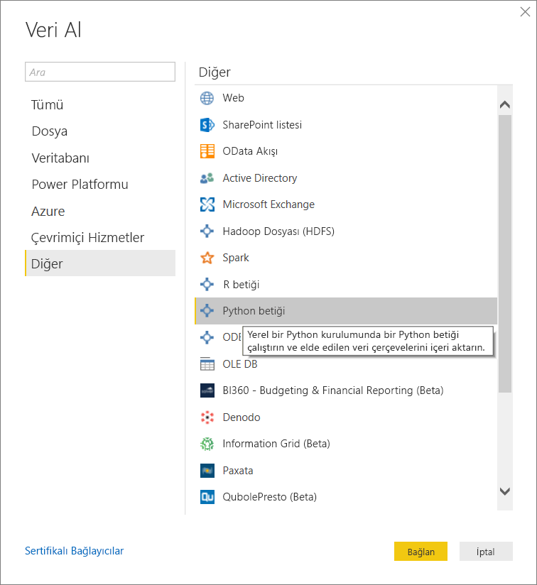
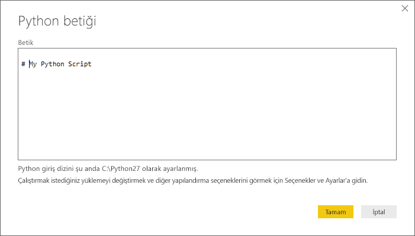
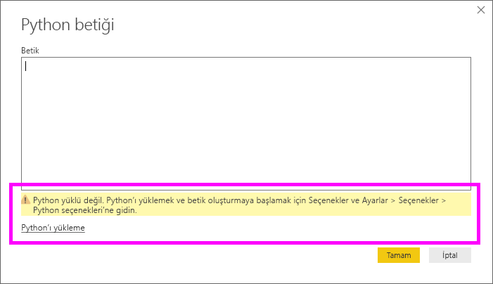
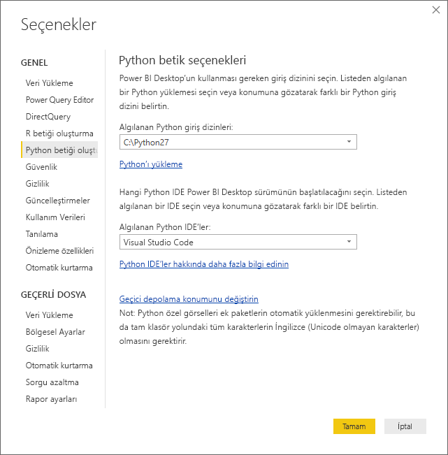

# Power BI Desktop'ta Python Betikleri Çalıştırma
**Power BI Desktop**'ta Python betiklerini doğrudan çalıştırabilir ve elde edilen veri kümelerini bir Power BI Desktop veri modeline aktarabilirsiniz.

## Python'ı Yükleme
Power BI Desktop'ta Python betikleri çalıştırabilmek için yerel makinenize **Python** yüklemeniz gerekir. **Python**’ı [Resmi Python indirme sayfası](https://www.python.org/) ve [Anaconda](https://anaconda.org/anaconda/python/) da dahil olmak üzere birçok konumdan ücretsiz olarak indirim yükleyebilirsiniz. Python betiklerinin Power BI Desktop'taki güncel sürümü, yükleme yolunda Unicode karakterlerin yanı sıra boşlukların (boş karakterler) olmasını da destekler.

## Python betiklerini çalıştırma
Power BI Desktop’ta yalnızca birkaç basit adım uygulayarak Python betikleri çalıştırabilir ve bir veri modeli oluşturabilirsiniz. Bu modeli kullanarak raporlar oluşturabilir ve raporları Power BI hizmetinde paylaşabilirsiniz.

### Python betiği hazırlama
Power BI Desktop'ta bir Python betiği çalıştırmak için yerel Python geliştirme ortamınızda betiği oluşturun ve başarıyla çalıştığından emin olun.

Betiği Power BI Desktop'ta çalıştırmak için, söz konusu betiğin yeni ve değiştirilmemiş bir çalışma alanında başarıyla çalıştığından emin olun. Bu, tüm paket ve bağımlılıkların açık bir şekilde yüklenmesi ve çalıştırılması gerektiği anlamına gelir.

Power BI Desktop'ta bir Python betiğini hazırlamaya ve çalıştırmaya ilişkin bazı sınırlamalar vardır:

* Yalnızca Pandas veri çerçeveleri içeri aktarıldığından, Power BI'a aktarmak istediğiniz verilerin bir veri çerçevesinde gösterildiğinden emin olun
* 30 dakikadan uzun süren herhangi bir Python betiği çalıştırma işlemi zaman aşımına uğrar
* Python betiğindeki etkileşimli çağrılar (kullanıcı girişinin beklenmesi gibi) betik yürütme işlemini durdurur
* Python betiğindeki çalışma dizinini ayarlarken çalışma dizinine yönelik bir tam yol (göreli yol yerine) tanımlamanız *gerekir*
* İç içe yerleştirilmiş tablolar (tabloların tablosu) şu anda desteklenmemektedir 

### Python betiğinizi çalıştırma ve verileri içeri aktarma
1. Power BI Desktop'ta Python Betiği veri bağlayıcısını **Veri Al** penceresinde bulabilirsiniz. Python Betiğinizi çalıştırmak için, aşağıda gösterilen şekilde **Veri Al&gt; Diğer...** seçeneğini belirleyin ve ardından **Diğer &gt; Python betiği**’ni seçin:
   
   
2. Yerel makinenizde Python yüklüyse Python altyapınız olarak en son yüklenen sürüm seçilir. Betiğinizi kopyalayıp betik penceresine yapıştırmanız ve **Tamam**'ı seçmeniz yeterlidir.
   
   
3. Python yüklü değilse, tanımlanmamışsa veya yerel makinenizde birden çok yüklemesi varsa uyarı görüntülenir.
   
   
   
   Python yükleme ayarları, Seçenekler iletişim kutusunun Python Betiği Oluşturma bölümünde bulunur. Python yükleme ayarlarınızı belirtmek için **Dosya > Seçenekler ve ayarlar**’ı seçin, sonra da **Seçenekler > Python betiği oluşturma** seçeneğini belirleyin. Birden fazla Python yüklemesi varsa, kullanacağınız yüklemeyi seçmenize olanak sağlayan bir açılan menü görüntülenir. **Diğer** seçeneğini belirleyip özel yol da sağlayabilirsiniz.
   
   
4. Python Betiğini çalıştırmak için **Tamam**'ı seçin. Betik başarıyla çalıştırıldığında, oluşturulan veri çerçevelerini seçip Power BI modeline ekleyebilirsiniz.

### Yenile
Power BI Desktop'ta bir Python betiğini yenileyebilirsiniz. Bir Python betiğini yenilediğinizde Power BI Desktop, Python betiğini Power BI Desktop ortamında yeniden çalıştırır.

## Sonraki adımlar
Power BI'da Python kullanımı ile ilgili aşağıdaki ek bilgilere göz atın.

* [Power BI Desktop'ta Python Görselleri Oluşturma](desktop-python-visuals.md)
* [Power BI ile harici bir Python IDE kullanma](desktop-python-ide.md)