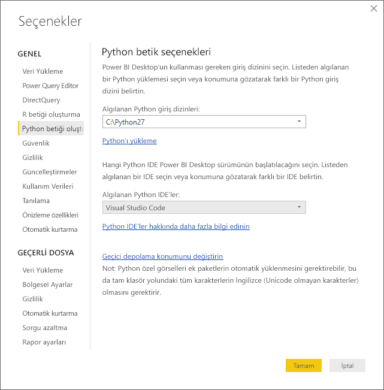
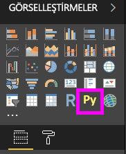
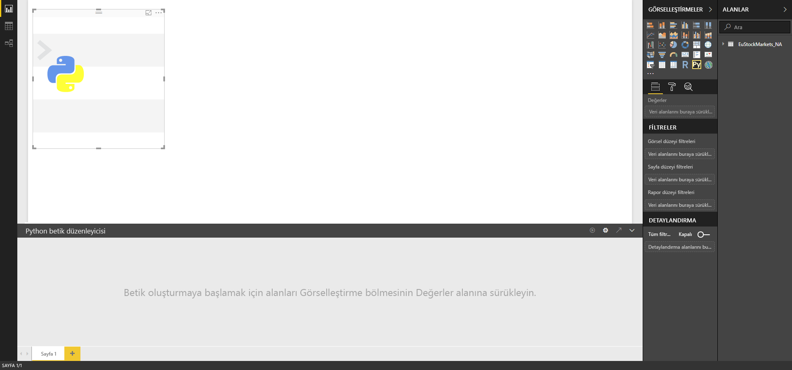
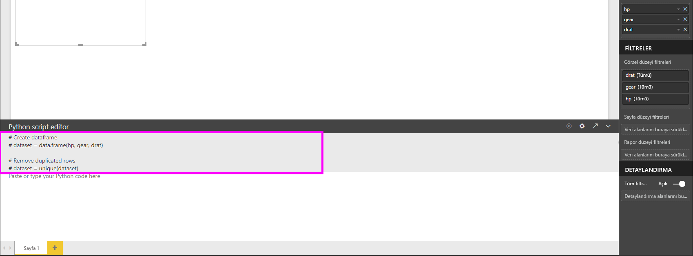
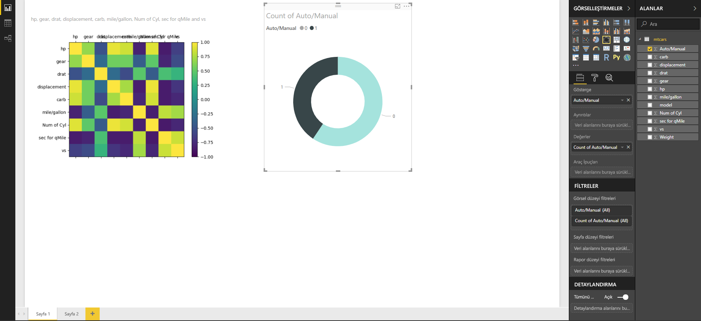
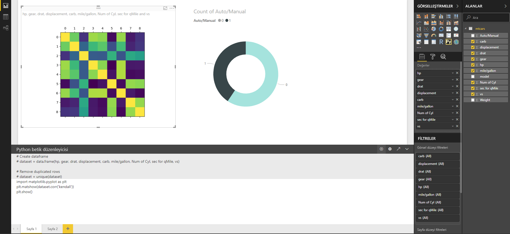
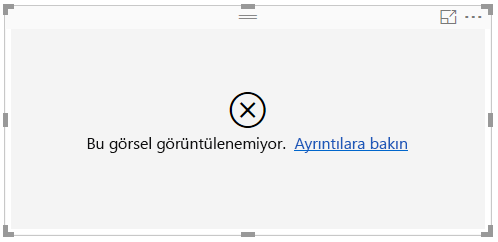

# Python programlama dilini kullanarak Power BI görselleri oluşturma
**Power BI Desktop** ile verilerinizi görselleştirmek için **Python** programlama dilini kullanabilirsiniz.

## Python'ı yükleme
**Power BI Desktop**, **Python** altyapısını içermez, dağıtmaz veya yüklemez. **Power BI Desktop**'ta Python betikleri çalıştırmak için yerel bilgisayarınıza **Python**'ı ayrıca yüklemeniz gerekir. **Python**’ı [Resmi Python indirme sayfası](https://www.python.org/) ve [Anaconda](https://anaconda.org/anaconda/python/) da dahil olmak üzere birçok konumdan ücretsiz olarak indirim yükleyebilirsiniz. Python betiklerinin Power BI Desktop'taki güncel sürümü, yükleme yolunda Unicode karakterlerin yanı sıra boşlukların (boş karakterler) olmasını da destekler.

## Python görsellerini etkinleştirme
Python görsellerini etkinleştirmek için **Dosya > Seçenekler ve ayarlar > Seçenekler** öğesini seçin. Görüntülenen **Seçenekler** sayfasında, aşağıda gösterildiği şekilde, **Seçenekler** penceresinin **Python betiği oluşturma** bölümünde yerel Python yüklemenizin belirtildiğinden emin olun. Aşağıdaki görüntüde, yerel Python yüklemesinin yolu **C:\Python27** şeklindedir ve bu yol, metin kutusunda açıkça belirtilmektedir. Görüntülenen yolun, **Power BI Desktop**'ın kullanmasını istediğiniz yerel Python yüklemesini doğru şekilde yansıttığından emin olun.
   
   

Python yüklemenizi belirttiğinizde Python görselleri oluşturmaya başlayabilirsiniz.

## Power BI Desktop'ta Python görselleri oluşturma
1. Bir Python görseli eklemek için, aşağıdaki görüntüde gösterilen şekilde, **Görsel Öğeler** bölmesindeki **Python Görseli** simgesini seçin.
   
   

   Bir rapora Python görseli eklediğinizde **Power BI Desktop** şu işlemleri gerçekleştirir:
   
   - Rapor tuvalinde bir yer tutucu Python görseli görüntüsü görünür.
   
   - Orta bölmenin alt kısmında **Python betik düzenleyicisi** görünür.
   
   

2. Daha sonra, Python betiğinizde kullanmak istediğiniz alanları, diğer **Power BI Desktop** görsellerinde yaptığınız gibi **Alanlar** bölmesindeki **Değerler** bölümüne ekleyin. 
    
    Yalnızca **Alanlar** kutusuna eklenmiş alanlar Python betiğinizle kullanılabilir. Ayrıca, **Power BI Desktop Python betik düzenleyicisinde** Python betiğinizle çalışırken **Alanlar** bölmesine yeni alan ekleyebilir veya gereksiz alanları bu bölmeden çıkarabilirsiniz. **Power BI Desktop**, hangi alanları eklediğinizi veya kaldırdığınızı otomatik olarak algılar.
   
   > [!NOTE]
   > Python görselleri için varsayılan toplama işlemi *özetleme*'dir.
   > 
   > 
   
3. Artık bir çizim oluşturmak için seçtiğiniz verileri kullanabilirsiniz. 

    Siz alan seçtikçe **Python betik düzenleyicisi**, düzenleyici bölmesinin üst kısmında bulunan gri bölümde yaptığınız seçimlere bağlı olarak yardımcı Python betiği bağlama kodunu oluşturur. Yeni alan seçtiğinizde veya var olan bir alanı kaldırdığınızda Python betik düzenleyicisinde yardımcı kod otomatik olarak oluşturulur veya kaldırılır.
   
   Aşağıdaki görüntüde gösterilen örnekte hp, gear ve drat olmak üzere üç alan seçilmiştir. Bu seçimlerin sonucunda Python betik düzenleyicisi, aşağıdaki bağlama kodunu oluşturmuştur:
   
   * **dataset** adlı bir veri çerçevesi oluşturulmuştur
     * Bu veri çerçevesi, kullanıcı tarafından seçilen farklı alanlardan oluşmaktadır
   * Varsayılan toplama türü, *özetleme* şeklindedir
   * Tablo görsellerinde olduğu gibi alanlar da gruplandırılır ve yinelenen satırlar yalnızca bir kez görünür
   
   
   
   > [!TIP]
   > Bazı durumlarda, otomatik gruplandırma işleminin gerçekleştirilmesini istemeyebilir veya yinelenenler de dahil olmak üzere tüm satırların görünmesini isteyebilirsiniz. Böyle durumlarda veri kümenize bir dizin alanı ekleyebilirsiniz. Böylece, tüm satırların benzersiz olduğu kabul edilir ve gruplandırma yapılması önlenir.
   > 
   > 
   
   Oluşturulan veri çerçevesi **dataset** olarak adlandırılır ve seçilen sütunlara, adlarıyla erişebilirsiniz. Örneğin, Python betiğinizde *dataset["gear"]* yazarak gear alanına erişin.

4. Seçtiğiniz alanlara göre otomatik olarak oluşturulan veri çerçevesi ile Python betiği yazmaya hazır hale gelirsiniz. Python betiği yazdığınızda, varsayılan Python cihazında bir çizim oluşturulur. Betik tamamlandığında **Python betik düzenleyicisi** başlık çubuğunda **Çalıştır**'ı seçin (**Çalıştır** seçeneği, başlık çubuğunun sağ tarafında bulunur).
   
    **Çalıştır**’ı seçtiğinizde **Power BI Desktop**, çizimi tanımlar ve tuval üzerinde görüntüler. İşlem yerel Python yüklemenizde gerçekleştirildiğinden, gerekli paketlerin yüklendiğinden emin olun.
   
   **Power BI Desktop**, aşağıdaki olaylardan herhangi biri meydana geldiğinde görseli yeniden çizer:
   
   * **Python betik düzenleyicisi** başlık çubuğunda **Çalıştır** seçeneğini belirlediğinizde
   * Veri yenileme, filtreleme veya vurgulama işlemi nedeniyle her veri değişikliği gerçekleştiğinde

    Aşağıdaki görüntüde bağıntı çizim koduna ilişkin bir örnek ve farklı otomobil türlerinin öznitelikleri arasındaki bağıntılara ilişkin bir çizim gösterilmektedir.

    

5. Görselleştirmelerin daha büyük bir görünümünü elde etmek için **Python betik düzenleyicisi**'ni simge durumuna küçültebilirsiniz. **Power BI Desktop**'taki diğer görsellerde olduğu gibi, halka görselinde (yukarıdaki örnek görüntüsünde, sağdaki yuvarlak görsel) yalnızca spor otomobilleri seçerek bağıntı çiziminde çapraz filtre uygulayabilirsiniz.

    

6. Ayrıca, görseli özelleştirmek için Python betiğini değiştirebilir ve çizim oluşturma komutuna parametre ekleyerek Python programlama dilinin gücünden yararlanabilirsiniz.

    Başlangıçta, çizim oluşturma komutu şu şekildeydi:

    plt.matshow(dataset.corr('pearson'))

    Python betiğinde yapılan birkaç değişikliğin ardından yeni komut şu şekildedir:

    plt.matshow(dataset.corr('kendall'))

    Sonuç olarak Python görseli aşağıdaki görüntüde gösterildiği gibi Kendall Tau bağıntı katsayısını kullanarak çizim yapar.

    

    Bir Python betiği yürütülürken hata oluşursa Python görseli çizilmez ve tuvalde bir hata iletisi görüntülenir. Hataya ilişkin ayrıntılar için, tuvalde görüntülenen Python görseli hata iletisinde **Ayrıntılara göz atın** seçeneğini belirleyin.

    

    > **Python betiklerinin güvenliği:** Python görselleri, güvenlik veya gizlilik riskleri taşıyan kodlar içerebilecek Python betiklerinden oluşturulur. Bir Python görselini ilk kez görüntülemeye veya Python görseliyle ilk kez etkileşim kurmaya çalışan kullanıcılar bir güvenlik uyarısı iletisiyle karşılaşır. Python görsellerini yalnızca, yazara ve kaynağa güvenmeniz halinde veya ilgili Python betiğini gözden geçirip anladıktan sonra etkinleştirin.
    > 
    > 

## Bilinen sınırlamalar
**Power BI Desktop**'ta Python görsellerine ilişkin bazı sınırlamalar mevcuttur:

* Veri boyutu sınırlamaları: Python görseli tarafından çizim için kullanılan veri 150.000 satırla sınırlıdır. 150.000'den fazla satır seçilirse yalnızca ilk 150.000 satır kullanılır ve görüntünün üzerinde bir ileti görüntülenir.
* Hesaplama süresi sınırlaması: Bir Python görseli hesaplaması beş dakikadan uzun sürerse betik zaman aşımına uğrar ve bir hata oluşur.
* İlişkiler: Diğer Power BI Desktop görsellerinde olduğu gibi, aralarında tanımlanmış hiçbir ilişki bulunmayan farklı tablolardan veri alanları seçilirse hata oluşur.
* Python görselleri veri güncelleştirme, filtreleme ve vurgulama işlemlerinden sonra yenilenir. Ancak, görüntünün kendisi etkileşimli değildir ve çapraz filtrelemenin kaynağı olamaz.
* Python görselleri diğer görselleri vurgulama işlemine yanıt verir ancak diğer öğelere çapraz filtreleme uygulamak için Python görselindeki öğelere tıklayamazsınız.
* Yalnızca varsayılan Python görüntüleme cihazında çizilen çizimler tuval üzerinde doğru şekilde görüntülenir. Farklı bir Python görüntüleme cihazını açıkça kullanmaktan kaçının.

## Sonraki adımlar
Power BI'da Python kullanımı ile ilgili aşağıdaki ek bilgilere göz atın.

* [Power BI Desktop'ta Python Betikleri Çalıştırma](desktop-python-scripts.md)
* [Power BI ile harici bir Python IDE kullanma](desktop-python-ide.md)

