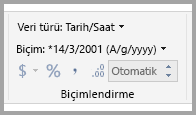
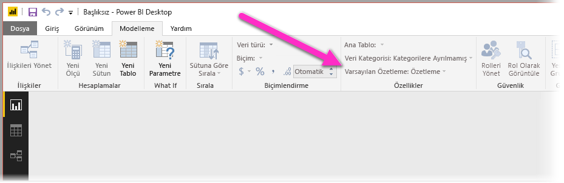
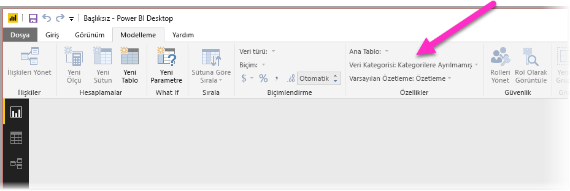
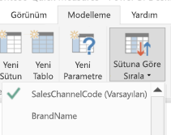
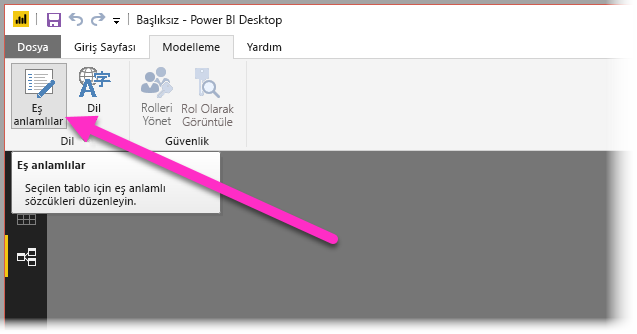
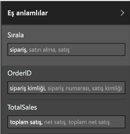

# Doğal dil sorguları için Power BI Desktop'taki Soru-Cevap özelliğini kullanın
Yaygın ifadeler ve doğal dil kullanarak verilerinize soru sorabilmek çok değerli bir olanaktır. Daha da değerlisi, verilerinizin yanıt vermesi. İşte **Power BI Desktop**’taki Soru-Cevap ile bunu yapabilirsiniz.

Yanıtlayabileceği büyük soru koleksiyonunu başarıyla yorumlayabileceği şekilde etkinleştirilmesi için Soru-Cevap özelliğinin modelle ilgili varsayımlar yapması gerekir. Modelinizin yapısı bu varsayımlardan birini veya daha fazlasını karşılamıyorsa modelinizi ayarlamanız gerekir. Bu Soru-Cevap ayarları, özelliği kullanıp kullanmadığınızdan bağımsız olarak Power BI’daki herhangi bir model için en iyi yöntem iyileştirmeleridir. 

Aşağıdaki bölümlerde, modelinizi nasıl Power BI’daki Soru-Cevap ile iyi çalışacak şekilde ayarlayabileceğiniz açıklanmıştır.

## Eksik ilişkileri ekleme

Modelinizde tablolar arası ilişkiler eksikse ve bunlar hakkında soru sorarsanız ne Power BI rapor oluşturur ne de Soru-Cevap bu tabloların nasıl birleştirileceğini yorumlayabilir. İlişkiler, iyi bir modelin köşetaşlarından biridir. Örneğin, *siparişler* tablosu ile *müşteriler* tablosu arasındaki ilişki eksikse “Seattle müşterileri için toplam satış miktarını” soramazsınız. Aşağıdaki resimlerde, üzerinde çalışılması gereken bir model ve Soru-Cevap için hazır olan bir modelle ilgili örnekler gösterilmiştir.

**Üzerinde çalışılması gerekiyor**

**Soru-Cevap için Hazır**

## Tabloları ve sütunları yeniden adlandırma

Soru-Cevap için tablo ve sütun seçimi çok önemlidir. Örneğin, müşterilerinizin listesini içeren *MüşteriÖzeti* adlı bir tablonuz varsa “Chicago’daki müşterileri listele” yerine “Chicago’daki müşterilerin özetlerini listele” gibi sorular sormanız gerekir. 

Soru-Cevap, bazı temel sözcük bölme ve çoğul algılama işlemlerini gerçekleştirebilse de tablo ve sütun adlarınızın içeriği doğru bir şekilde yansıttığını varsayar.

Başka bir örnek verelim. Çalışanların ad, soyadı ve numaralarını içeren *Sayım* adlı bir tablonun yanı sıra, çalışan numaralarını, iş numaralarını ve başlangıç tarihlerini içeren, *Çalışanlar* adlı bir tablonuz olduğunu varsayın. Modeli tanıyan kişiler için bu adlar anlaşılabilir olsa da başka birisi “çalışanların sayısını” sorduğunda, istediği cevap yerine her çalışanın daha önce yaptığı tüm işlerin sayısını ifade eden “Çalışanlar” tablosundaki satırların sayısı sunulur. Bu tabloların içeriği doğru yansıtacak şekilde yeniden adlandırılması çok daha iyi olur.

**Üzerinde çalışılması gerekiyor**

**Soru-Cevap için Hazır**

## Hatalı veri türlerini düzeltin

İçeri aktarılan veriler hatalı veri türleri içerebilir. Özellikle de *dize* olarak içeri aktarılan *tarih* and *sayı* sütunları, Soru-Cevap tarafından tarih ve sayı olarak yorumlanmaz. Power BI modelinizde doğru veri türünü seçtiğinizden emin olmalısınız.

## Yıl ve tanımlayıcı sütunlarını Özetleme olarak işaretleyin

Power BI, varsayılan olarak sayısal sütunları agresif bir şekilde topladığından, “yıla göre toplam satış” gibi sorular bazen genel satış toplamının yanı sıra genel yıl toplamı gibi sonuçlara yol açabilir. Bu Power BI davranışını önlemek istediğiniz belirli sütunlarınız varsa bunlardaki **Özetleme Ölçütü** özelliğini **Özetleme** olarak ayarlayın. En sık sorun yaşatan sütunlar **yıl**, **ay**, **gün** ve **kimlik** sütunları olduğundan, bunlara özen gösterin. Toplanması mantıklı olmayan *yaş* gibi diğer sütunlar için de **Özetleme Ölçütü** özelliğinin **Özetleme** veya **Ortalama** olarak ayarlanması yararlı olabilir. Bu ayarı **Modelleme** sekmesinde bulabilirsiniz.

## Her tarih ve coğrafya sütunu için bir Veri Kategorisi seçin

**Veri Kategorisi**, bir sütunun içeriğiyle ilgili olarak veri türünün ötesinde ek anlamsal bilgi sağlar. Örneğin, bir tamsayı sütunu Posta Kodu olarak işaretlenmiş, bir dize sütunu Şehir, Ülke, Bölge, vb. işaretlenmiş olabilir. Bu bilgiler Soru-Cevap tarafından iki önemli şekilde kullanılır: Görselleştirme seçimi ve dil sapmaları için.

İlk olarak, Soru-Cevap ne tür görsel öğeler kullanılacağına karar verilmesine yardımcı olmak için **Veri Kategorisi** bilgilerini kullanır. Örneğin, tarih veya saat **Veri Kategorilerine** sahip olan sütunları genellikle bir çizgi grafiğin yatay ekseni ya da bir kabarcık grafiğinin oynatma ekseni için iyi bir tercih olarak tanır. Coğrafi **Veri Kategorilerine** sahip sütunları içeren sonuçlarınsa bir haritada iyi görünebileceğini varsayar.

İkinci olarak, Soru-Cevap belirli soru türlerinin anlaşılmasını kolaylaştırmak için kullanıcıların tarih ve coğrafya sütunları hakkında nasıl konuşabileceğine dair bilgiye dayalı bazı tahminler yapar. Örneğin, “A kişisi ne zaman işe alındı? sorusundaki “ne zaman” ifadesinin bir tarih sütunuyla eşlenmesi neredeyse kesindir ve “Ağrıdaki müşterileri say” sorusundaki “Ağrı” sözcüğünün bir hastalıktan ziyade bir şehri ifade etmesi daha olasıdır.

## İlgili sütunlar için bir Sütuna Göre Sıralama seçin

**Sütuna Göre Sırala** özelliği, bir sütundaki sıralamanın otomatik olarak bunun yerine başka bir sütuna göre uygulanmasına imkan tanır. Örneğin, “müşterileri gömlek bedenine göre sırala” komutunu verirseniz muhtemelen Gömlek Bedeni sütununuzun alfabetik sıralama (L, M, S, XL, XS) yerine temel beden numarasına göre (XS, S, M, L, XL) sıralanmasını istersiniz.

## Modelinizi normalleştirin

Tabii ki modelinizi tamamen yeniden şekillendirmeniz gerektiğini söylemiyoruz. Bununla birlikte, Soru-Cevap’ın başa çıkamayacağı kadar zor olan belirli yapılar vardır. Modelinizin yapısında bazı temel normalleştirme işlemleri gerçekleştirirseniz, hem Power BI raporlarının kullanılabilirliği hem de Soru-Cevap sonuçlarının doğruluğu önemli ölçüde artar.

Şu genel kuralı izlemelisiniz: Kullanıcının bahsettiği her benzersiz “şey”, tam olarak bir model nesnesiyle (tablo veya sütun) temsil edilmelidir. Kullanıcılarınız müşterilerden bahsediyorsa bir *müşteri* nesnesi olmalıdır. Kullanıcılarınız satıştan bahediyorsa bir *satış* nesnesi olmalıdır. Kulağa basit geliyor, değil mi? Başlangıçta sahip olduğunuz verilerin durumuna bağlı olarak basit olabilir. Gerekirse **Sorgu Düzenleyicisi**’ndeki zengin veri biçimlendirme özelliklerinden yararlanabilirsiniz, ancak daha basit olan çoğu işlem yalnızca Power BI modelindeki hesaplamalar kullanılarak gerçekleştirilebilir.

Aşağıdaki bölümler, gerçekleştirmeniz gerekebilecek bazı yaygın dönüşümleri içermektedir.

### Çok sütunlu varlıklar için yeni tablolar oluşturun

Daha büyük bir tablo içinde tek başına ayrı bir birim görevi gören birden çok sütununuz varsa, bu sütunlar bir tablo olarak ayrılmalıdır. Örneğin, *Şirketler* tablonuzda İlgili Kişi Adı, İlgili Kişinin Unvanı ve İlgili Kişinin Telefonu sütunları varsa, Ad, Unvan ve Telefon’un yanı sıra *Şirketler* tablosunun bir bağlantısını içeren ayrı bir *İlgili Kişiler* tablosunun olması daha iyi bir tasarım olur. Bu, hangi şirkette çalıştıkları fark etmeksizin ilgili kişiler hakkında şirketlerden bağımsız olarak sorular sormayı önemli ölçüde kolaylaştırır ve görüntüleme esnekliğini geliştirir.

**Üzerinde çalışılması gerekiyor**

**Soru-Cevap için Hazır**

### Özellik paketlerini ortadan kaldırmak için özetleme

Modelinizde özellik paketleri varsa bunlar özellik başına tek bir sütun içerecek şekilde yeniden yapılandırılmalıdır. Özellik paketleri çok sayıda özelliğin yönetilmesi için kullanışlı olsa da ne Power BI tarafından raporlanan ne de Soru-Cevap’ın çözüm bulabileceği bir dizi doğal sınırlamaya sahiptir.

Örneğin, Müşteri Kimliği, Özellik ve Değer sütunlarına sahip olan ve her satırın aynı müşteri için farklı bir özelliği (örneğin, yaş, medeni durum, şehir, vb.) temsil ettiği bir *MüşteriDemografisi* tablosunu göz önünde bulundurun. Özellik sütununun içeriğine bağlı olarak Değer sütununa ek anlamlar yüklenmesi, Soru-Cevap’ın buna başvuran çoğu sorguyu yorumlamasını imkansız hale getirir. “Her müşterinin yaşını göster” gibi basit bir komut, “özelliğin yaş olduğu yerlerde müşterileri ve müşterilerin demografik bilgilerini göster” olarak yorumlanabileceğinden işe yarayabilir. Bununla birlikte, modelin yapısı biraz daha karmaşık olan “Chicago’daki müşterilerin ortalama yaşı” gibi soruları desteklemez. Power BI raporlarını doğrudan yazan kullanıcılar bazen istedikleri verilere ulaşmanın akıllı yollarını bulabilse de Soru-Cevap yalnızca her sütunun tek bir anlamı olduğunda çalışır.

**Üzerinde çalışılması gerekiyor**

**Soru-Cevap için Hazır**

### Bölümlemeyi ortadan kaldırmak için birleştirme

Verilerinizi birden çok tabloya böldüyseniz veya birden çok sütundaki değerleri özetlediyseniz, kullanıcılarınızın belirli yaygın işlemleri gerçekleştirmesi zor veya imkansız olabilir. İlk olarak tipik bir tablo bölümlemeyi göz önünde bulundurun: bir *Satış2000-2010* tablosu ile bir *Satış2011-2020* tablosu. Tüm önemli raporlarınız belirli bir on yıllık dönemle sınırlanmışsa Power BI raporları için değişiklik yapmanız gerekmeyebilir. Ne var ki, Soru-Cevap’ın esnekliği sayesinde kullanıcılarınız “yıla göre toplam satış” gibi soruların cevaplarını bekler. Bunun olabilmesi için verileri tek bir Power BI model tablosunda birleştirmeniz gerekir.

Benzer şekilde, normal bir özetlenmiş değer sütununu ele alalım: Yazar, Kitap, Şehir1, Şehir2 ve Şehir3 sütunlarını içeren *KitapTuru* tablosu. Böyle bir yapıda, "şehre göre kitap sayısı" gibi basit sorular bile doğru yorumlanamaz. Bunun işe yaraması için şehir değerlerini tek bir sütunda birleştiren *KitapTuruŞehirleri* tablosu oluşturmanız gerekir.

**Üzerinde çalışılması gerekiyor**

**Soru-Cevap için Hazır**

### Biçimlendirilmiş sütunları bölme

Verilerinizi içeri aktardığınız kaynak biçimlendirilmiş sütunlar içeriyorsa Power BI raporları (ve Soru-Cevap) sütunun içine ulaşarak içeriği ayıklamaz. Bu nedenle, örneğin adres, şehir ve ülkeyi içeren bir **Açık Adres** sütununuz varsa, kullanıcılarınızın her birini tek tek sorgulayabilmesi için bunu Adres, Şehir ve Ülke sütunlarına bölmeniz gerekir.

**Üzerinde çalışılması gerekiyor**

**Soru-Cevap için Hazır**

Benzer şekilde, bir kişi için tam ad sütunlarınız varsa, kısmi ad kullanılarak soru sorulmak istenmesi ihtimaline karşı **Ad** ve **Soyadı** sütunlarını eklemeniz gerekir. 

### Çok değerli sütunlar için yeni tablolar oluşturun

Yine benzer şekilde, vVerilerinizi içeri aktardığınız kaynak çok değerli sütunlar içeriyorsa Power BI raporları (ve Soru-Cevap) sütunun içine ulaşarak içeriği ayıklamaz. Örneğin, bir şarkı için birden çok bestecinin adını içeren bir Besteci sütununuz varsa bunu ayrı bir *Besteciler* tablosunda birden çok satıra bölmeniz gerekir.

**Üzerinde çalışılması gerekiyor**

**Soru-Cevap için Hazır**

### Etkin olmayan ilişkileri ortadan kaldırmak için normalleştirmeyi geri alın

“Normalleştirme daha iyidir” kuralının tek istisnası, bir tablodan diğerine ulaşmak için birden çok yol olduğunda görülür. Örneğin, her biri *Şehirler* tablosuyla ilişkili olacak şekilde hem KaynakŞehirKimliği hem de HedefŞehirKimliği sütununu içeren bir *Uçuşlar* tablonuz varsa, bu ilişkilerden biri etkin değil olarak işaretlenmelidir. Soru-Cevap yalnızca etkin ilişkileri kullanabildiğinden, hangisini seçtiğinize bağlı olarak kaynak veya hedef hakkında soru soramazsınız. Bunun yerine, *Uçuşlar* tablosunda şehir adı sütunlarının normalleştirmesini kaldırırsanız şöyle sorular sorabilirsiniz: “yarınki kaynak şehri Seattle, hedef şehri San Francisco olan uçuşları listele.”

**Üzerinde çalışılması gerekiyor**

**Soru-Cevap için Hazır**

### Tablo ve sütunlara eş anlamlılar ekleme

Bu adım, genel olarak Power BI raporları için değil özel olarak Soru-Cevap için geçerlidir. Kullanıcılar genellikle aynı şeyden bahsederken çeşitli terimler (toplam satış, net satış, toplam net satış gibi) kullanır. Power BI modeli, bu eş anlamlıların model içindeki tablo ve sütunlara eklenmesine olanak sağlar. 

Bu çok önemli bir adım olabilir. Tablo ve sütun adları kolay olsa bile Soru-Cevap kullanıcıları, önceden tanımlanmış bir sütun listesinden seçim yaparak değil akıllarına ilk gelen sözcükleri kullanarak soru sorar. Ne kadar çok mantıklı eş anlamlı eklerseniz kullanıcılarınızın raporla ilgili deneyimi o kadar iyi olur. Eş Anlamlılar eklemek için **İlişkiler** görünümünde, aşağıdaki resimde gösterildiği gibi şeritten Eş anlamlılar düğmesini seçin.

**Power BI Desktop**’ın sağ tarafında**Eş anlamlılar** alanı görünür ve aşağıdaki resimde gösterildiği gibi buradan eş anlamlılar ekleyebilirsiniz.

 Aynı eş anlamlının birden çok sütuna ve tabloya eklenmesi belirsizliğe yol açacağından bu konuda dikkatli olun. Soru-Cevap, belirsiz eş anlamlılar arasından seçim yapmak için mümkün olduğunda bağlamı kullanır, ancak ehr soru için yeterli bağlam yoktur. Örneğin, kullanıcınız “müşterileri say” komutunu verdiğinde, modelinizde “müşteri” eş anlamlısını içeren üç öğe varsa doğru cevap sağlanmayabilir. Böyle durumlarda, farklı ifadeler için birincil eş anlamlı kullanılacağından bunun benzersiz olduğundan emin olun. Bu, belirsizlik konusunda kullanıcıyı uyarıp (örneğin, “arşivlenen müşteri kaydı sayısını göster” sorusunun farklı ifade edilmesi) sorunun farklı bir şekilde sorulması gerektiğine dair ipucu verebilir.

## Sonraki adımlar
Power BI Desktop’taki özellikler hakkında daha fazla bilgi edinmek için şu makalelere göz atın:

* [Power BI Desktop'ta detaylandırma özelliğini kullanma](desktop-drillthrough.md)
* [Bir pano kutucuğunu veya rapor görselini Odak modunda görüntüleme](service-focus-mode.md)

