# Power BI Desktop'ta sorgulara genel bakış
**Power BI Desktop** ile veri dünyasına bağlanabilir, ilgi çekici ve temel nitelikte raporlar oluşturabilir ve çalışmanızı başkalarıyla paylaşabilirsiniz. Bu kişiler de çalışmanızı temel alıp kendi iş zekası çalışmalarını geliştirir.

Power BI Desktop'ta üç görünüm vardır:

* **Rapor** görünümü: İstediğiniz gibi görünen, birden çok sayfa içeren ve başka kullanıcılarla paylaşabileceğiniz ilgi çekici görselleştirmeler elde etmek için oluşturduğunuz sorguları kullanabilirsiniz
* **Veri** görünümü: Raporunuzdaki verileri, veri modeli biçiminde görebilir; ölçüler ekleyebilir, yeni sütunlar oluşturabilir ve ilişkileri yönetebilirsiniz
* **İlişkiler** görünümü: Veri modelinizde oluşturulan ilişkilerin grafik gösterimini elde edebilir ve bunları, gereken şekilde yönetebilir veya değiştirebilirsiniz.

Bu görünümlere, Power BI Desktop'ın sol tarafındaki üç simgeden birini seçerek erişebilirsiniz. Aşağıdaki görüntüde Rapor görünümü seçilmiştir ve bu seçim, simgenin yan tarafındaki sarı şerit ile belirtilmiştir.  

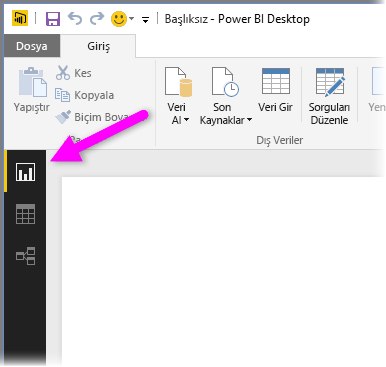

Power BI Desktop ile birlikte sunulan **Sorgu Düzenleyicisi**'ni kullanarak bir veya daha çok veri kaynağına bağlanabilir, verileri ihtiyaçlarınızı karşılayacak biçimde şekillendirip dönüştürebilir ve ilgili modeli Power BI Desktop'a yükleyebilirsiniz.

Bu belgede, **Sorgu Düzenleyicisi**'nde verilerle çalışmaya yönelik bir genel bakış sağlanmıştır. Öğrenecekleriniz elbette bunlarla sınırlı değil. Desteklenen veri türleri, verilere bağlanma, verileri şekillendirme, ilişki oluşturma ve çalışmaya başlama hakkında ayrıntılı yönergeler içeren bağlantıları bu belgenin sonunda bulabilirsiniz.

Öncelikle **Sorgu Düzenleyicisi**'ni tanıyalım.

## Sorgu Düzenleyicisi
**Sorgu Düzenleyicisi**'ne ulaşmak için Power BI Desktop'ın **Giriş** sekmesinde **Sorguları Düzenle**'yi seçin.  

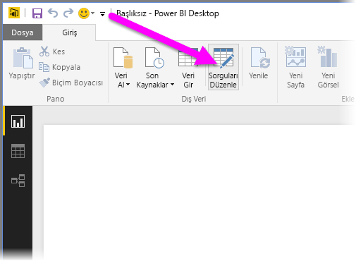

Hiçbir veri bağlantısı olmadığında **Sorgu Düzenleyicisi** veri almaya hazır, boş bir bölme olarak görünür.  

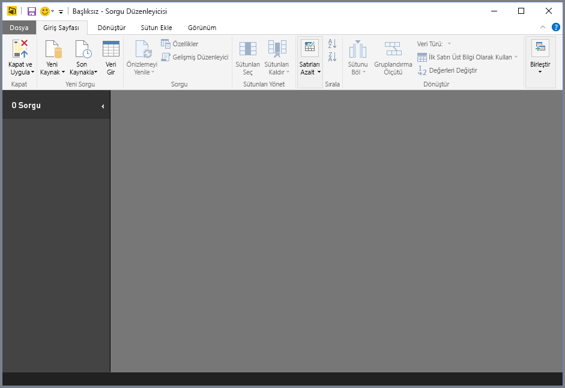

Bir sorgu yüklendikten sonra **Sorgu Düzenleyicisi** daha ilgi çekici hale gelir. Aşağıdaki Web veri kaynağına bağlanırsak **Sorgu Düzenleyicisi**, verilerle ilgili bilgileri yükler ve verileri şekillendirmeye başlayabilirsiniz.

[*http://www.bankrate.com/finance/retirement/best-places-retire-how-state-ranks.aspx*](http://www.bankrate.com/finance/retirement/best-places-retire-how-state-ranks.aspx)

Veri bağlantısı oluşturulduktan sonra **Sorgu Düzenleyicisi** aşağıdaki gibi görünür:

1. Sorgudaki verilerle etkileşim kurabilmeniz için şeritteki birçok düğmenin etkinleştirildiğini görürsünüz
2. Sol bölmede sorgular listelenir; bu sorguları seçebilir, görüntüleyebilir ve şekillendirebilirsiniz
3. Ortadaki bölmede, seçilen sorgudaki veriler görüntülenir ve bu veriler şekillendirilebilir
4. Sorgunun özelliklerinin ve uygulanan adımların listelendiği **Sorgu Ayarları** penceresi görünür  
   
   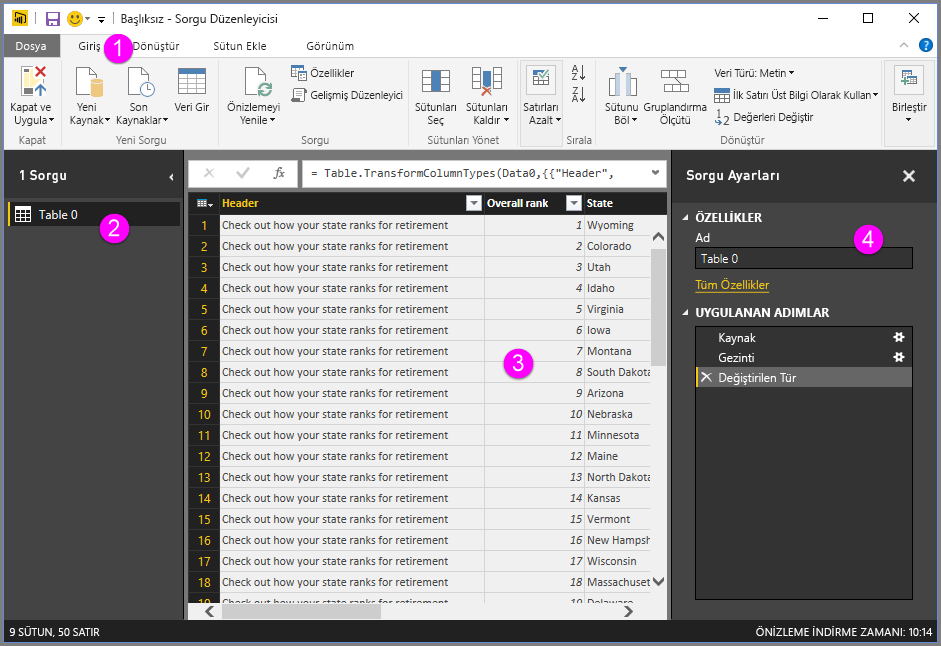

Bu dört alanın (şerit, sorgular bölmesi, veri görünümü ve Sorgu Ayarları bölmesi) her birini aşağıdaki bölümlerde ele alacağız.

## Sorgu şeridi
**Sorgu Düzenleyicisi**'ndeki şerit **Giriş**, **Dönüştür**, **Sütun Ekle** ve **Görünüm** olmak üzere dört sekmeden oluşur.

**Giriş** sekmesinde, tüm sorguların ilk adımı olarak kullanılan **Veri Al** düğmesi de dahil olmak üzere sık kullanılan sorgu görevlerini bulabilirsiniz. Aşağıdaki görüntüde **Giriş** şeridi gösterilmektedir.  

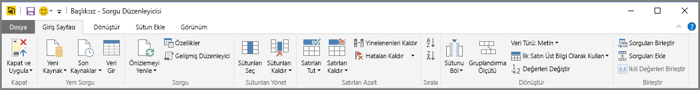

Verilere bağlanmak ve sorgu oluşturma işlemine başlamak için **Veri Al** düğmesini seçin. En yaygın veri kaynaklarının listelendiği bir menü belirir.  

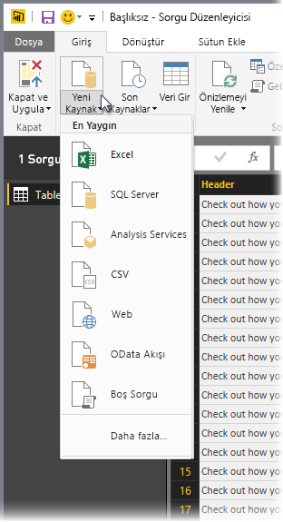

Mevcut veri kaynakları hakkında daha fazla bilgi için bkz. **Veri Kaynakları**. Örnekler ve adımlar da dahil olmak üzere verilere bağlanma hakkında bilgi edinmek için bkz. **Verilere Bağlanma**.

**Dönüştür** sekmesinde; sütun ekleme veya kaldırma, veri türlerini değiştirme, sütunları bölme ve diğer veri tabanlı görevler gibi sık kullanılan veri dönüştürme görevlerine erişebilirsiniz. Aşağıdaki görüntüde **Dönüştür** sekmesi gösterilmektedir.  

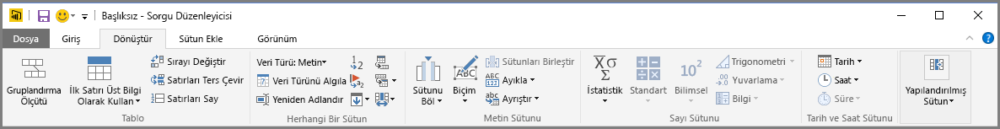

Örnekler de dahil olmak üzere veri dönüştürme hakkında daha fazla bilgi edinmek için bkz. **Verileri Birleştirme ve Şekillendirme**.

**Sütun Ekle** sekmesinde; sütun ekleme, sütun verilerini biçimlendirme ve özel sütunlar ekleme ile ilişkili ek görevler bulunur. Aşağıdaki görüntüde **Sütun Ekle** sekmesi gösterilmektedir.  

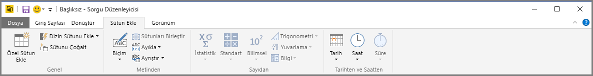

Şeritteki **Görünüm** sekmesi, belirli bölmelerin veya pencerelerin görüntülenip görüntülenmeyeceğini belirlemek için kullanılır. Gelişmiş Düzenleyici'yi görüntülemek için de kullanılır. Aşağıdaki görüntüde **Görünüm** sekmesi gösterilmektedir.  

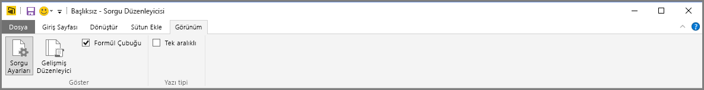

Şeritte sunulan görevlerin birçoğunu, orta bölmede bir sütuna veya diğer verilere sağ tıklayarak da kullanabileceğinizi unutmayın.

## Sol bölme
Sol bölmede, etkin sorgu sayısının yanı sıra sorgunun adı görüntülenir. Sol bölmede bir sorguyu seçtiğinizde bu sorgunun verileri orta bölmede görüntülenir ve orta bölmede verileri ihtiyaçlarınıza göre şekillendirip dönüştürebilirsiniz. Aşağıdaki görüntüde, birden fazla sorgu içeren sol bölme gösterilmektedir.  

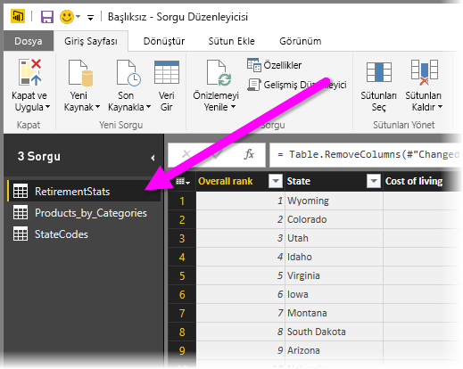

## Orta bölme (veri bölmesi)
Orta bölmede (veya Veri bölmesinde) seçilen sorgudaki tarihler görüntülenir. Sorgu görünümündeki çalışmanın büyük kısmı burada gerçekleşir.

Aşağıdaki görüntüde, daha önce kurulan Web veri bağlantısı görüntülenmektedir. **Overall score** sütunu seçilmiştir ve kullanılabilir menü öğelerinin gösterilmesi için bu sütunun başlığına sağ tıklanmıştır. Sağ tıklandığında görüntülenen menü öğelerinin birçoğunun, şerit sekmelerindeki düğmelerle aynı olduğu görülmektedir.  

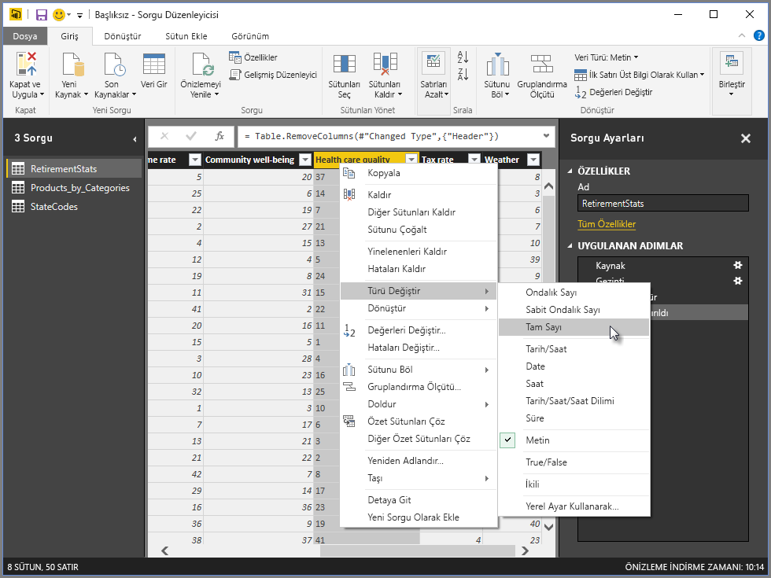

Sağ tıklandığında görüntülenen menü öğelerinden birini (veya şeritteki bir düğmeyi) seçtiğinizde Sorgu, ilgili adımı verilere uygular ve sorgunun parçası olarak kaydeder. Sonraki bölümde açıklandığı üzere, adımlar sıralı şekilde **Sorgu Ayarları**'nda kaydedilir.  

## Sorgu Ayarları bölmesi
**Sorgu Ayarları** bölmesi, sorgu ile ilişkili tüm adımların görüntülendiği yerdir. Örneğin, aşağıdaki görüntüde; **Sorgu Ayarları** bölmesinin **Uygulanan Adımlar** bölümünde, **Overall score** sütununun türünü değiştirdiğimiz gösterilmektedir.

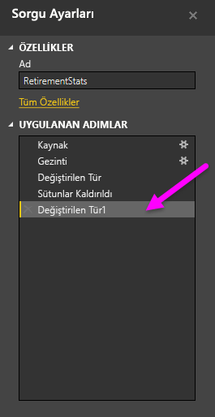

Sorguda uygulanan ek şekillendirme adımları, **Uygulanan Adımlar** bölümünde kaydedilir.

Temel alınan verilerin *değiştirilmediğini* bilmek önemlidir. Sorgu Düzenleyicisi, veri görünümünü ayarlayıp şekillendirir ve temel alınan verilerle kurulan herhangi bir etkileşim, ilgili verilerin Sorgu Düzenleyicisi tarafından şekillendirilen ve değiştirilen hali temel alınarak gerçekleştirilir.

**Sorgu Ayarları** bölmesinde adımları istediğiniz şekilde yeniden adlandırabilir, silebilir veya yeniden sıralayabilirsiniz. Bunun için **Uygulanan Adımlar** bölümünde adıma sağ tıklayın ve görünen menüde seçim yapın. Tüm sorgu adımları, **Uygulanan Adımlar** bölmesinde görünen sırada gerçekleştirilir.

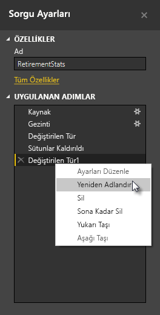

## Gelişmiş Düzenleyici
Sorgu Düzenleyicisi'nin her adımda oluşturduğu kodu görmek veya kendi şekillendirme kodunuzu oluşturmak isterseniz **Gelişmiş Düzenleyici**'yi kullanabilirsiniz. Gelişmiş düzenleyiciyi başlatmak için şeritte **Görünüm**'ü ve ardından **Gelişmiş Düzenleyici**'yi seçin. Var olan sorgu kodunu gösteren bir pencere görünür.  
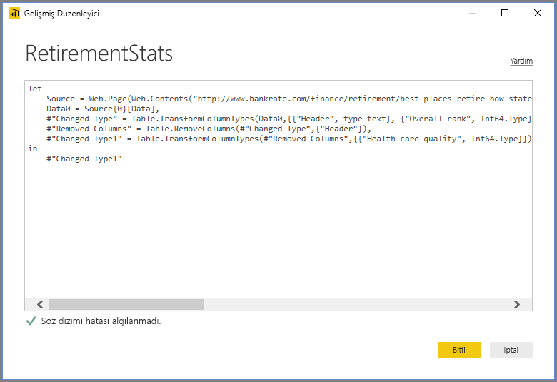

**Gelişmiş Düzenleyici** penceresinde kodu doğrudan düzenleyebilirsiniz. Pencereyi kapatmak için **Bitti** veya **İptal** düğmesini seçin.  

## Çalışmanızı kaydetme
Sorgunuz istediğiniz gibi olduğunda Sorgu Düzenleyicisi'nin, değişiklikleri Power BI Desktop'taki veri modelinde uygulamasını sağladıktan sonra Sorgu Düzenleyicisi'ni kapatabilirsiniz. Bunu yapmak için Sorgu Düzenleyicisi'nin **Dosya** menüsünden **Kapat & Uygula**'yı seçin.  
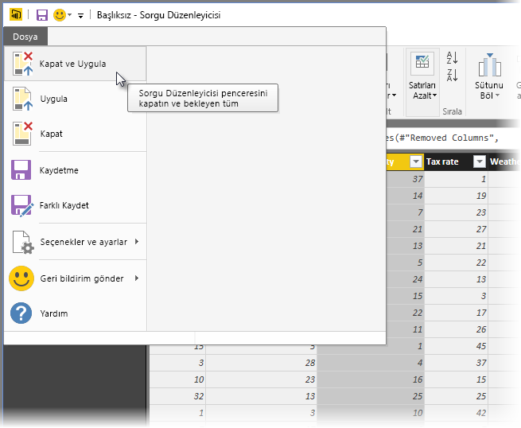

Power BI Desktop, ilerleme kaydedildiğinde durumu görüntülemek için bir iletişim kutusu sunar.  
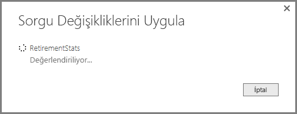

Sorgunuz istediğiniz gibi olduğunda veya çalışmanızın kaydedildiğinden emin olmak istediğinizde Power BI Desktop, çalışmanızı .pbix dosyası biçiminde kaydedebilir.

Çalışmanızı kaydetmek için aşağıdaki görüntüde gösterildiği üzere, **Dosya \> Kaydet**'i (veya **Dosya \> Farklı Kaydet**) seçin.  
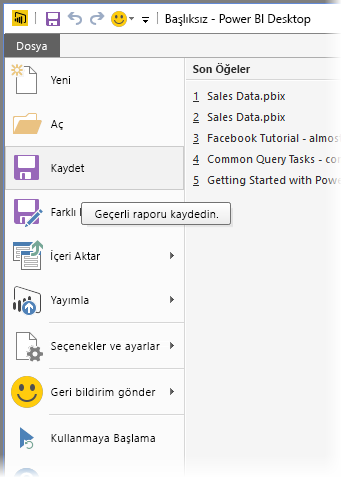

## Sonraki adımlar
Power BI Desktop ile yapabileceğiniz çok şey var. Özellikler hakkında daha fazla bilgi edinmek için aşağıdaki kaynaklara bakın:

* [Power BI Desktop nedir?](desktop-what-is-desktop.md)
* [Power BI Desktop'ta Veri Kaynakları](desktop-data-sources.md)
* [Power BI Desktop'taki Verilere Bağlanma](desktop-connect-to-data.md)
* [Power BI Desktop'ta Verileri Şekillendirme ve Birleştirme](desktop-shape-and-combine-data.md)
* [Power BI Desktop'taki Genel Sorgu Görevleri](desktop-common-query-tasks.md)   

