# Sık kullanılan ve etkili hesaplamaları kolayca gerçekleştirmek için Hızlı ölçümler özelliğini kullanma
**Hızlı ölçümler** özelliğini kullanarak kolayca sık kullanılan, etkili hesaplamalar gerçekleştirebilirsiniz. **Hızlı ölçüm**, bir iletişim kutusunda sağladığınız girişe dayalı olarak arka planda bir dizi DAX komutu çalıştırır (DAX komutunu yazmanız gerekmez, komut sizin için yazılır) ve ardından raporunuzda kullanacağınız sonuçlar sunar. Üstelik Hızlı ölçüm tarafından yürütülen DAX’ı görebilir ve kendi DAX bilginizi hemen kullanmaya başlayabilir veya genişletebilirsiniz.

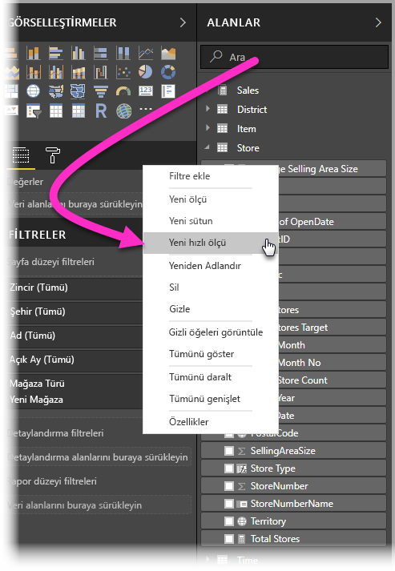

**Hızlı ölçümler** oluşturmak için **Alanlar** kutusundaki bir alana sağ tıklayın ve görünen menüden **Hızlı ölçümler**'i seçin. Ayrıca mevcut bir görselin **Değerler** bölmesindeki herhangi bir değerine de sağ tıklayabilirsiniz (bir *Çubuk grafik* görselindeki *Değerler* alanı gibi). Kullanılabilen çok sayıda hesaplama kategorisi ve her hesaplamayı gereksinimlerinize uyacak şekilde değiştirmenin çeşitli yöntemleri vardır.

### Hızlı ölçümler genel kullanıma sunulmuştur

Hızlı ölçümler, **Power BI Desktop**’ın Şubat 2018 sürümünden itibaren genel kullanıma sunulmuştur (artık önizlemede değildir). **Power BI Desktop**’ın önceki bir sürümünü kullanıyorsanız, **Power BI Desktop**’ın **Nisan 2017** sürümünden itibaren **Dosya > Seçenekler ve Ayarlar > Seçenekler > Önizleme Özellikleri**’ni seçip **Hızlı ölçümler**’in yanındaki onay kutusunu seçerek **Hızlı ölçümler** özelliğini deneyebilirsiniz.

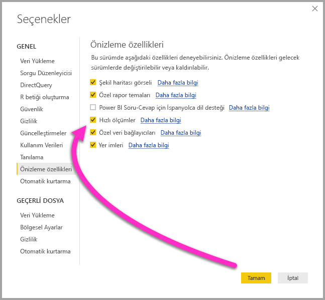

Seçiminizi yaptıktan sonra **Power BI Desktop**'ı yeniden başlatmanız gerekir.

## Hızlı ölçümler özelliğini kullanma
**Hızlı ölçüm** oluşturmak için **Power BI Desktop**'taki **Alanlar** kutusunda bulunan bir alana sağ tıklayın ve görünen menüden **Hızlı ölçüm** seçeneğini belirleyin.

SQL Server Analysis Services (SSAS) canlı bağlantıları söz konusu olduğunda bazı **Hızlı ölçümler** kullanılabilir. **Power BI Desktop** yalnızca bağlantının kurulduğu SSAS sürümü için desteklenen **Hızlı ölçümler** koleksiyonunu görüntüler. Bu nedenle, bir SSAS canlı veri kaynağına bağlandığınızda belirli **Hızlı ölçümleri** listede görmemenizin nedeni, bağlandığınız SSAS sürümünün söz konusu **Hızlı ölçümü** uygulamak için kullanılan DAX ölçümünü desteklememesidir.

Sağ tıklandığında görünen menüden seçim yapıldığında aşağıdaki **Hızlı ölçümler** penceresi açılarak, istediğiniz hesaplamayı ve hesaplamanın çalıştırılmasını istediğiniz alanları seçmenize olanak sağlar.

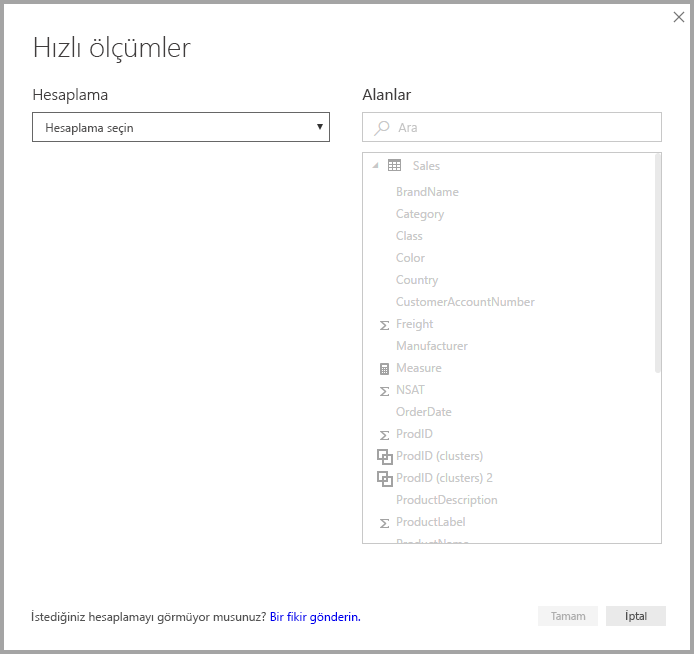

Açılan menüden seçim yaptığınızda kullanılabilir **Hızlı ölçümlerin** uzun listesi sunulur.

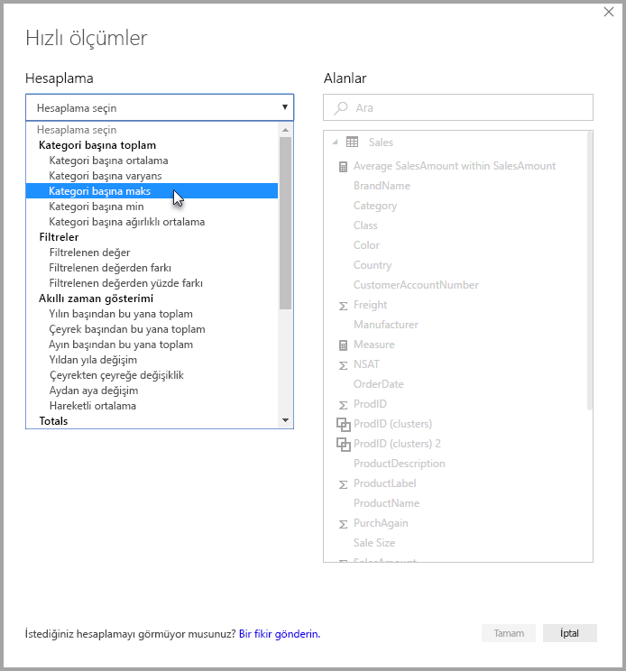

Hızlı ölçüm hesaplama türlerine ilişkin beş benzersiz grup bulunur ve bunların her biri bir hesaplama koleksiyonu içerir. Bu gruplar ve hesaplamalar şunlardır:

* **Kategori başına toplam**
  * Kategori başına ortalama
  * Kategori başına varyans
  * Kategori başına maks
  * Kategori başına min
  * Kategori başına ağırlıklı ortalama
* **Filtreler**
  * Filtrelenen değer
  * Filtrelenen değerden farkı
  * Filtrelenen değerden yüzde farkı
  * Yeni kategorilerden satışlar
* **Akıllı zaman gösterimi**
  * Yılın başından bu yana toplam
  * Çeyrek başından bu yana toplam
  * Ayın başından bu yana toplam
  * Yıldan yıla değişim
  * Çeyrekten çeyreğe değişim
  * Aydan aya değişim
  * Hareketli ortalama
* **Toplamlar**
  * Değişen toplam
  * Kategori toplamı (filtreler uygulandı)
  * Kategori toplamı (filtreler uygulanmadı)
* **Matematiksel işlemler**
  * Ekleme
  * Çıkarma
  * Çarpma
  * Bölme
  * Yüzde farkı
  * Bağıntı katsayısı
* **Metin**
  * Yıldız derecelendirmesi
  * Birleştirilmiş değer listesi

Bu hesaplamalara ekleme yapmayı umuyor ve hem görmek istediğiniz **Hızlı ölçümler** konusundaki önerilerinizi hem de varsa **Hızlı ölçümler** ile ilgili dikkate almamızı istediğiniz fikirlerinizi (temel alınan DAX formülleri dahil olmak üzere) bekliyoruz. Bu makalenin sonunda konu ile ilgili daha fazla bilgi bulabilirsiniz.

## Hızlı ölçümler ile ilgili örnek
Bu **Hızlı ölçümler** ile ilgili bir örneği uygulamalı olarak inceleyelim.

Aşağıdaki **Matris** görselinde, çeşitli elektronik ürünlere ilişkin bir satış tablosu gösterilmektedir. Bu, her kategori için toplam değeri içeren temel bir tablodur.

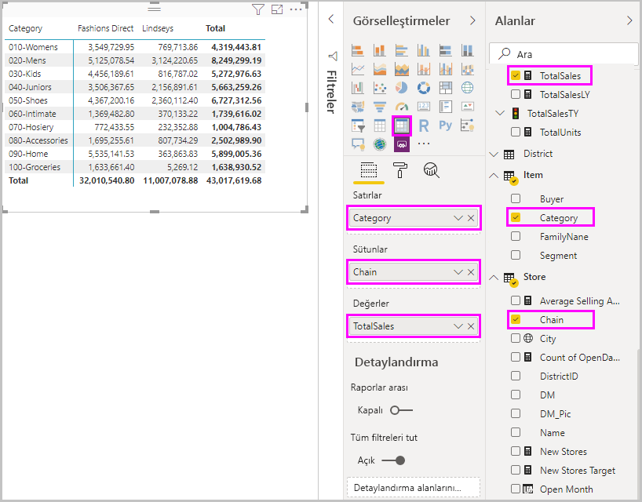

**Değerler** alanı kutusuna sağ tıklayıp **Hızlı ölçümler**’i seçtiğimizde *Hesaplama* olarak *Kategori başına ortalama*’yı, ardından *Taban değeri* olarak *Sum of SalesAmount*’u seçin ve söz konusu alanı sağ bölmedeki *Alanlar* kutusundan sol taraftaki *Kategori* bölümüne sürükleyerek *SalesAmount* değerini belirtin.

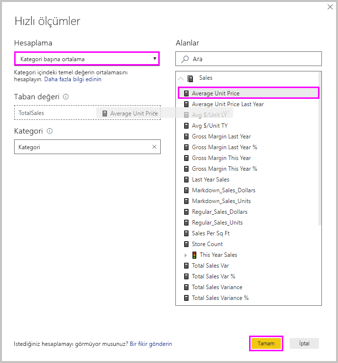

**Tamam**'ı seçtiğimizde bu listenin altındaki görüntüde gösterildiği gibi birkaç ilgi çekici nokta ortaya çıkar:

1. **Matris** görseli artık hesaplamamızı (bu örnekte *Average SalesAmount within SalesAmount*) gösteren yeni bir sütuna sahiptir.
2. **Alanlar** kutusunda yeni bir kullanılabilir **ölçü** oluşturulmuş ve vurgulanmıştır. (Power BI, yeni ölçüyü çevresinde sarı bir kutu ile işaretler.) Bu ölçü yalnızca özgün olarak oluşturulduğu görsel için değil, rapordaki diğer görseller için de kullanılabilir.
3. **Hızlı ölçüm** için oluşturulan DAX formülü, Formül çubuğunda görüntülenir.

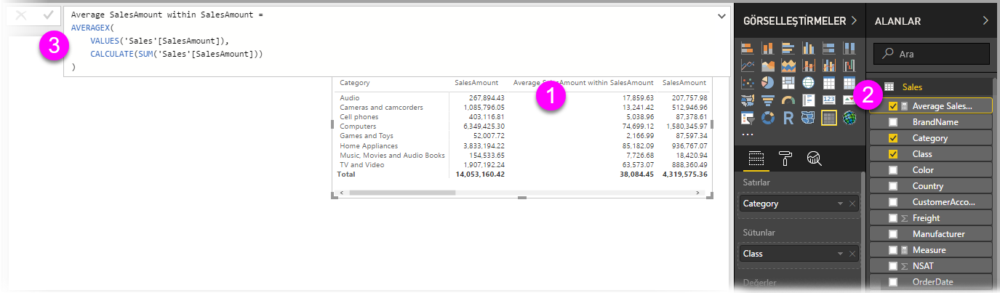

Birinci öğeyle başlamak için görsele **Hızlı ölçüm** uygulanmış olduğuna dikkat edin. Her ikisi de oluşturulan **Hızlı ölçümü** temel alan yeni bir sütun ve ilişkili değer bulunur.

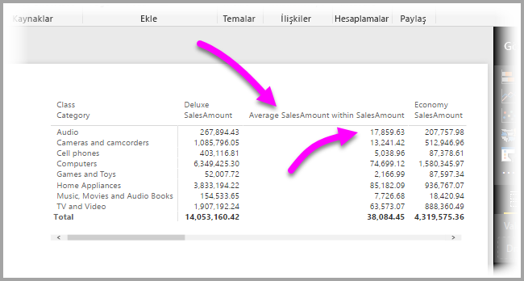

İkinci olarak, **Hızlı ölçüm** veri modelinin **Alanlar** kutusunda gösterilir ve modeldeki diğer alanlar gibi herhangi bir başka görsel için kullanılabilir. Aşağıdaki görüntüde, **Hızlı ölçüm** ile oluşturulan yeni alan kullanılarak hızlı bir **çubuk grafik** görseli oluşturulmuştur.

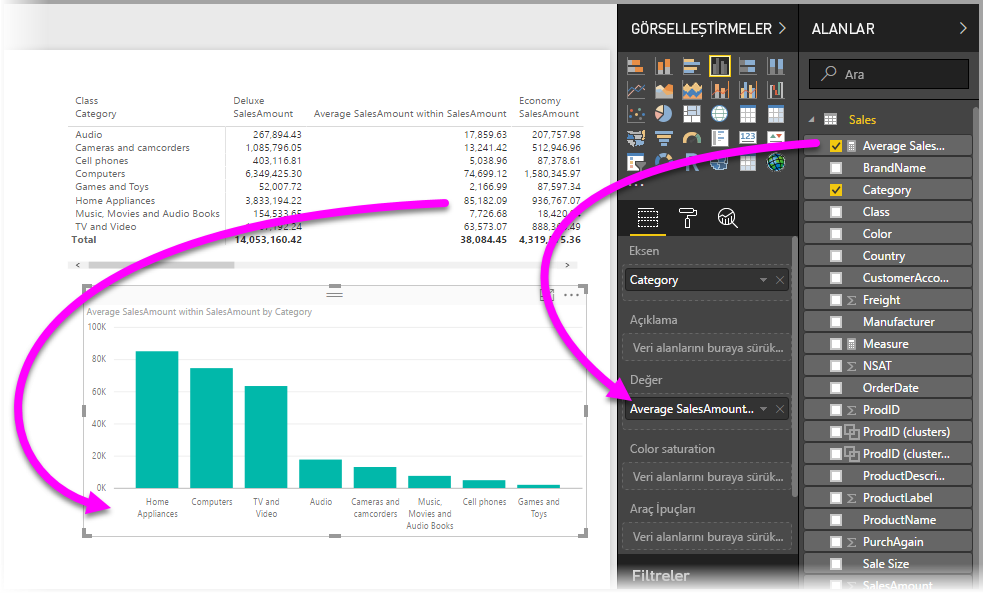

Şimdi de üçüncü öğe olan DAX formüllerini ele alacağımız sonraki bölüme geçelim.

## Hızlı ölçümleri kullanarak DAX hakkında bilgi edinme
**Hızlı ölçümler** özelliğinin diğer bir avantajı da ölçüyü uygulamak için kullanılan DAX formülünü size doğrudan göstermesidir. Aşağıdaki görüntüde, **Hızlı ölçüm** tarafından oluşturulan ölçü seçilmiştir. (Şu anda **Alanlar** kutusunda olduğu için sadece üzerine tıklamamız yeterlidir.) Bunu yaptığımızda **Formül çubuğu** açılarak Power BI'ın ölçüyü uygulamak için oluşturduğu DAX formülünü gösterir.

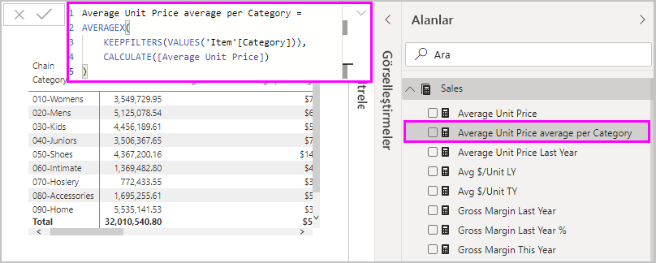

Ölçünün arkasındaki formülü göstermesi bile başlı başına bir yarar sağlar. Ancak belki de daha önemlisi, **Hızlı ölçümler**’i kullanarak, temel alınan DAX formüllerinin nasıl oluşturulması gerektiğini görmenize olanak sağlamasıdır.

Bir yıldan yıla hesaplaması yapmanız gerektiğini ancak DAX formülünü nasıl yapılandırmanız gerektiğini bilmediğinizi (veya nereden başlayacağınız konusunda hiçbir fikriniz olmadığını) düşünün. Ne yapacağınızı düşünmek yerine **Yıldan yıla değişim** hesaplamasını kullanarak **Hızlı ölçüm** oluşturup neler olacağını görebilirsiniz. **Hızlı ölçüm**’ü oluşturun ve görselinizde nasıl göründüğüne bakın, DAX formülünün nasıl çalıştığını görün ve ardından, gerek duyduğunuz ya da beklediğiniz hesaplamaya ulaşana kadar ister doğrudan DAX üzerinde değişiklikler yapın ister başka bir ölçü oluşturun.

Bu özellik, varsayımsal sorularınıza sadece birkaç tıklama ile yanıt veren hızlı bir öğretmen gibidir. İstemediğiniz ölçüleri dilediğiniz zaman modelinizden silebilirsiniz. Bunun için ölçüye tıklayıp **sil** seçeneğini belirlemeniz yeterlidir.

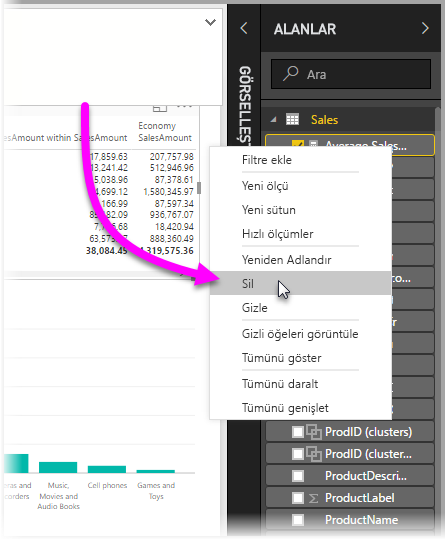

Tam olarak istediğiniz ölçüyü elde ettiğinizde aynı sağ tıklama menüsünü kullanarak ölçünüzü istediğiniz gibi yeniden adlandırabilirsiniz.

## Sınırlamalar ve önemli noktalar
Dikkat etmeniz gereken bazı sınırlamalar ve önemli noktalar vardır.

* **Hızlı ölçümler** yalnızca modeli değiştirirseniz kullanılabilir; bazı Canlı bağlantılarla çalışırken kullanılamaz (Yukarıda da açıklandığı gibi SSAS sekmeli canlı bağlantıları desteklenmektedir).
* **Alanlar** kutusuna eklenen ölçü, rapordaki herhangi bir görselle kullanılabilir.
* **Alanlar** kutusunda, oluşturulan ölçüyü seçip **Formül çubuğunda** gösterilen formüle bakarak bir **Hızlı ölçüm** ile ilişkili DAX formülünü dilediğiniz zaman görebilirsiniz.
* DirectQuery modunda çalışırken, akıllı zaman gösterimi hızlı ölçümleri oluşturamazsınız. Bu hızlı ölçümlerde kullanılan DAX işlevleri, veri kaynağınıza gönderilen T-SQL deyimlerine çevrildiğinde performansı etkiler.

> [!WARNING]
> Hızlı ölçümler şu anda *yalnızca* bağımsız değişken ayırıcısı virgül olan DAX deyimleri oluşturur. **Power BI Desktop** sürümünüz, ondalık ayırıcı olarak virgülü kullanan bir dile yerelleştirilirse hızlı ölçümler düzgün şekilde çalışmaz.
> 
> 

### Akıllı zaman gösterimi ve Hızlı ölçümler
**Power BI Desktop**'ın Ekim 2017 güncelleştirmesinden itibaren akıllı zaman gösterimi **Hızlı ölçümleri** ile kendi özel tarih tablolarınızı kullanabilirsiniz. Dış bir sekmeli model kullanıyorsanız, [bu makalede](https://docs.microsoft.com/sql/analysis-services/tabular-models/specify-mark-as-date-table-for-use-with-time-intelligence-ssas-tabular) açıklandığı gibi, modelin ne zaman oluşturulduğundan ve ilgili tablodaki birincil tarih sütununun bir Tarih tablosu olarak işaretlendiğinden emin olun. Kendi tarih tablonuzu içeri aktarıyorsanız, [bu makalede](https://docs.microsoft.com/power-bi/desktop-date-tables) açıklandığı gibi bunu bir tarih tablosu olarak işaretlediğinizden emin olun.

### Ek bilgi ve örnekler
**Hızlı ölçüm** hesaplamalarının her biri için örnekler sağlamayı ve rehberlik sunmayı planlıyoruz; bu nedenle lütfen ilgili makaleye ilişkin güncelleştirmeler için sayfayı yakın zamanda tekrar kontrol edin.

**Hızlı ölçüm** ile ilgili henüz sunulmamış bir fikriniz mi var? Harika! [Bu sayfayı](https://go.microsoft.com/fwlink/?linkid=842906) ziyaret ederek **Power BI Desktop**'ta görmek istediğiniz **Hızlı ölçüm** ile ilgili fikirlerinizi (ve DAX formülünü) paylaşın. Böylece biz de önerilerinizi gelecekteki bir sürümde sunulacak **Hızlı ölçümler** listesine ekleme konusunda bir değerlendirme yapabiliriz.

