# <a name="using-r-in-query-editor"></a>Sorgu Düzenleyicisi'nde R programlama dilini kullanma
İstatistik uzmanları, veri bilimciler ve veri analistleri tarafından yaygın olarak kullanılan bir programlama dili olan **R**, Power BI Desktop'taki **Sorgu Düzenleyicisi**'nde kullanılabilir. R programlama dilinin bu şekilde **Sorgu Düzenleyicisi** ile tümleştirilmesi, R kullanarak verileri temizlemenin yanı sıra eksik verilerin tamamlanması, tahminler ve kümeleme gibi gelişmiş veri şekillendirme ve analiz işlemleri gerçekleştirmenize olanak sağlar. **R** güçlü bir dildir ve bu dili veri modelinizi hazırlamanın yanı sıra raporlar oluşturmak için **Sorgu Düzenleyicisi**'nde kullanabilirsiniz.

## <a name="installing-r"></a>R programlama dilini yükleme
**R** programlama dilini Power BI Desktop'taki **Sorgu Düzenleyicisi**'nde kullanabilmek için yerel makinenize **R**'yi yüklemeniz gerekir. **R** programlama dilini [Revolution Open indirme sayfası](https://mran.revolutionanalytics.com/download/) ve [CRAN Repository](https://cran.r-project.org/bin/windows/base/) de dahil olmak üzere pek çok konumdan ücretsiz olarak indirip yükleyebilirsiniz.

## <a name="using-r-in-query-editor"></a>Sorgu Düzenleyicisi'nde R programlama dilini kullanma
**R** programlama dilinin **Sorgu Düzenleyicisi**’nde nasıl kullanılacağını göstermek için, birlikte ilerleyebilmek üzere [buradan indirebileceğiniz](http://download.microsoft.com/download/F/8/A/F8AA9DC9-8545-4AAE-9305-27AD1D01DC03/EuStockMarkets_NA.csv) bir .CSV dosyasını temel alan borsa veri kümesinden alınmış örnekten yararlanacağız. Bu örneğe yönelik adımlar aşağıda verilmiştir:

1. Öncelikle verilerinizi **Power BI Desktop**'a yükleyin. Bu örnekte, *EuStockMarkets_NA.csv* dosyasını yükleyin ve **Power BI Desktop**’taki **Giriş** şeridinden **Veri Al > CSV** seçeneğini belirleyin.

   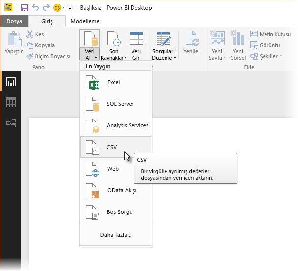
2. Dosyayı seçip **Aç** seçeneğini belirlediğinizde, CSV, **CSV dosyası** iletişim kutusunda görüntülenir.

   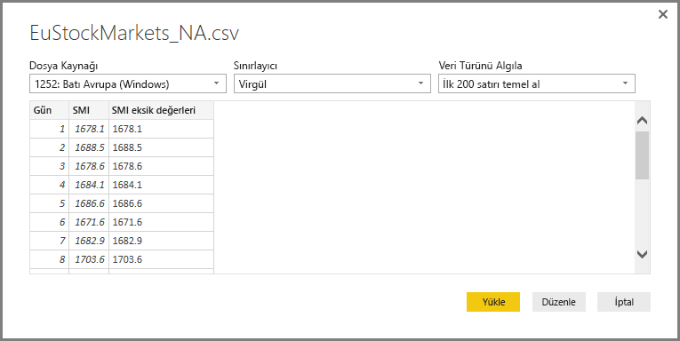
3. Veriler yüklendikten sonra CSV, Power BI Desktop'taki **Alanlar** bölmesinde yer alır.

   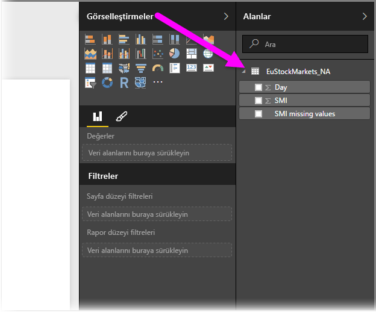
4. **Power BI Desktop**'taki **Giriş** sekmesinde bulunan **Sorguları Düzenle** seçeneğini belirleyerek **Sorgu Düzenleyicisi**'ni açın.

   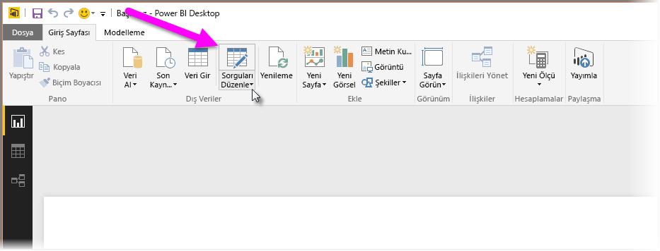
5. **Dönüştür** sekmesinde, **R Betiğini Çalıştır** seçeneğini belirleyerek **R Betiğini Çalıştır** düzenleyicisini görüntüleyin. (Bir sonraki adımda gösterilmiştir.) Tıpkı aşağıdaki görüntüde göremediğiniz diğer satırlar gibi, 15 ve 20 numaralı satırlar için eksik veri sorununun gözlemlendiğine dikkat edin. Söz konusu satırların R tarafından nasıl doldurulabildiği (veya doldurulacağı) aşağıdaki adımlarda gösterilmiştir.

   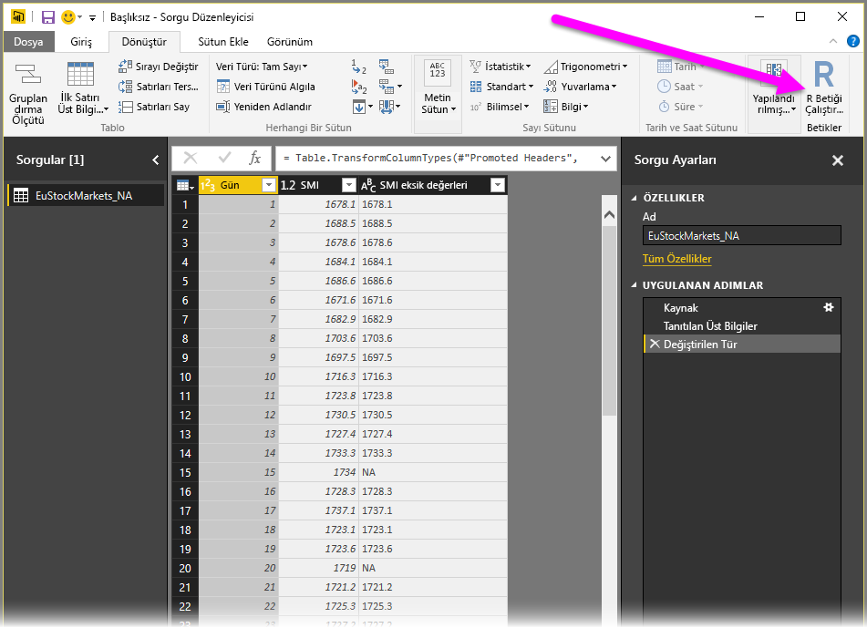
6. Bu örnek için aşağıdaki betik kodunu gireceğiz:

    ```r
       library(mice)
       tempData <- mice(dataset,m=1,maxit=50,meth='pmm',seed=100)
       completedData <- complete(tempData,1)
       output <- dataset
       output$completedValues <- completedData$"SMI missing values"
    ```

   > [!NOTE]
   > Önceki betik kodunuzun düzgün bir şekilde çalışması için R ortamınızda *mice* kitaplığının yüklü olması gerekir. R yüklemenizde şu komutu çalıştırarak mice kitaplığını yükleyin: |      > install.packages('mice')
   > 
   > 

   **R Betiğini Çalıştır** iletişim kutusuna yerleştirilen kod aşağıdaki gibi görünür:

   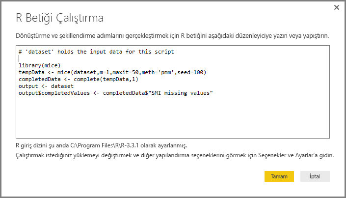
7. **Tamam**’ı seçmemizin ardından **Sorgu Düzenleyicisi**, veri gizliliği ile ilgili bir uyarı görüntüler.

   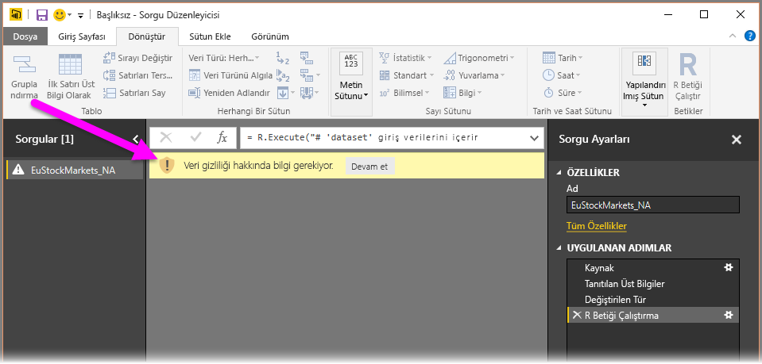
8. R betiklerinin Power BI hizmetinde düzgün bir şekilde çalışabilmesi için, tüm veri kaynaklarının *genel* olarak ayarlanması gerekir. Gizlilik ayarları ve etkileri hakkında daha fazla bilgi için bkz. [Gizlilik Düzeyleri](desktop-privacy-levels.md).

   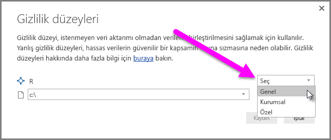

   **Alanlar** bölmesinde *completedValues* adlı yeni bir sütunla karşılaşırız. 15 ve 18 numaralı satırlar gibi birkaç eksik veri öğesinin bulunduğuna dikkat edin. Bu sorunun R tarafından nasıl giderildiğini bir sonraki bölümde görebilirsiniz.


Yalnızca beş R betiği satırı sayesinde **Sorgu Düzenleyicisi**, eksik değerleri bir tahmin modeli ile doldurur.

## <a name="creating-visuals-from-r-script-data"></a>R betiği verilerinden görseller oluşturma
Artık R betik kodunun, *mice* kitaplığını kullanarak eksik değerleri aşağıdaki görüntüde gösterildiği gibi nasıl tamamladığını görmek için bir görsel oluşturabiliriz:

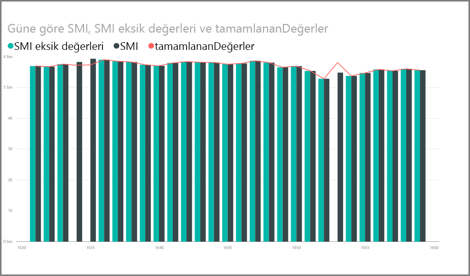

Söz konusu görsel ve **Power BI Desktop**’ı kullanarak oluşturmak isteyebileceğimiz diğer görseller tamamlandıktan sonra, içerdiği R betikleriyle birlikte **Power BI Desktop** dosyasını (.pbix dosyası olarak kaydedilen) kaydedebilir ve Power BI hizmetinde kullanabilirsiniz.

> [!NOTE]
> Bu adımlar uygulandığında elde edilen bir .pbix dosyasının nasıl göründüğünü merak ediyor musunuz? Şanslısınız. Bu örneklerde kullanılan tamamlanmış **Power BI Desktop** dosyasını [buradan](http://download.microsoft.com/download/F/8/A/F8AA9DC9-8545-4AAE-9305-27AD1D01DC03/Complete%20Values%20with%20R%20in%20PQ.pbix) indirebilirsiniz.

.pbix dosyasını Power BI hizmetine yüklemenizin ardından, veri yenilemeye (hizmette) ve görsellerin hizmette güncelleştirilmesine (görsellerin güncelleştirilmesi için verilerin R'ye erişmesi gerekir) olanak sağlamak için uygulamanız gereken birkaç adım daha kalır. Bu adımlar aşağıda verilmiştir:

* **Veri kümesi için zamanlanmış yenilemeyi etkinleştirme**: R betiklerinizi içeren veri kümenizin bulunduğu çalışma kitabı için zamanlanmış yenilemeyi etkinleştirmek için, **Personal Gateway** ile ilgili bilgiler de sunan [Zamanlanmış yenileme yapılandırma](refresh-scheduled-refresh.md) makalesine bakın.
* **Personal Gateway'i yükleme**: Dosyanın bulunduğu ve R'nin yüklü olduğu konuma bir **Personal Gateway** yüklenmesi gerekir; Power BI hizmetinin söz konusu çalışma kitabına erişmesi ve güncelleştirilen görselleri yeniden işlemesi gerekir. [Personal Gateway yükleme ve yapılandırma](service-gateway-personal-mode.md) hakkında daha fazla bilgi edinebilirsiniz.

## <a name="limitations"></a>Sınırlamalar
R betikleri içeren ve **Sorgu Düzenleyicisi**'nde oluşturulmuş sorgulara yönelik bazı sınırlamalar bulunur:

* Tüm R veri kaynağı ayarlarının *Genel* olarak belirlenmesi ve **Sorgu Düzenleyicisi**'nde oluşturulmuş tüm diğer adımların da genel olarak ayarlanması gerekir. Veri kaynağı ayarlarına ulaşmak için, **Power BI Desktop**'ta **Dosya > Seçenekler ve ayarlar > Veri kaynağı ayarları** seçeneğini belirleyin.

  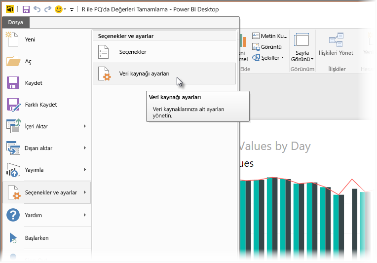

  **Veri Kaynağı Ayarları** iletişim kutusunda, veri kaynaklarını seçin ve ardından **İzinleri Düzenle...** seçeneğini belirleyip **Gizlilik Düzeyi** ayarının *Genel* olarak seçildiğinden emin olun.

  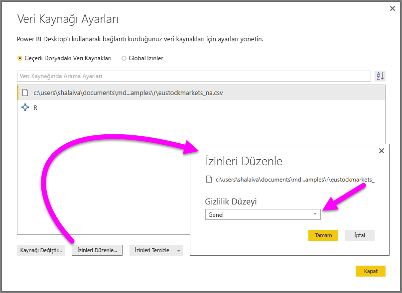    
* R görselleriniz veya veri kümeniz için zamanlanmış yenilemeyi etkinleştirmek üzere, **Zamanlanmış yenileme** özelliğini etkinleştirmeniz ve çalışma kitabı ile R yüklemesinin bulunduğu bilgisayara **Personal Gateway** yüklemeniz gerekir. Her iki konuya yönelik daha fazla bilgi için, bu makaledeki, daha fazla bilgi edinmeye yönelik bağlantıların sunulduğu önceki bölüme bakın.

R ve özel sorgular ile çok çeşitli işlemler gerçekleştirebilirsiniz. Keşfetmeye devam edin ve verilerinizi tam da görünmelerini istediğiniz biçimde şekillendirin.

