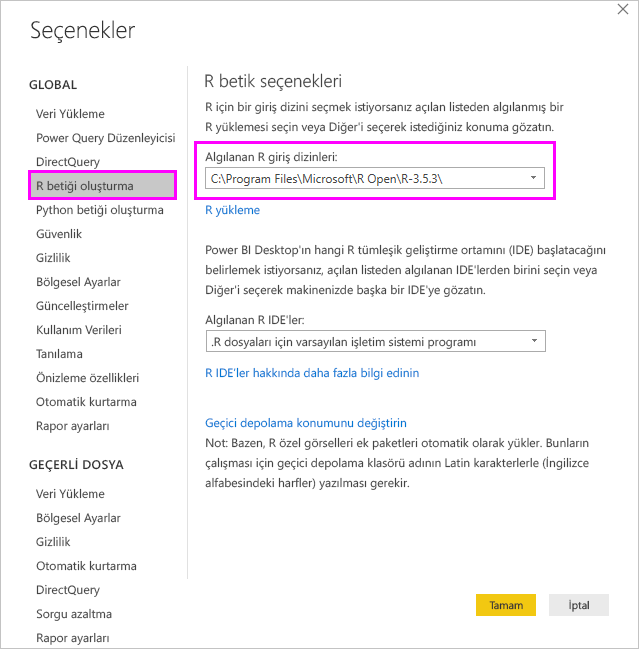
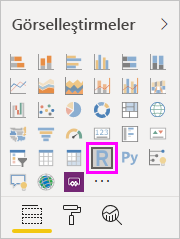
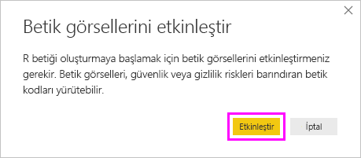
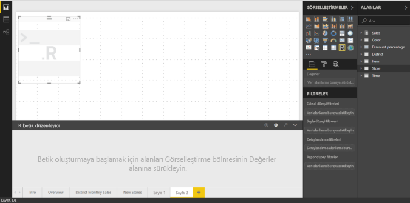
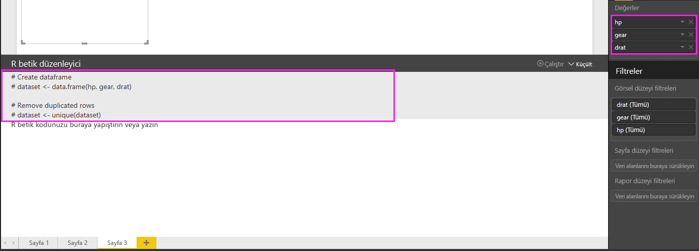
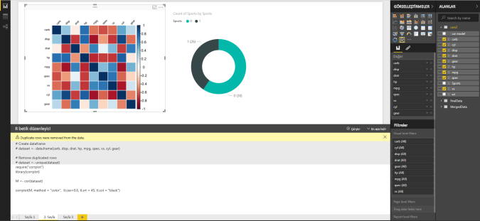
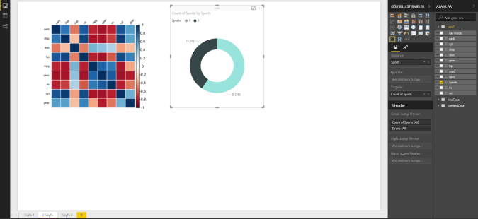
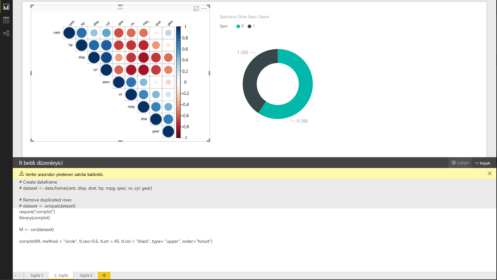
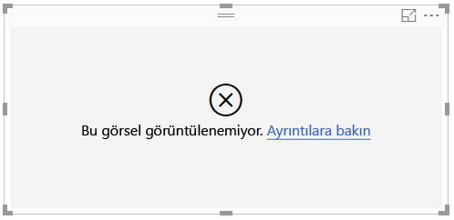

# <a name="create-power-bi-visuals-using-r"></a>R programlama dilini kullanarak Power BI görselleri oluşturma
Power BI Desktop'la verilerinizi görselleştirmek için *R* programlama dilini kullanabilirsiniz. [R](https://mran.revolutionanalytics.com/documents/what-is-r) istatistiksel bilgi işlem ve grafiklere yönelik bir dil ve ortamdır.

## <a name="install-r"></a>R yükleme
Varsayılan olarak Power BI Desktop R altyapısını içermez, dağıtmaz veya yüklemez. Power BI Desktop’ta R betiklerini çalıştırmak için yerel bilgisayarınıza R’yi ayrıca yüklemeniz gerekir. R'yi [Revolution Open indirme sayfası](https://mran.revolutionanalytics.com/download/) ve [CRAN Repository](https://cran.r-project.org/bin/windows/base/) de dahil olmak üzere pek çok konumdan ücretsiz olarak indirip yükleyebilirsiniz. R betiklerinin Power BI Desktop'taki güncel sürümü, yükleme yolunda Unicode karakterlerin yanı sıra boşlukların (boş karakterler) olmasını da destekler.

## <a name="enable-r-visuals-in-power-bi-desktop"></a>Power BI Desktop'ta R görsellerini etkinleştirme
R'yi yükledikten sonra Power BI Desktop bunu otomatik olarak etkinleştirir. Power BI Desktop'ın R'yi doğru konumda etkinleştirdiğini onaylamak için şu adımları izleyin: 

1. Power BI Desktop menüsünde **Dosya** > **Seçenekler ve ayarlar** > **Seçenekler**'i seçin. 

2. **Seçenekler** sayfasının sol tarafındaki **Genel**'in altında **R betiği oluşturma**'yı seçin. 

3. **R betik seçenekleri**'nin altında, **Algılanan R giriş dizinleri**'nde yerel R yüklemenizin belirtildiğini ve bunun Power BI Desktop'ın kullanmasını isteğiniz yerel R yüklemesini düzgün bir şekilde yansıttığını doğrulayın. Aşağıdaki resimde yerel R yüklemesinin yolu **C:\Program Files\R Open\R-3.5.3\\** 'tür.
   
   

R yüklemenizi doğruladıktan sonra R görselleri oluşturmaya başlayabilirsiniz.

## <a name="create-r-visuals-in-power-bi-desktop"></a>Power BI Desktop'ta R görselleri oluşturma
1. R görseli eklemek için **Görsel Öğeler** bölmesindeki **R Görseli** simgesini seçin.
   
   

2. Görüntülenen **Betik görsellerini etkinleştir** penceresinde **Etkinleştir**’i seçin.

   

   Bir rapora R görseli eklediğinizde Power BI Desktop şu değişiklikleri yapar:
   
   - Rapor tuvalinde bir yer tutucu R görseli görüntüsü görünür.
   
   - Orta bölmenin alt kısmında **R betik düzenleyicisi** görünür.
   
   

3. **Görsel Öğeler** bölmesinin **Değerler** bölümünde, R betiğinde kullanmak istediğiniz alanları aynı diğer Power BI Desktop görsellerinde yaptığınız gibi **Alanlar** bölmesinden sürükleyin. Alternatif olarak, alanları doğrudan **Alanlar** bölmesinde de seçebilirsiniz.
    
    Yalnızca **Değerler** bölümüne eklediğiniz alanlar R betiğinizde kullanılabilir. Ayrıca, **R betik düzenleyicisinde** R betiğinizle çalışırken **Değerler** bölümüne yeni alan ekleyebilir veya gereksiz alanları bu bölümden çıkarabilirsiniz. Power BI Desktop, hangi alanları eklediğinizi veya kaldırdığınızı otomatik olarak algılar.
   
   > [!NOTE]
   > R görselleri için varsayılan toplama işlemi *özetleme*'dir.
   > 
   > 
   
4. Artık bir çizim oluşturmak için seçtiğiniz verileri kullanabilirsiniz: 

    - Siz alan seçtikçe **R betik düzenleyicisi**, düzenleyici bölmesinin üst kısmında bulunan gri bölümde bu alanlar için yardımcı R betiği bağlama kodunu oluşturur.
    - Alanı kaldırırsanız, **R betik düzenleyicisi** destekleyen kodu bu alandan otomatik olarak kaldırır.
   
   Aşağıdaki resimde gösterilen örnekte üç alan seçilmiştir: hp, gear ve drat. Bu seçimlerin sonucunda R betik düzenleyicisi, aşağıdaki şekilde özetlenen bir bağlama kodu oluşturur:
   
   * Kullanıcının seçtiği farklı alanlardan oluşan **dataset** adlı bir veri çerçevesi oluşturun.
   * Varsayılan toplama türü şudur: *özetleme*.
   * Tablo görsellerinde olduğu gibi alanlar da gruplandırılır ve yinelenen satırlar yalnızca bir kez görünür.
   
   
   
   > [!TIP]
   > Bazı durumlarda, otomatik gruplandırma işleminin gerçekleştirilmesini istemeyebilir veya yinelenenler de dahil olmak üzere tüm satırların görünmesini isteyebilirsiniz. Böyle durumlarda veri kümenize bir dizin alanı ekleyin. Böylece, tüm satırların benzersiz olduğu kabul edilir ve gruplandırma yapılması önlenir.
   > 
   > 
   
   Oluşturulan veri çerçevesi **dataset** olarak adlandırılır ve seçilen sütunlara, adlarıyla erişirsiniz. Örneğin, R betiğinizde *dataset$gear* ekleyerek gear alanına erişin. Boşluklu veya özel karakterler içeren alanlar için tek tırnak işareti kullanın.

5. Veri çerçevesinin seçtiğiniz alanlara göre otomatik olarak oluşturulmasıyla R betiği yazmaya hazır hale gelirsiniz. R betiği yazdığınızda Power BI Desktop bunu varsayılan R cihazında çizer. Betiği tamamladıktan sonra **R betik düzenleyicisi** başlık çubuğunun sağ tarafında **Betiği çalıştır**'ı seçin.
   
    **Betiği çalıştır**’ı seçtiğinizde Power BI Desktop çizimi tanımlar ve tuval üzerinde görüntüler. İşlem yerel R yüklemenizde gerçekleştirildiğinden, gerekli R paketlerinin yüklendiğinden emin olun.
   
   Power BI Desktop, aşağıdaki olaylardan herhangi biri meydana geldiğinde görseli yeniden çizer:
   
   * **R betik düzenleyicisi** başlık çubuğunda **Betiği çalıştır**'ı seçersiniz.
   * Veri yenileme, filtreleme veya vurgulama işleminden dolayı bir veri değişikliği oluşur.

     Aşağıdaki resimde, farklı otomobil türlerinin öznitelikleri arasındaki bağıntıları çizen bir bağıntı çizim kodu örneği gösterilir.

     

6. Görselleştirmelerin daha büyük bir görünümünü elde etmek için **R betik düzenleyicisi**'ni simge durumuna küçültün. Power BI Desktop'taki diğer görsellerde olduğu gibi, halka biçimli görselde (sağdaki yuvarlak görsel) belirli bir bölümü (spor arabaları gibi) seçerek bağıntı çiziminde çapraz filtre uygulayabilirsiniz.

    

7. Görseli özelleştirmek için R betiğini değiştirin ve çizim oluşturma komutuna parametre ekleyerek R programlama dilinin gücünden yararlanın.

    Özgün çizim oluşturma komutu:

    ```
    corrplot(M, method = "color",  tl.cex=0.6, tl.srt = 45, tl.col = "black")
    ```

    R betiğini değiştirerek çizim komutunun şöyle olmasını sağlayın:

    ```
    corrplot(M, method = "circle", tl.cex=0.6, tl.srt = 45, tl.col = "black", type= "upper", order="hclust")
    ```

    Değişikliklerin ardından R görseli artık daireler çiziyor, yalnızca üst yarıyı dikkate alıyor ve bağıntılı öznitelikleri kümelemek için matrisi yeniden sıralıyor.

    

    Hatayla sonuçlanan bir R betiği yürüttüğünüzde hata iletisi R görsel çiziminde değil tuvalde görüntülenir. Hataya ilişkin ayrıntılar için, R görseli hatasındaki **Ayrıntılara göz atın** seçeneğini belirleyin.

    

## <a name="r-scripts-security"></a>R betiklerinin güvenliği 
R görselleri, güvenlik veya gizlilik riskleri taşıyan kodlar içerebilecek R betiklerinden oluşturulur. Bir R görselini ilk kez görüntülemeye veya R görseliyle ilk kez etkileşim kurmaya çalışan kullanıcılar bir güvenlik uyarısı iletisiyle karşılaşır. R görsellerini yalnızca, yazara ve kaynağa güvenmeniz halinde veya ilgili R betiğini gözden geçirip anladıktan sonra etkinleştirin.


## <a name="known-limitations"></a>Bilinen sınırlamalar
Power BI Desktop'ta R görsellerinin şöyle sınırlamaları vardır:

* Veri boyutları: R görseli tarafından çizim için kullanılan veriler 150.000 satırla sınırlıdır. 150.000'den fazla satır seçilirse yalnızca ilk 150.000 satır kullanılır ve görüntünün üzerinde bir ileti görüntülenir.

* Çözünürlük: Tüm R görselleri 72 DPI çözünürlükte görüntülenir.

* Hesaplama süreleri: R görseli hesaplama süresi 5 dakikayı aşarsa zaman aşımı hatasına neden olur.

* İlişkiler: Diğer Power BI Desktop görsellerinde olduğu gibi, aralarında tanımlanmış hiçbir ilişki bulunmayan farklı tablolardan veri alanları seçilirse hata oluşur.

* Yenilemeler: R görselleri veri güncelleştirme, filtreleme ve vurgulama işlemlerinden sonra yenilenir. Ancak, görüntünün kendisi etkileşimli değildir ve çapraz filtrelemenin kaynağı olamaz.

* Vurgulamalar: R görselleri diğer görselleri vurgulama işleminize yanıt verir ancak diğer öğelere çapraz filtre uygulamak için R görselindeki öğeleri seçemezsiniz.

* Görüntü bağdaştırıcıları: Yalnızca varsayılan R görüntüleme cihazında çizilen çizimler tuval üzerinde doğru şekilde görüntülenir. Farklı bir R görüntüleme cihazını açıkça kullanmaktan kaçının.

* RRO yüklemeleri: Bu sürümde Power BI Desktop'ın 32 bit sürümü RRO yüklemelerini otomatik olarak belirlemez; **Seçenekler ve ayarlar** > **Seçenekler** > **R Betiği Oluşturma** bölümünde R yükleme dizininin yolunu el ile sağlamanız gerekir.

## <a name="next-steps"></a>Sonraki adımlar
Power BI'da R hakkında daha fazla bilgi için aşağıdaki makalelere bakın:

* [Power BI Desktop'ta R Betikleri Çalıştırma](desktop-r-scripts.md)
* [Power BI ile harici bir R IDE kullanma](desktop-r-ide.md)

