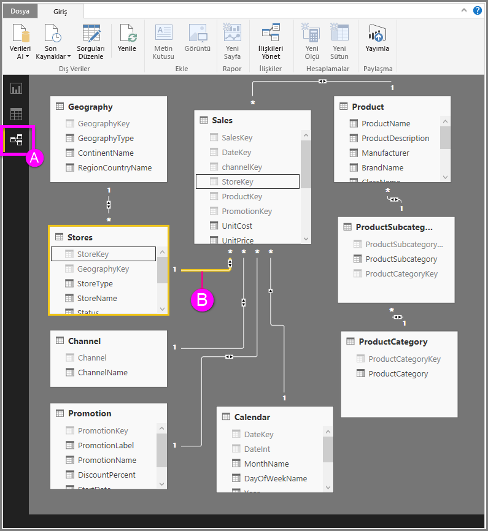

# Power BI Desktop'taki İlişki görünümüyle çalışma
**İlişki Görünümü**, modelinizdeki tüm tabloları, sütunları ve ilişkileri gösterir. Bu görünüm özellikle birçok tablo arasında karmaşık ilişkiler bulunduğunda kullanışlı olabilir.

Şimdi bir göz atalım.

**A.**  İlişki Görünümü simgesi: Modelinizi İlişki Görünümü'nde göstermek için tıklayın

**B.** İlişki: İmlecinizi ilişkinin üzerine getirerek kullanılan sütunları görebilirsiniz. Bir ilişkiye çift tıkladığınızda **İlişkiyi Düzenle** iletişim kutusu açılır. 

Yukarıdaki resimde *Stores* tablosunun *StoreKey* sütununa sahip olan *Sales* tablosuyla ilişkilendirilmiş bir *StoreKey* sütununa sahip olduğunu görebilirsiniz. Bu ilişkinin *Çok - Tek* (\*:1) ilişki olduğunu görebilirsiniz ve çizginin ortasındaki simge, Çapraz filtre yönünün *Her ikisi* olarak ayarlandığını göstermektedir. Simge üzerindeki ok, filtre bağlamı akışının yönünü gösterir.

İlişkiler hakkında daha fazla bilgi edinmek için bkz. [Power BI Desktop'ta ilişki oluşturma ve ilişkileri yönetme](desktop-create-and-manage-relationships.md).

