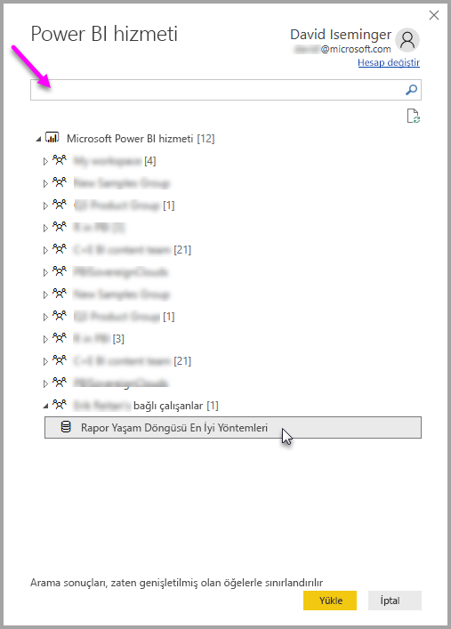

# Power BI Desktop'tan Power BI hizmetindeki veri kümelerine bağlanma
Power BI hizmetinde bir paylaşılan veri kümesiyle canlı bağlantı kurabilir, aynı veri kümesinden pek çok farklı rapor oluşturabilirsiniz. Yani Power BI Desktop'ta mükemmel veri modelinizi oluşturup Power BI hizmetine yayımlayabilir, siz ve başka kişiler bu ortak veri modelinden farklı raporlar (ayrı .pbix dosyaları) oluşturabilirsiniz. Bu özelliğin adı **Power BI hizmeti Canlı bağlantısı**'dır.

Bu özelliğin en iyi yöntem olması gibi pek çok avantajı vardır. Bunları bu makalede ele alacağız. Ayrıca makalenin sonunda bazı önemli noktalar ve sınırlamalar da verilmiştir. Lütfen bunları da okuduğunuzdan emin olun.

## Bir Power BI hizmet canlı bağlantısı kullanarak rapor yaşam döngüsünü yönetme
Power BI'ın bu kadar popüler olmasının bir sonucu olarak raporlar, panolar ve temel alınan veri modelleri hızla çoğalmaktadır. Bunun nedeni, **Power BI Desktop**'ta ilgi çekici raporlar oluşturup bunları **Power BI hizmetinde** paylaşmanın ([yayımlamanın](desktop-upload-desktop-files.md)) ve bu veri kümelerinden harika panolar oluşturmanın çok kolay olmasıdır. Pek çok kişi genellikle bunu aynı (veya neredeyse aynı) veri kümelerini kullanarak yaptığı için, hangi raporun hangi veri kümesini temel aldığını ve hangi veri kümesinin ne kadar güncel olduğunu bilmek bir zorluğa dönüştü. **Power BI hizmeti canlı bağlantısı** bu zorluğa eğiliyor ve ortak veri kümesi kullanarak rapor ve pano oluşturmayı, paylaşmayı ve genişletmeyi daha kolay ve tutarlı hale getiriyor.

### Herkesin kullanabileceği bir veri kümesi oluşturma ve paylaşma
Anna'nın (bir iş analisti) ekibinizde olduğunu ve iyi veri modelleri (genellikle veri kümesi olarak bilinir) oluşturmakta becerikli olduğunu varsayalım. Anna, uzmanlığına dayanarak bir veri kümesi ve rapor oluşturup bu raporu **Power BI hizmetinde** paylaşabiliyor.

Anna'nın raporu herkes tarafından çok beğeniliyor ve sorun burada başlıyor. Ekipteki herkes bu veri kümesinin *kendilerine ait bir sürümünü* oluşturmaya ve ekiple kendi raporlarını paylaşmaya çalışıyor. Birdenbire ekibinizin **Power BI hizmetindeki** çalışma alanında (farklı veri kümelerinden) çok sayıda rapor beliriyor. En yakın tarihli olan hangisiydi? Veri kümeleri neredeyse mi aynıydı, yoksa tamamen mi? Farklar nelerdi? **Power BI hizmeti canlı bağlantısı** özelliği sayesinde, bütün bunlar iyi yönde değişebilir. Aşağıdaki bölümde, Anna'nın yayımlanmış veri kümesini diğer ekip üyelerinin kendi raporları için nasıl kullanabileceğini ve herkesin benzersiz raporunu oluşturabilmesi için aynı sağlam, onaylanmış ve yayımlanmış veri kümesini kullanmasına izin verilebileceğini göreceğiz.

### Canlı bağlantıyla bir Power BI hizmeti veri kümesine bağlanma
Anna raporunu (ve temel aldığı veri kümesini) oluşturup **Power BI hizmetinde** yayımladığında rapor, ekibinin Power BI hizmetindeki çalışma alanında görünür. Artık çalışma alanındaki herkes bunu görebilir ve kullanabilir.

Artık çalışma alanının diğer üyeleri (**Power BI** hizmeti canlı bağlantı özelliği sayesinde) Anna'nın paylaştığı veri modeliyle canlı bağlantı kurabilir ve onun *özgün veri kümesinden* yola çıkarak kendi benzersiz raporlarını oluşturabilir.

Aşağıdaki görüntüde, Anna'nın bir **Power BI Desktop** raporunu nasıl oluşturduğunu ve **Power BI hizmetinde** (veri modeliyle birlikte) yayımladığını görebilirsiniz. Bundan sonra çalışma alanındaki diğer kişiler, **Power BI hizmeti canlı bağlantısını** kullanarak Anna'nın veri modeline bağlanabilir ve onun veri kümesini temel alan kendi benzersiz raporlarını oluşturabilir.

> [!NOTE]
> Veri kümeleri yalnızca bir çalışma alanında paylaşılır. Bir Power BI hizmeti canlı bağlantısı kurmak için, bağlanacağınız veri kümesinin üye olduğunuz bir çalışma alanında paylaşılmış olması gerekir.
> 
> 

## Power BI hizmeti canlı bağlantısını kullanmak için adım adım kılavuz
Artık **Power BI hizmeti canlı bağlantısının** ne kadar kullanışlı olduğunu ve bağlantıyı rapor yaşam döngüsü yönetiminin en iyi yöntemi olarak nasıl kullanabileceğinizi öğrendiğimize göre, bizi Anna'nın harika raporundan (ve veri kümesinden) Power BI çalışma alanındaki iş arkadaşlarının kullanabileceği paylaşılan veri kümesine götüren yolu adım adım yürüyelim.

### Bir Power BI raporu ve veri kümesini yayımlama
Bir **Power BI hizmeti canlı bağlantısı** kullanarak rapor yaşam döngüsünü yönetmenin ilk adımı, ekip arkadaşlarınızın kullanmak isteyeceği bir rapora (ve veri kümesine) sahip olmaktır. Bu yüzden Anna'nın önce raporunu **Power BI Desktop**'tan **yayımlaması** gerekir. Bunu yapmak için Power BI Desktop'ta **Giriş** şeridinden **Yayımla**'yı seçer.

Power BI hizmeti hesabında oturum açmamışsa oturum açması istenir.

Oradan, rapor ve veri kümesinin yayımlanacağı hedef çalışma alanını seçebilir. Unutmayın, yalnızca raporun yayımlandığı çalışma alanına erişimi olan üyeler söz konusu raporun veri kümesine **Power BI hizmeti canlı bağlantısıyla** erişebilir.

Yayımlama işlemi başlar ve **Power BI Desktop** ilerleme durumunu gösterir.

İşlem tamamlandığında, **Power BI Desktop** başarıyı bildirir ve **Power BI hizmetindeki** rapora ulaşmanız ve raporla ilgili **Hızlı Öngörüler** almanız için bağlantılar sunar.

Şimdi, raporun (ve veri kümesinin) yayımlandığı çalışma alanına erişimi olan diğer ekip üyelerinin veri kümesine nasıl bağlanıp kendi raporlarını oluşturabileceğini görelim.

### Yayımlanmış veri kümesiyle bir Power BI hizmeti canlı bağlantısı kurma
Yayımlanmış raporla bağlantı kurmak ve yayımlanmış veri kümesini temel alarak kendi raporunuzu oluşturmak için **Power BI Desktop**'ta **Giriş** şeridinden **Veri Al**'ı ve **Power BI hizmeti**'ni seçin. Ayrıca bunu **Veri Al > Çevrimiçi Hizmetler > Power BI hizmeti** yolundan da seçebilirsiniz.

Power BI'da oturum açmadıysanız oturum açmanız istenir. Oturum açtığınızda karşınıza, üye olduğunuz çalışma alanlarını gösteren bir pencere çıkar ve buradan **Power BI hizmeti canlı bağlantısı** kurmak istediğiniz veri kümesini içeren çalışma alanını seçebilirsiniz.

Çalışma alanının yanında köşeli ayraç içinde yazılı olan sayı, o çalışma alanında kullanılabilir olan paylaşılmış veri kümelerinin sayısıdır. Soldaki üçgene tıkladığınızda çalışma alanı genişler ve paylaşılmış veri kümesini seçebilirsiniz.

Yukarıdaki **Power BI hizmeti** canlı bağlantısı penceresiyle ilgili birkaç not:

* Paylaşılmış bir veri kümesini arayabilirsiniz ancak arama sonuçları yalnızca genişletilmiş öğelerle sınırlıdır, diğer bir deyişle, tıklayıp genişletmediğiniz çalışma alanlarıyla ilgili arama sonuçlarını göremezsiniz.
* Aramanızı genişletmek için birden fazla çalışma alanını genişletebilirsiniz.

Penceredeki **Yükle** düğmesine tıkladığınızda seçili veri kümesiyle bir canlı bağlantı kurabilirsiniz. Bu da, gördüğünüz verilerin (alanlar ve değerleri) gerçek zamanlı olarak **Power BI Desktop**'a yüklendiği anlamına gelir.

Artık siz (ve diğer kişiler) aynı veri kümesinden özel raporlar oluşturup paylaşabilirsiniz. Bilgi sahibi bir kişinin iyi biçimlendirilmiş bir veri kümesi oluşturup (Anna'nın yaptığı gibi), birçok ekip arkadaşının aynı veri kümesinden yola çıkarak kendi raporlarını oluşturması için bu harika bir yöntemdir.

> [!NOTE]
> **Power BI hizmeti** canlı bağlantısını kullanarak bir veri kümesini temel alan raporlar oluşturduğunuzda bu raporları yalnızca, kullanılan veri kümesini içeren Power BI hizmeti çalışma alanında yayımlayabilirsiniz.
> 
> 

## Sınırlamalar ve önemli noktalar
**Power BI hizmeti canlı bağlantısını** kullanırken dikkat etmeniz gereken bazı sınırlamalar ve önemli noktalar vardır.

* Bir çalışma alanının salt okunur üyeleri veri kümelerine **Power BI Desktop**'tan bağlanamaz.
* Yalnızca aynı **Power BI hizmeti** çalışma alanının parçası olan kullanıcılar, yayımlanmış bir veri kümesine **Power BI hizmeti canlı bağlantısı** kullanarak bağlanabilir. Kullanıcılar birden çok çalışma alanına üye olabilir (ve çoğunlukla üyedir).
* Bu canlı bir bağlantı olduğu için, **SQL Server Analysis Services**'e bağlanıldığındaki davranışa benzer şekilde sol gezinti çubuğu ve modellemeler devre dışıdır.
* Bu canlı bir bağlantı olduğu için, **SQL Server Analysis Services**'e bağlanıldığındaki gibi, RLS (satır ve rol düzeyi güvenlik), OneDrive İş ve diğer benzer bağlantı davranışları uygulanır.
* **Power BI hizmetinde** hangi veri kümesine bağlanacağınızı seçerken, arama kutusu yalnızca genişletilmiş çalışma alanlarında geçerlidir.
* Özgün paylaşılmış .pbix dosyasında dosyanın sahibi tarafından değişiklikler, **Power BI hizmetinde** paylaşılmış veri kümesinin ve raporun üzerine yazılır.
* Bir çalışma alanının üyeleri özgün paylaşılmış raporu başka bir raporla değiştiremez. Bunu denediğinizde dosyanızı yeniden adlandırıp yayımlamanızı isteyen bir uyarı belirecektir.
* **Power BI hizmetinde** paylaşılmış veri kümesini silerseniz diğer **Power BI Desktop** (.pbix) dosyaları düzgün çalışmaz ve görsellerini görüntülemez.
* İçerik Paketlerini **Power BI hizmetinde** bir .pbix raporu ve veri kümesi paylaşmak için temel olarak kullanmadan önce söz konusu içerik paketinin bir kopyasını oluşturmanız gerekir.
* *Kuruluşum*'dan gelen İçerik Paketlerini kopyaladığınızda, hizmette oluşturulan raporu ve/veya bir canlı bağlantıyla bir İçerik Paketini kopyalama işleminin bir parçası olarak oluşturulmuş bir raporu başka bir raporla değiştiremezsiniz. Bunu denediğinizde dosyanızı yeniden adlandırıp yayımlamanızı isteyen bir uyarı belirecektir. Bu durumda yalnızca yayımlanmış canlı bağlantılı raporları başka raporlarla değiştirebilirsiniz.
* **Power BI hizmeti** canlı bağlantısını kullanarak bir veri kümesini temel alan bir rapor oluşturduğunuzda söz konusu raporu yalnızca, kullanılan veri kümesini içeren Power BI hizmeti çalışma alanında yayımlayabilirsiniz.
* **Power BI hizmetindeki** bir paylaşılmış veri kümesini silerseniz daha sonra o veri kümesine **Power BI Desktop**'tan ulaşamazsınız.

