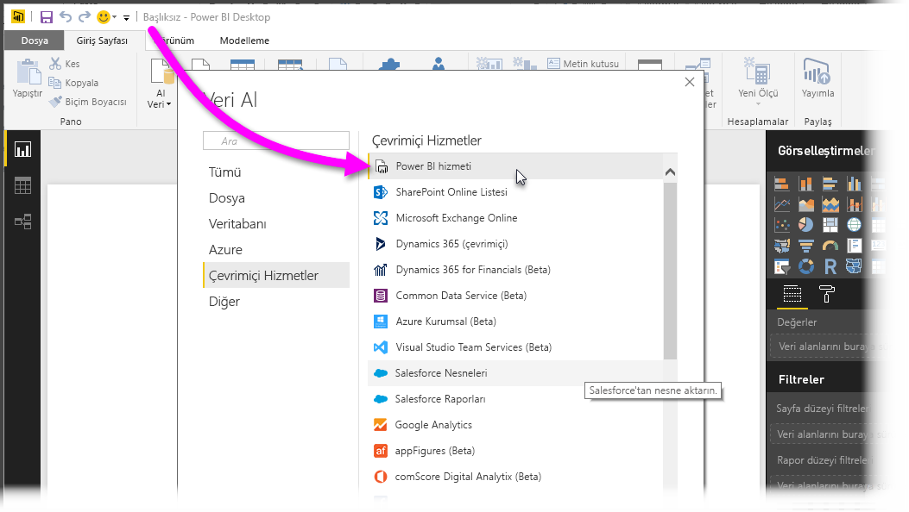
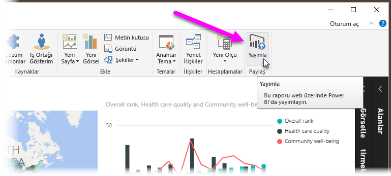
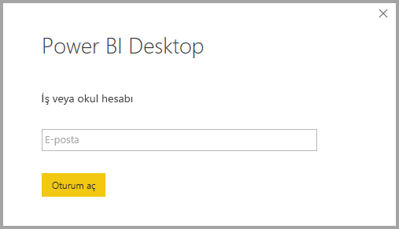
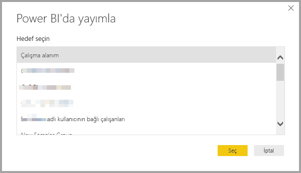
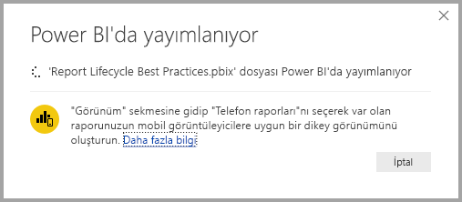
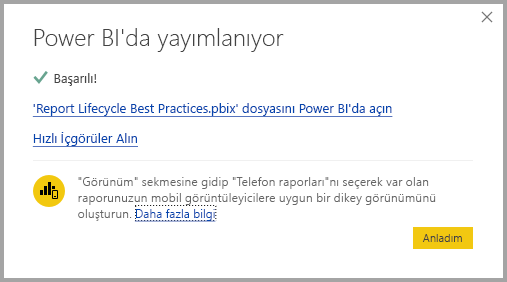
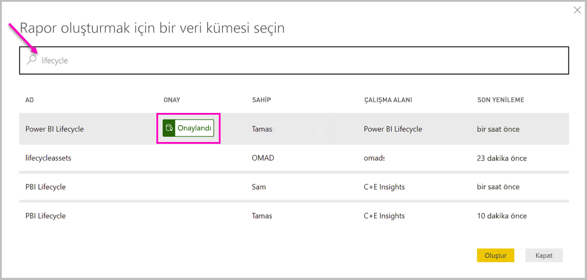
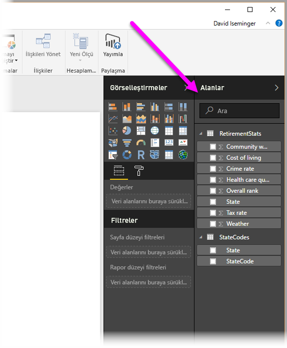

# Power BI Desktop'tan Power BI hizmetindeki veri kümelerine bağlanma
Power BI hizmetinde bir paylaşılan veri kümesiyle canlı bağlantı kurabilir, aynı veri kümesinden pek çok farklı rapor oluşturabilirsiniz. Bu Power BI Desktop'ta mükemmel veri modelinizi oluşturabileceğiniz ve Power BI hizmetinde yayımlayabileceğiniz anlamına gelir. Ardından siz ve başkaları aynı, ortak veri modelinden farklı raporlar (ayrı .pbix dosyalarında) oluşturabilir ve bunları farklı çalışma alanlarına kaydedebilirsiniz. Bu özelliğin adı **Power BI hizmeti Canlı bağlantısı**'dır.

Bu özelliğin en iyi yöntem olması gibi pek çok avantajı vardır. Bunları bu makalede ele alacağız. Ayrıca makalenin sonunda bazı önemli noktalar ve sınırlamalar da verilmiştir. Lütfen bunları da okuduğunuzdan emin olun.

## Bir Power BI hizmet canlı bağlantısı kullanarak rapor yaşam döngüsünü yönetme
Power BI'ın bu kadar popüler olmasının bir sonucu olarak raporlar, panolar ve temel alınan veri modelleri hızla çoğalmaktadır. Bunun nedeni, **Power BI Desktop**'ta ilgi çekici raporlar oluşturup bunları **Power BI hizmetinde** paylaşmanın ([yayımlamanın](desktop-upload-desktop-files.md)) ve bu veri kümelerinden harika panolar oluşturmanın çok kolay olmasıdır. Pek çok kişi genellikle bunu aynı (veya neredeyse aynı) veri kümelerini kullanarak yaptığı için, hangi raporun hangi veri kümesini temel aldığını ve hangi veri kümesinin ne kadar güncel olduğunu bilmek bir zorluğa dönüştü. **Power BI hizmeti canlı bağlantısı** bu zorluğa eğiliyor ve ortak veri kümesi kullanarak rapor ve pano oluşturmayı, paylaşmayı ve genişletmeyi daha kolay ve tutarlı hale getiriyor.

### Herkesin kullanabileceği bir veri kümesi oluşturma ve paylaşma
Anna'nın (bir iş analisti) ekibinizde olduğunu ve iyi veri modelleri (genellikle veri kümesi olarak bilinir) oluşturmakta becerikli olduğunu varsayalım. Anna, uzmanlığına dayanarak bir veri kümesi ve rapor oluşturup bu raporu **Power BI hizmetinde** paylaşabiliyor.

Anna'nın raporu herkes tarafından çok beğeniliyor ve sorun burada başlıyor. Anna'nın ekibindeki herkes bu veri kümesinin *kendilerine ait bir sürümünü* oluşturmaya ve ekiple kendi raporlarını paylaşmaya çalışıyor. Birdenbire ekibinizin **Power BI hizmetindeki** çalışma alanında (farklı veri kümelerinden) çok sayıda rapor beliriyor. En yakın tarihli olan hangisiydi? Veri kümeleri neredeyse mi aynıydı, yoksa tamamen mi? Farklar nelerdi? **Power BI hizmeti canlı bağlantısı** özelliği sayesinde, bütün bunlar iyi yönde değişebilir. Aşağıdaki bölümde, Anna'nın yayımlanmış veri kümesini diğer ekip üyelerinin kendi çalışma alanlarında kendi raporları için nasıl kullanabileceğini ve herkesin benzersiz raporunu oluşturabilmesi için aynı sağlam, onaylanmış ve yayımlanmış veri kümesini kullanmasına izin verilebileceğini göreceğiz.

### Canlı bağlantıyla bir Power BI hizmeti veri kümesine bağlanma
Anna bir rapor (ve temel aldığı veri kümesini) oluşturup bunu **Power BI hizmetinde** yayımlar ve rapor, ekibin Power BI hizmetindeki çalışma alanında görünür. Anna, raporu *yeni çalışma alanı deneyimine* kaydederse, çalışma alanı içindeki ve dışındaki herkesin bunu görebilmesi ve kullanabilmesi için Derleme izni ayarlayabilir.

Yeni çalışma alanları deneyimi hakkında daha fazla bilgi için bkz. [uygulama çalışma alanları](service-new-workspaces.md).

Anna’nın çalışma alanının içindeki ve dışındaki diğer üyeler (**Power BI hizmeti canlı bağlantı** özelliği sayesinde) Anna'nın paylaştığı veri modeliyle canlı bağlantı kurabilir ve onun *özgün veri kümesinden* yola çıkarak *kendi yeni deneyim çalışma alanlarında* kendi benzersiz raporlarını oluşturabilir.

Aşağıdaki görüntüde, Anna'nın bir **Power BI Desktop** raporunu nasıl oluşturduğunu ve **Power BI hizmetinde** (veri modeliyle birlikte) yayımladığını görebilirsiniz. Bundan sonra çalışma alanındaki diğer kişiler, **Power BI hizmeti canlı bağlantısını** kullanarak Anna'nın veri modeline bağlanabilir ve kendi çalışma alanlarında Anna’nın veri kümesini temel alan kendi benzersiz raporlarını oluşturabilir.

> [!NOTE]
> Veri kümenizi [klasik paylaşılan çalışma alanına](service-create-workspaces.md) kaydederseniz, yalnızca söz konusu çalışma alanının üyeleri veri kümenizi temel alan raporlar oluşturabilir. Bir Power BI hizmeti canlı bağlantısı kurmak için, bağlanacağınız veri kümesinin üye olduğunuz bir çalışma alanında paylaşılmış olması gerekir.
> 
> 

## Power BI hizmeti canlı bağlantısını kullanmak için adım adım kılavuz
Artık **Power BI hizmeti canlı bağlantısının** ne kadar kullanışlı olduğunu ve bağlantıyı rapor yaşam döngüsü yönetiminin en iyi yöntemi olarak nasıl kullanabileceğinizi öğrendiğimize göre, bizi Anna'nın harika raporundan (ve veri kümesinden) Power BI ekip arkadaşlarının kullanabileceği paylaşılan veri kümesine götüren yolu adım adım yürüyelim.

### Bir Power BI raporu ve veri kümesini yayımlama
Bir **Power BI hizmeti canlı bağlantısı** kullanarak rapor yaşam döngüsünü yönetmenin ilk adımı, ekip arkadaşlarınızın kullanmak isteyeceği bir rapora (ve veri kümesine) sahip olmaktır. Bu yüzden ilk olarak Anna'nın raporu **Power BI Desktop**'tan **yayımlaması** gerekir. Bu, Power BI Desktop'taki **Giriş** şeridinden **Yayımla** seçilerek yapılır.

Anna, Power BI hizmeti hesabında oturum açmadıysa, bir açılır pencere ile Anna’ya istem gönderilir.

Anna, oradan rapor ve veri kümesinin yayımlanacağı hedef çalışma alanını seçebilir. Anna bunu yeni çalışma alanı deneyimine kaydederse Derleme izni olan herkesin söz konusu veri kümesine erişebileceğini unutmayın. Derleme izni, yayımlama sonrasında Power BI hizmetinde ayarlanır. İş, klasik bir çalışma alanına kaydedilirse, yalnızca raporun yayımlandığı çalışma alanına erişimi olan üyeler söz konusu raporun veri kümesine **Power BI hizmeti canlı bağlantısıyla** erişebilir.

Yayımlama işlemi başlar ve **Power BI Desktop** ilerleme durumunu gösterir.

İşlem tamamlandığında, **Power BI Desktop** başarıyı bildirir ve **Power BI hizmetindeki** rapora ulaşmanız ve raporla ilgili **Hızlı Öngörüler** almanız için bağlantılar sunar.

Artık raporunuz veri kümesiyle birlikte Power BI hizmetinde olduğundan, kalitesini ve güvenilirliğini kanıtlamak için raporu *tanıtabilirsiniz*. Hatta Power BI kiracınızdaki merkezi bir yetkili tarafından *onaylanmasını* bile isteyebilirsiniz. Bu onaylardan herhangi biriyle, başkaları veri kümelerinde arama yaparken veri kümeniz her zaman listenin üstünde görüntülenecektir. İlginizi çekiyorsa, [veri kümenizi tanıtma](service-datasets-promote.md) işlemiyle ilgili daha fazla bilgi edinebilirsiniz. 

Son adım raporun dayandığı veri kümesi için *Derleme iznini* ayarlamaktır. Derleme izni veri kümenizi kimlerin görebileceğini ve kullanabileceğini belirler. Bu izni çalışma alanının içinde veya çalışma alanında uygulama paylaşırken ayarlayabilirsiniz. [Derleme iznini](service-datasets-build-permissions.md#build-permissions-for-shared-datasets) ayarlama hakkında daha fazla bilgi edinin.

Şimdi, raporun (ve veri kümesinin) yayımlandığı çalışma alanına erişimi olan diğer ekip üyelerinin veri kümesine nasıl bağlanıp kendi raporlarını oluşturabileceğini görelim.

### Yayımlanmış veri kümesiyle bir Power BI hizmeti canlı bağlantısı kurma
Yayımlanmış raporla bağlantı kurmak ve yayımlanmış veri kümesini temel alarak kendi raporunuzu oluşturmak için **Power BI Desktop**'ta **Giriş** şeridinden **Veri Al**'ı seçin, sol bölmede **Power BI**'ı ve sonra da **Power BI veri kümeleri**'ni seçin.

Power BI'da oturum açmadıysanız oturum açmanız istenir. Oturum açtığınızda karşınıza, üye olduğunuz çalışma alanlarını gösteren bir pencere çıkar ve buradan **Power BI hizmeti canlı bağlantısı** kurmak istediğiniz veri kümesini içeren çalışma alanını seçebilirsiniz.

Listedeki veri kümelerinin tümü, herhangi bir çalışma alanında Derleme iznine sahip olduğunuz paylaşılan veri kümeleridir. Belirli bir veri kümesi için arama yapabilir ve adını, sahibini, bulunduğu çalışma alanını ve en son ne zaman yenilendiğini görebilirsiniz. Ayrıca listenin en üstünde sertifikalı veya tanıtılan *onaylanmış* veri kümelerini de görürsünüz. 

Penceredeki **Yükle** düğmesine tıkladığınızda seçili veri kümesiyle bir canlı bağlantı kurabilirsiniz. Bu da, gördüğünüz verilerin (alanlar ve değerleri) gerçek zamanlı olarak **Power BI Desktop**'a yüklendiği anlamına gelir.

Artık siz (ve diğer kişiler) aynı veri kümesinden özel raporlar oluşturup paylaşabilirsiniz. Bilgi sahibi bir kişinin iyi biçimlendirilmiş bir veri kümesi oluşturup (Anna'nın yaptığı gibi), birçok ekip arkadaşının aynı veri kümesinden yola çıkarak kendi raporlarını oluşturması için bu harika bir yöntemdir.

## Sınırlamalar ve önemli noktalar
**Power BI hizmeti canlı bağlantısını** kullanırken dikkat etmeniz gereken bazı sınırlamalar ve önemli noktalar vardır.

* Yalnızca veri kümesi üzerinde Derleme izni olan kullanıcılar yayımlanmış bir veri kümesine **Power BI hizmeti canlı bağlantısını** kullanarak bağlanabilir. 
* Ücretsiz kullanıcılar yalnızca Çalışma Alanım'daki ve Premium tabanlı çalışma alanlarındaki veri kümelerini görebilir.
* Bu canlı bir bağlantı olduğu için, **SQL Server Analysis Services**'e bağlanıldığındaki davranışa benzer şekilde sol gezinti çubuğu ve modellemeler devre dışı bırakılır ve her raporda yalnızca bir veri kümesine bağlanabilirsiniz.
* Bu canlı bir bağlantı olduğu için, **SQL Server Analysis Services**'e bağlanıldığındaki gibi, RLS (satır ve rol düzeyi güvenlik) ve diğer benzer bağlantı davranışları uygulanır.
* Özgün paylaşılmış .pbix dosyasında dosyanın sahibi tarafından değişiklikler, **Power BI hizmetinde** paylaşılmış veri kümesinin ve raporun üzerine yazılır. Bu veri kümesine dayalı raporların üzerine yazılmaz ama veri kümesinde yapılan tüm değişiklikler rapora yansıtılır.
* Bir çalışma alanının üyeleri özgün paylaşılmış raporu başka bir raporla değiştiremez. Bunu denediğinizde dosyanızı yeniden adlandırıp yayımlamanızı isteyen bir uyarı belirecektir.
* **Power BI hizmetinde** paylaşılan veri kümesini silerseniz bu veri kümesine dayalı diğer raporlar düzgün çalışmaz veya görsellerini görüntülemez.
* İçerik Paketlerini **Power BI hizmetinde** bir .pbix raporu ve veri kümesi paylaşmak için temel olarak kullanmadan önce söz konusu içerik paketinin bir kopyasını oluşturmanız gerekir.
* *Kuruluşum*'dan gelen İçerik Paketlerini kopyaladığınızda, hizmette oluşturulan raporu ve/veya bir canlı bağlantıyla bir İçerik Paketini kopyalama işleminin bir parçası olarak oluşturulmuş bir raporu başka bir raporla değiştiremezsiniz. Bunu denediğinizde dosyanızı yeniden adlandırıp yayımlamanızı isteyen bir uyarı belirecektir. Bu durumda yalnızca yayımlanmış canlı bağlantılı raporları başka raporlarla değiştirebilirsiniz.
* **Power BI hizmetindeki** paylaşılan veri kümesini silerseniz artık o veri kümesine kimse **Power BI Desktop**'tan ulaşamaz.

