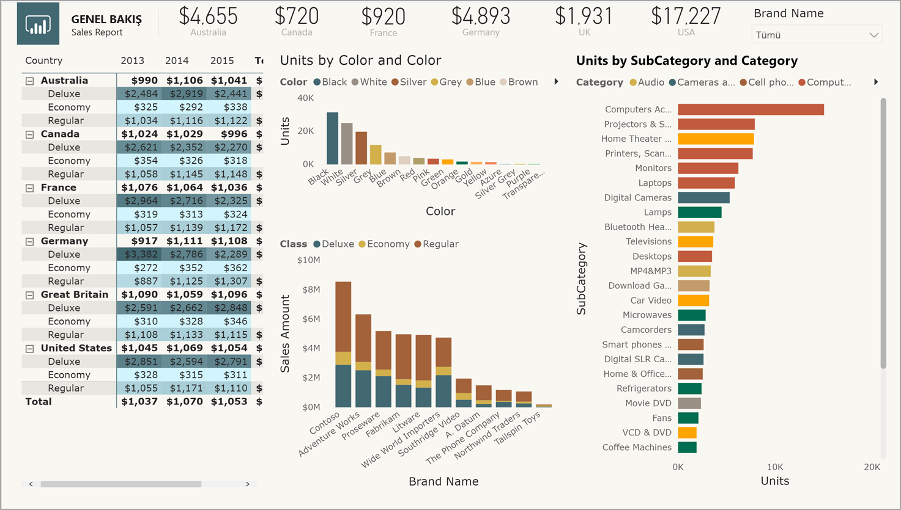
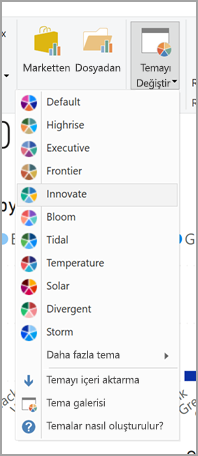
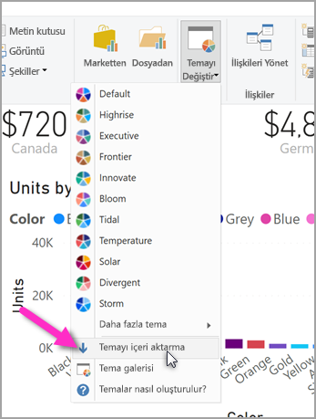
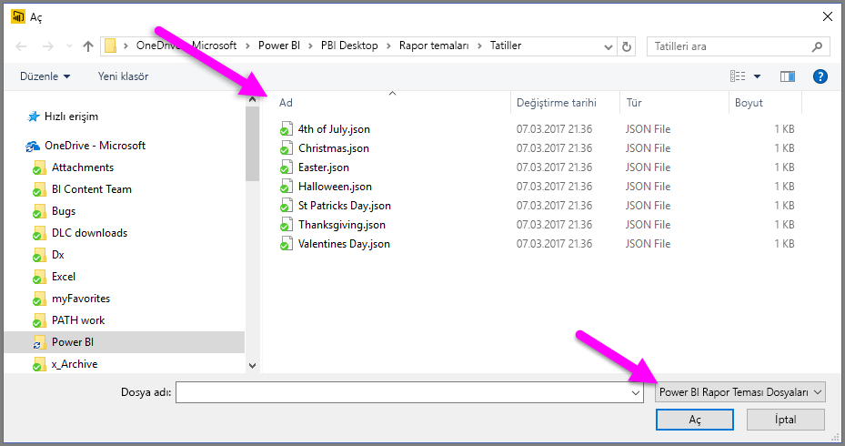
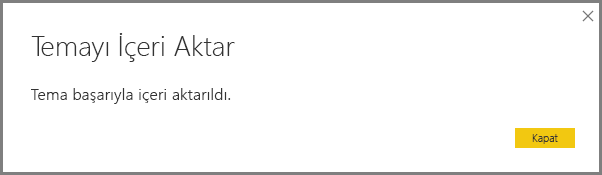
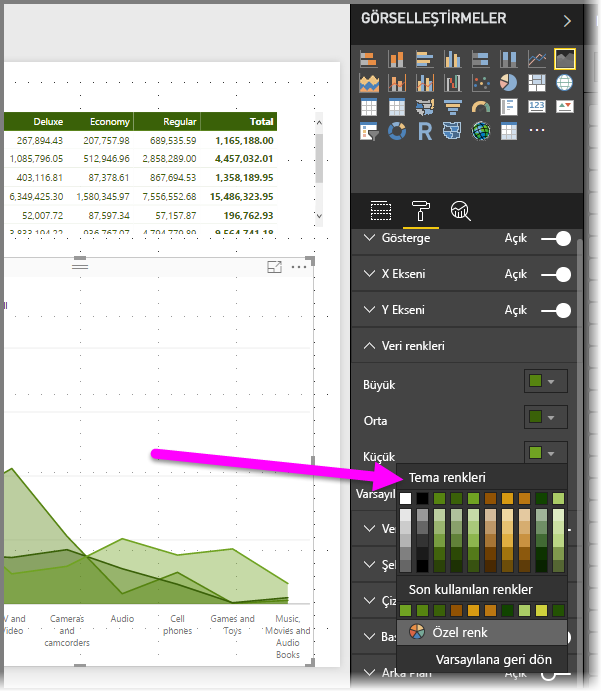
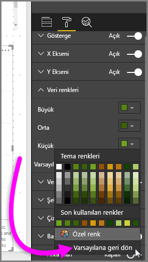

# <a name="use-report-themes-in-power-bi-desktop"></a>Power BI Desktop'ta Rapor Temalarını Kullanma
**Rapor Temaları** ile raporunuzun tamamında kurumsal renkler kullanmak, simge kümelerini değiştirmek veya yeni varsayılan görsel biçimlendirmeyi uygulamak gibi tasarım değişiklikleri uygulayabilirsiniz. Bir **Rapor Teması** uyguladığınızda raporunuzdaki tüm görsellerde, seçtiğiniz temanın renkleri ve biçimlendirmesi kullanılır. Bu makalenin devamında da açıklandığı üzere bazı özel durumlar söz konusudur.



Bir özel **Rapor Teması** uygulamak için temel yapıda bir JSON dosyası gerekir. Daha sonra bu JSON dosyasını Power BI Desktop'a aktarabilir ve raporunuza uygulayabilirsiniz.

Ayrıca, doğrudan Power BI Desktop'ta yapılan özelleştirmeler veya tema JSON dosyası aracılığıyla **Biçimlendirme** bölmesinde görülen neredeyse tüm öğeleri özelleştirebilir ve standartlaştırabilirsiniz. Amaç, raporlarınızın görünüm ve yapısını en küçük ayrıntılarına kadar tamamen denetleyebilmenizi sağlamaktır.

## <a name="how-report-themes-work"></a>Rapor Temaları nasıl kullanılır?
Bir Power BI Desktop raporuna Rapor Teması uygulamak için kullanılabilir durumdaki yerleşik rapor temalarından birini seçebilir ya da özel bir temayı oluşturabilir veya içeri aktarabilirsiniz.

| Yerleşik rapor teması | Varsayılan renk dizisi    |
|------ |---------- |
| Varsayılan   | |
| Highrise  | |
| Yönetici     | |
| Sınır  | |
| Yenilikçi    | |
| Çiçek     | |
| Gelgit | |
| Sıcaklık   | |
| Güneş | |
| Çeşitli     | |
| Fırtına     | |
| Klasik   | |
| Şehir parkı     | |
| Sınıf     | |
| Renk körleri için   | |
| Elektrik  | |
| Yüksek karşıtlık     | |
| Gün batımı    | |
| Alacakaranlık  | |

Kullanılabilir durumdaki yerleşik rapor temalarından seçim yapmak için **Giriş** şeridinden **Temayı Değiştir** düğmesini ve ardından açılan menüdeki temalardan birini seçin.



Rapor temanız rapora uygulanır ve kullanılmaya hazır duruma gelir.

### <a name="importing-report-themes"></a>Rapor Temalarını İçeri Aktarma

Özel bir Rapor Temasını içeri aktarmak için **Giriş** şeridindeki **Temayı Değiştir** düğmesini seçin. Ardından açılan menüden **Temayı İçeri Aktar** seçeneğini belirleyin.



JSON tema dosyasının konumuna göz atmanızı sağlayan bir pencere açılır. Power BI Rapor Teması dosya türü JSON olduğu için Power BI Desktop JSON dosyalarını arar. Aşağıdaki görüntüde birkaç tatil tema dosyası bulunur. Mart ayı için bir tatil teması seçeceğiz.



Tema dosyası başarıyla yüklendiğinde, Power BI Desktop size haber verir.



Power BI Desktop'ta temaları özelleştirmenin iki yolu vardır. Şimdi sırayla bunları gözden geçirelim:


## <a name="customize-report-themes-preview"></a>Rapor temalarını özelleştirme (önizleme)

**Power BI Desktop**'ın Aralık 2019 sürümünden başlayarak, artık rapor temasını özelleştirmenin iki yolu vardır:

* Power BI Desktop'ta temayı oluşturma ve özelleştirme (önizleme)
* Özel Rapor Teması JSON dosyasını oluşturma ve özelleştirme

Temayı doğrudan Power BI Desktop'ta özelleştirmek için önce **Dosya > Seçenekler ve ayarlar > Seçenekler**'i seçmeniz ve ardından aşağıdaki resimde gösterildiği gibi **Önizleme özellikleri** bölümünde **Geçerli temayı özelleştir**'in yanındaki kutuyu seçmeniz gerekir.


Önizleme özelliğinin etkinleştirilmesi için Power BI Desktop'ı yeniden başlatmanız istenebilir.

Yeniden başlattıktan sonra **Giriş** şeridini ve sonra şeritten **Temayı değiştir > Geçerli temayı özelleştir**'i seçerek geçerli temayı özelleştirmeye başlayabilirsiniz. Mevcut temayı özelleştirmenin birçok yolunu gösteren bir iletişim kutusu görüntülenir.


Mevcut temalardan birini beğeniyor ve birkaç ayarlama yapmak istiyorsanız, mevcut temayı seçip ardından aşağıdaki resimde gösterildiği gibi iletişim kutusunda **Geçerli temayı özelleştir**'i kullanabilirsiniz. 


> [!NOTE]
> Önceki resimde, şu anda önizleme aşamasında olan yeni şerit etkinleştirilmiş durumdadır. **Dosya > Seçenekler ve ayarlar > Seçenekler**seçerek ve **Önizleme özellikleri** bölümünde **Yeni şerit önizlemesi** seçerek yeni şerit önizlemesini etkinleştirebilirsiniz.

Özelleştirilebilen tema ayarları aşağıdaki kategorilerde bulunur ve temayı özelleştirme iletişim kutusunda bunlar yansıtılır:

* Tema adı (özelleştirdiğiniz temayı adlandırırsınız) ve çeşitli renk ayarları (tema renkleri, yaklaşım renkleri, farklı renkler ve diğerleri)
* Yazı tipi ailesi, boyutu ve rengi de dahil olmak üzere metin ayarları; eksen başlıkları, renkleri, kartlar ve KPI'ler; sekme üst bilgileri
* Arka plan, kenarlık, üst bilgi ve araç ipuçları gibi görsel öğeler
* Duvar kağıdı ve arka plan gibi sayfa öğeleri
* Arka plan rengi, saydamlık, yazı tipi ve simge rengi, boyutu ve filtre kartları gibi filtre bölmesi ayarları

Değişikliklerinizi yaptıktan ve **Uygula ve kaydet** düğmesini seçtikten sonra temanız kaydedilir. Bundan sonra geçerli raporda kullanılabilir ve dışarı aktarılabilir. 

Geçerli temayı bu şekilde özelleştirmek, temaları özelleştirmeye yönelik görsel çalışmanın hızlı ve kolay olmasını sağlayabilir. Öte yandan temaların, aşağıdaki bölümde açıklandığı gibi temanın JSON dosyasında değişiklik yapılmasını gerektiren bazı sınırlı ayarlamaları vardır.

> [!TIP]
> **Geçerli temayı özelleştir** iletişim kutusu kullanılarak görsel öğeler aracılığıyla tema öğelerinden çoğu özelleştirilebilir. Bundan sonra JSON dosyasını dışarı aktarabilir ve el ile ince ayarlamalar yapabilirsiniz (JSON dosyasının kendisinde değişiklik yaparak). Ardından ince ayarlamaların yapıldığı JSON dosyasını yeniden adlandırabilir, içeri aktarabilir ve istediğiniz tüm ayarlamalara sahip olabilirsiniz.


## <a name="structure-of-a-report-theme-json-file"></a>Rapor Teması JSON dosyasının yapısı
 Önceki bölümde seçilen temel JSON dosyası (*St Patrick's Day.json* dosyası) bir düzenleyicide açıldığında aşağıdaki ekran görüntüsü gibi görünür:


Bu JSON dosyasında şu gerekli satırlar bulunur:

* **name**: Temanın adıdır ve gerekli olan tek alandır.

* **dataColors**: Power BI Desktop görsellerindeki veriler için kullanılacak onaltılık renk kodlarının listesidir. Listede istediğiniz sayıda renk bulunabilir.

* **background**, **foreground** ve **tableAccent**: Birkaç renk sınıfı. Renk sınıflarının ayrıntılarına bu makalenin ilerleyen bölümlerinde bakacağız, ancak renk sınıflarının raporunuzda tek seferde birçok renk ayarlamanıza olanak tanıdığını biliyoruz.

Aşağıda verilen *St Patrick's Day.json* dosyasının metin içeriğini kullanarak kendi JSON dosyanızı oluşturabilirsiniz:

```json
    {
        "name": "St Patricks Day",
        "dataColors": ["#568410", "#3A6108", "#70A322", "#915203", "#D79A12", "#bb7711", "#114400", "#aacc66"],
        "background":"#FFFFFF",
        "foreground": "#3A6108",
        "tableAccent": "#568410"
    }
```

Yapmak istediğiniz şey raporunuzun temel renklerini ayarlamaksa, kendi kişisel JSON dosyanızı içeri aktarmaya hazırlamak için yalnızca bu dosyanın adını ve onaltılık kodlarını değiştirebilirsiniz.

JSON dosyasında yalnızca, uygulamak istediğiniz biçimlendirmeyi tanımlarsınız. JSON dosyanızda *belirtilmeyen* her şey için Power BI varsayılan ayarları geçerli olur.

JSON dosyası oluşturmanın çok sayıda avantajı vardır. Örneğin, tüm grafiklerde yazı tipi boyutunun 12 olacağını, bazı görsellerde belirli bir yazı tipi ailesinin kullanılacağını belirtebilirsiniz. Veya belirli grafik türleri için veri etiketlerini devre dışı bırakabilirsiniz.

Ayrıntılı bir JSON dosyası kullanarak grafik ve raporlarınızı standart hale getirip kuruluş raporlarınızın tutarlı olmasını kolaylaştıran bir tema dosyası oluşturabilirsiniz.

Ayrıntılı JSON dosyasının biçimi hakkında daha fazla bilgi için, bu makalenin ilerleyen kısımlarında yer alan **Rapor teması JSON dosya biçimi** bölümüne bakın.

## <a name="how-report-theme-colors-stick-to-your-reports"></a>Rapor Teması renkleri, raporlarınıza nasıl eklenir?
Raporunuzu **Power BI hizmetinde** yayımladığınızda Rapor Teması renkleriniz de yayımlanır.

**Biçim** bölmesindeki **Veri renkleri** bölümünde Rapor Temanız gösterilir. Örneğin, **St. Patrick's Day** temasından çok sayıda kahverengi ve yeşil renk uyguladıktan sonra bir görsel seçebilirsiniz. Ardından **Biçim > Veri renkleri** bölümüne gittiğinizde aşağıdakileri görürsünüz:



Tüm yeşil renkleri görüyor musunuz? Bunun nedeni, bu renklerin içeri aktarıp uyguladığımız **Rapor Temasında** yer almasıdır.

Renk paletindeki renkler de geçerli temaya göre değişir. Bu nedenle, örneğin, bir veri noktası için en üstteki satırın üçüncü rengini seçer ve daha sonra farklı temayla değiştirirseniz, tıpkı Microsoft Office’te tema değiştirirken göreceğiniz gibi, bu veri noktasının rengi yeni temanın en üst satırının üçüncü rengiyle otomatik olarak güncelleştirilir.

### <a name="situations-when-report-theme-colors-wont-stick-to-your-reports"></a>Rapor Teması renklerinin raporlarınıza eklenmediği durumlar
Renk seçicideki Özel renk seçeneğini kullanarak bir görseldeki belirli bir veri noktasına özel bir renk kümesi (veya tek bir renk) uyguladığınızı düşünelim. Bir Rapor Teması uyguladığınızda bu özelleştirilmiş veri noktası rengini geçersiz *kılmaz*.

Tema renkleri bölümünü kullanarak bir veri noktasının rengini el ile ayarlamak da isteyebilirsiniz. Yeni bir Rapor Teması uyguladığınızda bu renkler *güncelleştirilmez*. Yeni bir Rapor Teması uyguladığınızda güncelleştirilmesi için varsayılan renklere dönmek isterseniz **Varsayılana geri dön**’ü seçin veya renk seçicinin Tema renkleri paletinden **Tema renkleri** seçeneğini belirleyin.



Ayrıca Rapor Temaları birçok **Özel Görsele** de uygulanmaz.

## <a name="report-theme-files-you-can-use-right-now"></a>Şu anda kullanabileceğiniz Rapor Teması dosyaları
**Rapor Temaları** ile çalışmaya başlamak mı istiyorsunuz? Aşağıda indirip **Power BI Desktop** raporunuza aktarabileceğiniz birkaç hazır Rapor Teması JSON dosyası bulunmaktadır. Bu makalede kullanılan rapora uygulanan Rapor Temasının görüntüsü de dahil edilmiştir.

* **Rapor Temalarının** kullanıma sunulduğunu duyuran [blog gönderisinde](https://powerbi.microsoft.com/blog/power-bi-desktop-march-feature-summary/) kullanılan [*waveform.json*](https://go.microsoft.com/fwlink/?linkid=843924) adlı [tema](https://go.microsoft.com/fwlink/?linkid=843924).

  

* Varsayılan renk temasına kıyasla [görme zorluğu yaşayan kullanıcılar için okuması daha kolay olan tema](https://go.microsoft.com/fwlink/?linkid=843923). Bu tema [*ColorblindSafe-Longer.json*](https://go.microsoft.com/fwlink/?linkid=843923) olarak adlandırılmıştır.

  

* Aşağıda gösterilen [*Apothecary.json*](https://go.microsoft.com/fwlink/?linkid=843925) adlı tema da dahil olmak üzere bir zip dosyasına yerleştirilmiş [Power View teması](https://go.microsoft.com/fwlink/?linkid=843925) grubu.

  

* Son olarak *Valentine's Day* teması.

  

Valentine's Day teması için indirme bağlantısı yerine JSON kodunu verdik:

```json
    {
        "name": "Valentine's Day",
        "dataColors": ["#990011", "#cc1144", "#ee7799", "#eebbcc", "#cc4477", "#cc5555", "#882222", "#A30E33"],
        "background":"#FFFFFF",
        "foreground": "#ee7799",
        "tableAccent": "#990011"
    }
```

**Rapor Temaları** sizi, kuruluşunuzu ve hatta geçerli mevsimi ya da tatili Power BI Desktop raporlarınızda renkli bir şekilde yansıtabilir. 

Başlangıçta kullanabileceğiniz birkaç rapor teması daha aşağıda bulunmaktadır:

* [Sunflower-twilight](https://community.powerbi.com/t5/Themes-Gallery/Sunflower-Twilight/m-p/140749)
* [Plum](https://community.powerbi.com/t5/Themes-Gallery/Plum/m-p/140711)
* [Autumn](https://community.powerbi.com/t5/Themes-Gallery/Autumn/m-p/140746)
* [High contrast](https://community.powerbi.com/t5/Themes-Gallery/Color-Blind-Friendly/m-p/140597)

## <a name="report-theme-json-file-format"></a>Rapor teması JSON dosya biçimi
En temel düzeyinde, tema JSON dosyasında yalnızca bir gerekli satır vardır: **ad**. 

```json
    {
        "name": "Custom Theme",
    }
```

*Ad* dışındaki her şey isteğe bağlıdır. Diğer bir deyişle, tema dosyasına yalnızca özellikle istediğiniz özellikleri eklemekte ve geri kalanı için Power BI’ın varsayılan özelliklerini kullanmakta serbestsiniz. 

Ad altında, veri rengiyle ilgili bazı temel özellikleri ekleyebilirsiniz. 


* **dataColors**: Power BI Desktop görsellerindeki veriler için kullanılacak onaltılık renk kodlarının listesidir. Listede istediğiniz sayıda renk bulunabilir. Bu listedeki tüm renkler kullanıldıktan sonra, görsel daha fazla renk gerekiyorsa Power BI’ın varsayılan renk paletini kullanmaya geri döner. 
* **iyi, nötr, bozuk**: Bunlar şelale grafiği ve KPI görseli tarafından kullanılan durum renklerini ayarlar.
* **maksimum, orta, minimum, null**: Bu renkler koşullu biçimlendirme iletişim kutusundaki çeşitli gradyan renklerini ayarlar.  

Bu renkleri tanımlayan temel bir tema aşağıdaki gibi görünür:

```json
    {
        "name": "Custom Theme",
          "dataColors": [
                "#118DFF",
                "#12239E", 
                "#E66C37", 
                "#6B007B", 
                "#E044A7",
                "#744EC2", 
                "#D9B300", 
                "#D64550",
                "#197278", 
                "#1AAB40"
    ],
        "good": "#1AAB40",
        "neutral": "#D9B300",
        "bad": "#D64554",
        "maximum": "#118DFF",
        "center": "#D9B300",
        "minimum": "#DEEFFF",
        "null": "#FF7F48"
    }
```

Daha sonra çeşitli renk sınıfları ekleyebilirsiniz. Renk sınıfları, genel olarak aynı renge sahip benzer görsel özellikleri gruplandırarak, raporunuzun tamamında tek bir satırda birçok renk ayarlamanıza olanak sağlar. 

Aşağıdaki tabloda, biçimlendirebileceğiniz altı renk sınıfını görebilirsiniz.


|Renk sınıfı  |Neyi biçimlendirir?  |
|---------|---------|
|ön plan | Etiket arka plan rengi (veri noktaları dışında olduğunda) <br> Eğilim çizgisi rengi <br>  Metin kutusu varsayılan rengi <br> Tablo ve matris değerleri ve toplam yazı tipi renkleri Veri çubukları eksen rengi <br> Kart veri etiketleri <br> Ölçek açıklama balonu değeri rengi <br> KPI hedefi rengi <br>  KPI metin rengi <br> Dilimleyici öğe rengi (Odak modundayken)  <br> Dilimleyici açılan öğe yazı tipi rengi <br> Dilimleyici sayısal giriş yazı tipi rengi <br> Dilimleyici üst bilgisi yazı tipi rengi <br> Dağılım grafiği oran çizgisi rengi <br> Çizgi grafik tahmin çizgisi rengi <br> Eşleme öncü çizgisi rengi <br> Filtre bölmesi ve kart metin rengi|
|foregroundNeutralSecondary |Etiket renkleri  <br> Gösterge etiketi rengi <br> Eksen etiketi rengi <br> Tablo ve matris üst bilgisi yazı tipi rengi <br> Ölçek hedefi ve hedef öncü çizgisi rengi <br>  KPI eğilimi ekseni rengi <br> Dilimleyici kaydırıcısı rengi <br> Dilimleyici öğe yazı tipi rengi <br> Kaydırıcı ana hat rengi <br> Çizgi grafik üzerine gelme rengi <br> Çok satırlı kart başlığı rengi <br> Şerit grafik kontur rengi <br> Şekil eşlemi kenarlık rengi <br> Düğme metni yazı tipi rengi <br> Düğme simgesi çizgi rengi <br> Düğme ana hat çizgisi rengi |
| foregroundNeutralTertiary | gösterge soluk rengi <br> Kart kategori etiketi rengi <br> Çok satırlı kart kategorisi etiketi rengi <br> Çok satırlı kart çubuk rengi <br> Huni grafiği dönüştürme oranı kontur rengi 
| backgroundLight | Eksen kılavuz çizgisi rengi <br> Tablo ve matris kılavuz rengi <br> Dilimleyici üst bilgisi arka plan rengi (Odak modundayken)  <br> Çok satırlı kart ana hat rengi  <br> Şekil dolgusu rengi <br> Ölçek yayı arka plan rengi <br> Uygulanan filtre kart arka planı rengi <br> |
backgroundNeutral | Tablo ve matris kılavuz ana hat rengi <br> Şekil eşlemi varsayılan rengi <br> Şerit grafik şeridi dolgu rengi (seri eşleştirme seçeneği kapalıyken) |
background | Etiket arka plan rengi (veri noktaları içinde olduğunda) <br> Dilimleyici açılan öğeleri arka plan rengi  <br> Halka grafik kontur rengi <br> Ağaç haritası kontur rengi <br> Birleşik harita arka plan rengi <br> Düğme dolgusu rengi <br> Filtre bölmesi ve kullanılabilir filtre kartı arka plan rengi |
tableAccent | Mevcut olduğunda tablo ve matris kılavuzu ana hat rengini geçersiz kılar |


Renk sınıflarını ayarlayan örnek tema aşağıda verilmiştir:

```json
    {
        "name": "Custom Theme",
        "foreground": "#252423",
          "foregroundNeutralSecondary": "#605E5C",
          "foregroundNeutralTertiary": "#B3B0AD",
        "background": "#FFFFFF",
          "backgroundLight": "#F3F2F1",
          "backgroundNeutral": "#C8C6C4",
        "tableAccent": "#118DFF"
    }
```

Daha sonra renk sınıflarına benzer olmasına karşılık yazı tipi boyutunu, rengini ve ailesini rapor genelindeki metin grupları için güncelleştirmenizi sağlamak için tasarlanmış olan metin sınıflarını JSON dosyanıza ekleyebilirsiniz. 12 metin sınıfı vardır, ancak raporunuzdaki metin biçimlendirmelerinin tümünü değiştirmek için *birincil sınıflar* olarak adlandırılan dört sınıfı ayarlamanız yeterlidir. *İkincil sınıflar* olarak kabul edilen diğer metin sınıfları ise özelliklerini ilişkili oldukları birincil sınıflardan otomatik olarak devralır veya türetir. İkincil sınıf genellikle birincil sınıfa kıyasla daha açık bir metin rengi gölgesi ya da daha büyük veya daha küçük bir metin boyutu yüzdesi türetir. 

*Etiket* sınıfını örnek olarak alalım. Etiket sınıfı için varsayılan biçimlendirme Segoe UI, #252423 (koyu gri renk) ve 12 puntodur ve bu sınıf tablo ile matristeki değerleri biçimlendirmek için kullanılır. Genellikle bir tablo veya matristeki toplamlar benzer bir biçimlendirmeye sahip olacaktır, ancak daha fazla öne çıkması için kalın yapıldığından kalın etiket sınıfını kullanır. Ancak, bunu hiçbir zaman JSON teması içinde belirtmeniz gerekmez. Power BI bunu sizin için otomatik olarak algılar. Daha sonra etiketlerinizin 14 punto yazı tipinde olmasını ve temanızda bunu belirtmeyi isterseniz, etiket sınıfından tüm metin biçimlendirmesini devraldığı ve sadece üstündeki yazı tipi ailesini kalın yaptığından kalın etiket sınıfını da güncelleştirmeniz gerekmez. 

Tablo listesinde aşağıdakiler gösterilir:
* Dört birincil metin sınıfı, neyi biçimlendirdiği ve varsayılan ayarları
* İkincil sınıfların her biri, neyi biçimlendirdiği ve birincil sınıfa kıyasla benzersiz olan varsayılan ayarı


|Birincil sınıf  |İkincil Sınıflar  |JSON'daki sınıf adı  |Ayarlar  |İlişkili görsel nesneler  |
|---------|---------|---------|---------|---------|
| Açıklama Balonu   | YOK   | açıklama balonu | DIN <br> #252423 <br> 45 pt |Kart veri etiketleri <br> KPI göstergeleri|
|Üst bilgi|YOK|üst bilgi|Segoe UI Semibold <br> #252423 <br> 12 pt |Ana etmenler üst bilgileri |
| Başlık || başlık    |DIN <br> #252423 <br> 12 pt |Kategori ekseni başlığı <br> Değer ekseni başlığı <br> Çok satırlı kart başlığı * <br> Dilimleyici üst bilgisi|
|-| Büyük başlık | largeTitle    |14 pt   |Görsel başlık |
|Etiket ||etiket |Segoe UI<br>#252423<br>10 pt |Tablo ve matris sütun üst bilgileri <br> Matris satır üst bilgileri<br>Tablo ve matris kılavuzu<br>Tablo ve matris değerleri |
|-|Yarı kalın |semiboldLabel| Segoe UI Semibold   | Ana etmenler profil metni
|-|Büyük    |largeLabel |12 pt   | Çok satırlı kart veri etiketleri |
|-|Küçük    |smallLabel |9 pt    |Başvuru çizgisi etiketleri * <br>Dilimleyici tarih aralığı etiketleri<br> Dilimleyici sayısal giriş metin stili<br>Dilimleyici arama kutusu<br>Ana etmenler etkileyici metni|
|-|Açık    |lightLabel |#605E5C    |Gösterge metni<br>Düğme metni<br>Kategori Ekseni etiketleri<br>Huni grafiği veri etiketleri<br>Huni grafiği dönüştürme oranı etiketleri<br>Ölçek hedefi<br>Dağılım grafiği kategori etiketi<br>Dilimleyici öğeleri|
|-|Kalın |boldLabel  |Segoe UI Bold  |Matris alt toplamları<br>Matris genel toplamları<br>Tablo toplamları |
|-|Büyük ve Hafif  |largeLightLabel    |#605E5C<br>12 pt    |Kart kategori etiketleri<br>Ölçek etiketleri<br>Çok satırlı kart kategorisi etiketleri |
|-|Küçük ve Hafif  |smallLightLabel    |#605E5C<br>9 pt |Veri etiketleri<br>Değer ekseni etiketleri|


Birincil sınıflardan devralındığı için tema dosyanızda ikincil sınıfları ayarlamanız gerekmezse de, devralma kurallarını beğenmiyorsanız (örneğin, bir tabloda toplamlarınız için değerlerin kalın sürümünü görmek istemiyorsanız), tıpkı birincil sınıfları biçimlendirebileceğiniz gibi tema dosyasındaki ikincil sınıfları da açıkça biçimlendirebilirsiniz.

Yalnızca birincil metin sınıflarını ayarlayan örnek bir tema aşağıda verilmiştir: 

```json
    {
            "name": "Custom Theme",
          "textClasses": {
                "callout": {
                    "fontSize": 45,
                    "fontFace": "wf_standard-font",
                    "color": "#252423"
                },
                "title": {
                    "fontSize": 12,
                    "fontFace": "wf_standard-font",
                    "color": "#252423"
                },
                "header": {
                    "fontSize": 12,
                    "fontFace": "Segoe UI Semibold",
                    "color": "#252423"
                },
                "label": {
                    "fontSize": 10,
                    "fontFace": "Segoe UI",
                    "color": "#252423"
                }
        }    
    }
```

Son olarak, tüm görsel biçimlendirmeye daha ayrıntılı denetim sağlayan genişletilmiş biçimli bir JSON dosyası oluşturmak için JSON dosyasına bir **visualStyles** bölümü ekleyebilirsiniz. Biçimlendirme ayrıntılarını **visualStyles** bölümünde iç içe yerleştirirsiniz. **visualStyles** bölümünü aşağıdaki biçime benzer olacaktır:

    visualStyles: {
        visualName: {
            styleName: {
                cardName: [{
                    propertyName: propertyValue
                }]
            }
        }
    }

**visualName** ve **cardName** bölümlerinde belirli bir görsel ve kart adı kullanın. Şu anda **styleName** her zaman bir yıldız işareti ("*") ile gösterilmektedir ancak gelecek bir sürümde görselleriniz için farklı stiller oluşturabilecek ve farklı adlar verebileceksiniz (tablo ve matris stili özelliğine benzer şekilde). **propertyName**, belirli bir biçimlendirme seçeneğinin adıdır, **propertyValue** ise bu biçimlendirme seçeneğini yerleştirmek istediğiniz yerdir.  

Ayarın bir özelliğe sahip tüm görseller veya kartlar geçerli olmasını istiyorsanız, **visualName** ve **cardName** için belirli bir görsel ya da kart adı yerine yıldız işareti ("\*") kullanabilirsiniz. Hem görsel hem de kart adı için yıldız işareti ("\*") kullanırsanız, tüm görsellerdeki bütün metinlerde yazı tipi veya belirli bir yazı tipi ailesi kullanmak gibi bir ayarı raporunuzun geneline uygulamış olursunuz.

Görsel stiller aracılığıyla birkaç özelliği ayarlayan bir örnek aşağıda verilmiştir. 

```json
{  
   "name":"Custom Theme",
   "visualStyles":{  
      "*":{  
         "*":{  
            "*":[{  
                  "wordWrap":true
            }],
            "categoryAxis":[{
                  "gridlineStyle":"dotted"
            }],
            "filterCard":[{  
                  "$id":"Applied",
                  "foregroundColor":{"solid":{"color":"#252423"}}
               },
               {  
                  "$id":"Available",
                  "border":true
            }]
         }
      },
      "scatterChart":{  
         "*":{  
            "bubbles":[{  
                  "bubbleSize":-10
            }]
         }
      }
   }
}
```

Bu örnekte aşağıdakiler gösterilmektedir:

* Her yerde sözcük kaydırmayı açma
* Kategori ekseni olan tüm görseller için kılavuz çizgisi stilini noktalı olarak ayarlama
* Kullanılabilir ve uygulanmış filtre kartları için bazı biçimlendirmeleri ayarlama (filtre kartlarının farklı sürümlerini ayarlamak için "$id" kullanarak biçimi not edin)
* Dağılım grafikleri için kabarcık boyutunu -10 olarak ayarlama.


> [!NOTE]
> Yalnızca ayarlamak istediğiniz biçimlendirme öğelerini belirtmeniz yeterlidir. JSON dosyasında belirtilmeyen biçimlendirme öğeleri için varsayılan değerler ve ayarlar geçerli olur.
> 
> 

### <a name="json-file-element-definitions"></a>JSON dosya öğesi tanımları
Bu bölümdeki tablolarda görsel adları (*visualName*), kart adları (*cardName*) ve JSON dosyanızı oluşturmanız için gereken sabit listeleri tanımlanmaktadır.

| **visualName** |
| --- |
| areaChart |
| barChart |
| basicShape |
| card |
| clusteredBarChart |
| clusteredColumnChart |
| columnChart |
| comboChart |
| donutChart |
| filledMap |
| funnel |
| gauge |
| hundredPercentStackedBarChart |
| hundredPercentStackedColumnChart |
| image |
| kpi |
| lineChart |
| lineClusteredColumnComboChart |
| lineStackedColumnComboChart |
| map |
| multiRowCard |
| pieChart |
| pivotTable |
| ribbonChart |
| scatterChart |
| shapeMap |
| slicer |
| stackedAreaChart |
| tableEx |
| treemap |
| waterfallChart |

Aşağıdaki tabloda *cardName* değerleri tanımlanmaktadır. Her hücredeki ilk değer JSON dosyası terimidir. İkinci değer ise **Power BI Desktop** kullanıcı arabiriminde görüldüğü üzere kartın adıdır.

| **cardName** |
| --- |
| axis: Ölçer ekseni |
| breakdown: Çözümleme |
| bubbles: Balonlar |
| calloutValue: Açıklama Balonu Değeri |
| card: Kart |
| cardTitle: Kart Başlığı |
| categoryAxis: X Ekseni |
| categoryLabels: Kategori etiketleri |
| columnFormatting: Alan biçimlendirme |
| columnHeaders: Sütun üst bilgileri |
| dataLabels: Veri etiketleri |
| fill: Doldur |
| fillPoint: Doldurma noktası |
| forecast: Tahmin |
| general: Genel |
| goals: Hedefler |
| grid: Kılavuz |
| header: Üst bilgi |
| imageScaling: Ölçeklendirme |
| indicator: Gösterge |
| items: Öğeleri |
| labels: Veri etiketleri |
| legend: Gösterge |
| lineStyles: Şekiller |
| mapControls: Eşleme denetimleri |
| mapStyles: Eşleme stilleri |
| numericInputStyle: Sayısal girişler |
| percentBarLabel: Dönüştürme Oranı Etiketi |
| plotArea: Çizim Alanı |
| plotAreaShading: Simetri gölgelendirme |
| ratioLine: Oran çizgisi |
| referenceLine: Sabit Çizgi |
| ribbonChart: Şeritler |
| rotation: Döndürme |
| rowHeaders: Satır başlıkları |
| selection: Seçim Denetimleri |
| sentimentColors: Yaklaşım renkleri |
| shape: Şekil |
| slider: Kaydırıcı |
| status: Renk kodlaması |
| subTotals: Alt toplamlar |
| target: Hedef |
| total: Genel toplam |
| trend: Eğilim Çizgisi |
| trendline: Eğilim ekseni |
| valueAxis: Y Ekseni |
| values: Değerler |
| wordWrap: Sözcük kaydırma |
| xAxisReferenceLine: X Ekseni Sabit Çizgisi |
| y1AxisReferenceLine: Sabit Çizgi |
| zoom: Yakınlaştır |

### <a name="properties-within-each-card"></a>Her bir karttaki özellikler
Aşağıdaki bölümde, her bir karttaki özellikler tanımlanmıştır. Kart adının ardından her özelliğin adı gelir. Her özellik için, biçimlendirme bölmesinin gösterilip gösterilmediğini, biçimlendirme seçeneğinin ne yaptığına ilişkin bir açıklamayı ve biçimlendirme seçeneğinin türünü görürsünüz. Bu yaklaşım, tema dosyanızda ne tür değerleri kullanabileceğinizi bilmenizi sağlar. 

**dateTime** değerini kullandığınızda tarih, datetime başta olacak şekilde, tek tırnak işaretleri içinde ve ISO tarih biçiminde yazılmalıdır. Aşağıda bir örnek verilmiştir:

    “datetime’2011-10-05T14:48:00.000Z’”

Boole değerleri true veya false şeklindedir. Dizeler, "bu bir dizedir" örneğinde olduğu gibi çift tırnak işaretleri içinde olmalıdır. Sayılar tırnak içinde gösterilmez ve değerin kendisidir.

Renkler, özel onaltılı kodunuzun aşağıdaki örnekte “FFFFFF” olan yere gittiği aşağıdaki biçimi kullanmalıdır.  

    { "solid": { "color": "#FFFFFF" } }

Açılan biçimlendirme seçenekleri için en yaygın olarak kullanılan bir numaralandırma, bölmede görülen seçeneklerden herhangi birine ayarlanabileceği anlamına gelir; örneğin gösterge konumu için "RightCenter" veya pasta veri etiketi için "Veri değeri, toplamın yüzdesi". Numaralandırma seçenekleri, özellik listesinin altında gösterilir.


```json
{
      "general":{ 
        "responsive": {
          "type": [
            "bool"
          ],
          "displayName": [
            "(Preview) Responsive"
          ],
          "description": [
            "The visual will adapt to size changes"
          ]
        },
        "legend": {
        "show": {
          "type": [
            "bool"
          ],
          "displayName": [
            "Show"
          ]
        },
        "position": {
          "type": [
            "enumeration"
          ],
          "displayName": [
            "Position"
          ],
          "description": [
            "Select the location for the legend"
          ]
        },
        "showTitle": {
          "type": [
            "bool"
          ],
          "displayName": [
            "Title"
          ],
          "description": [
            "Display a title for legend symbols"
          ]
        },
        "labelColor": {
          "type": [
            "fill"
          ],
          "displayName": [
            "Color"
          ]
        },
        "fontFamily": {
          "type": [
            "formatting"
          ],
          "displayName": [
            "Font family"
          ]
        },
        "fontSize": {
          "type": [
            "formatting"
          ],
          "displayName": [
            "Text Size"
          ]
        }
      },
      "categoryAxis": {
        "show": {
          "type": [
            "bool"
          ],
          "displayName": [
            "Show"
          ]
        },
        "axisScale": {
          "type": [
            "enumeration"
          ],
          "displayName": [
            "Scale type"
          ]
        },
        "start": {
          "type": [
            "numeric",
            "dateTime"
          ],
          "displayName": [
            "Start"
          ],
          "description": [
            "Enter a starting value (optional)"
          ]
        },
        "end": {
          "type": [
            "numeric",
            "dateTime"
          ],
          "displayName": [
            "End"
          ],
          "description": [
            "Enter an ending value (optional)"
          ]
        },
        "axisType": {
          "type": [
            "enumeration"
          ],
          "displayName": [
            "Type"
          ]
        },
        "showAxisTitle": {
          "type": [
            "bool"
          ],
          "displayName": [
            "Title"
          ],
          "description": [
            "Title for the X-axis",
            "Title for the Y-axis"
          ]
        },
        "axisStyle": {
          "type": [
            "enumeration"
          ],
          "displayName": [
            "Style"
          ]
        },
        "labelColor": {
          "type": [
            "fill"
          ],
          "displayName": [
            "Color"
          ]
        },
        "fontFamily": {
          "type": [
            "formatting"
          ],
          "displayName": [
            "Font family"
          ]
        },
        "fontSize": {
          "type": [
            "formatting"
          ],
          "displayName": [
            "Text Size"
          ]
        },
        "labelDisplayUnits": {
          "type": [
            "formatting"
          ],
          "displayName": [
            "Display units"
          ],
          "description": [
            "Select the units (millions, billions, etc.)"
          ]
        },
        "labelPrecision": {
          "type": [
            "numeric"
          ],
          "displayName": [
            "Value decimal places"
          ],
          "description": [
            "Select the number of decimal places to display for the values"
          ]
        },
        "concatenateLabels": {
          "type": [
            "bool"
          ],
          "displayName": [
            "Concatenate labels"
          ],
          "description": [
            "Always concatenate levels of the hierarchy instead of drawing the hierarchy."
          ]
        },
        "preferredCategoryWidth": {
          "type": [
            "numeric"
          ],
          "displayName": [
            "Minimum category width"
          ]
        },
        "titleColor": {
          "type": [
            "fill"
          ],
          "displayName": [
            "Title color"
          ]
        },
        "titleFontFamily": {
          "type": [
            "formatting"
          ],
          "displayName": [
            "Font family"
          ]
        },
        "titleFontSize": {
          "type": [
            "formatting"
          ],
          "displayName": [
            "Title text size"
          ]
        },
        "position": {
          "type": [
            "enumeration"
          ],
          "displayName": [
            "Position"
          ],
          "description": [
            "Select left or right"
          ]
        },
        "color": {
          "type": [
            "fill"
          ],
          "displayName": [
            "Color"
          ],
          "description": [
            "Select color for data labels"
          ]
        },
        "duration": {
          "type": [
            "numeric"
          ]
        }
      },
      "valueAxis": {
        "show": {
          "type": [
            "bool"
          ],
          "displayName": [
            "Show"
          ]
        },
        "position": {
          "type": [
            "enumeration"
          ],
          "displayName": [
            "Position"
          ],
          "description": [
            "Select left or right"
          ]
        },
        "axisScale": {
          "type": [
            "enumeration"
          ],
          "displayName": [
            "Scale type"
          ]
        },
        "start": {
          "type": [
            "numeric",
            "dateTime"
          ],
          "displayName": [
            "Start"
          ],
          "description": [
            "Enter a starting value (optional)"
          ]
        },
        "end": {
          "type": [
            "numeric",
            "dateTime"
          ],
          "displayName": [
            "End"
          ],
          "description": [
            "Enter an ending value (optional)"
          ]
        },
        "showAxisTitle": {
          "type": [
            "bool"
          ],
          "displayName": [
            "Title"
          ],
          "description": [
            "Title for the Y-axis",
            "Title for the X-axis"
          ]
        },
        "axisStyle": {
          "type": [
            "enumeration"
          ],
          "displayName": [
            "Style"
          ]
        },
        "labelColor": {
          "type": [
            "fill"
          ],
          "displayName": [
            "Color"
          ]
        },
        "fontFamily": {
          "type": [
            "formatting"
          ],
          "displayName": [
            "Font family"
          ]
        },
        "fontSize": {
          "type": [
            "formatting"
          ],
          "displayName": [
            "Text Size"
          ]
        },
        "labelDisplayUnits": {
          "type": [
            "formatting"
          ],
          "displayName": [
            "Display units"
          ],
          "description": [
            "Select the units (millions, billions, etc.)"
          ]
        },
        "labelPrecision": {
          "type": [
            "numeric"
          ],
          "displayName": [
            "Value decimal places"
          ],
          "description": [
            "Select the number of decimal places to display for the values"
          ]
        },
        "titleColor": {
          "type": [
            "fill"
          ],
          "displayName": [
            "Title color"
          ]
        },
        "titleFontFamily": {
          "type": [
            "formatting"
          ],
          "displayName": [
            "Font family"
          ]
        },
        "titleFontSize": {
          "type": [
            "formatting"
          ],
          "displayName": [
            "Title text size"
          ]
        },
        "axisLabel": {
          "type": [
            "none"
          ],
          "displayName": [
            "Y-Axis (Column)"
          ]
        },
        "secShow": {
          "type": [
            "bool"
          ],
          "displayName": [
            "Show secondary"
          ]
        },
        "alignZeros": {
          "type": [
            "bool"
          ],
          "displayName": [
            "Align zeros"
          ],
          "description": [
            "Align the zero tick marks for both value axes"
          ]
        },
        "secAxisLabel": {
          "type": [
            "none"
          ],
          "displayName": [
            "Y-Axis (Line)"
          ]
        },
        "secPosition": {
          "type": [
            "enumeration"
          ],
          "displayName": [
            "Position"
          ],
          "description": [
            "Select left or right"
          ]
        },
        "secAxisScale": {
          "type": [
            "enumeration"
          ],
          "displayName": [
            "Scale type"
          ]
        },
        "secStart": {
          "type": [
            "numeric"
          ],
          "displayName": [
            "Start"
          ],
          "description": [
            "Enter a starting value (optional)"
          ]
        },
        "secEnd": {
          "type": [
            "numeric"
          ],
          "displayName": [
            "End"
          ],
          "description": [
            "Enter an ending value (optional)"
          ]
        },
        "secShowAxisTitle": {
          "type": [
            "bool"
          ],
          "displayName": [
            "Title"
          ],
          "description": [
            "Title for the Y-axis"
          ]
        },
        "secAxisStyle": {
          "type": [
            "enumeration"
          ],
          "displayName": [
            "Style"
          ]
        },
        "secLabelColor": {
          "type": [
            "fill"
          ],
          "displayName": [
            "Color"
          ]
        },
        "secFontFamily": {
          "type": [
            "formatting"
          ],
          "displayName": [
            "Font family"
          ]
        },
        "secFontSize": {
          "type": [
            "formatting"
          ],
          "displayName": [
            "Text Size"
          ]
        },
        "secLabelDisplayUnits": {
          "type": [
            "formatting"
          ],
          "displayName": [
            "Display units"
          ],
          "description": [
            "Select the units (millions, billions, etc.)"
          ]
        },
        "secLabelPrecision": {
          "type": [
            "numeric"
          ],
          "displayName": [
            "Value decimal places"
          ],
          "description": [
            "Select the number of decimal places to display for the values"
          ]
        },
        "secTitleColor": {
          "type": [
            "fill"
          ],
          "displayName": [
            "Title color"
          ]
        },
        "secTitleFontFamily": {
          "type": [
            "formatting"
          ],
          "displayName": [
            "Font family"
          ]
        },
        "secTitleFontSize": {
          "type": [
            "formatting"
          ],
          "displayName": [
            "Title text size"
          ]
        }
      },
      "dataPoint": {
        "defaultColor": {
          "type": [
            "fill"
          ],
          "displayName": [
            "Default color",
            "Default Column Color"
          ]
        },
        "fill": {
          "type": [
            "fill"
          ],
          "displayName": [
            "Fill"
          ]
        },
        "defaultCategoryColor": {
          "type": [
            "fill"
          ],
          "displayName": [
            "Default color",
            "Default Column Color"
          ]
        },
        "showAllDataPoints": {
          "type": [
            "bool"
          ],
          "displayName": [
            "Show all"
          ]
        }
      },
      "labels": {
        "show": {
          "type": [
            "bool"
          ],
          "displayName": [
            "Show"
          ]
        },
        "showSeries": {
          "type": [
            "bool"
          ],
          "displayName": [
            "Show"
          ]
        },
        "color": {
          "type": [
            "fill"
          ],
          "displayName": [
            "Color"
          ],
          "description": [
            "Select color for data labels"
          ]
        },
        "labelDisplayUnits": {
          "type": [
            "formatting"
          ],
          "displayName": [
            "Display units"
          ],
          "description": [
            "Select the units (millions, billions, etc.)"
          ]
        },
        "labelPrecision": {
          "type": [
            "numeric"
          ],
          "displayName": [
            "Value decimal places"
          ],
          "description": [
            "Select the number of decimal places to display for the values"
          ]
        },
        "showAll": {
          "type": [
            "bool"
          ],
          "displayName": [
            "Customize series"
          ]
        },
        "fontSize": {
          "type": [
            "formatting"
          ],
          "displayName": [
            "Text Size"
          ]
        },
        "fontFamily": {
          "type": [
            "formatting"
          ],
          "displayName": [
            "Font family"
          ]
        },
        "labelDensity": {
          "type": [
            "formatting"
          ],
          "displayName": [
            "Label density"
          ]
        },
        "labelOrientation": {
          "type": [
            "enumeration"
          ],
          "displayName": [
            "Orientation"
          ]
        },
        "labelPosition": {
          "type": [
            "enumeration"
          ],
          "displayName": [
            "Position"
          ]
        },
        "percentageLabelPrecision": {
          "type": [
            "numeric"
          ],
          "displayName": [
            "% decimal places"
          ],
          "description": [
            "Select the number of decimal places to display for the percentages"
          ]
        },
        "labelStyle": {
          "type": [
            "enumeration"
          ],
          "displayName": [
            "Label style"
          ]
        }
      },
      "lineStyles": {
        "strokeWidth": {
          "type": [
            "numeric"
          ],
          "displayName": [
            "Stroke width"
          ]
        },
        "strokeLineJoin": {
          "type": [
            "enumeration"
          ],
          "displayName": [
            "Join type"
          ]
        },
        "lineStyle": {
          "type": [
            "enumeration"
          ],
          "displayName": [
            "Line style"
          ]
        },
        "showMarker": {
          "type": [
            "bool"
          ],
          "displayName": [
            "Show marker"
          ]
        },
        "markerShape": {
          "type": [
            "enumeration"
          ],
          "displayName": [
            "Marker shape"
          ]
        },
        "markerSize": {
          "type": [
            "numeric"
          ],
          "displayName": [
            "Marker size"
          ]
        },
        "markerColor": {
          "type": [
            "fill"
          ],
          "displayName": [
            "Marker color"
          ]
        },
        "showSeries": {
          "type": [
            "bool"
          ],
          "displayName": [
            "Customize series",
            "Show"
          ]
        },
        "shadeArea": {
          "type": [
            "bool"
          ],
          "displayName": [
            "Shade area"
          ]
        }
      },
      "plotArea": {
        "transparency": {
          "type": [
            "numeric"
          ],
          "displayName": [
            "Transparency"
          ],
          "description": [
            "Set transparency for background color"
          ]
        }
      },
      "trend": {
        "show": {
          "type": [
            "bool"
          ],
          "displayName": [
            "Show"
          ]
        },
        "displayName": {
          "type": [
            "text"
          ],
          "displayName": [
            "Name"
          ],
          "description": [
            "Set trend line name"
          ]
        },
        "lineColor": {
          "type": [
            "fill"
          ],
          "displayName": [
            "Color"
          ],
          "description": [
            "Set trend line color"
          ]
        },
        "transparency": {
          "type": [
            "numeric"
          ],
          "displayName": [
            "Transparency"
          ],
          "description": [
            "Set transparency for trend line color"
          ]
        },
        "style": {
          "type": [
            "enumeration"
          ],
          "displayName": [
            "Style"
          ],
          "description": [
            "Set trend line style"
          ]
        },
        "combineSeries": {
          "type": [
            "bool"
          ],
          "displayName": [
            "Combine Series"
          ],
          "description": [
            "Show one trend line per series or combine"
          ]
        }
      },
      "y1AxisReferenceLine": {
        "show": {
          "type": [
            "bool"
          ],
          "displayName": [
            "Show"
          ]
        },
        "value": {
          "type": [
            "numeric"
          ],
          "displayName": [
            "Value"
          ],
          "description": [
            "Set reference line numeric value"
          ]
        },
        "lineColor": {
          "type": [
            "fill"
          ],
          "displayName": [
            "Color"
          ],
          "description": [
            "Set reference line color"
          ]
        },
        "transparency": {
          "type": [
            "numeric"
          ],
          "displayName": [
            "Transparency"
          ],
          "description": [
            "Set transparency for reference line color"
          ]
        },
        "style": {
          "type": [
            "enumeration"
          ],
          "displayName": [
            "Line style"
          ]
        },
        "position": {
          "type": [
            "enumeration"
          ],
          "displayName": [
            "Position"
          ],
          "description": [
            "Arrange relative to chart data points"
          ]
        },
        "dataLabelShow": {
          "type": [
            "bool"
          ],
          "displayName": [
            "Data label"
          ],
          "description": [
            "Display a data label for the reference line"
          ]
        },
        "dataLabelColor": {
          "type": [
            "fill"
          ],
          "displayName": [
            "Color"
          ],
          "description": [
            "Set the reference line data label color"
          ]
        },
        "dataLabelDecimalPoints": {
          "type": [
            "numeric"
          ],
          "displayName": [
            "Decimal Places"
          ]
        },
        "dataLabelHorizontalPosition": {
          "type": [
            "enumeration"
          ],
          "displayName": [
            "Horizontal Position"
          ],
          "description": [
            "Set the horizontal position for the reference line data label"
          ]
        },
        "dataLabelVerticalPosition": {
          "type": [
            "enumeration"
          ],
          "displayName": [
            "Vertical Position"
          ],
          "description": [
            "Set the vertical position for the reference line data label"
          ]
        },
        "dataLabelDisplayUnits": {
          "type": [
            "formatting"
          ],
          "displayName": [
            "Display units"
          ],
          "description": [
            "Select the units (millions, billions, etc.)"
          ]
        }
      },
      "referenceLine": {
        "show": {
          "type": [
            "bool"
          ],
          "displayName": [
            "Show"
          ]
        },
        "displayName": {
          "type": [
            "text"
          ],
          "displayName": [
            "Name"
          ],
          "description": [
            "Set reference line name"
          ]
        },
        "value": {
          "type": [
            "numeric"
          ],
          "displayName": [
            "Value"
          ],
          "description": [
            "Set reference line numeric value"
          ]
        },
        "lineColor": {
          "type": [
            "fill"
          ],
          "displayName": [
            "Color"
          ],
          "description": [
            "Set reference line color"
          ]
        },
        "transparency": {
          "type": [
            "numeric"
          ],
          "displayName": [
            "Transparency"
          ],
          "description": [
            "Set transparency for reference line color"
          ]
        },
        "style": {
          "type": [
            "enumeration"
          ],
          "displayName": [
            "Line style"
          ]
        },
        "position": {
          "type": [
            "enumeration"
          ],
          "displayName": [
            "Position"
          ],
          "description": [
            "Arrange relative to chart data points"
          ]
        },
        "dataLabelShow": {
          "type": [
            "bool"
          ],
          "displayName": [
            "Data label"
          ],
          "description": [
            "Display a data label for the reference line"
          ]
        },
        "dataLabelColor": {
          "type": [
            "fill"
          ],
          "displayName": [
            "Color"
          ],
          "description": [
            "Set the reference line data label color"
          ]
        },
        "dataLabelDecimalPoints": {
          "type": [
            "numeric"
          ],
          "displayName": [
            "Decimal Places"
          ]
        },
        "dataLabelHorizontalPosition": {
          "type": [
            "enumeration"
          ],
          "displayName": [
            "Horizontal Position"
          ],
          "description": [
            "Set the horizontal position for the reference line data label"
          ]
        },
        "dataLabelVerticalPosition": {
          "type": [
            "enumeration"
          ],
          "displayName": [
            "Vertical Position"
          ],
          "description": [
            "Set the vertical position for the reference line data label"
          ]
        },
        "dataLabelDisplayUnits": {
          "type": [
            "formatting"
          ],
          "displayName": [
            "Display units"
          ],
          "description": [
            "Select the units (millions, billions, etc.)"
          ]
        }
      },
      "line": {
        "lineColor": {
          "type": [
            "fill"
          ],
          "displayName": [
            "Line color"
          ]
        },
        "transparency": {
          "type": [
            "numeric"
          ],
          "displayName": [
            "Transparency"
          ],
          "description": [
            "Set transparency for background color"
          ]
        },
        "weight": {
          "type": [
            "numeric"
          ],
          "displayName": [
            "Weight"
          ]
        },
        "roundEdge": {
          "type": [
            "numeric"
          ],
          "displayName": [
            "Round edges"
          ]
        }
      },
      "fill": {
        "show": {
          "type": [
            "bool"
          ],
          "displayName": [
            "Show"
          ]
        },
        "fillColor": {
          "type": [
            "fill"
          ],
          "displayName": [
            "Fill color"
          ]
        },
        "transparency": {
          "type": [
            "numeric"
          ],
          "displayName": [
            "Transparency"
          ],
          "description": [
            "Set transparency for background color"
          ]
        }
      },
      "rotation": {
        "angle": {
          "type": [
            "numeric"
          ],
          "displayName": [
            "Rotation"
          ]
        }
      },
      "categoryLabels": {
        "show": {
          "type": [
            "bool"
          ],
          "displayName": [
            "Show"
          ]
        },
        "color": {
          "type": [
            "fill"
          ],
          "displayName": [
            "Color"
          ],
          "description": [
            "Select color for data labels"
          ]
        },
        "fontSize": {
          "type": [
            "formatting"
          ],
          "displayName": [
            "Text Size"
          ]
        },
        "fontFamily": {
          "type": [
            "formatting"
          ],
          "displayName": [
            "Font family"
          ]
        }
      },
      "wordWrap": {
        "show": {
          "type": [
            "bool"
          ],
          "displayName": [
            "Show"
          ]
        }
      },
      "dataLabels": {
        "color": {
          "type": [
            "fill"
          ],
          "displayName": [
            "Color"
          ],
          "description": [
            "Select color for data labels"
          ]
        },
        "fontSize": {
          "type": [
            "formatting"
          ],
          "displayName": [
            "Text Size"
          ]
        },
        "fontFamily": {
          "type": [
            "formatting"
          ],
          "displayName": [
            "Font family"
          ]
        }
      },
      "cardTitle": {
        "color": {
          "type": [
            "fill"
          ],
          "displayName": [
            "Color"
          ],
          "description": [
            "Select color for data labels"
          ]
        },
        "fontSize": {
          "type": [
            "formatting"
          ],
          "displayName": [
            "Text Size"
          ]
        },
        "fontFamily": {
          "type": [
            "formatting"
          ],
          "displayName": [
            "Font family"
          ]
        }
      },
      "card": {
        "outline": {
          "type": [
            "enumeration"
          ],
          "displayName": [
            "Outline"
          ]
        },
        "outlineColor": {
          "type": [
            "fill"
          ],
          "displayName": [
            "Outline color"
          ],
          "description": [
            "Color of the outline"
          ]
        },
        "outlineWeight": {
          "type": [
            "numeric"
          ],
          "displayName": [
            "Outline weight"
          ],
          "description": [
            "Thickness of the outline in pixels"
          ]
        },
        "barShow": {
          "type": [
            "bool"
          ],
          "displayName": [
            "Show bar"
          ],
          "description": [
            "Display a bar to the left side of the card as an accent"
          ]
        },
        "barColor": {
          "type": [
            "fill"
          ],
          "displayName": [
            "Bar color"
          ]
        },
        "barWeight": {
          "type": [
            "numeric"
          ],
          "displayName": [
            "Bar thickness"
          ],
          "description": [
            "Thickness of the bar in pixels"
          ]
        },
        "cardPadding": {
          "type": [
            "numeric"
          ],
          "displayName": [
            "Padding"
          ],
          "description": [
            "Background"
          ]
        },
        "cardBackground": {
          "type": [
            "fill"
          ],
          "displayName": [
            "Background"
          ]
        }
      },
      "percentBarLabel": {
        "show": {
          "type": [
            "bool"
          ],
          "displayName": [
            "Show"
          ]
        },
        "color": {
          "type": [
            "fill"
          ],
          "displayName": [
            "Color"
          ],
          "description": [
            "Select color for data labels"
          ]
        },
        "fontSize": {
          "type": [
            "formatting"
          ],
          "displayName": [
            "Text Size"
          ]
        },
        "fontFamily": {
          "type": [
            "formatting"
          ],
          "displayName": [
            "Font family"
          ]
        }
      },
      "axis": {
        "min": {
          "type": [
            "numeric"
          ],
          "displayName": [
            "Min"
          ]
        },
        "max": {
          "type": [
            "numeric"
          ],
          "displayName": [
            "Max"
          ]
        },
        "target": {
          "type": [
            "numeric"
          ],
          "displayName": [
            "Target"
          ]
        }
      },
      "target": {
        "show": {
          "type": [
            "bool"
          ],
          "displayName": [
            "Show"
          ]
        },
        "color": {
          "type": [
            "fill"
          ],
          "displayName": [
            "Color"
          ],
          "description": [
            "Select color for data labels"
          ]
        },
        "labelDisplayUnits": {
          "type": [
            "formatting"
          ],
          "displayName": [
            "Display units"
          ],
          "description": [
            "Select the units (millions, billions, etc.)"
          ]
        },
        "labelPrecision": {
          "type": [
            "numeric"
          ],
          "displayName": [
            "Value decimal places"
          ],
          "description": [
            "Select the number of decimal places to display for the values"
          ]
        },
        "fontSize": {
          "type": [
            "formatting"
          ],
          "displayName": [
            "Text Size"
          ]
        },
        "fontFamily": {
          "type": [
            "formatting"
          ],
          "displayName": [
            "Font family"
          ]
        }
      },
      "calloutValue": {
        "show": {
          "type": [
            "bool"
          ],
          "displayName": [
            "Show"
          ]
        },
        "color": {
          "type": [
            "fill"
          ],
          "displayName": [
            "Color"
          ],
          "description": [
            "Select color for data labels"
          ]
        },
        "labelDisplayUnits": {
          "type": [
            "formatting"
          ],
          "displayName": [
            "Display units"
          ],
          "description": [
            "Select the units (millions, billions, etc.)"
          ]
        },
        "labelPrecision": {
          "type": [
            "numeric"
          ],
          "displayName": [
            "Value decimal places"
          ],
          "description": [
            "Select the number of decimal places to display for the values"
          ]
        }
      },
      "forecast": {
        "show": {
          "type": [
            "bool"
          ],
          "displayName": [
            "Show"
          ]
        },
        "displayName": {
          "type": [
            "text"
          ],
          "displayName": [
            "Name"
          ],
          "description": [
            "Set forecast name"
          ]
        },
        "confidenceBandStyle": {
          "type": [
            "enumeration"
          ],
          "displayName": [
            "Confidence band style"
          ],
          "description": [
            "Set forecast confidence band style"
          ]
        },
        "lineColor": {
          "type": [
            "fill"
          ],
          "displayName": [
            "Color"
          ],
          "description": [
            "Set forecast line color"
          ]
        },
        "transparency": {
          "type": [
            "numeric"
          ],
          "displayName": [
            "Transparency"
          ],
          "description": [
            "Set transparency for background color"
          ]
        },
        "style": {
          "type": [
            "enumeration"
          ],
          "displayName": [
            "Line style"
          ]
        },
        "transform": {
          "type": [
            "queryTransform"
          ]
        }
      },
      "bubbles": {
        "bubbleSize": {
          "type": [
            "formatting"
          ],
          "displayName": [
            "Size"
          ]
        }
      },
      "mapControls": {
        "autoZoom": {
          "type": [
            "bool"
          ],
          "displayName": [
            "Auto zoom"
          ]
        },
        "zoomLevel": {
          "type": [
            "numeric"
          ]
        },
        "centerLatitude": {
          "type": [
            "numeric"
          ]
        },
        "centerLongitude": {
          "type": [
            "numeric"
          ]
        }
      },
      "mapStyles": {
        "mapTheme": {
          "type": [
            "enumeration"
          ],
          "displayName": [
            "Theme"
          ]
        }
      },
      "shape": {
        "map": {
          "type": [
            "geoJson"
          ]
        },
        "projectionEnum": {
          "type": [
            "enumeration"
          ],
          "displayName": [
            "Projection"
          ],
          "description": [
            "Projection"
          ]
        }
      },
      "zoom": {
        "autoZoom": {
          "type": [
            "bool"
          ],
          "displayName": [
            "Auto zoom"
          ],
          "description": [
            "Zoom in on shapes with available data"
          ]
        },
        "selectionZoom": {
          "type": [
            "bool"
          ],
          "displayName": [
            "Selection zoom"
          ],
          "description": [
            "Zoom in on selected shapes"
          ]
        },
        "manualZoom": {
          "type": [
            "bool"
          ],
          "displayName": [
            "Manual zoom"
          ],
          "description": [
            "Allow user to zoom and pan"
          ]
        }
      },
      "xAxisReferenceLine": {
        "show": {
          "type": [
            "bool"
          ],
          "displayName": [
            "Show"
          ]
        },
        "value": {
          "type": [
            "numeric"
          ],
          "displayName": [
            "Value"
          ],
          "description": [
            "Set reference line numeric value"
          ]
        },
        "lineColor": {
          "type": [
            "fill"
          ],
          "displayName": [
            "Color"
          ],
          "description": [
            "Set reference line color"
          ]
        },
        "transparency": {
          "type": [
            "numeric"
          ],
          "displayName": [
            "Transparency"
          ],
          "description": [
            "Set transparency for reference line color"
          ]
        },
        "style": {
          "type": [
            "enumeration"
          ],
          "displayName": [
            "Line style"
          ]
        },
        "position": {
          "type": [
            "enumeration"
          ],
          "displayName": [
            "Position"
          ],
          "description": [
            "Arrange relative to chart data points"
          ]
        },
        "dataLabelShow": {
          "type": [
            "bool"
          ],
          "displayName": [
            "Data label"
          ],
          "description": [
            "Display a data label for the reference line"
          ]
        },
        "dataLabelColor": {
          "type": [
            "fill"
          ],
          "displayName": [
            "Color"
          ],
          "description": [
            "Set the reference line data label color"
          ]
        },
        "dataLabelDecimalPoints": {
          "type": [
            "numeric"
          ],
          "displayName": [
            "Decimal Places"
          ]
        },
        "dataLabelHorizontalPosition": {
          "type": [
            "enumeration"
          ],
          "displayName": [
            "Horizontal Position"
          ],
          "description": [
            "Set the horizontal position for the reference line data label"
          ]
        },
        "dataLabelVerticalPosition": {
          "type": [
            "enumeration"
          ],
          "displayName": [
            "Vertical Position"
          ],
          "description": [
            "Set the vertical position for the reference line data label"
          ]
        },
        "dataLabelDisplayUnits": {
          "type": [
            "formatting"
          ],
          "displayName": [
            "Display units"
          ],
          "description": [
            "Select the units (millions, billions, etc.)"
          ]
        }
      },
      "fillPoint": {
        "show": {
          "type": [
            "bool"
          ],
          "displayName": [
            "Show"
          ]
        }
      },
      "colorByCategory": {
        "show": {
          "type": [
            "bool"
          ],
          "displayName": [
            "Show"
          ]
        }
      },
      "plotAreaShading": {
        "show": {
          "type": [
            "bool"
          ],
          "displayName": [
            "Show"
          ]
        },
        "upperShadingColor": {
          "type": [
            "fill"
          ],
          "displayName": [
            "Upper shading"
          ],
          "description": [
            "Shading color of the upper region"
          ]
        },
        "lowerShadingColor": {
          "type": [
            "fill"
          ],
          "displayName": [
            "Lower shading"
          ],
          "description": [
            "Shading color of the lower region"
          ]
        },
        "transparency": {
          "type": [
            "numeric"
          ],
          "displayName": [
            "Transparency"
          ],
          "description": [
            "Set transparency for background color"
          ]
        }
      },
      "ratioLine": {
        "show": {
          "type": [
            "bool"
          ],
          "displayName": [
            "Show"
          ]
        },
        "lineColor": {
          "type": [
            "fill"
          ],
          "displayName": [
            "Color"
          ],
          "description": [
            "Set reference line color"
          ]
        },
        "transparency": {
          "type": [
            "numeric"
          ],
          "displayName": [
            "Transparency"
          ],
          "description": [
            "Set transparency for line color"
          ]
        },
        "style": {
          "type": [
            "enumeration"
          ],
          "displayName": [
            "Line style"
          ]
        }
      },
      "grid": {
        "outlineColor": {
          "type": [
            "fill"
          ],
          "displayName": [
            "Outline color"
          ],
          "description": [
            "Color of the outline"
          ]
        },
        "outlineWeight": {
          "type": [
            "numeric"
          ],
          "displayName": [
            "Outline weight"
          ],
          "description": [
            "Thickness of the outline in pixels"
          ]
        },
        "gridVertical": {
          "type": [
            "bool"
          ],
          "displayName": [
            "Vert grid"
          ],
          "description": [
            "Show/Hide the vertical gridlines"
          ]
        },
        "gridVerticalColor": {
          "type": [
            "fill"
          ],
          "displayName": [
            "Vert grid color"
          ],
          "description": [
            "Color for the vertical gridlines"
          ]
        },
        "gridVerticalWeight": {
          "type": [
            "numeric"
          ],
          "displayName": [
            "Vert grid thickness"
          ],
          "description": [
            "Thickness of the vertical gridlines in pixels"
          ]
        },
        "gridHorizontal": {
          "type": [
            "bool"
          ],
          "displayName": [
            "Horiz grid"
          ],
          "description": [
            "Show/Hide the horizontal gridlines"
          ]
        },
        "gridHorizontalColor": {
          "type": [
            "fill"
          ],
          "displayName": [
            "Horiz grid color"
          ],
          "description": [
            "Color for the horizontal gridlines"
          ]
        },
        "gridHorizontalWeight": {
          "type": [
            "numeric"
          ],
          "displayName": [
            "Horiz grid thickness"
          ],
          "description": [
            "Thickness of the horizontal gridlines in pixels"
          ]
        },
        "rowPadding": {
          "type": [
            "numeric"
          ],
          "displayName": [
            "Row padding"
          ],
          "description": [
            "Padding in pixels applied to top and bottom of every row"
          ]
        },
        "imageHeight": {
          "type": [
            "numeric"
          ],
          "displayName": [
            "Image height"
          ],
          "description": [
            "The height of images in pixels"
          ]
        },
        "textSize": {
          "type": [
            "numeric"
          ],
          "displayName": [
            "Text Size"
          ]
        }
      },
      "columnHeaders": {
        "outline": {
          "type": [
            "enumeration"
          ],
          "displayName": [
            "Outline"
          ]
        },
        "fontColor": {
          "type": [
            "fill"
          ],
          "displayName": [
            "Font color"
          ],
          "description": [
            "Font color of the cells"
          ]
        },
        "backColor": {
          "type": [
            "fill"
          ],
          "displayName": [
            "Background color"
          ],
          "description": [
            "Background color of the cells"
          ]
        },
        "wordWrap": {
          "type": [
            "bool"
          ],
          "displayName": [
            "Word wrap"
          ]
        },
        "fontFamily": {
          "type": [
            "formatting"
          ],
          "displayName": [
            "Font family"
          ]
        },
        "fontSize": {
          "type": [
            "formatting"
          ],
          "displayName": [
            "Text Size"
          ]
        },
        "autoSizeColumnWidth": {
          "type": [
            "bool"
          ],
          "displayName": [
            "Auto-size column width"
          ]
        },
        "urlIcon": {
          "type": [
            "bool"
          ],
          "displayName": [
            "URL icon"
          ],
          "description": [
            "Show an icon instead of the full URL"
          ]
        }
      },
      "values": {
        "outline": {
          "type": [
            "enumeration"
          ],
          "displayName": [
            "Outline"
          ]
        },
        "backColor": {
          "type": [
            "fill"
          ],
          "displayName": [
            "Color scales"
          ]
        },
        "fontColorPrimary": {
          "type": [
            "fill"
          ],
          "displayName": [
            "Font color"
          ],
          "description": [
            "Font color of the odd rows"
          ]
        },
        "backColorPrimary": {
          "type": [
            "fill"
          ],
          "displayName": [
            "Background color"
          ],
          "description": [
            "Background color of the odd rows"
          ]
        },
        "fontColorSecondary": {
          "type": [
            "fill"
          ],
          "displayName": [
            "Alternate font color"
          ],
          "description": [
            "Font color of the even rows"
          ]
        },
        "backColorSecondary": {
          "type": [
            "fill"
          ],
          "displayName": [
            "Alternate background color"
          ],
          "description": [
            "Background color of the even rows"
          ]
        },
        "urlIcon": {
          "type": [
            "bool"
          ],
          "displayName": [
            "URL icon"
          ],
          "description": [
            "Show an icon instead of the full URL"
          ]
        },
        "fontFamily": {
          "type": [
            "formatting"
          ],
          "displayName": [
            "Font family"
          ]
        },
        "fontSize": {
          "type": [
            "formatting"
          ],
          "displayName": [
            "Text Size"
          ]
        },
        "wordWrap": {
          "type": [
            "bool"
          ],
          "displayName": [
            "Word wrap"
          ]
        },
        "bandedRowHeaders": {
          "type": [
            "bool"
          ],
          "displayName": [
            "Banded row style"
          ],
          "description": [
            "Apply banded row style to the last level of the row group headers, using the colors of the values."
          ]
        },
        "valuesOnRow": {
          "type": [
            "bool"
          ],
          "displayName": [
            "Show on rows"
          ],
          "description": [
            "Show values in row groups rather than columns"
          ]
        }
      },
      "total": {
        "outline": {
          "type": [
            "enumeration"
          ],
          "displayName": [
            "Outline"
          ]
        },
        "fontColor": {
          "type": [
            "fill"
          ],
          "displayName": [
            "Font color"
          ],
          "description": [
            "Font color of the cells"
          ]
        },
        "backColor": {
          "type": [
            "fill"
          ],
          "displayName": [
            "Background color"
          ],
          "description": [
            "Background color of the cells"
          ]
        },
        "applyToHeaders": {
          "type": [
            "bool"
          ],
          "displayName": [
            "Apply to labels"
          ]
        },
        "totals": {
          "type": [
            "bool"
          ],
          "displayName": [
            "Totals"
          ]
        },
        "fontFamily": {
          "type": [
            "formatting"
          ],
          "displayName": [
            "Font family"
          ]
        },
        "fontSize": {
          "type": [
            "formatting"
          ],
          "displayName": [
            "Text Size"
          ]
        }
      },
      "columnFormatting": {
        "fontColor": {
          "type": [
            "fill"
          ],
          "displayName": [
            "Font color"
          ],
          "description": [
            "Font color of the cells"
          ]
        },
        "backColor": {
          "type": [
            "fill"
          ],
          "displayName": [
            "Background color"
          ],
          "description": [
            "Background color of the cells"
          ]
        },
        "styleHeader": {
          "type": [
            "bool"
          ],
          "displayName": [
            "Color header"
          ]
        },
        "styleValues": {
          "type": [
            "bool"
          ],
          "displayName": [
            "Color values"
          ]
        },
        "styleTotal": {
          "type": [
            "bool"
          ],
          "displayName": [
            "Color total"
          ]
        },
        "styleSubtotals": {
          "type": [
            "bool"
          ],
          "displayName": [
            "Color subtotals"
          ]
        }
      },
      "rowHeaders": {
        "outline": {
          "type": [
            "enumeration"
          ],
          "displayName": [
            "Outline"
          ]
        },
        "fontColor": {
          "type": [
            "fill"
          ],
          "displayName": [
            "Font color"
          ],
          "description": [
            "Font color of the cells"
          ]
        },
        "backColor": {
          "type": [
            "fill"
          ],
          "displayName": [
            "Background color"
          ],
          "description": [
            "Background color of the cells"
          ]
        },
        "wordWrap": {
          "type": [
            "bool"
          ],
          "displayName": [
            "Word wrap"
          ]
        },
        "fontFamily": {
          "type": [
            "formatting"
          ],
          "displayName": [
            "Font family"
          ]
        },
        "fontSize": {
          "type": [
            "formatting"
          ],
          "displayName": [
            "Text Size"
          ]
        },
        "stepped": {
          "type": [
            "bool"
          ],
          "displayName": [
            "Stepped layout"
          ],
          "description": [
            "Render row headers with stepped layout"
          ]
        },
        "steppedLayoutIndentation": {
          "type": [
            "numeric"
          ],
          "displayName": [
            "Stepped layout indentation"
          ],
          "description": [
            "Set the indentation, in pixels, applied to row headers"
          ]
        },
        "urlIcon": {
          "type": [
            "bool"
          ],
          "displayName": [
            "URL icon"
          ],
          "description": [
            "Show an icon instead of the full URL"
          ]
        }
      },
      "subTotals": {
        "outline": {
          "type": [
            "enumeration"
          ],
          "displayName": [
            "Outline"
          ]
        },
        "fontColor": {
          "type": [
            "fill"
          ],
          "displayName": [
            "Font color"
          ],
          "description": [
            "Font color of the cells"
          ]
        },
        "backColor": {
          "type": [
            "fill"
          ],
          "displayName": [
            "Background color"
          ],
          "description": [
            "Background color of the cells"
          ]
        },
        "fontFamily": {
          "type": [
            "formatting"
          ],
          "displayName": [
            "Font family"
          ]
        },
        "fontSize": {
          "type": [
            "formatting"
          ],
          "displayName": [
            "Text Size"
          ]
        },
        "rowSubtotals": {
          "type": [
            "bool"
          ],
          "displayName": [
            "Total row"
          ]
        },
        "columnSubtotals": {
          "type": [
            "bool"
          ],
          "displayName": [
            "Total column"
          ]
        },
        "applyToHeaders": {
          "type": [
            "bool"
          ],
          "displayName": [
            "Apply to labels"
          ]
        }
      },
      "selection": {
        "selectAllCheckboxEnabled": {
          "type": [
            "bool"
          ],
          "displayName": [
            "Select All"
          ]
        },
        "singleSelect": {
          "type": [
            "bool"
          ],
          "displayName": [
            "Single Select"
          ]
        }
      },
      "header": {
        "show": {
          "type": [
            "bool"
          ],
          "displayName": [
            "Show"
          ]
        },
        "fontColor": {
          "type": [
            "fill"
          ],
          "displayName": [
            "Font color"
          ],
          "description": [
            "Font color of the cells"
          ]
        },
        "background": {
          "type": [
            "fill"
          ],
          "displayName": [
            "Background"
          ]
        },
        "outline": {
          "type": [
            "enumeration"
          ],
          "displayName": [
            "Outline"
          ]
        },
        "textSize": {
          "type": [
            "numeric"
          ],
          "displayName": [
            "Text Size"
          ]
        },
        "fontFamily": {
          "type": [
            "formatting"
          ],
          "displayName": [
            "Font family"
          ]
        }
      },
      "items": {
        "fontColor": {
          "type": [
            "fill"
          ],
          "displayName": [
            "Font color"
          ],
          "description": [
            "Font color of the cells"
          ]
        },
        "background": {
          "type": [
            "fill"
          ],
          "displayName": [
            "Background"
          ]
        },
        "outline": {
          "type": [
            "enumeration"
          ],
          "displayName": [
            "Outline"
          ]
        },
        "textSize": {
          "type": [
            "numeric"
          ],
          "displayName": [
            "Text Size"
          ]
        },
        "fontFamily": {
          "type": [
            "formatting"
          ],
          "displayName": [
            "Font family"
          ]
        }
      },
      "numericInputStyle": {
        "fontColor": {
          "type": [
            "fill"
          ],
          "displayName": [
            "Font color"
          ],
          "description": [
            "Font color of the cells"
          ]
        },
        "textSize": {
          "type": [
            "numeric"
          ],
          "displayName": [
            "Text Size"
          ]
        },
        "fontFamily": {
          "type": [
            "formatting"
          ],
          "displayName": [
            "Font family"
          ]
        },
        "background": {
          "type": [
            "fill"
          ],
          "displayName": [
            "Background"
          ]
        }
      },
      "slider": {
        "show": {
          "type": [
            "bool"
          ],
          "displayName": [
            "Show"
          ]
        },
        "color": {
          "type": [
            "fill"
          ],
          "displayName": [
            "Color"
          ]
        }
      },
      "dateRange": {
        "includeToday": {
          "type": [
            "bool"
          ],
          "displayName": [
            "Include today"
          ]
        }
      },
      "sentimentColors": {
        "increaseFill": {
          "type": [
            "fill"
          ],
          "displayName": [
            "Increase"
          ]
        },
        "decreaseFill": {
          "type": [
            "fill"
          ],
          "displayName": [
            "Decrease"
          ]
        },
        "totalFill": {
          "type": [
            "fill"
          ],
          "displayName": [
            "Total"
          ]
        },
        "otherFill": {
          "type": [
            "fill"
          ],
          "displayName": [
            "Other"
          ]
        }
      },
      "breakdown": {
        "maxBreakdowns": {
          "type": [
            "integer"
          ],
          "displayName": [
            "Max breakdowns"
          ],
          "description": [
            "The number of individual breakdowns to show (rest grouped into Other)"
          ]
        }
      },
      "indicator": {
        "indicatorDisplayUnits": {
          "type": [
            "formatting"
          ],
          "displayName": [
            "Display units"
          ],
          "description": [
            "Select the units (millions, billions, etc.)"
          ]
        },
        "indicatorPrecision": {
          "type": [
            "numeric"
          ],
          "displayName": [
            "Value decimal places"
          ],
          "description": [
            "Select the number of decimal places to display for the values"
          ]
        },
        "kpiFormat": {
          "type": [
            "text"
          ],
          "displayName": [
            "Format"
          ]
        }
      },
      "trendline": {
        "show": {
          "type": [
            "bool"
          ],
          "displayName": [
            "Show"
          ]
        }
      },
      "goals": {
        "showGoal": {
          "type": [
            "bool"
          ],
          "displayName": [
            "Goal"
          ]
        },
        "showDistance": {
          "type": [
            "bool"
          ],
          "displayName": [
            "Distance"
          ]
        }
      },
      "status": {
        "direction": {
          "type": [
            "enumeration"
          ],
          "displayName": [
            "Direction"
          ]
        },
        "goodColor": {
          "type": [
            "fill"
          ],
          "displayName": [
            "Good Color"
          ]
        },
        "neutralColor": {
          "type": [
            "fill"
          ],
          "displayName": [
            "Neutral Color"
          ]
        },
        "badColor": {
          "type": [
            "fill"
          ],
          "displayName": [
            "Bad Color"
          ]
        }
      }
```


### <a name="enumerations-in-the-json-file"></a>JSON dosyasındaki sabit listeleri
Aşağıdaki bölümde, JSON dosyasında kullanabileceğiniz sabit listeleri tanımlanmıştır.

```json
    {
        "legend": {
            "position": [
                {
                    "value": "Top",
                    "displayName": "Top"
                },
                {
                    "value": "Bottom",
                    "displayName": "Bottom"
                },
                {
                    "value": "Left",
                    "displayName": "Left"
                },
                {
                    "value": "Right",
                    "displayName": "Right"
                },
                {
                    "value": "TopCenter",
                    "displayName": "Top Center"
                },
                {
                    "value": "BottomCenter",
                    "displayName": "Bottom Center"
                },
                {
                    "value": "LeftCenter",
                    "displayName": "Left Center"
                },
                {
                    "value": "RightCenter",
                    "displayName": "Right center"
                }
            ],
            "legendMarkerRendering": [
                {
                    "value": "markerOnly",
                    "displayName": "Markers only"
                },
                {
                    "value": "lineAndMarker",
                    "displayName": "Line and markers"
                },
                {
                    "value": "lineOnly",
                    "displayName": "Line only"
                }
            ]
        },
        "categoryAxis": {
            "axisScale": [
                {
                    "value": "linear",
                    "displayName": "Linear"
                },
                {
                    "value": "log",
                    "displayName": "Log"
                }
            ],
            "axisType": [
                {
                    "value": "Scalar",
                    "displayName": "Continuous"
                },
                {
                    "value": "Categorical",
                    "displayName": "Categorical"
                }
            ],
            "axisStyle": [
                {
                    "value": "showTitleOnly",
                    "displayName": "Show title only"
                },
                {
                    "value": "showUnitOnly",
                    "displayName": "Show unit only"
                },
                {
                    "value": "showBoth",
                    "displayName": "Show both"
                }
            ],
            "gridlineStyle": [
                {
                    "value": "dashed",
                    "displayName": "Dashed"
                },
                {
                    "value": "solid",
                    "displayName": "Solid"
                },
                {
                    "value": "dotted",
                    "displayName": "Dotted"
                }
            ],
            "position": [
                {
                    "value": "Left",
                    "displayName": "Left"
                },
                {
                    "value": "Right",
                    "displayName": "Right"
                }
            ]
        },
        "valueAxis": {
            "position": [
                {
                    "value": "Left",
                    "displayName": "Left"
                },
                {
                    "value": "Right",
                    "displayName": "Right"
                }
            ],
            "axisScale": [
                {
                    "value": "linear",
                    "displayName": "Linear"
                },
                {
                    "value": "log",
                    "displayName": "Log"
                }
            ],
            "axisStyle": [
                {
                    "value": "showTitleOnly",
                    "displayName": "Show title only"
                },
                {
                    "value": "showUnitOnly",
                    "displayName": "Show unit only"
                },
                {
                    "value": "showBoth",
                    "displayName": "Show both"
                }
            ],
            "gridlineStyle": [
                {
                    "value": "dashed",
                    "displayName": "Dashed"
                },
                {
                    "value": "solid",
                    "displayName": "Solid"
                },
                {
                    "value": "dotted",
                    "displayName": "Dotted"
                }
            ],
            "secPosition": [
                {
                    "value": "Left",
                    "displayName": "Left"
                },
                {
                    "value": "Right",
                    "displayName": "Right"
                }
            ],
            "secAxisScale": [
                {
                    "value": "linear",
                    "displayName": "Linear"
                },
                {
                    "value": "log",
                    "displayName": "Log"
                }
            ],
            "secAxisStyle": [
                {
                    "value": "showTitleOnly",
                    "displayName": "Show title only"
                },
                {
                    "value": "showUnitOnly",
                    "displayName": "Show unit only"
                },
                {
                    "value": "showBoth",
                    "displayName": "Show both"
                }
            ]
        },
        "lineStyles": {
            "strokeLineJoin": [
                {
                    "value": "miter",
                    "displayName": "Miter"
                },
                {
                    "value": "round",
                    "displayName": "Round"
                },
                {
                    "value": "bevel",
                    "displayName": "Bevel"
                }
            ],
            "lineStyle": [
                {
                    "value": "dashed",
                    "displayName": "Dashed"
                },
                {
                    "value": "solid",
                    "displayName": "Solid"
                },
                {
                    "value": "dotted",
                    "displayName": "Dotted"
                }
            ],
            "markerShape": [
                {
                    "value": "circle",
                    "displayName": "●"
                },
                {
                    "value": "square",
                    "displayName": "■"
                },
                {
                    "value": "diamond",
                    "displayName": "◆"
                },
                {
                    "value": "triangle",
                    "displayName": "▲"
                },
                {
                    "value": "x",
                    "displayName": "☓"
                },
                {
                    "value": "shortDash",
                    "displayName": " -"
                },
                {
                    "value": "longDash",
                    "displayName": "—"
                },
                {
                    "value": "plus",
                    "displayName": "+"
                }
            ]
        },
        "trend": {
            "style": [
                {
                    "value": "dashed",
                    "displayName": "Dashed"
                },
                {
                    "value": "solid",
                    "displayName": "Solid"
                },
                {
                    "value": "dotted",
                    "displayName": "Dotted"
            }
        ]
    },
    "y1AxisReferenceLine": {
        "style": [
            {
                "value": "dashed",
                "displayName": "Dashed"
            },
            {
                "value": "solid",
                "displayName": "Solid"
            },
            {
                "value": "dotted",
                "displayName": "Dotted"
            }
        ],
        "position": [
            {
                "value": "back",
                "displayName": "Behind"
            },
            {
                "value": "front",
                "displayName": "In Front"
            }
        ],
        "dataLabelText": [
            {
                "value": "Value",
                "displayName": "Value"
            },
            {
                "value": "Name",
                "displayName": "Name"
            },
            {
                "value": "ValueAndName",
                "displayName": "Name and Value"
            }
        ],
        "dataLabelHorizontalPosition": [
            {
                "value": "left",
                "displayName": "Left"
            },
            {
                "value": "right",
                "displayName": "Right"
            }
        ],
        "dataLabelVerticalPosition": [
            {
                "value": "above",
                "displayName": "Above"
            },
            {
                "value": "under",
                "displayName": "Under"
            }
        ]
    },
    "referenceLine": {
        "style": [
            {
                "value": "dashed",
                "displayName": "Dashed"
            },
            {
                "value": "solid",
                "displayName": "Solid"
            },
            {
                "value": "dotted",
                "displayName": "Dotted"
            }
        ],
        "position": [
            {
                "value": "back",
                "displayName": "Behind"
            },
            {
                "value": "front",
                "displayName": "In Front"
            }
        ],
        "dataLabelText": [
      {
        "value": "Value",
        "displayName": "Value"
      },
      {
        "value": "Name",
        "displayName": "Name"
      },
      {
        "value": "ValueAndName",
        "displayName": "Name and Value"
      }
    ],
    "dataLabelHorizontalPosition": [
      {
        "value": "left",
        "displayName": "Left"
      },
      {
        "value": "right",
        "displayName": "Right"
      }
    ],
    "dataLabelVerticalPosition": [
      {
        "value": "above",
        "displayName": "Above"
      },
      {
        "value": "under",
        "displayName": "Under"
      }
    ]
    },
    "labels": {
    "labelOrientation": [
      {
        "value": "vertical",
        "displayName": "Vertical"
      },
      {
        "value": "horizontal",
        "displayName": "Horizontal"
      }
    ],
    "labelPosition": [
      {
        "value": "Auto",
        "displayName": "Auto"
      },
      {
        "value": "InsideEnd",
        "displayName": "Inside End"
      },
      {
        "value": "OutsideEnd",
        "displayName": "Outside End"
      },
      {
        "value": "InsideCenter",
        "displayName": "Inside Center"
      },
      {
        "value": "InsideBase",
        "displayName": "Inside Base"
      }
    ],
    "labelStyle": [
      {
        "value": "Category",
        "displayName": "Category"
      },
      {
        "value": "Data",
        "displayName": "Data value"
      },
      {
        "value": "Percent of total",
        "displayName": "Percent of total"
      },
      {
        "value": "Both",
        "displayName": "Category, data value"
      },
      {
        "value": "Category, percent of total",
        "displayName": "Category, percent of total"
      },
      {
        "value": "Data value, percent of total",
        "displayName": "Data value, percent of total"
      },
      {
        "value": "Category, data value, percent of total",
        "displayName": "All detail labels"
      }
     ]
    },
    "card": {
        "outline": [
          {
            "value": "None",
            "displayName": "None"
          },
          {
            "value": "BottomOnly",
            "displayName": "Bottom only"
          },
          {
            "value": "TopOnly",
            "displayName": "Top only"
          },
          {
            "value": "LeftOnly",
            "displayName": "Left only"
          },
          {
            "value": "RightOnly",
            "displayName": "Right only"
          },
          {
            "value": "TopBottom",
            "displayName": "Top + bottom"
          },
          {
            "value": "LeftRight",
            "displayName": "Left + right"
          },
          {
            "value": "Frame",
            "displayName": "Frame"
          }
         ]
    },
    "imageScaling": {
        "imageScalingType": [
          {
            "value": "Normal",
            "displayName": "Normal"
          },
          {
            "value": "Fit",
            "displayName": "Fit"
          },
          {
            "value": "Fill",
            "displayName": "Fill"
          }
        ]
    },
    "forecast": {
        "confidenceBandStyle": [
          {
            "value": "fill",
            "displayName": "Fill"
          },
          {
            "value": "line",
            "displayName": "Line"
          },
          {
            "value": "none",
            "displayName": "None"
          }
        ],
        "style": [
          {
            "value": "dashed",
            "displayName": "Dashed"
          },
          {
            "value": "solid",
            "displayName": "Solid"
          },
          {
            "value": "dotted",
            "displayName": "Dotted"
          }
        ]
        },
        "mapStyles": {
        "mapTheme": [
          {
            "value": "aerial",
            "displayName": "Aerial"
          },
          {
            "value": "canvasDark",
            "displayName": "Dark"
          },
          {
            "value": "canvasLight",
            "displayName": "Light"
          },
          {
            "value": "grayscale",
            "displayName": "Grayscale"
          },
          {
            "value": "road",
            "displayName": "Road"
          }
        ]
    },
    "shape": {
        "projectionEnum": [
          {
            "value": "albersUsa",
            "displayName": "Albers USA"
          },
          {
            "value": "equirectangular",
            "displayName": "Equirectangular"
          },
          {
            "value": "mercator",
            "displayName": "Mercator"
          },
          {
            "value": "orthographic",
            "displayName": "Orthographic"
          }
        ]
        },
        "xAxisReferenceLine": {
        "style": [
          {
            "value": "dashed",
            "displayName": "Dashed"
          },
          {
            "value": "solid",
            "displayName": "Solid"
          },
          {
            "value": "dotted",
            "displayName": "Dotted"
          }
        ],
        "position": [
          {
            "value": "back",
            "displayName": "Behind"
          },
          {
            "value": "front",
            "displayName": "In Front"
          }
        ],
        "dataLabelText": [
          {
            "value": "Value",
            "displayName": "Value"
          },
          {
            "value": "Name",
            "displayName": "Name"
          },
          {
            "value": "ValueAndName",
            "displayName": "Name and Value"
          }
        ],
        "dataLabelHorizontalPosition": [
          {
            "value": "left",
            "displayName": "Left"
          },
          {
            "value": "right",
            "displayName": "Right"
          }
        ],
        "dataLabelVerticalPosition": [
          {
            "value": "above",
            "displayName": "Above"
          },
          {
            "value": "under",
            "displayName": "Under"
          }
        ]
        },
        "ratioLine": {
        "style": [
          {
            "value": "dashed",
            "displayName": "Dashed"
          },
          {
            "value": "solid",
            "displayName": "Solid"
          },
          {
            "value": "dotted",
            "displayName": "Dotted"
          }
        ]
        },
        "columnHeaders": {
        "outline": [
          {
            "value": "None",
            "displayName": "None"
          },
          {
            "value": "BottomOnly",
            "displayName": "Bottom only"
          },
          {
            "value": "TopOnly",
            "displayName": "Top only"
          },
          {
            "value": "LeftOnly",
            "displayName": "Left only"
          },
          {
            "value": "RightOnly",
            "displayName": "Right only"
          },
          {
            "value": "TopBottom",
            "displayName": "Top + bottom"
          },
          {
            "value": "LeftRight",
            "displayName": "Left + right"
          },
          {
            "value": "Frame",
            "displayName": "Frame"
          }
        ]
        },
        "values": {
        "outline": [
          {
            "value": "None",
            "displayName": "None"
          },
          {
            "value": "BottomOnly",
            "displayName": "Bottom only"
          },
          {
            "value": "TopOnly",
            "displayName": "Top only"
          },
          {
            "value": "LeftOnly",
            "displayName": "Left only"
          },
          {
            "value": "RightOnly",
            "displayName": "Right only"
          },
          {
            "value": "TopBottom",
            "displayName": "Top + bottom"
          },
          {
            "value": "LeftRight",
            "displayName": "Left + right"
          },
          {
            "value": "Frame",
            "displayName": "Frame"
          }
        ]
        },
        "total": {
        "outline": [
          {
            "value": "None",
            "displayName": "None"
          },
          {
            "value": "BottomOnly",
            "displayName": "Bottom only"
          },
          {
            "value": "TopOnly",
            "displayName": "Top only"
          },
          {
            "value": "LeftOnly",
            "displayName": "Left only"
          },
          {
            "value": "RightOnly",
            "displayName": "Right only"
          },
          {
            "value": "TopBottom",
            "displayName": "Top + bottom"
          },
          {
            "value": "LeftRight",
            "displayName": "Left + right"
          },
          {
            "value": "Frame",
            "displayName": "Frame"
          }
        ]
        },
        "rowHeaders": {
        "outline": [
          {
            "value": "None",
            "displayName": "None"
          },
          {
            "value": "BottomOnly",
            "displayName": "Bottom only"
          },
          {
            "value": "TopOnly",
            "displayName": "Top only"
          },
          {
            "value": "LeftOnly",
            "displayName": "Left only"
          },
          {
            "value": "RightOnly",
            "displayName": "Right only"
          },
          {
            "value": "TopBottom",
            "displayName": "Top + bottom"
          },
          {
            "value": "LeftRight",
            "displayName": "Left + right"
          },
          {
            "value": "Frame",
            "displayName": "Frame"
          }
        ]
        },
        "subTotals": {
        "outline": [
          {
            "value": "None",
            "displayName": "None"
          },
          {
            "value": "BottomOnly",
            "displayName": "Bottom only"
          },
          {
            "value": "TopOnly",
            "displayName": "Top only"
          },
          {
            "value": "LeftOnly",
            "displayName": "Left only"
          },
          {
            "value": "RightOnly",
            "displayName": "Right only"
          },
          {
            "value": "TopBottom",
            "displayName": "Top + bottom"
          },
          {
            "value": "LeftRight",
            "displayName": "Left + right"
          },
          {
            "value": "Frame",
            "displayName": "Frame"
          }
        ],
        "rowSubtotalsPosition": [
          {
            "value": "Top",
            "displayName": "Top"
          },
          {
            "value": "Bottom",
            "displayName": "Bottom"
          }
        ]
        },
        "general": {
        "orientation": [
          {
            "value": "vertical",
            "displayName": "Vertical"
          },
          {
            "value": "horizontal",
            "displayName": "Horizontal"
          }
        ]
        },
        "data": {
        "relativeRange": [
          {
            "value": "Last",
            "displayName": "Last"
          },
          {
            "value": "Next",
            "displayName": "Next"
          },
          {
            "value": "This",
            "displayName": "This"
          }
        ],
        "relativePeriod": [
          {
            "value": "None",
            "displayName": "Select"
          },
          {
            "value": "Days",
            "displayName": "Days"
          },
          {
            "value": "Weeks",
            "displayName": "Weeks"
          },
          {
            "value": "Calendar Weeks",
            "displayName": "Weeks (Calendar)"
          },
          {
            "value": "Months",
            "displayName": "Months"
          },
          {
            "value": "Calendar Months",
            "displayName": "Months (Calendar)"
          },
          {
            "value": "Years",
            "displayName": "Years"
          },
          {
            "value": "Calendar Years",
            "displayName": "Years (Calendar)"
          }
        ],
        "mode": [
          {
            "value": "Between",
            "displayName": "Between"
          },
          {
            "value": "Before",
            "displayName": "Before"
          },
          {
            "value": "After",
            "displayName": "After"
          },
          {
            "value": "Basic",
            "displayName": "List"
          },
          {
            "value": "Dropdown",
            "displayName": "Dropdown"
          },
          {
            "value": "Relative",
            "displayName": "Relative"
          },
          {
            "value": "Single",
            "displayName": "Single Value"
          }
        ]
        },
        "header": {
        "outline": [
          {
            "value": "None",
            "displayName": "None"
          },
          {
            "value": "BottomOnly",
            "displayName": "Bottom only"
          },
          {
            "value": "TopOnly",
            "displayName": "Top only"
          },
          {
            "value": "LeftOnly",
            "displayName": "Left only"
          },
          {
            "value": "RightOnly",
            "displayName": "Right only"
          },
          {
            "value": "TopBottom",
            "displayName": "Top + bottom"
          },
          {
            "value": "LeftRight",
            "displayName": "Left + right"
          },
          {
            "value": "Frame",
            "displayName": "Frame"
          }
        ]
        },
        "items": {
        "outline": [
          {
            "value": "None",
            "displayName": "None"
          },
          {
            "value": "BottomOnly",
            "displayName": "Bottom only"
          },
          {
            "value": "TopOnly",
            "displayName": "Top only"
          },
          {
            "value": "LeftOnly",
            "displayName": "Left only"
          },
          {
            "value": "RightOnly",
            "displayName": "Right only"
          },
          {
            "value": "TopBottom",
            "displayName": "Top + bottom"
          },
          {
            "value": "LeftRight",
            "displayName": "Left + right"
          },
          {
            "value": "Frame",
            "displayName": "Frame"
          }
        ]
        },
        "status": {
        "direction": [
          {
            "value": "Positive",
            "displayName": "High is good"
          },
          {
            "value": "Negative",
            "displayName": "Low is good"
          }
         ]
       }
    }
  }
}
```
