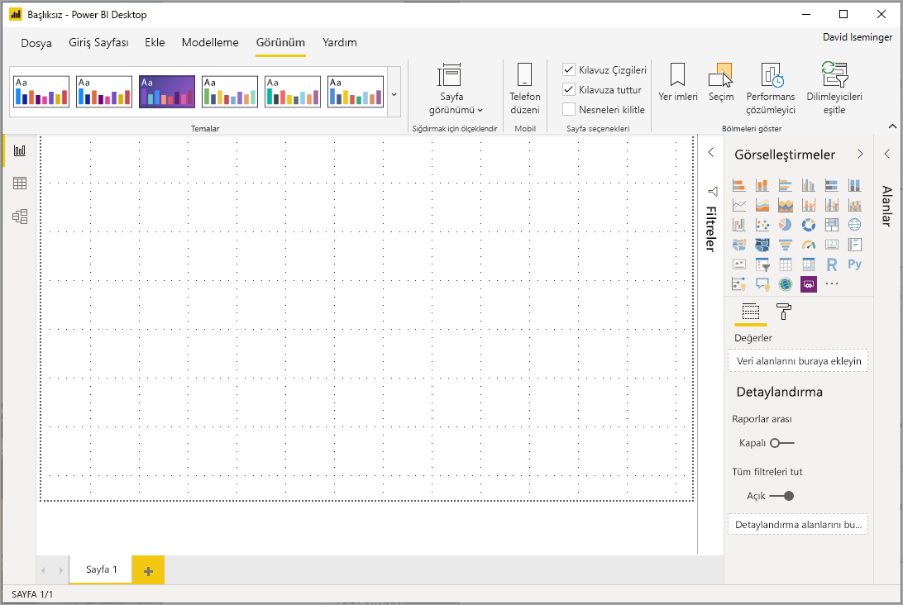
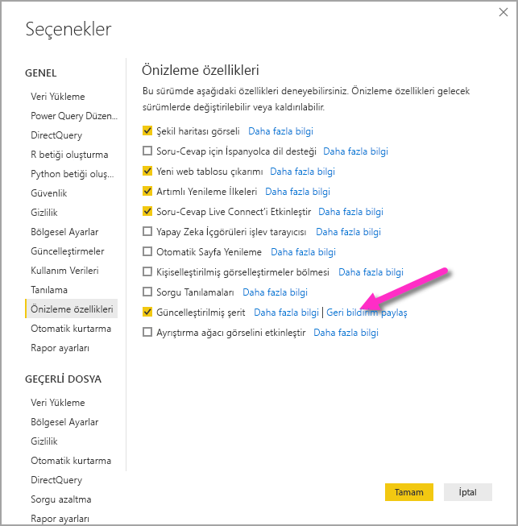
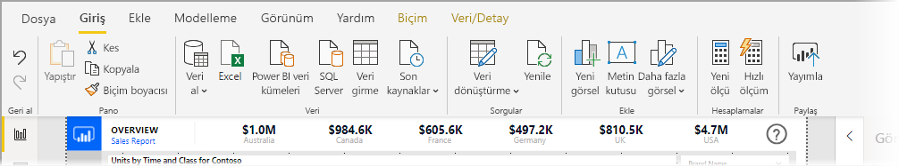
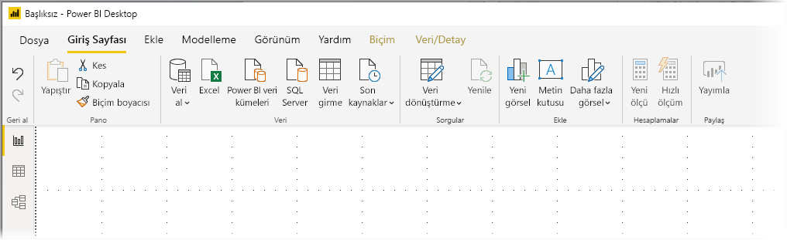
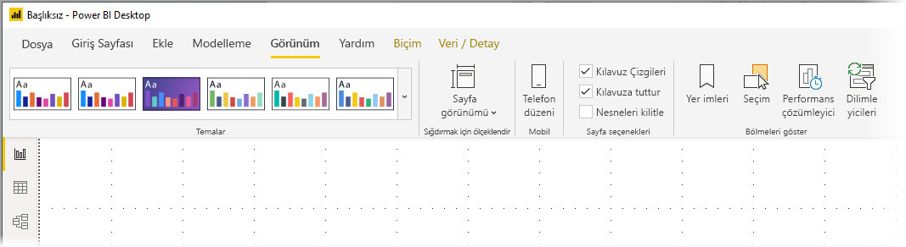
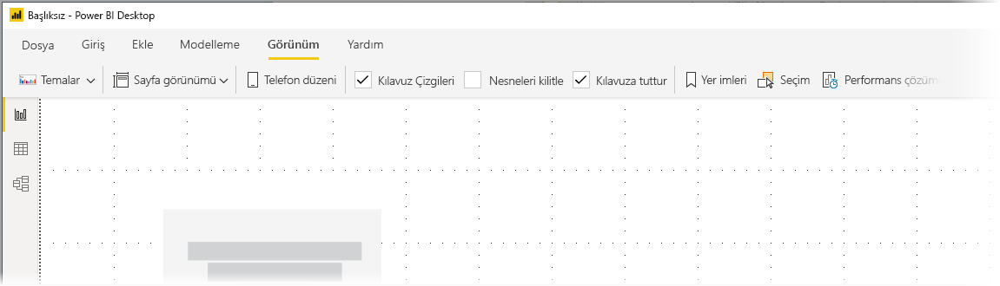

# Power BI Desktop’taki güncelleştirilmiş şeridi kullanma (önizleme)

Kasım 2019 güncelleştirmesiyle, Power BI Desktop görünümünü Microsoft Office gibi diğer Microsoft ürünleriyle daha uyumlu hale getirmek için şeridini düzeltiyor.

Güncelleştirilen şerit önizleme aşamasındadır; dolayısıyla kullanıcılardan ve müşterilerden geri bildirim toplayabilir ve deneyimin olağanüstü olduğundan emin olabilirsiniz. Güncelleştirilmiş Power BI Desktop şeridi genel kullanıma sunulmadan önce önizleme, geri bildirim ve geliştirme aşamalarının birkaç ay süreceğini tahmin ediyoruz. 

## Güncelleştirilmiş şeridi etkinleştirme

Power BI'da güncelleştirilmiş şerit bir önizleme özelliğidir ve etkinleştirilmesi gerekir. Etkinleştirmek için **Dosya > Seçenekler ve ayarlar > Seçenekler**'i ve ardından sol sütundan **Önizleme özellikleri**'ni seçin. Sağ bölmede bir **Güncelleştirilmiş şerit** seçimi vardır. Önizleme özelliğini etkinleştirmek için **Güncelleştirilmiş şerit**'in yanındaki kutuyu işaretleyin. Önizleme özelliğinin geçerlilik kazanması için Power BI Desktop'ı yeniden başlatmanız gerekir.

## Yeni şeridin özellikleri

Şeridi güncelleştirmenin avantajlarında hem Power BI Desktop'ta hem de diğer Microsoft ürünlerinde deneyimi kolay ve tanıdık hale getirmek amaçlanmıştır. 

Bu avantajlar aşağıdaki kategorilere gruplandırılabilir:

* **Geliştirilmiş genel görünüm ve düzen** - güncelleştirilmiş Power BI Desktop şeridindeki simgeler ve işlevler, Office uygulamalarında bulunan şerit öğelerinin genel görünümüne ve düzenine uyarlanmıştır.

    

* **Sezgisel bir Temalar galerisi** - **Görünüm** şeridinde yer alan Temalar galerisi, PowerPoint temalar galerisinin tanıdık genel görünümüne sahiptir. Şöyle ki, şeritteki resimler renk bileşimleri ve yazı tipleri gibi tema değişikliklerinin raporunuza uygulandığında nasıl görüneceğini gösterir. 

    

* **Görünümünüzü temel alan dinamik şerit içeriği** - Power BI Desktop'ın mevcut şeridinde kullanılabilir olmayan simgeler veya komutlar yalnızca soluk gösterilir ve bu da en iyi deneyimi oluşturmaz. Güncelleştirilmiş şeritte simgeler dinamik olarak görüntülenir ve yerleştirilir, böylelikle bağlama göre size hangi seçeneklerin sağlandığını her zaman bilirsiniz.

* **Daraltıldığında tek satırlık bir şerit size yer kazandırır** - güncelleştirilmiş şeridin bir diğer avantajı da şeridi tek satıra daraltabilmek,bağlamınıza göre şerit öğelerini dinamik olarak görüntülemektir. 

    

Bu görünür değişikliklere ek olarak, güncelleştirilmiş şerit Power BI Desktop'ta ve şeridinde gelecekte şöyle güncelleştirmeler yapmanıza da olanak tanır:

* Şeritte görsel galerisi gibi daha esnek ve sezgisel denetimler oluşturma
* Power BI Desktop'a *koyu* ve *koyu gri* Office temalarını ekleme
* Erişilebilirliği geliştirme

## Sonraki adımlar
Power BI Desktop'ı kullanarak çok çeşitli türlerdeki verilere bağlanabilirsiniz. Veri kaynakları hakkında daha fazla bilgi için aşağıdaki kaynaklara bakın:

* [Power BI Desktop nedir?](desktop-what-is-desktop.md)
* [Power BI Desktop'ta Veri Kaynakları](desktop-data-sources.md)
* [Power BI Desktop'ta Verileri Şekillendirme ve Birleştirme](desktop-shape-and-combine-data.md)
* [Power BI Desktop'ta Excel çalışma kitaplarına bağlanma](desktop-connect-excel.md)   
* [Verileri doğrudan Power BI Desktop'a girme](desktop-enter-data-directly-into-desktop.md)   

