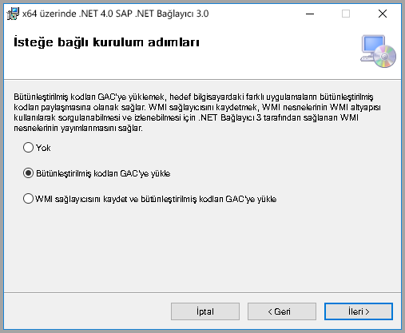

# <a name="use-the-sap-business-warehouse-connector-in-power-bi-desktop"></a>Power BI Desktop’ta SAP Business Warehouse bağlayıcısını kullanma

Power BI Desktop ile *SAP Business Warehouse (BW)* verilerine erişebilirsiniz.

SAP müşterilerinin Power BI’ı mevcut SAP BW sistemlerine bağlayarak nasıl avantaj elde edebileceği hakkında bilgi için bkz. [Power BI ve SAP BW teknik incelemesi](https://aka.ms/powerbiandsapbw). SAP BW ile DirectQuery kullanma hakkında ayrıntılı bilgi için bkz. [DirectQuery ve SAP Business Warehouse (BW)](desktop-directquery-sap-bw.md).

Power BI Desktop’ın Haziran 2018 sürümünden itibaren ve Ekim 2018’de genel kullanıma açık bir şekilde, *SAP BW bağlayıcısını* performans ve özellikler bakımından önemli iyileştirmeler içeren bir uygulama ile birlikte kullanabilirsiniz. Microsoft, SAP BW bağlayıcısı *Uygulama 2.0*’ı geliştirmiştir. SAP BW Bağlayıcısı’nın 1. sürümünü veya Uygulama 2.0 SAP Bağlayıcısı’nı seçin. Aşağıdaki bölümlerde, her bir sürümün yüklenmesi sırayla açıklanmaktadır. Power BI Desktop’tan SAP BW’ye bağlanırken bağlayıcılardan birini seçebilirsiniz.

Mümkün olduğunda Uygulama 2.0 SAP Bağlayıcısı’nı kullanmanızı öneririz.

## <a name="installation-of-version-1-of-the-sap-bw-connector"></a>SAP BW Bağlayıcısı'nın 1. sürümünü yükleme

Mümkün olduğunda Uygulama 2.0 SAP Bağlayıcısı’nın kullanılması önerilir. Bu bölümde SAP BW Bağlayıcısı'nın 1. sürümünü yükleme işlemi açıklanır.

1. Yerel bilgisayarınıza *SAP NetWeaver* kitaplığını yükleyin. SAP NetWeaver kitaplığını SAP yöneticinizden veya doğrudan [SAP Software Download Center](https://support.sap.com/swdc) sayfasından alabilirsiniz. SAP Software Download Center sayfasının yapısı sıklıkla değiştiğinden sitede gezinmeyle ilgili ayrıntılı bilgi veremiyoruz. SAP NetWeaver kitaplığı genelde SAP Client Tools yüklemesine dahil edilir.

   Son sürümü bulmak için *SAP Note #1025361* terimini de aratabilirsiniz. SAP NetWeaver kitaplığının mimarisinin (32 bit veya 64 bit) Power BI Desktop yüklemenizle eşleştiğinden emin olun. SAP Note’a göre *SAP NetWeaver RFC SDK* içindeki tüm dosyaları yükleyin.
2. Power BI Desktop’ta **Veri Al**’ı seçin. **Veritabanı** seçenekleri *SAP Business Warehouse Uygulama Sunucusu* ve *SAP Business Warehouse İleti Sunucusu*’nu içerir.

   

## <a name="installation-of-implementation-20-sap-connector"></a>Uygulama 2.0 SAP Bağlayıcısı’nı yükleme

SAP Bağlayıcısı’nın Uygulama 2.0 sürümü, SAP .NET Bağlayıcısı 3.0 gerektirir. İndirme bağlantısına erişmek için geçerli bir S kullanıcı gerekir. SAP .NET Bağlayıcısı 3.0’ı almak için SAP Basis ekibinize başvurun.

[SAP .NET Bağlayıcısı 3.0](https://support.sap.com/en/product/connectors/msnet.html)’ı SAP’den indirebilirsiniz.

Bağlayıcının 32 bit ve 64 bit sürümleri sağlanır. Power BI Desktop yüklemenizle eşleşen sürümü seçin. Şu anda web sitesinde .NET 4.0 Framework için iki sürüm listelenmektedir:

* Windows 32 bit (x86) için Microsoft .NET 3.0.22.0 SAP Bağlayıcısı zip dosyası (6,896 KB), 1 Haziran 2019
* Windows 64 bit (x64) için Microsoft .NET 3.0.22.0 SAP Bağlayıcısı zip dosyası (7,180 KB), 1 Haziran 2019

Yüklerken, **İsteğe bağlı kurulum adımlarında** *Derlemeleri GAC’ye yükle*’nin seçili olduğundan emin olun.



> [!NOTE]
> SAP BW uygulamasının ilk sürümü NetWeaver DLL’lerini gerektiriyordu. SAP Bağlayıcısı Uygulama 2.0 kullanıyorsanız ve birinci sürümü kullanmıyorsanız, NetWeaver DLL’leri gerekli değildir.

## <a name="version-1-sap-bw-connector-features"></a>Sürüm 1 SAP BW Bağlayıcısı'nın özellikleri

Power BI Desktop’taki sürüm 1 SAP BW Bağlayıcısı, *SAP Business Warehouse Sunucusu* küplerinden verileri içeri aktarmanıza veya DirectQuery’yi kullanmanıza olanak tanır.

SAP BW Bağlayıcısı ve bunun DirectQuery ile kullanımı hakkında daha fazla bilgi edinmek için bkz. [DirectQuery ve SAP Business Warehouse (BW)](desktop-directquery-sap-bw.md).

Bağlanırken, bağlantıyı kurmak için **Sunucu**, **Sistem Numarası** ve **İstemci Kimliği**’ni belirtin.


Ayrıca fazladan iki **Gelişmiş seçenek** belirtebilirsiniz: **Dil kodu** ve belirtilen sunucuda çalıştırılacak özel bir **MDX deyimi**.


MDX deyimi belirtmezseniz, bağlantı ayarı sunucudaki kullanılabilir küplerin listesini görüntüler. Kullanılabilir küplerden detaya gidebilir, boyutlar ve ölçüler gibi öğeleri seçebilirsiniz. Power BI, [Open Analysis Interface](https://help.sap.com/saphelp_nw70/helpdata/en/d9/ed8c3c59021315e10000000a114084/content.htm)'ler tarafından ortaya çıkarılan sorguları ve küpleri gösterir.

Sunucudan bir veya birden çok öğe seçtiğinizde Gezgin iletişim kutusu çıkış tablosunun önizlemesini oluşturur.


**Gezgin** iletişim kutusu görüntü seçenekleri de sağlar:

* **Yalnızca seçilen öğeleri göster**. Varsayılan olarak **Gezgin** tüm öğeleri görüntüler.  Bu seçenek, seçilen son özellik kümesini doğrulamak için kullanışlıdır. Seçilen öğeleri görüntülemenin bir diğer yolu önizleme alanında sütun adlarını seçmektir.
* **Veri önizlemelerini etkinleştir**. Bu varsayılan değerdir. Veri önizlemelerini görüntüler. Veri önizlemelerini devre dışı bıraktığınızda, önizleme için veri isteği gönderilmediğinden sunucu çağrısı sayısı da azalır.
* **Teknik adlar**. SAP BW, bir küp içindeki nesneler için *teknik adlar* kavramının kullanılmasını destekler. Teknik adlar, küp sahibinin küp içindeki nesnelerin yalnızca *fiziksel adlarını* değil, küp nesnelerinin *kolay adlarını* da görüntülemesini sağlar.


Tüm gerekli nesneleri seçtikten sonra aşağıdaki seçeneklerden birini belirterek bundan sonra ne yapılacağına karar verebilirsiniz:

* **Yükle**’yi seçerek çıkış tablosu için satır kümesinin tamamını Power BI Desktop veri modeline yükleyin. **Rapor** görünümü açılır. **Veri** veya **İlişkiler** görünümünü kullanarak verileri görselleştirmeye veya başka değişiklikler yapmaya başlayabilirsiniz.
* **Düzenle**’yi seçerek **Sorgu Düzenleyicisi**’ni açın. Satır kümesinin tamamı Power BI Desktop veri modeline alınmadan önce ek veri dönüştürme ve filtreleme adımlarını belirtin.

SAP BW küplerindeki verileri içeri aktarmanın yanı sıra Power BI Desktop'a birçok farklı veri kaynağından da veri aktararak bunları tek bir raporda birleştirebilirsiniz. Bu özellik sayesinde SAP BW verilerine ek olarak çok çeşitli raporlama ve analiz senaryoları oluşturabilirsiniz.

## <a name="using-implementation-20-sap-bw-connector"></a>Uygulama 2.0 SAP BW Bağlayıcısı'nı kullanma

SAP BW Bağlayıcısı Uygulama 2.0’ı kullanmak için yeni bir bağlantı oluşturun. Yeni bir bağlantı oluşturmak için aşağıdaki adımları uygulayın.

1. **Veri Al**’ı seçin. **SAP Business Warehouse Uygulama Sunucusu**’nu veya **SAP Business Warehouse İleti Sunucusu**’nu seçin ve bağlanın.

2. Yeni bağlantı iletişim kutusunda uygulamayı seçin. Aşağıdaki resimde gösterildiği gibi **Uygulama** olarak **2.0** seçildiğinde **Yürütme modu**, **Toplu iş boyutu** ve **Özellik yapılarını etkinleştir** seçenekleri etkin duruma gelir.

    

3. **Tamam**’ı seçin. Bu noktadan sonraki deneyim, sürüm 1 SAP BW Bağlayıcısı için [Sürüm 1 SAP BW Bağlayıcısı özelliklerinde](#version-1-sap-bw-connector-features) açıklandığı gibidir.

### <a name="new-options-for-implementation-20"></a>Uygulama 2.0 için yeni seçenekler

Uygulama 2.0 aşağıdaki seçenekleri destekler:

* *ExecutionMode*, sunucu üzerinde sorgu yürütmek için kullanılan MDX arabirimini belirtir. Geçerli seçenekler şunlardır:

  * `SapBusinessWarehouseExecutionMode.BasXml`
  * `SapBusinessWarehouseExecutionMode.BasXmlGzip`
  * `SapBusinessWarehouseExecutionMode.DataStream`

    `SapBusinessWarehouseExecutionMode.BasXmlGzip` varsayılan değerdir.

    `SapBusinessWarehouseExecutionMode.BasXmlGzip` değerinin kullanılması, büyük veri kümeleri için yüksek gecikme süresi yaşandığında performansı artırabilir.

* *BatchSize*, bir MDX deyimi yürütülürken aynı anda alınacak en fazla satır sayısını belirtir. Küçük bir sayı, büyük veri kümesi alınırken sunucuya daha fazla çağrı gönderilmesine neden olur. Çok sayıda satır, performansını artırabilir ancak SAP BW sunucusunda bellek sorunlarına neden olabilir. Varsayılan değer 50000 satırdır.

* *EnableStructures*, özellik yapılarının tanınıp tanınmadığını gösterir. Bu seçenek için varsayılan değer false şeklindedir. Seçime uygun olan nesnelerin listesini etkiler. Yerel sorgu modunda desteklenmez.

*ScaleMeasures* seçeneği bu uygulamada kullanım dışı bırakılmıştır. Şimdiki davranış, her zaman ölçeklendirilmemiş değerleri gösteren *ScaleMeasures* öğesinin false ayarıyla aynıdır.

### <a name="additional-improvements-for-implementation-20"></a>Uygulama 2.0 için diğer iyileştirmeler

Aşağıdaki listede yeni uygulama ile birlikte gelen ek iyileştirmelerden bazıları açıklanmaktadır:

* Geliştirilmiş performans.
* Birkaç milyon veri satırı alma ve toplu iş boyutu parametresi ile ince ayar yapma olanağı.
* Yürütme modları arasında geçiş yapma olanağı.
* Sıkıştırılmış mod desteği. Özellikle yüksek gecikme süreli bağlantılar veya büyük veri kümeleri için yararlıdır.
* `Date` değişkenlerinin daha iyi algılanması.
* [Deneysel] Metin değerleri yerine, sırasıyla tarih ve saat olarak `Date` (ABAP türü DATS) ve `Time` (ABAP türü TIMS) boyutlarını kullanıma sunun.
* Daha iyi özel durum işleme. BAPI çağrılarında oluşan hatalar şimdi yüzeye çıkarılmıştır.
* BasXml ve BasXmlGzip modlarında sütun katlama. Örneğin, oluşturulan MDX sorgusu 40 sütun alırken geçerli seçim için yalnızca 10 sütun gerekliyse, bu istek daha küçük bir veri kümesi almak üzere sunucuya geçirilir.

### <a name="changing-existing-reports-to-use-implementation-20"></a>Var olan raporları Uygulama 2.0 kullanacak şekilde değiştirme

Var olan raporların Uygulama 2.0 kullanacak şekilde değiştirilmesi yalnızca içeri aktarma modunda mümkündür. Şu adımları uygulayın:

1. Var olan bir raporu açın, şeritten **Sorguları Düzenle**’yi seçin ve sonra da güncelleştirilecek SAP Business Warehouse sorgusunu seçin.

1. Sorguya sağ tıklayın ve **Gelişmiş Düzenleyici**’yi seçin.

1. **Gelişmiş Düzenleyici**’de `SapBusinessWarehouse.Cubes` çağrısını aşağıda gösterildiği gibi değiştirin:

    Sorgunun zaten aşağıdaki örnekteki gibi bir seçenek kaydı içerip içermediğini belirleyin:

    

    İçeriyorsa, aşağıda gösterildiği gibi `Implementation` 2.0 seçeneğini ekleyin ve varsa `ScaleMeasures` seçeneğini kaldırın:

    

    Sorgu henüz bir seçenekler kaydı içermiyorsa eklemeniz yeterlidir. Aşağıdaki seçenek için:

    

    Yalnızca şu şekilde değiştirin:

    

SAP BW Bağlayıcısı Uygulama 2.0’ı 1. sürümle uyumlu hale getirmek için her türlü çaba gösterilmiştir. Ancak, kullanılmakta olan farklı SAP BW MDX yürütme modları nedeniyle bazı farklılıklar olabilir. Tutarsızlıkları gidermek için yürütme modları arasında geçiş yapmayı deneyin.

## <a name="troubleshooting"></a>Sorun giderme

Bu bölümde SAP BW bağlayıcısıyla çalışırken karşılaşabileceğiniz sorunlara (ve çözümlerine) yer verilmiştir.

1. SAP BW sayısal verilerinde ondalık ayırıcı olarak virgül yerine nokta dönüyor. Örneğin 1,000,000 sayısı 1.000.000 olarak döndürülüyor.

   SAP BW, ondalık verileri ondalık ayırıcı olarak `,` (virgül) veya `.` (nokta) ile döndürür. SAP BW'nin hangi ondalık ayırıcıyı kullanacağını belirtmek için Power BI Desktop tarafından kullanılan sürücü, `BAPI_USER_GET_DETAIL` için bir çağrıda bulunur. Bu çağrı tarafından döndürülen `DEFAULTS` adlı yapının `DCPFM` alanında *Decimal Format Notation* (Ondalık Ayırıcı Biçimi) depolanır. Bu alan aşağıdaki değerlerden birini alır:

   * ' ' (boşluk) = Ondalık ayırıcı virgül: N.NNN,NN
   * 'X' = Ondalık ayırıcı nokta: N,NNN.NN
   * 'Y' = Ondalık ayırıcı N NNN NNN,NN

   Bu sorunu bildiren müşteriler `BAPI_USER_GET_DETAIL` çağrısının belirli bir kullanıcı (hatalı verileri gösteren kullanıcı) için başarısız olduğunu ve aşağıdakine benzer bir hata iletisiyle karşılaşıldığını belirlemiştir:

   ```xml
    You are not authorized to display users in group TI:
        <item>
            <TYPE>E</TYPE>
            <ID>01</ID>
            <NUMBER>512</NUMBER>
            <MESSAGE>You are not authorized to display users in group TI</MESSAGE>
            <LOG_NO/>
            <LOG_MSG_NO>000000</LOG_MSG_NO>
            <MESSAGE_V1>TI</MESSAGE_V1>
            <MESSAGE_V2/>
            <MESSAGE_V3/>
            <MESSAGE_V4/>
            <PARAMETER/>
            <ROW>0</ROW>
            <FIELD>BNAME</FIELD>
            <SYSTEM>CLNTPW1400</SYSTEM>
        </item>
   ```

   Bu hatayı çözmek için kullanıcıların SAP yöneticilerinden Power BI'da kullanılan SAPBW kullanıcısına `BAPI_USER_GET_DETAIL` yürütme iznini vermelerini istemesi gerekmektedir. Ayrıca bu sorun giderme adımının önceki bölümlerinde anlatıldığı üzere kullanıcının gerekli `DCPFM` değerini alıp almadığının doğrulanmasında da fayda vardır.

2. SAP BEx sorguları için bağlantı
   
   Aşağıdaki resimde gösterildiği üzere belirli bir özelliği etkinleştirerek Power BI Desktop'ta BEx sorguları gerçekleştirebilirsiniz:
   
   
   
3. **Gezgin** penceresinde veri önizlemesi görüntülenmez ve bunun yerine *nesne başvurusu nesnenin bir örneğine ayarlanmadı* hata iletisi sağlanır.
   
   SAP kullanıcılarının, meta verileri elde etmek ve SAP BW InfoProviders'dan verileri almak için belirli BAPI işlev modüllerine erişmesi gerekir. Bu modüller şunlardır:

   * BAPI_MDPROVIDER_GET_CATALOGS
   * BAPI_MDPROVIDER_GET_CUBES
   * BAPI_MDPROVIDER_GET_DIMENSIONS
   * BAPI_MDPROVIDER_GET_HIERARCHYS
   * BAPI_MDPROVIDER_GET_LEVELS
   * BAPI_MDPROVIDER_GET_MEASURES
   * BAPI_MDPROVIDER_GET_MEMBERS
   * BAPI_MDPROVIDER_GET_VARIABLES
   * BAPI_IOBJ_GETDETAIL

   Bu sorunu çözmek için, kullanıcının çeşitli MDPROVIDER modüllerine ve `BAPI_IOBJ_GETDETAIL` modülüne erişimi olduğunu doğrulayın. Bu veya benzer sorunlarda daha fazla sorun giderme işlemi yapmak için izlemeyi etkinleştirebilirsiniz. **Dosya** > **Seçenekler ve ayarlar** > **Seçenekler**’i seçin. **Seçenekler** altında **Tanılama**’yı ve sonra da **İzlemeyi etkinleştir**’i seçin. İzleme etkin durumdayken SAP BW'den verileri almayı deneyin ve diğer ayrıntılar için izleme dosyasını inceleyin.

## <a name="sap-bw-connection-support"></a>SAP BW Bağlantı desteği

Aşağıdaki tabloda SAP BW için geçerli desteğin ayrıntıları verilmiştir.

|Ürün  |Mod  |Kimlik Doğrulama  |Bağlayıcı  |SNC Kitaplığı  |Destekleniyor  |
|---------|---------|---------|---------|---------|---------|
|Power BI Desktop     |Herhangi biri         | Kullanıcı / parola  | Uygulama Sunucusu | YOK  | Evet  |
|Power BI Desktop     |Herhangi biri         | Windows          | Uygulama Sunucusu | sapcrypto + gsskrb5/gx64krb5  | Evet  |
|Power BI Desktop     |Herhangi biri         | Kimliğe bürünme yoluyla Windows | Uygulama Sunucusu | sapcrypto + gsskrb5/gx64krb5  | Evet  |
|Power BI Desktop     |Herhangi biri         | Kullanıcı / parola        | İleti Sunucusu | YOK  | Evet  |
|Power BI Desktop     |Herhangi biri         | Windows        | İleti Sunucusu | sapcrypto + gsskrb5/gx64krb5  | Evet  |
|Power BI Desktop     |Herhangi biri         | Kimliğe bürünme yoluyla Windows | İleti Sunucusu | sapcrypto + gsskrb5/gx64krb5  | Evet  |
|Power BI Ağ Geçidi     |İçeri Aktar      | Power BI Desktop ile aynı |         |   |   |
|Power BI Ağ Geçidi     |DirectQuery | Kullanıcı / parola        | Uygulama Sunucusu | YOK  | Evet  |
|Power BI Ağ Geçidi     |DirectQuery | Kimliğe bürünme yoluyla Windows (sabit kullanıcı, SSO yok) | Uygulama Sunucusu | sapcrypto + gsskrb5/gx64krb5  | Evet  |
|Power BI Ağ Geçidi     |DirectQuery | DirectQuery sorguları için Kerberos üzerinden SSO kullanın seçeneği | Uygulama Sunucusu | sapcrypto + gsskrb5/gx64krb5   | Evet  |
|Power BI Ağ Geçidi     |DirectQuery | Kullanıcı / parola        | İleti Sunucusu | YOK  | Evet  |
|Power BI Ağ Geçidi     |DirectQuery | Kimliğe bürünme yoluyla Windows (sabit kullanıcı, SSO yok) | İleti Sunucusu | sapcrypto + gsskrb5/gx64krb5  | Evet  |
|Power BI Ağ Geçidi     |DirectQuery | DirectQuery sorguları için Kerberos üzerinden SSO kullanın seçeneği | İleti Sunucusu | gsskrb5/gx64krb5  | Hayır  |
|Power BI Ağ Geçidi     |DirectQuery | DirectQuery sorguları için Kerberos üzerinden SSO kullanın seçeneği | İleti Sunucusu | sapcrypto  | Evet  |

## <a name="next-steps"></a>Sonraki adımlar

SAP ve DirectQuery hakkında daha fazla bilgi için aşağıdaki kaynaklara bakın:

* [DirectQuery ve SAP HANA](desktop-directquery-sap-hana.md)
* [DirectQuery ve SAP Business Warehouse (BW)](desktop-directquery-sap-bw.md)
* [Power BI'da DirectQuery kullanma](desktop-directquery-about.md)
* [Power BI veri kaynakları](desktop-directquery-data-sources.md)
* [Power BI ve SAP BW teknik incelemesi](https://aka.ms/powerbiandsapbw)
