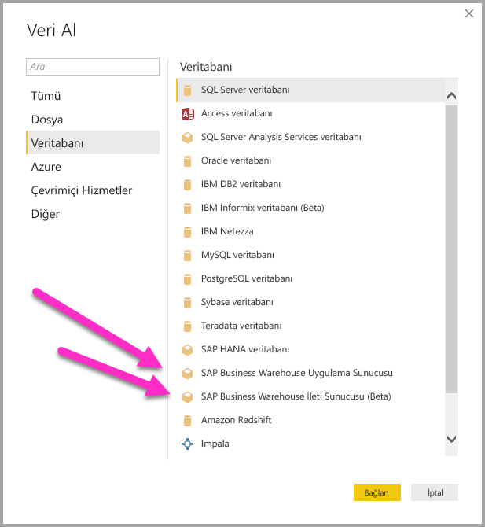
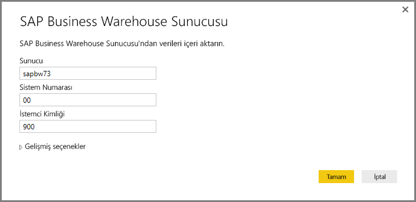
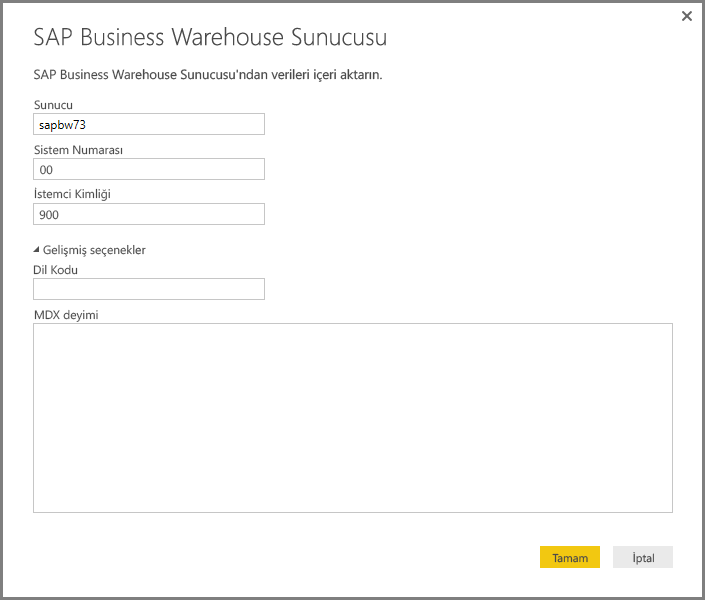
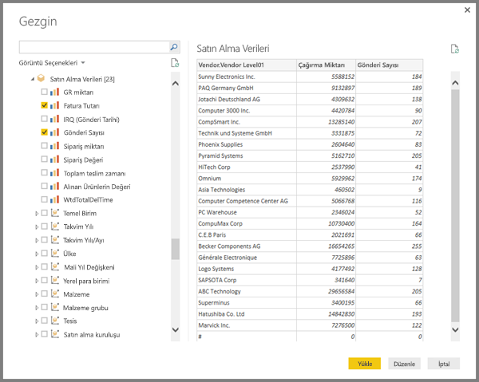
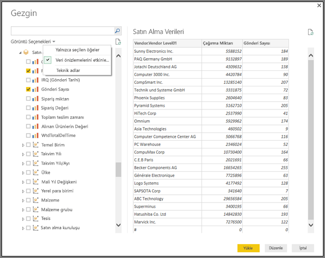
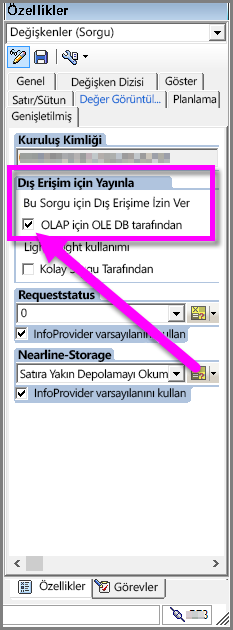

# Power BI Desktop'ta SAP BW Bağlayıcısı'nı kullanma
Power BI Desktop ile **SAP BusinessWarehouse (BW)** verilerine erişebilirsiniz.

## SAP BW Bağlayıcısı'nı yükleme
**SAP BW Bağlayıcısı**'nı yüklemek için aşağıdaki yükleme adımlarını uygulayın:

1. Yerel makinenize **SAP NetWeaver** kitaplığını yükleyin. **SAP Netweaver** kitaplığını SAP yöneticinizden veya doğrudan [SAP Software Download Center](https://support.sap.com/swdc) sayfasından edinebilirsiniz. **SAP Software Download Center** sayfasının yapısı sıklıkla değiştiğinden sitede gezinmeyle ilgili ayrıntılı bilgi veremiyoruz. **SAP NetWeaver** kitaplığı genelde SAP Client Tools yüklemesine de dahil edilir.
   
   Son sürümü bulmak için *SAP Note #1025361* terimini de aratabilirsiniz. **SAP NetWeaver** kitaplığı mimarisinin (32 bit veya 64 bit) **Power BI Desktop** yüklemenizle aynı olduğundan emin olduktan sonra **SAP NetWeaver RFC SDK** içindeki tüm dosyaları SAP Note talimatlarına uygun şekilde yükleyin.
2. **Veri Al** iletişim kutusunun **Veritabanı** kategorisinde **SAP Business Warehouse Sunucusu** girişi bulunur.
   
   

## SAP BW Bağlayıcısı'nın özellikleri
Power BI Desktop'ta bulunan önizleme sürümündeki **SAP BW Bağlayıcısı**, kullanıcıların **SAP Business Warehouse Sunucusu** küplerini içeri aktarmasını sağlar. **SAP BW Bağlayıcısı** ile DirectQuery özelliğini de kullanabilirsiniz. Bağlantıyı kurmak için *Sunucu*, *Sistem Numarası* ve *İstemci Kimliği* girmeniz gerekir.

Ayrıca belirtebileceğiniz iki ek **Gelişmiş seçenek** de vardır: Dil kodu ve belirtilen sunucuda çalıştırılacak özel MDX deyimi.

Herhangi bir MDX deyimi belirtilmezse **Gezgin** penceresi açılır ve burada sunucudaki kullanılabilir küplerin listesinin yanı sıra kullanılabilir küplerden boyutlar ve ölçüler dahil olmak üzere ayrıntıya inme ve öğe belirleme seçenekleri görüntülenir. Power BI, [BW Open Analysis Interface OLAP BAPI'leri](https://help.sap.com/saphelp_nw70/helpdata/en/d9/ed8c3c59021315e10000000a114084/content.htm) tarafından gösterilen sorguları ve küpleri gösterir.

Sunucudan bir veya daha fazla öğe seçtiğinizde yaptığınız seçime bağlı olarak çıkış tablosu önizlemesi oluşturulur.

**Gezgin** penceresinde ayrıca aşağıdakileri yapmanızı sağlayan birkaç **Görüntüleme Seçeneği** de bulunur:

* ***Yalnızca Seçilen Öğeler* veya *Tüm Öğeler* (varsayılan görünüm) arasında seçim yapma:** Bu seçenek, seçilen son öğe kümesini doğrulama açısından yararlıdır. Bu görünüme alternatif olarak *Önizleme* alanında *Sütun Adları*'nı seçerek de ulaşabilirsiniz.
* **Veri Önizlemelerini Etkinleştir (varsayılan davranış):** Veri önizlemelerinin bu iletişim kutusunda görüntülenip görüntülenmeyeceğini de denetleyebilirsiniz. Veri önizlemelerini devre dışı bıraktığınızda, önizleme için veri isteği gönderilmediğinden sunucu çağrısı sayısı da azalır.
* **Teknik Adlar:** SAP BW, bir küp içindeki nesneler için *teknik adlar* kavramının kullanılmasını destekler. Teknik adlar, küp sahibinin küp içindeki nesnelerin yalnızca *fiziksel adlarını* değil, küp nesnelerinin *kolay adlarını* da görüntülemesini sağlar.

**Gezgin**'de gerekli tüm nesneleri seçtikten sonra **Gezgin** penceresinin en altında bulunan aşağıdaki düğmelerden birini seçerek bir sonraki adımı belirleyebilirsiniz:

* **Yükle**'yi seçtiğinizde satır kümesinin tamamı çıkış tablosunu oluşturmak üzere Power BI Desktop veri modeline yüklenir. Ardından açılan **Rapor** görünümünde verileri görselleştirmeye başlayabilir ya da **Veri** veya **İlişkiler** görünümlerini kullanarak ek değişiklikler yapabilirsiniz.
* **Düzenle**'yi seçtiğinizde açılan **Sorgu Düzenleyicisi**'nde satır kümesinin tamamı Power BI Desktop veri modeline alınmadan önce ek veri dönüştürme ve filtreleme adımları uygulayabilirsiniz.

**SAP BW** küplerindeki verileri içeri aktarmanın yanı sıra Power BI Desktop'a birçok farklı veri kaynağından da veri aktararak bunları tek bir raporda birleştirebileceğinizi unutmayın. Bu sayede **SAP BW** verilerine ek olarak çok çeşitli raporlama ve analiz senaryoları oluşturabilirsiniz.

## Sorun giderme
Bu bölümde **SAP BW** bağlayıcısının önizleme sürümüyle çalışırken karşılaşabileceğiniz sorunlara (ve çözümlerine) yer verilmiştir.

1. **SAP BW** sayısal verilerinde ondalık ayırıcı olarak virgül yerine nokta dönüyor. Örneğin 1,000,000 sayısı 1.000.000 olarak döndürülüyor.
   
   **SAP BW**, ondalık verileri *,* (virgül) veya *.* (nokta) ondalık ayırıcısıyla döndürür. **SAP BW**'nin hangi ondalık ayırıcıyı kullanacağını belirtmek için **Power BI Desktop** tarafından kullanılan sürücü, *BAPI_USER_GET_DETAIL* için bir çağrıda bulunur. Bu çağrı tarafından döndürülen **DEFAULTS** adlı yapının *DCPFM* alanında *Decimal Format Notation* (Ondalık Ayırıcı Biçimi) bulunur. Bu parametre aşağıdaki üç değerden birini alır:
   
       ‘ ‘ (space) = Decimal point is comma: N.NNN,NN
       'X' = Decimal point is period: N,NNN.NN
       'Y' = Decimal point is N NNN NNN,NN
   
   Bu sorunu bildiren müşteriler *BAPI_USER_GET_DETAIL* çağrısının belirli bir kullanıcı (verilerin hatalı gösterildiği kullanıcı) için başarısız olduğunu ve aşağıdakine benzer bir hata iletisiyle karşılaşıldığını belirlemiştir:
   
       You are not authorized to display users in group TI:
           <item>
               <TYPE>E</TYPE>
               <ID>01</ID>
               <NUMBER>512</NUMBER>
               <MESSAGE>You are not authorized to display users in group TI</MESSAGE>
               <LOG_NO/>
               <LOG_MSG_NO>000000</LOG_MSG_NO>
               <MESSAGE_V1>TI</MESSAGE_V1>
               <MESSAGE_V2/>
               <MESSAGE_V3/>
               <MESSAGE_V4/>
               <PARAMETER/>
               <ROW>0</ROW>
               <FIELD>BNAME</FIELD>
               <SYSTEM>CLNTPW1400</SYSTEM>
           </item>
   
   Bu hatayı çözmek için kullanıcıların SAP yöneticilerinden Power BI'da kullanılan SAPBW kullanıcısına *BAPI_USER_GET_DETAIL* yürütme iznini vermelerini istemesi gerekmektedir. Ayrıca bu sorun giderme adımının önceki bölümlerinde anlatıldığı üzere kullanıcının gerekli *DCPFM* değerini alıp almadığının doğrulanmasında da fayda vardır.
2. **SAP BEx sorguları için bağlantı**
   
   Aşağıdaki görüntüde gösterildiği üzere belirli bir özelliği etkinleştirerek Power BI Desktop'ta **BEx** sorguları gerçekleştirebilirsiniz:
   
   

