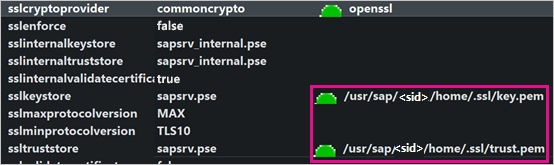
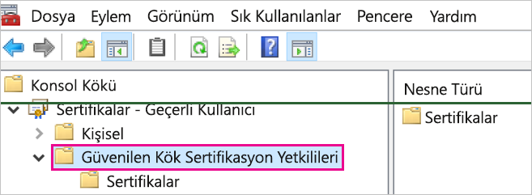
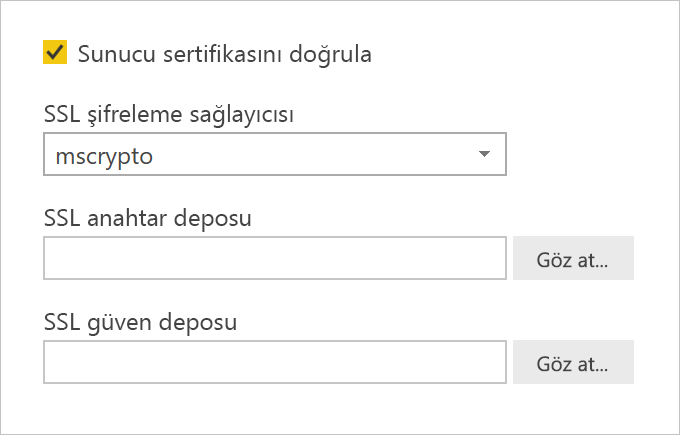
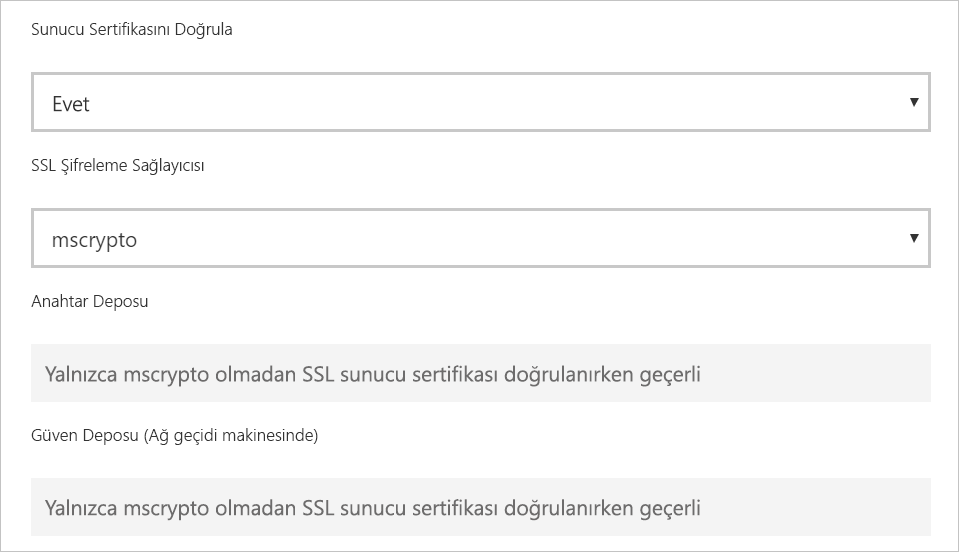

# <a name="enable-encryption-for-sap-hana"></a>SAP HANA için şifrelemeyi etkinleştirme

Power BI Desktop ve Power BI hizmetinden bir SAP HANA sunucusuna yönelik bağlantıları şifrelemenizi öneririz. Hem OpenSSL hem de SAP'nin özel CommonCryptoLib (eski adıyla sapcrypto) kitaplığını kullanarak HANA şifrelemesini etkinleştirebilirsiniz. SAP, CommonCryptoLib kullanmayı önerir, ancak temel şifreleme özellikleri kitaplıklardan herhangi biri kullanılarak kullanılabilir.

Bu makalede, OpenSSL kullanarak şifrelemeyi etkinleştirmeye ilişkin bir genel bakış sağlanır ve SAP belgelerinin belirli bölümlerine başvurulur. İçerikleri ve bağlantıları düzenli aralıklarla güncelleştiriyoruz, ancak kapsamlı yönergeler ve destek için her zaman resmi SAP belgelerine başvurun. OpenSSL yerine CommonCryptoLib kullanarak şifrelemeyi ayarlamak istiyorsanız bkz. [SAP HANA 2.0 içinde TLS/SSL’yi yapılandırma](https://blogs.sap.com/2018/11/13/how-to-configure-tlsssl-in-sap-hana-2.0/) OpenSSL’den CommonCryptoLib’e geçiş adımları için bkz. [SAP Not 2093286](https://launchpad.support.sap.com/#/notes/2093286) (s-user gereklidir).

> [!NOTE]
> Bu makalede ayrıntılı olarak açıklanan şifreleme için kurulum adımları, SAML SSO için kurulum ve yapılandırma adımlarıyla çakışıyor. HANA sunucunuzun şifreleme sağlayıcısı olarak OpenSSL’yi veya CommonCryptoLib’i seçmenizden bağımsız olarak, tercihinizin SAML ve şifreleme yapılandırmalarında tutarlı olduğundan emin olun.

OpenSSL kullanarak SAP HANA şifrelemesini etkinleştirmek için dört aşama vardır. Bu aşamaları daha sonra ele alacağız.  Daha fazla bilgi için bkz. [SSL aracılığıyla SAP HANA Studio ile SAP HANA Sunucusu arasındaki İletişimin Güvenliğini Sağlama](https://blogs.sap.com/2015/09/28/securing-the-communication-between-sap-hana-studio-and-sap-hana-server-through-ssl/).

## <a name="use-openssl"></a>OpenSSL kullan

HANA sunucunuzun, şifreleme sağlayıcısı olarak OpenSSL kullanacak şekilde yapılandırıldığından emin olun. Aşağıdaki eksik yol bilgilerini HANA sunucunuzun sunucu kimliği (sid) ile değiştirin.



## <a name="create-a-certificate-signing-request"></a>Sertifika imzalama isteği oluşturma

HANA sunucusu için bir X509 sertifika imzalama isteği oluşturun.

1. SSH kullanarak, HANA sunucusunun, \<sid\>adm olarak çalıştığı Linux makinesine bağlanın.

1. _/__usr/sap/\<sid\>/home_ ana dizinine gidin.

1. Zaten mevcut değilse _.__ssl_ adlı bir gizli dizin oluşturun.

1. Aşağıdaki komutu yürütün:

    ```
    openssl req -newkey rsa:2048 -days 365 -sha256 -keyout Server\_Key.pem -out Server\_Req.pem -nodes
    ```

Bu komut bir sertifika imzalama isteği ve özel anahtar oluşturur. İmzalandıktan sonra sertifika bir yıl için geçerlidir (bkz. -days parametresi). Ortak ad (CN) istendiğinde, HANA sunucusunun yüklü olduğu bilgisayarın tam etki alanı adını (FQDN) girin.

## <a name="get-the-certificate-signed"></a>Sertifikayı imzalatma

HANA sunucusuna bağlanmak için kullanacağınız istemciler tarafından güvenilen bir sertifika yetkilisi (CA) tarafından imzalanan sertifikayı alın.

1. Zaten güvenilir bir şirket CA’nız varsa (aşağıdaki örnekte CA\_Cert.pem ve CA\_Key.pem ile temsil edilir) varsa, aşağıdaki komutu çalıştırarak sertifika isteğini imzalayın:

    ```
    openssl x509 -req -days 365 -in Server\_Req.pem -sha256 -extfile /etc/ssl/openssl.cnf -extensions usr\_cert -CA CA\_Cert.pem -CAkey CA\_Key.pem -CAcreateserial -out Server\_Cert.pem
    ```

    Kullanabileceğiniz bir CA’nız yoksa, [SSL aracılığıyla SAP HANA Studio ile SAP HANA Sunucusu arasındaki İletişimin güvenliğini sağlama](https://blogs.sap.com/2015/09/28/securing-the-communication-between-sap-hana-studio-and-sap-hana-server-through-ssl/) bölümünde açıklanan adımları izleyerek bir kök CA oluşturabilirsiniz.

1. Sunucu sertifikasını, anahtarı ve CA sertifikasını birleştirerek HANA sunucu sertifikası zincirini oluşturun (anahtar.pem adı, SAP HANA için olan kuraldır):

    ```
    cat Server\_Cert.pem Server\_Key.pem CA\_Cert.pem \> key.pem
    ```

1. CA\_Cert.pem öğesinin trust.pem adlı bir kopyasını oluşturun (trust.pem adı SAP HANA kuralıdır):

    ```
    cp CA\_Cert.pem trust.pem
    ```

1. HANA sunucusunu yeniden başlatın.

1. Bir istemci ile SAP HANA sunucusunun sertifikasını imzalamak için kullandığınız CA arasındaki güven ilişkisini doğrulayın.

    İstemcinin, HANA sunucusuna istemci makinesinden şifreli bir bağlantı kurabilmesi için HANA sunucusunun X509 sertifikasını imzalamak için kullanılan CA’ya güvenmesi gerekir.

    Microsoft Yönetim Konsolu’nu (MMC) veya komut satırını kullanarak bu güven ilişkisinin mevcut olduğundan emin olmanın çeşitli yolları vardır. CA’nın X509 sertifikasını (trust.pem), bağlantıyı kuracak kullanıcı için **Güvenilen Kök Sertifika Yetkilileri** klasörüne veya istenirse istemci makinedeki aynı klasöre içeri aktarabilirsiniz.

    

    Sertifikayı Güvenilen Kök Sertifika Yetkilileri klasörüne (örneğin, aşağıdaki OpenSSL komutunu çalıştırarak) içeri aktarabilmek için öncelikle trust.pem’yi bir .crt dosyasına dönüştürmeniz gerekir:

    ```
    openssl x509 -outform der -in your-cert.pem -out your-cert.crt
    ```
    
    Dönüştürme için OpenSSL kullanma hakkında daha fazla bilgi için [OpenSSL belgelerine](https://www.openssl.org/docs/manmaster/man1/x509.html) bakın.

## <a name="test-the-connection"></a>Bağlantıyı test etme

Bağlantıyı Power BI Desktop’ta veya Power BI hizmetinde test edin.

1. Power BI Desktop veya Power BI hizmetinin **Ağ geçitlerini yönet** sayfasında, SAP HANA sunucunuzla bağlantı kurmaya çalışmadan önce **Sunucu sertifikasını doğrula**’nın etkinleştirildiğinden emin olun. **SSL şifreleme sağlayıcısı** için, bu kitaplığı şifreleme sağlayıcınız olarak yapılandırmış olmanız durumunda, OpenSSL kurulum adımlarını ve commoncrypto’yu izlediyseniz, mscrypto’yu seçin. SSL anahtar deposu ve SSL güven deposu alanlarını boş bırakın.

    - Power BI Desktop

        

    - Power BI hizmeti

        

1. **Sunucu sertifikasını doğrula** seçeneği etkinken, Power BI Desktop’a veri yükleyerek veya Power BI hizmetinde yayımlanmış bir raporu yenileyerek sunucu ile şifreli bir bağlantıyı başarıyla kurabildiğinizi doğrulayın.
